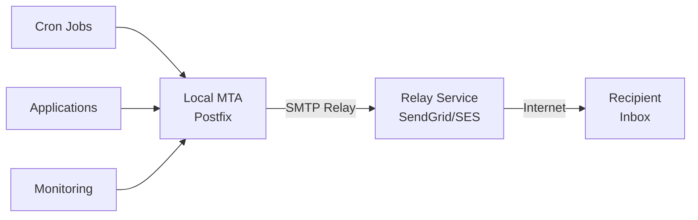

# How to Use Ansible to Configure System Email (Postfix)

Author: [nawazdhandala](https://www.github.com/nawazdhandala)

Tags: Ansible, Postfix, Email, Linux

Description: Deploy and configure Postfix mail transfer agent on Linux servers using Ansible for reliable system email delivery.

---

Every Linux server needs the ability to send email. Whether it is cron job output, security alerts, log rotation notifications, or application error reports, system email is a fundamental part of server operations. Postfix is the most widely used MTA (Mail Transfer Agent) on Linux, and for good reason. It is fast, secure, and easy to configure once you know what you are doing.

The problem is that Postfix configuration involves many files and settings that need to be consistent across your fleet. One server with a misconfigured relay can mean missed alerts during an incident. Ansible solves this by making Postfix configuration repeatable and auditable.

## Installing Postfix

```yaml
# install-postfix.yml - Install and configure Postfix MTA
---
- name: Install Postfix
  hosts: all
  become: true

  tasks:
    # Remove sendmail if present (conflicts with Postfix)
    - name: Remove sendmail if installed
      ansible.builtin.yum:
        name: sendmail
        state: absent
      when: ansible_os_family == "RedHat"

    # Install Postfix and mail utilities
    - name: Install Postfix (RedHat)
      ansible.builtin.yum:
        name:
          - postfix
          - mailx
          - cyrus-sasl-plain
          - cyrus-sasl-lib
        state: present
      when: ansible_os_family == "RedHat"

    - name: Install Postfix (Debian)
      ansible.builtin.apt:
        name:
          - postfix
          - mailutils
          - libsasl2-modules
        state: present
        update_cache: true
      when: ansible_os_family == "Debian"
      environment:
        DEBIAN_FRONTEND: noninteractive

    # Enable and start Postfix
    - name: Enable Postfix
      ansible.builtin.systemd:
        name: postfix
        state: started
        enabled: true

    # Set Postfix as the default MTA
    - name: Set Postfix as default MTA (RedHat)
      ansible.builtin.command:
        cmd: alternatives --set mta /usr/sbin/sendmail.postfix
      when: ansible_os_family == "RedHat"
      changed_when: true
      failed_when: false
```

## Basic Postfix Configuration

Here is a playbook that configures Postfix for local delivery and outbound email:

```yaml
# configure-postfix.yml - Configure Postfix for system email
---
- name: Configure Postfix
  hosts: all
  become: true

  vars:
    postfix_hostname: "{{ ansible_fqdn }}"
    postfix_domain: "{{ ansible_domain | default('example.com') }}"
    postfix_origin: "{{ postfix_domain }}"
    postfix_networks:
      - 127.0.0.0/8
    postfix_relay_host: ""
    postfix_message_size_limit: 52428800  # 50 MB
    postfix_aliases:
      root: "sysadmin@example.com"
      postmaster: "root"

  tasks:
    # Deploy main.cf configuration
    - name: Configure Postfix main.cf
      ansible.builtin.template:
        src: main.cf.j2
        dest: /etc/postfix/main.cf
        owner: root
        group: root
        mode: '0644'
        backup: true
      notify: restart postfix

    # Configure aliases
    - name: Configure mail aliases
      ansible.builtin.lineinfile:
        path: /etc/aliases
        regexp: "^{{ item.key }}:"
        line: "{{ item.key }}: {{ item.value }}"
      loop: "{{ postfix_aliases | dict2items }}"
      notify: rebuild aliases

    # Set proper hostname in mailname
    - name: Set mailname
      ansible.builtin.copy:
        content: "{{ postfix_hostname }}\n"
        dest: /etc/mailname
        mode: '0644'
      when: ansible_os_family == "Debian"

  handlers:
    - name: restart postfix
      ansible.builtin.systemd:
        name: postfix
        state: restarted

    - name: rebuild aliases
      ansible.builtin.command:
        cmd: newaliases
```

The main.cf template:

```jinja2
# /etc/postfix/main.cf - Managed by Ansible
# Do not edit manually

# Basic settings
myhostname = {{ postfix_hostname }}
mydomain = {{ postfix_domain }}
myorigin = $mydomain
mydestination = $myhostname, localhost.$mydomain, localhost
mynetworks = {{ postfix_networks | join(', ') }}

# Mail handling
inet_interfaces = loopback-only
inet_protocols = ipv4

# Relay configuration

relayhost = {{ postfix_relay_host }}


# Message limits
message_size_limit = {{ postfix_message_size_limit }}
mailbox_size_limit = 0

# Security settings
smtpd_banner = $myhostname ESMTP
biff = no
append_dot_mydomain = no

# TLS settings for outbound mail
smtp_tls_security_level = may
smtp_tls_loglevel = 1
smtp_tls_CAfile = /etc/pki/tls/certs/ca-bundle.crt

# Header checks to clean outbound mail
header_size_limit = 4096000

# Queue settings
maximal_queue_lifetime = 3d
bounce_queue_lifetime = 1d
maximal_backoff_time = 4000s
minimal_backoff_time = 300s
queue_run_delay = 300s

# Alias maps
alias_maps = hash:/etc/aliases
alias_database = hash:/etc/aliases

# Logging
maillog_file = /var/log/mail.log
```

## Configuring Postfix as a Relay Client

Most servers should not send email directly to the internet. Instead, they should relay through a central mail server or a service like Amazon SES, SendGrid, or Mailgun:

```yaml
# postfix-relay.yml - Configure Postfix to relay through an SMTP service
---
- name: Configure Postfix SMTP relay
  hosts: all
  become: true

  vars:
    smtp_relay_host: "[smtp.sendgrid.net]:587"
    smtp_relay_user: "apikey"
    smtp_relay_password: "{{ vault_smtp_password }}"
    sender_domain: "notifications.example.com"

  tasks:
    # Configure relay host in main.cf
    - name: Set relay host
      ansible.builtin.lineinfile:
        path: /etc/postfix/main.cf
        regexp: '^relayhost\s*='
        line: "relayhost = {{ smtp_relay_host }}"
      notify: restart postfix

    # Enable SASL authentication for relay
    - name: Configure SASL authentication
      ansible.builtin.blockinfile:
        path: /etc/postfix/main.cf
        marker: "# {mark} SASL AUTH - ANSIBLE MANAGED"
        block: |
          # SASL authentication for relay
          smtp_sasl_auth_enable = yes
          smtp_sasl_password_maps = hash:/etc/postfix/sasl_passwd
          smtp_sasl_security_options = noanonymous
          smtp_sasl_tls_security_options = noanonymous
          smtp_use_tls = yes
      notify: restart postfix

    # Create SASL password file
    - name: Create SASL password file
      ansible.builtin.copy:
        content: "{{ smtp_relay_host }} {{ smtp_relay_user }}:{{ smtp_relay_password }}\n"
        dest: /etc/postfix/sasl_passwd
        owner: root
        group: root
        mode: '0600'
      no_log: true
      notify: rebuild sasl db

    # Configure sender address rewriting
    - name: Configure sender rewriting
      ansible.builtin.blockinfile:
        path: /etc/postfix/main.cf
        marker: "# {mark} SENDER REWRITE - ANSIBLE MANAGED"
        block: |
          # Rewrite sender addresses for external delivery
          smtp_generic_maps = hash:/etc/postfix/generic
      notify: restart postfix

    # Create generic mapping for sender rewriting
    - name: Create sender rewrite map
      ansible.builtin.copy:
        dest: /etc/postfix/generic
        mode: '0644'
        content: |
          root@{{ ansible_hostname }} noreply@{{ sender_domain }}
          root@{{ ansible_fqdn }} noreply@{{ sender_domain }}
          @{{ ansible_hostname }} noreply@{{ sender_domain }}
      notify: rebuild generic db

  handlers:
    - name: restart postfix
      ansible.builtin.systemd:
        name: postfix
        state: restarted

    - name: rebuild sasl db
      ansible.builtin.command:
        cmd: postmap /etc/postfix/sasl_passwd

    - name: rebuild generic db
      ansible.builtin.command:
        cmd: postmap /etc/postfix/generic
```

## Email Flow Architecture



## Testing Email Delivery

After configuration, you want to verify email actually works:

```yaml
# test-email.yml - Test Postfix email delivery
---
- name: Test email delivery
  hosts: all
  become: true

  vars:
    test_recipient: "ops-team@example.com"

  tasks:
    # Send a test email
    - name: Send test email
      ansible.builtin.shell:
        cmd: |
          echo "Test email from {{ inventory_hostname }} at $(date)" | \
          mail -s "Test: {{ inventory_hostname }} Postfix config" {{ test_recipient }}
      changed_when: true

    # Check the mail queue for stuck messages
    - name: Check mail queue
      ansible.builtin.command:
        cmd: postqueue -p
      register: mail_queue
      changed_when: false

    - name: Display mail queue
      ansible.builtin.debug:
        var: mail_queue.stdout_lines

    # Check the mail log for delivery status
    - name: Check recent mail log entries
      ansible.builtin.shell:
        cmd: "tail -20 /var/log/mail.log 2>/dev/null || tail -20 /var/log/maillog 2>/dev/null || echo 'No mail log found'"
      register: mail_log
      changed_when: false

    - name: Display recent mail activity
      ansible.builtin.debug:
        var: mail_log.stdout_lines
```

## Monitoring Postfix

```yaml
# monitor-postfix.yml - Monitor Postfix mail system health
---
- name: Monitor Postfix health
  hosts: all
  become: true

  tasks:
    # Check if Postfix is running
    - name: Check Postfix service status
      ansible.builtin.systemd:
        name: postfix
      register: postfix_status

    - name: Report Postfix status
      ansible.builtin.debug:
        msg: "Postfix on {{ inventory_hostname }}: {{ postfix_status.status.ActiveState }}"

    # Check mail queue size
    - name: Count messages in queue
      ansible.builtin.shell:
        cmd: "postqueue -p | tail -1"
      register: queue_count
      changed_when: false

    - name: Alert on large queue
      ansible.builtin.debug:
        msg: "WARNING: Mail queue on {{ inventory_hostname }} has messages: {{ queue_count.stdout }}"
      when: "'empty' not in queue_count.stdout"

    # Check for authentication failures
    - name: Check for auth failures in log
      ansible.builtin.shell:
        cmd: "grep -c 'authentication failed' /var/log/mail.log 2>/dev/null || echo 0"
      register: auth_failures
      changed_when: false

    - name: Alert on authentication failures
      ansible.builtin.debug:
        msg: "ALERT: {{ auth_failures.stdout }} authentication failures on {{ inventory_hostname }}"
      when: auth_failures.stdout | int > 0
```

## Configuring SPF and DKIM

If your servers send email directly (not through a relay), you need proper DNS records:

```yaml
# postfix-dkim.yml - Configure DKIM signing for outbound email
---
- name: Configure DKIM signing
  hosts: mail_servers
  become: true

  vars:
    dkim_domain: example.com
    dkim_selector: mail2024

  tasks:
    # Install OpenDKIM
    - name: Install OpenDKIM
      ansible.builtin.yum:
        name:
          - opendkim
          - opendkim-tools
        state: present

    # Generate DKIM keys
    - name: Create DKIM key directory
      ansible.builtin.file:
        path: "/etc/opendkim/keys/{{ dkim_domain }}"
        state: directory
        owner: opendkim
        group: opendkim
        mode: '0700'

    - name: Generate DKIM key pair
      ansible.builtin.command:
        cmd: "opendkim-genkey -D /etc/opendkim/keys/{{ dkim_domain }}/ -d {{ dkim_domain }} -s {{ dkim_selector }}"
        creates: "/etc/opendkim/keys/{{ dkim_domain }}/{{ dkim_selector }}.private"

    # Configure OpenDKIM
    - name: Configure OpenDKIM
      ansible.builtin.copy:
        dest: /etc/opendkim.conf
        mode: '0644'
        content: |
          Mode                sv
          Syslog              yes
          SyslogSuccess       yes
          Canonicalization    relaxed/simple
          Domain              {{ dkim_domain }}
          Selector            {{ dkim_selector }}
          KeyFile             /etc/opendkim/keys/{{ dkim_domain }}/{{ dkim_selector }}.private
          Socket              inet:8891@localhost
      notify: restart opendkim

    # Connect Postfix to OpenDKIM
    - name: Add DKIM milter to Postfix
      ansible.builtin.blockinfile:
        path: /etc/postfix/main.cf
        marker: "# {mark} DKIM - ANSIBLE MANAGED"
        block: |
          # DKIM signing
          milter_protocol = 6
          milter_default_action = accept
          smtpd_milters = inet:localhost:8891
          non_smtpd_milters = inet:localhost:8891
      notify: restart postfix

    # Read the DNS record that needs to be created
    - name: Read DKIM DNS record
      ansible.builtin.command:
        cmd: "cat /etc/opendkim/keys/{{ dkim_domain }}/{{ dkim_selector }}.txt"
      register: dkim_dns
      changed_when: false

    - name: Display DKIM DNS record to add
      ansible.builtin.debug:
        msg: "Add this DNS TXT record: {{ dkim_dns.stdout }}"

  handlers:
    - name: restart opendkim
      ansible.builtin.systemd:
        name: opendkim
        state: restarted

    - name: restart postfix
      ansible.builtin.systemd:
        name: postfix
        state: restarted
```

## Production Tips

From years of managing Postfix on production servers:

1. Always set `inet_interfaces = loopback-only` on servers that should not accept inbound email. This is the default for most servers and prevents your machine from being an open relay.

2. Configure sender address rewriting. Emails from `root@ip-172-31-42-15.ec2.internal` will be rejected by most mail services. Rewrite them to a proper domain that has SPF records.

3. Monitor your mail queue. A growing queue usually means your relay credentials are wrong, your relay service is down, or you are being rate-limited. Set up alerts when the queue exceeds a threshold.

4. Use a relay service for outbound email. Sending directly from your server IP will almost certainly result in your messages being flagged as spam. Services like Amazon SES, SendGrid, or Postmark handle deliverability for you.

5. Keep the SASL password file permissions at 0600. This file contains your relay service credentials in plain text, and it should only be readable by root.

6. Set a reasonable `maximal_queue_lifetime`. The default of 5 days means failed messages will retry for 5 days before bouncing. For alert emails, 3 days is usually enough.

Postfix with Ansible is the right way to handle system email at scale. Configure it once, deploy it everywhere, and never worry about a server silently failing to send alerts during an incident.
