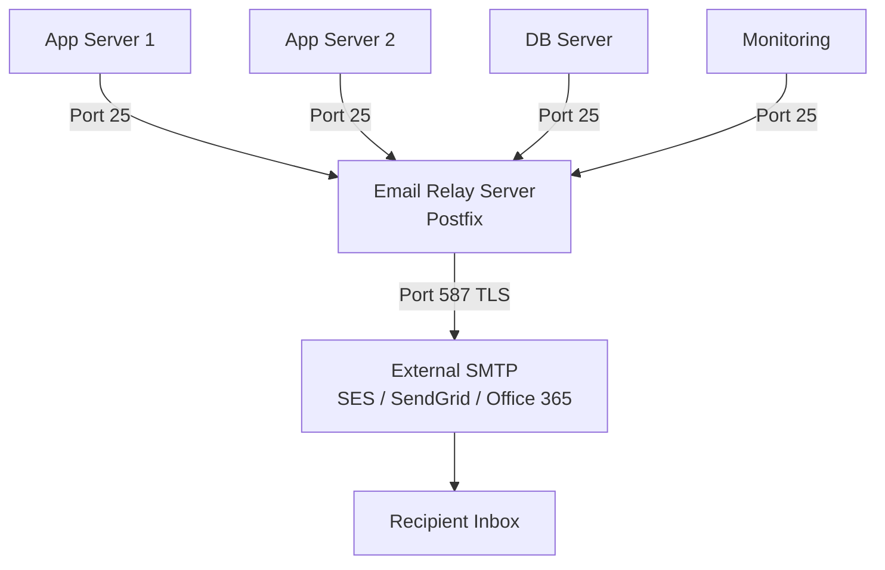

# How to Use Ansible to Configure System Email Relay

Author: [nawazdhandala](https://www.github.com/nawazdhandala)

Tags: Ansible, Email, SMTP Relay, Linux

Description: Set up centralized email relay servers using Ansible so all your Linux servers route outbound mail through a single trusted gateway.

---

In any sizable infrastructure, you do not want every server sending email directly to the internet. Instead, you route all outbound email through a central relay server (or a cloud relay service). This approach gives you a single point of control for email delivery, consistent sender addresses, proper authentication, and simplified firewall rules since only the relay needs outbound SMTP access.

Ansible makes it straightforward to configure both the relay server itself and all the client servers that need to send through it. This guide covers both sides of that equation.

## Architecture Overview



## Setting Up the Relay Server

The relay server accepts email from your internal network and forwards it to an external SMTP service. Here is the full playbook:

```yaml
# setup-relay-server.yml - Configure a Postfix email relay server
---
- name: Set up email relay server
  hosts: mail_relay
  become: true

  vars:
    relay_networks:
      - 127.0.0.0/8
      - 10.0.0.0/8
      - 172.16.0.0/12
      - 192.168.0.0/16
    relay_domain: "relay.example.com"
    external_relay: "[smtp.sendgrid.net]:587"
    external_user: "apikey"
    external_password: "{{ vault_smtp_relay_password }}"
    sender_domain: "example.com"

  tasks:
    # Install Postfix and supporting packages
    - name: Install Postfix and dependencies
      ansible.builtin.yum:
        name:
          - postfix
          - cyrus-sasl-plain
          - cyrus-sasl-lib
          - mailx
        state: present
      when: ansible_os_family == "RedHat"

    # Deploy the relay server main.cf
    - name: Configure Postfix relay server
      ansible.builtin.template:
        src: relay-main.cf.j2
        dest: /etc/postfix/main.cf
        owner: root
        group: root
        mode: '0644'
        backup: true
      notify: restart postfix

    # Create SASL credentials for upstream relay
    - name: Deploy upstream SASL credentials
      ansible.builtin.copy:
        content: "{{ external_relay }} {{ external_user }}:{{ external_password }}\n"
        dest: /etc/postfix/sasl_passwd
        owner: root
        group: root
        mode: '0600'
      no_log: true
      notify: rebuild sasl map

    # Create sender canonical map for address rewriting
    - name: Deploy sender canonical map
      ansible.builtin.copy:
        dest: /etc/postfix/sender_canonical
        mode: '0644'
        content: |
          # Rewrite all outgoing sender addresses
          /.+@.+\.internal$/    noreply@{{ sender_domain }}
          /.+@localhost$/       noreply@{{ sender_domain }}
          /root@.*/             server-alerts@{{ sender_domain }}
      notify: rebuild sender canonical

    # Create header checks to clean up internal hostnames
    - name: Deploy header checks
      ansible.builtin.copy:
        dest: /etc/postfix/header_checks
        mode: '0644'
        content: |
          # Remove internal hostnames from headers
          /^Received:.*\.internal/ IGNORE
          /^X-Mailer:/ IGNORE
      notify: restart postfix

    # Configure transport map for special routing
    - name: Deploy transport map
      ansible.builtin.copy:
        dest: /etc/postfix/transport
        mode: '0644'
        content: |
          # Route specific domains differently if needed
          # internal.example.com   local:
          # partner.com           smtp:[partner-relay.example.com]:25
      notify: rebuild transport map

    # Open firewall for internal SMTP
    - name: Open SMTP port for internal network
      ansible.posix.firewalld:
        port: 25/tcp
        permanent: true
        state: enabled
        immediate: true
      failed_when: false

    # Enable Postfix
    - name: Enable and start Postfix
      ansible.builtin.systemd:
        name: postfix
        state: started
        enabled: true

  handlers:
    - name: restart postfix
      ansible.builtin.systemd:
        name: postfix
        state: restarted

    - name: rebuild sasl map
      ansible.builtin.command:
        cmd: postmap /etc/postfix/sasl_passwd

    - name: rebuild sender canonical
      ansible.builtin.command:
        cmd: postmap regexp:/etc/postfix/sender_canonical

    - name: rebuild transport map
      ansible.builtin.command:
        cmd: postmap /etc/postfix/transport
```

The relay server main.cf template:

```jinja2
# Postfix relay server configuration - Managed by Ansible

# Identity
myhostname = {{ relay_domain }}
mydomain = {{ sender_domain }}
myorigin = $mydomain

# Network settings - accept mail from internal networks
inet_interfaces = all
inet_protocols = ipv4
mynetworks = {{ relay_networks | join(', ') }}

# This server is a relay, not a destination
mydestination =
local_transport = error:local delivery disabled

# Upstream relay configuration
relayhost = {{ external_relay }}
smtp_sasl_auth_enable = yes
smtp_sasl_password_maps = hash:/etc/postfix/sasl_passwd
smtp_sasl_security_options = noanonymous
smtp_tls_security_level = encrypt
smtp_tls_CAfile = /etc/pki/tls/certs/ca-bundle.crt

# Sender address rewriting
sender_canonical_maps = regexp:/etc/postfix/sender_canonical

# Header cleanup
header_checks = regexp:/etc/postfix/header_checks

# Transport map
transport_maps = hash:/etc/postfix/transport

# Security - restrict who can relay through us
smtpd_relay_restrictions =
    permit_mynetworks,
    reject_unauth_destination

smtpd_recipient_restrictions =
    permit_mynetworks,
    reject_unauth_destination

# Rate limiting to avoid hitting upstream limits
smtp_destination_rate_delay = 1s
smtp_destination_concurrency_limit = 5

# Message limits
message_size_limit = 26214400
mailbox_size_limit = 0

# Queue settings
maximal_queue_lifetime = 2d
bounce_queue_lifetime = 1d

# Logging
maillog_file = /var/log/mail.log
```

## Configuring Client Servers

Every server in your fleet needs to point its Postfix at the relay:

```yaml
# configure-relay-clients.yml - Point all servers at the email relay
---
- name: Configure email relay clients
  hosts: all:!mail_relay
  become: true

  vars:
    relay_server: "10.0.1.50"  # IP of your relay server
    sender_domain: "example.com"

  tasks:
    # Install Postfix if not present
    - name: Install Postfix
      ansible.builtin.yum:
        name:
          - postfix
          - mailx
        state: present
      when: ansible_os_family == "RedHat"

    # Configure as relay client
    - name: Set relayhost to internal relay
      ansible.builtin.lineinfile:
        path: /etc/postfix/main.cf
        regexp: '^relayhost\s*='
        line: "relayhost = [{{ relay_server }}]:25"
      notify: restart postfix

    # Only listen on localhost
    - name: Set inet_interfaces to loopback
      ansible.builtin.lineinfile:
        path: /etc/postfix/main.cf
        regexp: '^inet_interfaces\s*='
        line: "inet_interfaces = loopback-only"
      notify: restart postfix

    # Set proper hostname for outbound mail
    - name: Set myhostname
      ansible.builtin.lineinfile:
        path: /etc/postfix/main.cf
        regexp: '^myhostname\s*='
        line: "myhostname = {{ ansible_fqdn }}"
      notify: restart postfix

    # Set origin domain
    - name: Set myorigin
      ansible.builtin.lineinfile:
        path: /etc/postfix/main.cf
        regexp: '^myorigin\s*='
        line: "myorigin = {{ sender_domain }}"
      notify: restart postfix

    # Enable Postfix
    - name: Enable and start Postfix
      ansible.builtin.systemd:
        name: postfix
        state: started
        enabled: true

  handlers:
    - name: restart postfix
      ansible.builtin.systemd:
        name: postfix
        state: restarted
```

## Testing the Relay Chain

After deploying both the relay server and client configurations, verify the whole chain works:

```yaml
# test-relay.yml - Test the complete email relay chain
---
- name: Test email relay chain
  hosts: all
  become: true
  serial: 5

  vars:
    test_recipient: "ops@example.com"

  tasks:
    # Send a test message
    - name: Send test email through relay
      ansible.builtin.shell:
        cmd: |
          echo "Relay test from {{ inventory_hostname }} ({{ ansible_host }}) at $(date)" | \
          mail -s "Relay Test: {{ inventory_hostname }}" {{ test_recipient }}
      changed_when: true

    # Wait a moment for delivery attempt
    - name: Wait for delivery attempt
      ansible.builtin.pause:
        seconds: 5

    # Check for messages stuck in queue
    - name: Check mail queue
      ansible.builtin.command:
        cmd: postqueue -p
      register: queue_status
      changed_when: false

    - name: Report queue status
      ansible.builtin.debug:
        msg: "{{ inventory_hostname }}: {{ queue_status.stdout_lines | last | default('Queue empty') }}"

# Also check the relay server queue
- name: Check relay server queue
  hosts: mail_relay
  become: true

  tasks:
    - name: Show relay server queue
      ansible.builtin.command:
        cmd: postqueue -p
      register: relay_queue
      changed_when: false

    - name: Display relay queue
      ansible.builtin.debug:
        var: relay_queue.stdout_lines

    - name: Check relay log for recent deliveries
      ansible.builtin.shell:
        cmd: "tail -50 /var/log/mail.log | grep -E 'status=(sent|deferred|bounced)' || echo 'No recent delivery activity'"
      register: delivery_log
      changed_when: false

    - name: Display delivery log
      ansible.builtin.debug:
        var: delivery_log.stdout_lines
```

## Monitoring the Relay

Your relay server is a critical piece of infrastructure. If it goes down, no server in your fleet can send alerts:

```yaml
# monitor-relay.yml - Monitor email relay health
---
- name: Monitor email relay
  hosts: mail_relay
  become: true

  vars:
    queue_warning_threshold: 50
    queue_critical_threshold: 200

  tasks:
    # Check queue size
    - name: Get queue message count
      ansible.builtin.shell:
        cmd: "postqueue -p | tail -1 | grep -oP '\\d+(?= Request)' || echo 0"
      register: queue_size
      changed_when: false

    - name: Alert on queue size
      ansible.builtin.debug:
        msg: "{{ 'CRITICAL' if (queue_size.stdout | int) > queue_critical_threshold else 'WARNING' }}: Relay queue has {{ queue_size.stdout }} messages"
      when: queue_size.stdout | int > queue_warning_threshold

    # Check for deferred messages
    - name: Count deferred messages
      ansible.builtin.shell:
        cmd: "find /var/spool/postfix/deferred -type f 2>/dev/null | wc -l"
      register: deferred_count
      changed_when: false

    - name: Report deferred count
      ansible.builtin.debug:
        msg: "Deferred messages: {{ deferred_count.stdout }}"

    # Check upstream relay connectivity
    - name: Test upstream relay connectivity
      ansible.builtin.wait_for:
        host: smtp.sendgrid.net
        port: 587
        timeout: 10
      register: upstream_check
      failed_when: false

    - name: Report upstream status
      ansible.builtin.debug:
        msg: "Upstream relay: {{ 'CONNECTED' if upstream_check is not failed else 'UNREACHABLE' }}"

    # Check disk space on mail spool
    - name: Check mail spool disk usage
      ansible.builtin.shell:
        cmd: "df -h /var/spool/postfix | tail -1 | awk '{print $5}'"
      register: spool_usage
      changed_when: false

    - name: Alert on high spool usage
      ansible.builtin.debug:
        msg: "WARNING: Mail spool disk usage at {{ spool_usage.stdout }}"
      when: spool_usage.stdout | regex_replace('%', '') | int > 80
```

## Handling Relay Failover

For high availability, you can configure clients with multiple relay servers:

```yaml
# relay-failover.yml - Configure multiple relay servers for failover
---
- name: Configure relay failover
  hosts: all:!mail_relay
  become: true

  vars:
    relay_primary: "10.0.1.50"
    relay_secondary: "10.0.1.51"

  tasks:
    # Configure fallback relay
    - name: Configure primary and fallback relay
      ansible.builtin.blockinfile:
        path: /etc/postfix/main.cf
        marker: "# {mark} RELAY CONFIG - ANSIBLE MANAGED"
        block: |
          relayhost = [{{ relay_primary }}]:25
          fallback_relay = [{{ relay_secondary }}]:25
          smtp_connection_cache_on_demand = yes
          smtp_connection_cache_time_limit = 2s
      notify: restart postfix

  handlers:
    - name: restart postfix
      ansible.builtin.systemd:
        name: postfix
        state: restarted
```

## Production Recommendations

Things I have learned running email relay infrastructure:

1. Always restrict your relay to accept mail only from known networks. An open relay will be found by spammers within hours and your IP will be blacklisted. The `mynetworks` directive is your first line of defense.

2. Implement rate limiting on the relay. Without `smtp_destination_rate_delay`, a burst of alert emails (say, from a monitoring system) can trigger rate limits on your upstream provider, causing legitimate messages to be deferred.

3. Monitor the deferred queue on the relay server. Deferred messages mean something is wrong with upstream delivery. If the deferred queue grows while the active queue is empty, check your upstream credentials and connectivity.

4. Rewrite sender addresses at the relay, not on individual clients. This gives you a single place to manage sender identity and makes it easier to update when you switch email providers.

5. Set up a secondary relay if email delivery is business-critical. The `fallback_relay` directive in Postfix makes this trivial. Both relays should have identical upstream configurations.

6. Log retention on the relay server should be long enough to investigate delivery issues. I keep mail logs for 90 days, which covers most "I never got that notification" investigation requests.

A centralized email relay managed by Ansible gives you visibility and control over all outbound email from your infrastructure. It is one of those foundational pieces that, once set up properly, you rarely think about again.
