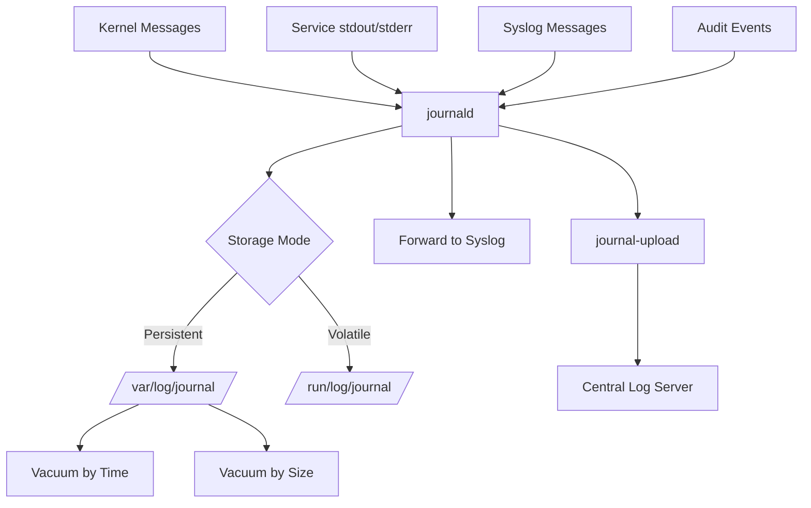

# How to Use Ansible to Configure System Journal (journald)

Author: [nawazdhandala](https://www.github.com/nawazdhandala)

Tags: Ansible, journald, Logging, systemd, Linux

Description: Automate systemd-journald configuration across your Linux fleet using Ansible to control log storage, retention, size limits, and forwarding.

---

systemd-journald is the logging service that comes with systemd, and on modern Linux distributions it is the primary log collector. It captures everything: kernel messages, service logs, boot messages, and more. The default configuration works fine for a single laptop, but in production you need to control how much disk space journals consume, how long they are retained, and where they are stored. Ansible lets you standardize these settings across your infrastructure.

## How journald Works

journald collects log data from multiple sources and stores it in a binary format in `/var/log/journal/` (persistent) or `/run/log/journal/` (volatile, lost on reboot). The main configuration file is `/etc/systemd/journald.conf`.

Key things to understand:

- By default on many distributions, journald only stores logs in memory (volatile)
- Persistent storage requires creating `/var/log/journal/`
- journald can forward logs to syslog for compatibility with traditional log management
- Journal files are automatically rotated based on size and time

## Enabling Persistent Storage

The first and most important configuration change is making journal storage persistent.

This playbook configures journald for persistent log storage with size limits:

```yaml
# configure-journald.yml - Set up systemd-journald
---
- name: Configure systemd-journald
  hosts: all
  become: true
  vars:
    journald_storage: persistent
    journald_max_use: 2G
    journald_max_file_size: 128M
    journald_max_retention: 30day
    journald_compress: "yes"
    journald_forward_to_syslog: "yes"
    journald_rate_limit_interval: 30s
    journald_rate_limit_burst: 10000

  tasks:
    - name: Create persistent journal directory
      ansible.builtin.file:
        path: /var/log/journal
        state: directory
        owner: root
        group: systemd-journal
        mode: '2755'

    - name: Deploy journald configuration
      ansible.builtin.template:
        src: journald.conf.j2
        dest: /etc/systemd/journald.conf
        owner: root
        group: root
        mode: '0644'
        backup: true
      notify: Restart journald

    - name: Ensure systemd-journal group exists
      ansible.builtin.group:
        name: systemd-journal
        state: present

    - name: Add ops users to systemd-journal group for log access
      ansible.builtin.user:
        name: "{{ item }}"
        groups: systemd-journal
        append: true
      loop: "{{ journal_readers | default([]) }}"
      when: journal_readers is defined

  handlers:
    - name: Restart journald
      ansible.builtin.systemd:
        name: systemd-journald
        state: restarted
```

## The journald Configuration Template

Here is the Jinja2 template for the journald configuration file:

```jinja2
# journald.conf.j2 - systemd-journald configuration
# Managed by Ansible - do not edit manually

[Journal]
# Storage mode: volatile, persistent, auto, none
Storage={{ journald_storage }}

# Compress journal files to save disk space
Compress={{ journald_compress }}

# Maximum disk space the journal can use
SystemMaxUse={{ journald_max_use }}

# Maximum size of individual journal files
SystemMaxFileSize={{ journald_max_file_size }}

# Keep journal data for this long
MaxRetentionSec={{ journald_max_retention }}

# Maximum disk space to keep free
SystemKeepFree=1G

# Rate limiting to prevent log floods
RateLimitIntervalSec={{ journald_rate_limit_interval }}
RateLimitBurst={{ journald_rate_limit_burst }}

# Forward to traditional syslog
ForwardToSyslog={{ journald_forward_to_syslog }}

# Forward to the kernel log buffer
ForwardToKMsg=no

# Forward to the console
ForwardToConsole=no

# Forward to the wall (broadcast to logged-in users)
ForwardToWall=yes

# Split journals per user (yes) or single system journal (no)
SplitMode=uid

# Maximum log level to store
MaxLevelStore=debug

# Maximum log level to forward to syslog
MaxLevelSyslog=debug

# Seal journal files for tamper detection (requires FSS key)

Seal=yes

Seal=no

```

## Role-Based Journal Configuration

Different server roles have different logging needs. Web servers generate more logs than jump boxes, for example.

Role-specific variables for journal configuration:

```yaml
# group_vars/webservers.yml - Web servers generate more logs
journald_max_use: 4G
journald_max_file_size: 256M
journald_max_retention: 14day
journald_rate_limit_burst: 20000

# group_vars/database_servers.yml - Keep DB logs longer
journald_max_use: 2G
journald_max_file_size: 128M
journald_max_retention: 90day
journald_rate_limit_burst: 5000

# group_vars/build_servers.yml - Build servers are chatty
journald_max_use: 8G
journald_max_file_size: 512M
journald_max_retention: 7day
journald_rate_limit_burst: 50000
```

## Journal Maintenance Tasks

Regular maintenance keeps journal storage under control.

This playbook performs journal maintenance operations:

```yaml
# maintain-journal.yml - Journal cleanup and maintenance
---
- name: Journal Maintenance
  hosts: all
  become: true
  tasks:
    - name: Check current journal disk usage
      ansible.builtin.command: journalctl --disk-usage
      register: journal_usage
      changed_when: false

    - name: Display journal disk usage
      ansible.builtin.debug:
        msg: "{{ inventory_hostname }}: {{ journal_usage.stdout }}"

    - name: Vacuum old journal entries by time
      ansible.builtin.command:
        cmd: "journalctl --vacuum-time=30d"
      register: vacuum_time
      changed_when: "'Deleted' in vacuum_time.stdout"

    - name: Vacuum journal entries by size
      ansible.builtin.command:
        cmd: "journalctl --vacuum-size=2G"
      register: vacuum_size
      changed_when: "'Deleted' in vacuum_size.stdout"

    - name: Verify journal file integrity
      ansible.builtin.command:
        cmd: "journalctl --verify"
      register: verify_result
      changed_when: false
      failed_when: false

    - name: Report journal verification status
      ansible.builtin.debug:
        msg: "Journal verification: {{ 'PASSED' if verify_result.rc == 0 else 'ISSUES FOUND' }}"

    - name: Check journal disk usage after cleanup
      ansible.builtin.command: journalctl --disk-usage
      register: journal_usage_after
      changed_when: false

    - name: Display cleaned journal size
      ansible.builtin.debug:
        msg: "{{ inventory_hostname }} after cleanup: {{ journal_usage_after.stdout }}"
```

## Setting Up Journal Export

For centralized logging, you can export journal entries to external systems.

This playbook configures journal-upload for remote log shipping:

```yaml
# configure-journal-upload.yml - Ship logs to central server
---
- name: Configure Journal Remote Upload
  hosts: all
  become: true
  vars:
    journal_remote_url: "http://logserver.example.com:19532"

  tasks:
    - name: Install systemd-journal-remote package
      ansible.builtin.apt:
        name: systemd-journal-remote
        state: present
      when: ansible_os_family == "Debian"

    - name: Configure journal-upload
      ansible.builtin.copy:
        dest: /etc/systemd/journal-upload.conf
        mode: '0644'
        content: |
          [Upload]
          URL={{ journal_remote_url }}
          # ServerKeyFile=/etc/ssl/private/journal-upload.pem
          # ServerCertificateFile=/etc/ssl/certs/journal-upload.pem
          # TrustedCertificateFile=/etc/ssl/ca/journal-ca.pem
      notify: Restart journal-upload

    - name: Enable and start journal-upload service
      ansible.builtin.systemd:
        name: systemd-journal-upload
        enabled: true
        state: started

  handlers:
    - name: Restart journal-upload
      ansible.builtin.systemd:
        name: systemd-journal-upload
        state: restarted
```

## Scheduled Journal Cleanup with Cron

Automate periodic journal maintenance:

```yaml
# schedule-journal-maintenance.yml - Automated cleanup
---
- name: Schedule Journal Maintenance
  hosts: all
  become: true
  tasks:
    - name: Create journal maintenance script
      ansible.builtin.copy:
        dest: /usr/local/bin/journal-maintenance.sh
        mode: '0750'
        content: |
          #!/bin/bash
          # Journal maintenance - runs weekly via cron
          # Managed by Ansible

          LOG="/var/log/journal-maintenance.log"
          echo "$(date): Starting journal maintenance" >> $LOG

          # Remove entries older than retention period
          journalctl --vacuum-time=30d >> $LOG 2>&1

          # Cap total size
          journalctl --vacuum-size=2G >> $LOG 2>&1

          # Verify integrity
          journalctl --verify >> $LOG 2>&1

          # Log current usage
          echo "$(date): Current usage:" >> $LOG
          journalctl --disk-usage >> $LOG 2>&1

    - name: Schedule weekly journal maintenance
      ansible.builtin.cron:
        name: "Journal maintenance"
        weekday: "0"
        hour: "3"
        minute: "30"
        job: "/usr/local/bin/journal-maintenance.sh"
        user: root
```

## Journal Architecture



## Troubleshooting Journal Issues

**Journal taking too much disk space**: Check with `journalctl --disk-usage`. If it is over your limit, the `SystemMaxUse` setting might not be applying. Restart journald after config changes.

**Missing logs after reboot**: If `/var/log/journal/` does not exist, journald falls back to volatile storage. Create the directory and restart journald.

**Rate limiting dropping logs**: If you see "Suppressed N messages" in your logs, increase `RateLimitBurst` or set `RateLimitIntervalSec=0` to disable rate limiting (not recommended for production).

**Journal corruption**: Run `journalctl --verify` to check integrity. If files are corrupt, you can delete them from `/var/log/journal/` and restart journald. The corrupt entries are lost, but logging resumes normally.

Properly configured journald is a solid foundation for your logging infrastructure. Whether you use it as your primary log storage or as a buffer before shipping to a central system, getting the configuration right with Ansible ensures you never lose logs due to disk pressure or misconfiguration.
