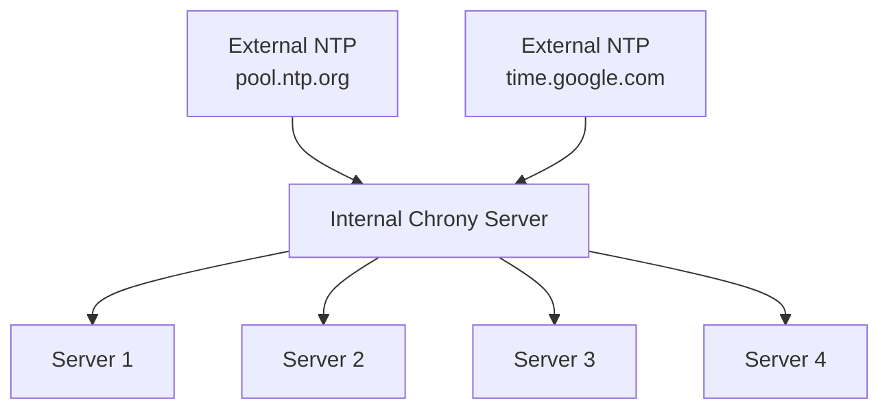

# How to Use Ansible to Configure Time Synchronization (chrony)

Author: [nawazdhandala](https://www.github.com/nawazdhandala)

Tags: Ansible, Chrony, NTP, Time Synchronization

Description: Configure chrony for accurate time synchronization across your Linux servers using Ansible to prevent clock drift issues.

---

Time synchronization is one of those infrastructure fundamentals that people ignore until something breaks. When server clocks drift, Kerberos authentication fails, log correlation becomes impossible, database replication goes haywire, TLS certificates appear expired, and cron jobs run at the wrong time. Chrony is the modern replacement for ntpd on RHEL-family systems, and it is better in almost every way: faster synchronization, better accuracy, and easier configuration.

Managing chrony with Ansible ensures every server in your fleet points to the same time sources with the same configuration. This guide covers everything from basic NTP client setup to running your own internal time servers.

## Why Chrony Over ntpd

Chrony handles several scenarios better than traditional ntpd:

- Virtual machines with unstable clocks
- Servers that are frequently suspended or hibernated
- Intermittent network connectivity
- Initial synchronization speed (chrony syncs in seconds, ntpd can take minutes)



## Installing and Configuring Chrony

```yaml
# configure-chrony.yml - Install and configure chrony for time sync
---
- name: Configure chrony time synchronization
  hosts: all
  become: true

  vars:
    # NTP sources - use internal servers if available, otherwise public pools
    chrony_ntp_servers:
      - server: "ntp1.corp.example.com"
        options: "iburst prefer"
      - server: "ntp2.corp.example.com"
        options: "iburst"
      - server: "0.pool.ntp.org"
        options: "iburst"
      - server: "1.pool.ntp.org"
        options: "iburst"

    # For cloud environments, you might use provider-specific servers
    chrony_ntp_servers_aws:
      - server: "169.254.169.123"
        options: "prefer iburst minpoll 4 maxpoll 4"

    # Allow these networks to query this server as an NTP source
    chrony_allow_networks: []

    # Maximum allowed clock skew before stepping (in seconds)
    chrony_max_offset: 3

    # Log directory
    chrony_log_dir: /var/log/chrony

  tasks:
    # Install chrony (remove ntpd if present)
    - name: Remove ntpd if installed
      ansible.builtin.yum:
        name:
          - ntp
          - ntpdate
        state: absent
      when: ansible_os_family == "RedHat"

    - name: Install chrony (RedHat)
      ansible.builtin.yum:
        name: chrony
        state: present
      when: ansible_os_family == "RedHat"

    - name: Install chrony (Debian)
      ansible.builtin.apt:
        name: chrony
        state: present
        update_cache: true
      when: ansible_os_family == "Debian"

    # Deploy chrony configuration
    - name: Deploy chrony.conf
      ansible.builtin.template:
        src: chrony.conf.j2
        dest: /etc/chrony.conf
        owner: root
        group: root
        mode: '0644'
        backup: true
      notify: restart chronyd

    # Create log directory
    - name: Create chrony log directory
      ansible.builtin.file:
        path: "{{ chrony_log_dir }}"
        state: directory
        owner: chrony
        group: chrony
        mode: '0755'

    # Enable and start chrony
    - name: Enable chronyd
      ansible.builtin.systemd:
        name: chronyd
        state: started
        enabled: true

    # Open NTP port if this server is an NTP source
    - name: Open NTP port for clients
      ansible.posix.firewalld:
        service: ntp
        permanent: true
        state: enabled
        immediate: true
      when: chrony_allow_networks | length > 0
      failed_when: false

  handlers:
    - name: restart chronyd
      ansible.builtin.systemd:
        name: chronyd
        state: restarted
```

The chrony.conf template:

```jinja2
# chrony.conf - Managed by Ansible
# Do not edit manually

# NTP sources

server {{ ntp.server }} {{ ntp.options }}


# Record the rate at which the system clock gains/losses time
driftfile /var/lib/chrony/drift

# Allow the system clock to be stepped in the first three updates
# if its offset is larger than {{ chrony_max_offset }} seconds
makestep {{ chrony_max_offset }} 3

# Enable kernel synchronization of the real-time clock (RTC)
rtcsync

# Enable hardware timestamping on all interfaces that support it

hwtimestamp *



# Allow NTP client access from these networks

allow {{ network }}



# Serve time even if not synchronized to a time source
# (useful for internal NTP servers)

local stratum 10


# Specify the directory for log files
logdir {{ chrony_log_dir }}

# Select which information is logged
log measurements statistics tracking

# Minimum number of selectable sources required to adjust the system clock
minsources 2

# Specify the key file for NTP authentication
keyfile /etc/chrony.keys

# Do not allow commands from the network
cmdallow 127.0.0.1
cmdallow ::1

# Lock chronyd into RAM to prevent swapping
lock_all
```

## Setting Up Internal NTP Servers

For environments that need their own NTP infrastructure:

```yaml
# setup-ntp-server.yml - Configure internal NTP server
---
- name: Configure internal NTP server
  hosts: ntp_servers
  become: true

  vars:
    # These servers sync from public pools and serve internal clients
    chrony_ntp_servers:
      - server: "0.pool.ntp.org"
        options: "iburst minpoll 4 maxpoll 6"
      - server: "1.pool.ntp.org"
        options: "iburst minpoll 4 maxpoll 6"
      - server: "2.pool.ntp.org"
        options: "iburst minpoll 4 maxpoll 6"
      - server: "3.pool.ntp.org"
        options: "iburst minpoll 4 maxpoll 6"
    chrony_allow_networks:
      - "10.0.0.0/8"
      - "172.16.0.0/12"
      - "192.168.0.0/16"

  tasks:
    - name: Deploy NTP server chrony.conf
      ansible.builtin.template:
        src: chrony.conf.j2
        dest: /etc/chrony.conf
        owner: root
        group: root
        mode: '0644'
      notify: restart chronyd

    - name: Enable chronyd
      ansible.builtin.systemd:
        name: chronyd
        state: started
        enabled: true

    - name: Open NTP firewall port
      ansible.posix.firewalld:
        service: ntp
        permanent: true
        state: enabled
        immediate: true
      failed_when: false

  handlers:
    - name: restart chronyd
      ansible.builtin.systemd:
        name: chronyd
        state: restarted
```

## Verifying Time Synchronization

After deployment, verify that synchronization is working correctly:

```yaml
# verify-time-sync.yml - Verify chrony synchronization across fleet
---
- name: Verify time synchronization
  hosts: all
  become: true

  tasks:
    # Check chrony tracking (sync status)
    - name: Get chrony tracking info
      ansible.builtin.command:
        cmd: chronyc tracking
      register: tracking
      changed_when: false

    - name: Display tracking info
      ansible.builtin.debug:
        msg: "{{ tracking.stdout_lines }}"

    # Check NTP sources
    - name: Get chrony sources
      ansible.builtin.command:
        cmd: chronyc sources -v
      register: sources
      changed_when: false

    - name: Display NTP sources
      ansible.builtin.debug:
        msg: "{{ sources.stdout_lines }}"

    # Check if the clock is synchronized
    - name: Check synchronization status
      ansible.builtin.shell:
        cmd: "chronyc tracking | grep 'Leap status'"
      register: sync_status
      changed_when: false

    - name: Alert on unsynchronized clock
      ansible.builtin.debug:
        msg: "WARNING: {{ inventory_hostname }} clock is NOT synchronized! {{ sync_status.stdout }}"
      when: "'Normal' not in sync_status.stdout"

    # Check clock offset
    - name: Get current offset
      ansible.builtin.shell:
        cmd: "chronyc tracking | grep 'Last offset' | awk '{print $4}'"
      register: clock_offset
      changed_when: false

    - name: Alert on large clock offset
      ansible.builtin.debug:
        msg: "WARNING: {{ inventory_hostname }} has a clock offset of {{ clock_offset.stdout }} seconds"
      when: clock_offset.stdout | float | abs > 0.1

    # Compare system time with expected
    - name: Get system time
      ansible.builtin.command:
        cmd: date '+%Y-%m-%d %H:%M:%S %Z'
      register: system_time
      changed_when: false

    - name: Display system time
      ansible.builtin.debug:
        msg: "{{ inventory_hostname }}: {{ system_time.stdout }}"
```

## Monitoring Chrony Health

Set up ongoing monitoring for time synchronization:

```yaml
# monitor-chrony.yml - Monitor chrony health for alerting
---
- name: Monitor chrony synchronization health
  hosts: all
  become: true

  vars:
    max_offset_seconds: 0.5
    max_stratum: 5

  tasks:
    # Get synchronization data in machine-readable format
    - name: Get chrony tracking data
      ansible.builtin.shell:
        cmd: |
          chronyc -c tracking
      register: tracking_csv
      changed_when: false

    # Parse key metrics
    - name: Parse tracking data
      ansible.builtin.set_fact:
        chrony_ref_name: "{{ tracking_csv.stdout.split(',')[0] }}"
        chrony_stratum: "{{ tracking_csv.stdout.split(',')[2] }}"
        chrony_offset: "{{ tracking_csv.stdout.split(',')[4] }}"
        chrony_last_update: "{{ tracking_csv.stdout.split(',')[3] }}"

    # Build health report
    - name: Build chrony health report
      ansible.builtin.set_fact:
        chrony_health:
          hostname: "{{ inventory_hostname }}"
          reference: "{{ chrony_ref_name }}"
          stratum: "{{ chrony_stratum }}"
          offset_seconds: "{{ chrony_offset }}"
          healthy: "{{ (chrony_offset | float | abs < max_offset_seconds) and (chrony_stratum | int < max_stratum) and (chrony_stratum | int > 0) }}"

    - name: Display health status
      ansible.builtin.debug:
        msg: >
          {{ inventory_hostname }} |
          Ref: {{ chrony_ref_name }} |
          Stratum: {{ chrony_stratum }} |
          Offset: {{ chrony_offset }}s |
          {{ 'HEALTHY' if chrony_health.healthy else 'UNHEALTHY' }}

    # Alert on unhealthy servers
    - name: Alert on time sync issues
      ansible.builtin.debug:
        msg: "ALERT: Time sync issue on {{ inventory_hostname }}! Stratum: {{ chrony_stratum }}, Offset: {{ chrony_offset }}s"
      when: not chrony_health.healthy

    # Deploy a simple cron-based monitor
    - name: Deploy chrony monitoring script
      ansible.builtin.copy:
        dest: /usr/local/bin/check-chrony.sh
        mode: '0755'
        content: |
          #!/bin/bash
          # Check chrony health and alert if sync is lost
          OFFSET=$(chronyc tracking | grep "Last offset" | awk '{print $4}')
          STRATUM=$(chronyc tracking | grep "Stratum" | awk '{print $3}')
          STATUS=$(chronyc tracking | grep "Leap status" | awk -F: '{print $2}' | xargs)

          if [ "$STATUS" != "Normal" ] || [ "$STRATUM" = "0" ]; then
              logger -p daemon.err "chrony: Clock NOT synchronized! Status=$STATUS Stratum=$STRATUM"
              echo "CRITICAL: Clock not synchronized on $(hostname)" | mail -s "NTP Alert: $(hostname)" ops-team@example.com 2>/dev/null
          fi

    - name: Schedule chrony health check
      ansible.builtin.cron:
        name: "Chrony health check"
        minute: "*/15"
        job: "/usr/local/bin/check-chrony.sh"
        user: root
```

## Handling Time Zone Configuration

While you are managing time, ensure time zones are also consistent:

```yaml
# set-timezone.yml - Configure timezone alongside chrony
---
- name: Configure system timezone
  hosts: all
  become: true

  vars:
    system_timezone: "UTC"

  tasks:
    # Set the system timezone
    - name: Set timezone
      community.general.timezone:
        name: "{{ system_timezone }}"

    # Verify the timezone is set correctly
    - name: Verify timezone
      ansible.builtin.command:
        cmd: timedatectl
      register: timedatectl_output
      changed_when: false

    - name: Display time settings
      ansible.builtin.debug:
        var: timedatectl_output.stdout_lines
```

## Practical Tips

Lessons from running chrony in production:

1. Use internal NTP servers whenever possible. Having every server in your fleet hitting public NTP pools is wasteful and can get your IP blocked for excessive queries. Set up 2-3 internal chrony servers that sync from public pools, and point everything else at those.

2. The `makestep` directive controls when chrony will jump the clock versus gradually adjusting it. The default `makestep 1.0 3` means "step the clock if the offset is more than 1 second, but only during the first 3 updates after startup." After that, chrony will only slew (gradually adjust). This is important because a clock jump can confuse running applications.

3. Set `minsources 2` to require at least two agreeable NTP sources before adjusting the clock. This prevents a single rogue NTP server from corrupting your time.

4. Use UTC on all servers. Having some servers in EST and others in PST makes log correlation a nightmare. Set everything to UTC and convert for display in your monitoring tools.

5. Monitor the stratum value. If your servers are at stratum 4 or higher, your NTP hierarchy is too deep and accuracy suffers. Ideally, your internal NTP servers should be stratum 2 (directly syncing from stratum 1 public servers), and your clients should be stratum 3.

6. For virtual machines, chrony is significantly better than ntpd. VMs have notoriously unstable clocks because the hypervisor can pause them at any time. Chrony is designed to handle this gracefully.

Accurate time is the foundation that many other systems depend on. With chrony managed by Ansible, you can trust that every server in your fleet has the same time, from the same sources, with the same configuration.
