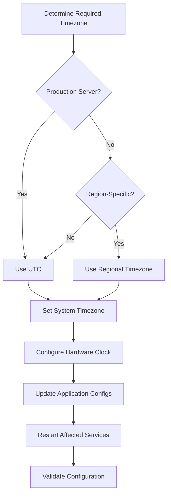

# How to Use Ansible to Configure Timezone Settings

Author: [nawazdhandala](https://www.github.com/nawazdhandala)

Tags: Ansible, Timezone, Linux, System Configuration

Description: Automate timezone configuration across your Linux infrastructure using Ansible to ensure consistent time settings for logging, scheduling, and compliance.

---

Timezone mismatches across servers create subtle, maddening bugs. Your cron jobs run at the wrong time, your log timestamps do not line up when you are correlating events across servers, and your database queries return unexpected results. I have debugged more issues caused by timezone inconsistency than I care to admit. Ansible makes it trivial to enforce the same timezone across your entire fleet.

## Why UTC Is (Almost) Always the Right Choice

The standard practice for servers is to set them all to UTC. Here is why:

- Log correlation is straightforward when every server uses the same timezone
- No daylight saving time surprises breaking your scheduled tasks
- Database timestamps are unambiguous
- Compliance frameworks often require UTC for audit logs

The only exception I make is for servers that run user-facing applications where local time display is handled at the application level, not the OS level.

## Setting Timezone with the timezone Module

Ansible has a built-in module for this, and it works across all major Linux distributions.

This playbook sets the timezone to UTC on all servers:

```yaml
# set-timezone.yml - Configure timezone across all servers
---
- name: Configure System Timezone
  hosts: all
  become: true
  vars:
    system_timezone: "UTC"

  tasks:
    - name: Set system timezone
      community.general.timezone:
        name: "{{ system_timezone }}"

    - name: Verify timezone is set correctly
      ansible.builtin.command: timedatectl
      register: tz_status
      changed_when: false

    - name: Display timezone configuration
      ansible.builtin.debug:
        msg: "{{ tz_status.stdout_lines }}"
```

## Per-Environment Timezone Configuration

Some organizations need different timezones for different environments or regions.

This inventory structure defines timezones per region:

```yaml
# group_vars/us_east.yml
system_timezone: "America/New_York"

# group_vars/us_west.yml
system_timezone: "America/Los_Angeles"

# group_vars/eu_west.yml
system_timezone: "Europe/London"

# group_vars/asia_pacific.yml
system_timezone: "Asia/Tokyo"

# group_vars/production.yml - Override for production (always UTC)
system_timezone: "UTC"
```

This playbook applies the timezone from group variables:

```yaml
# set-timezone-regional.yml - Regional timezone configuration
---
- name: Configure Regional Timezones
  hosts: all
  become: true
  tasks:
    - name: Verify the requested timezone is valid
      ansible.builtin.command:
        cmd: "timedatectl list-timezones"
      register: valid_timezones
      changed_when: false

    - name: Fail if timezone is not recognized
      ansible.builtin.assert:
        that:
          - system_timezone in valid_timezones.stdout_lines
        fail_msg: "{{ system_timezone }} is not a valid timezone on {{ inventory_hostname }}"

    - name: Set the system timezone
      community.general.timezone:
        name: "{{ system_timezone }}"
      notify: Restart cron

    - name: Restart rsyslog to pick up timezone change
      ansible.builtin.systemd:
        name: rsyslog
        state: restarted
      failed_when: false

  handlers:
    - name: Restart cron
      ansible.builtin.systemd:
        name: cron
        state: restarted
      failed_when: false
```

## Handling the Hardware Clock

Linux systems have two clocks: the system clock (software, managed by the kernel) and the hardware clock (RTC, on the motherboard). They need to agree on whether they store time as UTC or local time.

This playbook configures the hardware clock to use UTC:

```yaml
# configure-hwclock.yml - Set hardware clock to UTC
---
- name: Configure Hardware Clock
  hosts: all
  become: true
  tasks:
    - name: Set hardware clock to UTC mode
      community.general.timezone:
        name: "{{ system_timezone | default('UTC') }}"
        hwclock: UTC

    - name: Sync system clock to hardware clock
      ansible.builtin.command: hwclock --systohc --utc
      changed_when: false

    - name: Verify hardware clock setting
      ansible.builtin.command: timedatectl
      register: timedatectl_output
      changed_when: false

    - name: Check RTC in UTC setting
      ansible.builtin.debug:
        msg: "{{ timedatectl_output.stdout_lines | select('search', 'RTC in local TZ') | list }}"
```

## Configuring Timezone for Specific Applications

Some applications maintain their own timezone settings independent of the system timezone.

This playbook configures timezone settings for common applications:

```yaml
# configure-app-timezones.yml - Set timezone for applications
---
- name: Configure Application Timezones
  hosts: all
  become: true
  vars:
    app_timezone: "UTC"

  tasks:
    - name: Set timezone for PHP applications
      ansible.builtin.lineinfile:
        path: /etc/php/8.1/cli/php.ini
        regexp: '^;?date.timezone'
        line: "date.timezone = {{ app_timezone }}"
      when: "'php_servers' in group_names"
      notify: Restart php-fpm

    - name: Set timezone for MySQL/MariaDB
      ansible.builtin.lineinfile:
        path: /etc/mysql/mysql.conf.d/mysqld.cnf
        regexp: '^default-time-zone'
        line: "default-time-zone = '+00:00'"
        insertafter: '^\[mysqld\]'
      when: "'database_servers' in group_names"
      notify: Restart mysql

    - name: Set timezone for PostgreSQL
      ansible.builtin.lineinfile:
        path: /etc/postgresql/15/main/postgresql.conf
        regexp: '^timezone'
        line: "timezone = '{{ app_timezone }}'"
      when: "'postgres_servers' in group_names"
      notify: Restart postgresql

    - name: Set timezone environment variable system-wide
      ansible.builtin.lineinfile:
        path: /etc/environment
        regexp: '^TZ='
        line: "TZ={{ app_timezone }}"

    - name: Set timezone in profile for all users
      ansible.builtin.copy:
        dest: /etc/profile.d/timezone.sh
        mode: '0644'
        content: |
          # System timezone - managed by Ansible
          export TZ="{{ app_timezone }}"

  handlers:
    - name: Restart php-fpm
      ansible.builtin.systemd:
        name: php8.1-fpm
        state: restarted

    - name: Restart mysql
      ansible.builtin.systemd:
        name: mysql
        state: restarted

    - name: Restart postgresql
      ansible.builtin.systemd:
        name: postgresql
        state: restarted
```

## Timezone Audit Playbook

Run this periodically to catch any drift.

This playbook checks timezone consistency across your fleet:

```yaml
# audit-timezones.yml - Verify timezone settings
---
- name: Audit Timezone Configuration
  hosts: all
  become: true
  vars:
    expected_timezone: "UTC"

  tasks:
    - name: Get current timezone
      ansible.builtin.slurp:
        src: /etc/timezone
      register: current_tz
      failed_when: false

    - name: Get timedatectl output
      ansible.builtin.command: timedatectl show --property=Timezone --value
      register: timedatectl_tz
      changed_when: false

    - name: Check system date and time
      ansible.builtin.command: date '+%Z %Y-%m-%d %H:%M:%S'
      register: current_datetime
      changed_when: false

    - name: Report timezone status
      ansible.builtin.debug:
        msg: >
          {{ inventory_hostname }}:
          Timezone={{ timedatectl_tz.stdout }}
          DateTime={{ current_datetime.stdout }}
          Expected={{ expected_timezone }}
          Match={{ timedatectl_tz.stdout == expected_timezone }}

    - name: Flag servers with wrong timezone
      ansible.builtin.fail:
        msg: >
          TIMEZONE MISMATCH on {{ inventory_hostname }}!
          Expected: {{ expected_timezone }}
          Found: {{ timedatectl_tz.stdout }}
      when: timedatectl_tz.stdout != expected_timezone
      ignore_errors: true
```

## Timezone Configuration Flow



## Common Pitfalls

**Containers inherit host timezone**: If your Docker containers mount `/etc/localtime` from the host, changing the host timezone affects all containers. This is usually what you want, but be aware of it.

**Cron and timezone changes**: After changing the timezone, restart the cron daemon. Older versions of cron do not pick up timezone changes until restarted, which means your scheduled jobs run at the old timezone.

**Java applications**: Java maintains its own timezone database. If you change the system timezone, Java applications may need to be restarted or configured separately with `-Duser.timezone=UTC`.

**Database timestamps**: If you change a database server's timezone, existing timestamps stored as "timestamp without time zone" will suddenly mean something different. Plan this carefully and communicate with your development team before making the change.

Timezone configuration is a small detail that has outsized impact on operations. Get it right early, enforce it with Ansible, and you will never have to deal with the "which timezone is this log in?" conversation again.
