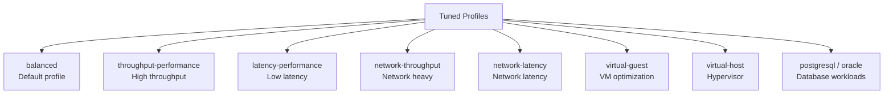

# How to Use Ansible to Configure Tuned Profiles for Performance

Author: [nawazdhandala](https://www.github.com/nawazdhandala)

Tags: Ansible, Tuned, Performance, Linux Optimization

Description: Optimize Linux server performance using Ansible to deploy and manage tuned profiles tailored for specific workloads.

---

Linux servers do not come optimized for your specific workload out of the box. A database server needs different kernel parameters than a web server, which needs different settings than a network gateway. The `tuned` daemon on RHEL-family systems provides an elegant solution: predefined profiles that adjust kernel parameters, disk I/O schedulers, CPU governors, and network settings for common workload types.

Managing tuned profiles with Ansible means every server gets the right performance profile for its role, consistently and automatically. No more manual tuning that gets lost during reprovisioning.

## Understanding Tuned Profiles

Tuned comes with several built-in profiles. Here are the most commonly used ones:



## Installing and Enabling Tuned

```yaml
# install-tuned.yml - Install and enable the tuned daemon
---
- name: Install and enable tuned
  hosts: all
  become: true

  tasks:
    # Install tuned
    - name: Install tuned (RedHat)
      ansible.builtin.yum:
        name:
          - tuned
          - tuned-utils
        state: present
      when: ansible_os_family == "RedHat"

    - name: Install tuned (Debian)
      ansible.builtin.apt:
        name: tuned
        state: present
        update_cache: true
      when: ansible_os_family == "Debian"

    # Enable and start tuned daemon
    - name: Enable tuned service
      ansible.builtin.systemd:
        name: tuned
        state: started
        enabled: true

    # List available profiles
    - name: List available tuned profiles
      ansible.builtin.command:
        cmd: tuned-adm list
      register: available_profiles
      changed_when: false

    - name: Display available profiles
      ansible.builtin.debug:
        var: available_profiles.stdout_lines

    # Show currently active profile
    - name: Show current profile
      ansible.builtin.command:
        cmd: tuned-adm active
      register: current_profile
      changed_when: false

    - name: Display current profile
      ansible.builtin.debug:
        msg: "{{ inventory_hostname }}: {{ current_profile.stdout }}"
```

## Applying Profiles Based on Server Role

Different server roles need different tuned profiles. This playbook applies the right profile based on inventory groups:

```yaml
# apply-tuned-profiles.yml - Apply workload-specific tuned profiles
---
- name: Apply tuned profiles based on server role
  hosts: all
  become: true

  vars:
    # Map inventory groups to tuned profiles
    role_profiles:
      web_servers: "network-latency"
      db_servers: "throughput-performance"
      app_servers: "latency-performance"
      file_servers: "throughput-performance"
      virtual_machines: "virtual-guest"
      hypervisors: "virtual-host"
      network_appliances: "network-throughput"
      default: "balanced"

  tasks:
    # Determine the correct profile for this host
    - name: Determine target profile
      ansible.builtin.set_fact:
        target_profile: >-
          
          {{ role_profiles[group] }}
          

    # Fall back to default if no specific group matched
    - name: Set default profile if none matched
      ansible.builtin.set_fact:
        target_profile: "{{ role_profiles['default'] }}"
      when: target_profile | trim == ""

    # Get the currently active profile
    - name: Get current active profile
      ansible.builtin.command:
        cmd: tuned-adm active
      register: current_active
      changed_when: false

    # Apply the target profile
    - name: Apply tuned profile
      ansible.builtin.command:
        cmd: "tuned-adm profile {{ target_profile | trim }}"
      when: target_profile | trim not in current_active.stdout
      register: profile_applied

    # Verify the profile was applied
    - name: Verify active profile
      ansible.builtin.command:
        cmd: tuned-adm active
      register: verify_profile
      changed_when: false

    - name: Display profile status
      ansible.builtin.debug:
        msg: "{{ inventory_hostname }}: {{ verify_profile.stdout }}"

    # Verify tuned recommendations
    - name: Check tuned verification
      ansible.builtin.command:
        cmd: tuned-adm verify
      register: verify_result
      changed_when: false
      failed_when: false

    - name: Display verification result
      ansible.builtin.debug:
        msg: "Verification: {{ verify_result.stdout }}"
```

## Creating Custom Tuned Profiles

Built-in profiles are a great start, but you often need custom profiles tailored to your specific applications:

```yaml
# custom-tuned-profile.yml - Deploy custom tuned profiles
---
- name: Deploy custom tuned profiles
  hosts: all
  become: true

  vars:
    custom_profiles:
      - name: web-optimized
        parent: network-latency
        description: "Custom profile for web servers"
        settings:
          sysctl:
            net.core.somaxconn: 65535
            net.ipv4.tcp_max_syn_backlog: 65535
            net.core.netdev_max_backlog: 65535
            net.ipv4.tcp_fin_timeout: 15
            net.ipv4.tcp_tw_reuse: 1
            vm.swappiness: 10
            net.ipv4.tcp_keepalive_time: 300
            net.ipv4.tcp_keepalive_intvl: 30
            net.ipv4.tcp_keepalive_probes: 5
          vm:
            transparent_hugepages: never

      - name: database-optimized
        parent: throughput-performance
        description: "Custom profile for database servers"
        settings:
          sysctl:
            vm.swappiness: 1
            vm.dirty_background_ratio: 5
            vm.dirty_ratio: 15
            vm.overcommit_memory: 0
            net.core.somaxconn: 4096
            kernel.sched_migration_cost_ns: 5000000
          vm:
            transparent_hugepages: never
          disk:
            readahead: 4096
            elevator: none

  tasks:
    # Create profile directories
    - name: Create custom profile directories
      ansible.builtin.file:
        path: "/etc/tuned/{{ item.name }}"
        state: directory
        owner: root
        group: root
        mode: '0755'
      loop: "{{ custom_profiles }}"

    # Deploy profile configuration files
    - name: Deploy custom profile config
      ansible.builtin.template:
        src: tuned-profile.conf.j2
        dest: "/etc/tuned/{{ item.name }}/tuned.conf"
        owner: root
        group: root
        mode: '0644'
      loop: "{{ custom_profiles }}"
      notify: restart tuned

  handlers:
    - name: restart tuned
      ansible.builtin.systemd:
        name: tuned
        state: restarted
```

The profile template:

```jinja2
# tuned.conf for {{ item.name }} - Managed by Ansible
# {{ item.description }}

[main]
summary={{ item.description }}
include={{ item.parent }}

[sysctl]


{{ key }}={{ value }}




[vm]

transparent_hugepages={{ item.settings.vm.transparent_hugepages }}




[disk]

readahead={{ item.settings.disk.readahead }}


elevator={{ item.settings.disk.elevator }}



[cpu]
governor=performance
energy_perf_bias=performance
min_perf_pct=100
```

## Auditing Current Tuned Settings

Before making changes, audit what is currently running:

```yaml
# audit-tuned.yml - Audit tuned profiles across the fleet
---
- name: Audit tuned profiles
  hosts: all
  become: true

  tasks:
    # Get active profile
    - name: Get active tuned profile
      ansible.builtin.command:
        cmd: tuned-adm active
      register: active_profile
      changed_when: false
      failed_when: false

    # Get recommended profile
    - name: Get recommended profile
      ansible.builtin.command:
        cmd: tuned-adm recommend
      register: recommended_profile
      changed_when: false

    # Verify current settings match profile
    - name: Verify profile compliance
      ansible.builtin.command:
        cmd: tuned-adm verify
      register: compliance
      changed_when: false
      failed_when: false

    # Check key kernel parameters
    - name: Get key sysctl values
      ansible.builtin.shell:
        cmd: |
          echo "vm.swappiness=$(sysctl -n vm.swappiness)"
          echo "vm.dirty_ratio=$(sysctl -n vm.dirty_ratio)"
          echo "net.core.somaxconn=$(sysctl -n net.core.somaxconn)"
          echo "transparent_hugepages=$(cat /sys/kernel/mm/transparent_hugepage/enabled)"
      register: kernel_params
      changed_when: false

    # Display audit results
    - name: Display audit results
      ansible.builtin.debug:
        msg:
          - "Host: {{ inventory_hostname }}"
          - "Active: {{ active_profile.stdout | default('tuned not running') }}"
          - "Recommended: {{ recommended_profile.stdout }}"
          - "Compliant: {{ compliance.stdout | default('verification failed') }}"
          - "Key params: {{ kernel_params.stdout_lines }}"
```

## Performance Testing After Profile Changes

After applying a new profile, validate that it actually improved performance:

```yaml
# benchmark-profile.yml - Run basic benchmarks before and after profile changes
---
- name: Benchmark tuned profile impact
  hosts: "{{ target_hosts }}"
  become: true

  tasks:
    # Record current profile
    - name: Get current profile
      ansible.builtin.command:
        cmd: tuned-adm active
      register: current_profile
      changed_when: false

    # Run disk I/O benchmark
    - name: Run disk write benchmark
      ansible.builtin.shell:
        cmd: "dd if=/dev/zero of=/tmp/bench_test bs=1M count=1024 oflag=dsync 2>&1 | tail -1"
      register: disk_benchmark
      changed_when: false

    # Run network buffer check
    - name: Check network buffer sizes
      ansible.builtin.shell:
        cmd: |
          echo "rmem_max=$(sysctl -n net.core.rmem_max)"
          echo "wmem_max=$(sysctl -n net.core.wmem_max)"
          echo "somaxconn=$(sysctl -n net.core.somaxconn)"
      register: net_buffers
      changed_when: false

    # Check CPU governor
    - name: Check CPU governor
      ansible.builtin.shell:
        cmd: "cat /sys/devices/system/cpu/cpu0/cpufreq/scaling_governor 2>/dev/null || echo 'not available'"
      register: cpu_governor
      changed_when: false

    # Check I/O scheduler
    - name: Check I/O scheduler
      ansible.builtin.shell:
        cmd: "cat /sys/block/sda/queue/scheduler 2>/dev/null || echo 'not available'"
      register: io_scheduler
      changed_when: false

    # Display results
    - name: Display benchmark results
      ansible.builtin.debug:
        msg:
          - "Profile: {{ current_profile.stdout }}"
          - "Disk write: {{ disk_benchmark.stdout }}"
          - "Network buffers: {{ net_buffers.stdout_lines }}"
          - "CPU governor: {{ cpu_governor.stdout }}"
          - "I/O scheduler: {{ io_scheduler.stdout }}"

    # Clean up benchmark file
    - name: Remove benchmark file
      ansible.builtin.file:
        path: /tmp/bench_test
        state: absent
```

## Dynamic Profile Switching

For environments with variable workloads, you might want to switch profiles based on time of day or load:

```yaml
# dynamic-profile.yml - Switch profiles based on conditions
---
- name: Dynamic tuned profile management
  hosts: batch_servers
  become: true

  vars:
    daytime_profile: "latency-performance"
    nighttime_profile: "throughput-performance"

  tasks:
    # Deploy a script that switches profiles based on time
    - name: Deploy dynamic profile script
      ansible.builtin.copy:
        dest: /usr/local/bin/dynamic-tuned.sh
        mode: '0755'
        content: |
          #!/bin/bash
          # Switch tuned profiles based on time of day
          HOUR=$(date +%H)
          CURRENT=$(tuned-adm active | awk '{print $NF}')

          if [ "$HOUR" -ge 8 ] && [ "$HOUR" -lt 20 ]; then
              TARGET="{{ daytime_profile }}"
          else
              TARGET="{{ nighttime_profile }}"
          fi

          if [ "$CURRENT" != "$TARGET" ]; then
              tuned-adm profile "$TARGET"
              logger "tuned: switched from $CURRENT to $TARGET"
          fi

    # Schedule hourly profile check
    - name: Schedule dynamic profile switching
      ansible.builtin.cron:
        name: "Dynamic tuned profile"
        minute: "0"
        job: "/usr/local/bin/dynamic-tuned.sh"
        user: root
```

## Tips for Tuned Management

Practical advice from production tuned deployments:

1. Always start with the `tuned-adm recommend` command. It analyzes your system (physical vs virtual, hardware type) and suggests the best starting profile. For virtual machines, it usually recommends `virtual-guest`, which is almost always the right choice.

2. Run `tuned-adm verify` after applying a profile. This confirms that all the settings defined in the profile were actually applied. Sometimes other configuration management or startup scripts override tuned settings, and verify catches that.

3. Disable transparent huge pages for database servers. Both PostgreSQL and MySQL documentation recommend this. The `database-optimized` custom profile above handles this automatically.

4. Do not stack custom sysctl settings on top of tuned. If you are using tuned, put your sysctl customizations in a custom tuned profile rather than in `/etc/sysctl.conf`. Otherwise, tuned and sysctl fight over which settings win, and the result depends on startup order.

5. Document why you chose each profile. "We use throughput-performance on the database servers because our workload is dominated by sequential large reads from the data warehouse" is much more useful than just having the setting in a playbook without context.

6. Test performance impact. A profile change should be measurable. If switching from `balanced` to `throughput-performance` does not show up in your application metrics, you might be optimizing for the wrong bottleneck.

Tuned with Ansible gives you a systematic approach to performance optimization across your fleet. Instead of ad-hoc sysctl tweaks scattered across servers, you have named profiles with clear purposes, applied consistently.
