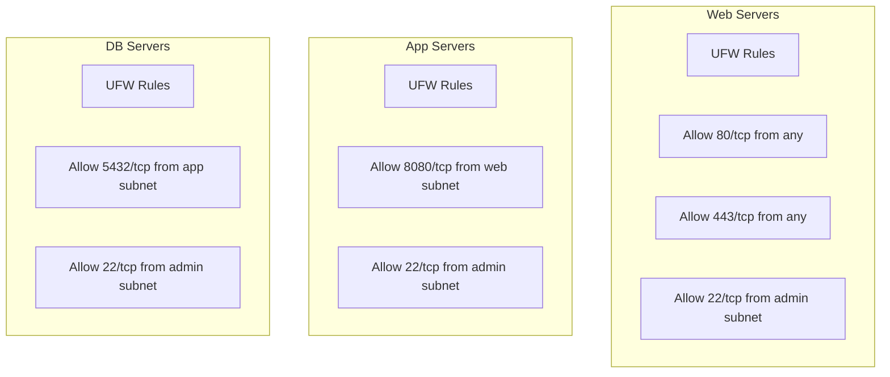

# How to Use Ansible to Configure UFW Firewall

Author: [nawazdhandala](https://www.github.com/nawazdhandala)

Tags: Ansible, UFW, Firewall, Security, Ubuntu

Description: Automate UFW firewall configuration across Ubuntu and Debian servers using Ansible with rules for web, database, and application traffic.

---

UFW (Uncomplicated Firewall) is the default firewall management tool on Ubuntu and Debian systems. It provides a simpler interface to iptables, making it the standard choice for teams that want effective firewall rules without wrestling with iptables syntax. Managing UFW manually on each server works for small environments, but as your fleet grows, Ansible becomes essential for keeping firewall rules consistent and auditable.

In this guide, I will walk through configuring UFW across your server fleet using Ansible. We will cover role-based rule definitions (web servers get different rules than database servers), rate limiting, and logging configuration.

## Design Approach

Different server roles need different firewall rules. Web servers need ports 80 and 443 open. Database servers should only accept connections from application servers. Monitoring servers need their own set of ports. Ansible lets you define rules per server role.



## Variables

```yaml
# group_vars/all.yml
# Default UFW settings applied to all servers
ufw_default_incoming: deny
ufw_default_outgoing: allow
ufw_default_forward: deny
ufw_logging: "on"
ufw_logging_level: low  # low, medium, high, full

# Admin subnet (always allowed SSH access)
admin_subnet: "10.0.100.0/24"

# Rules applied to ALL servers
ufw_global_rules:
  - rule: allow
    port: 22
    proto: tcp
    from_ip: "{{ admin_subnet }}"
    comment: "SSH from admin subnet"

  - rule: allow
    port: 22
    proto: tcp
    from_ip: "{{ ansible_default_ipv4.network }}/{{ ansible_default_ipv4.netmask }}"
    comment: "SSH from local subnet"

  # Allow ICMP for monitoring
  - rule: allow
    proto: icmp
    comment: "Allow ping"

# Rate limiting for SSH (even from allowed subnets)
ufw_rate_limit:
  - port: 22
    proto: tcp
```

Web server specific rules.

```yaml
# group_vars/webservers.yml
ufw_role_rules:
  - rule: allow
    port: 80
    proto: tcp
    comment: "HTTP"

  - rule: allow
    port: 443
    proto: tcp
    comment: "HTTPS"

  - rule: allow
    port: 9100
    proto: tcp
    from_ip: "10.0.2.0/24"
    comment: "Node Exporter from monitoring"
```

Application server rules.

```yaml
# group_vars/appservers.yml
ufw_role_rules:
  - rule: allow
    port: 8080
    proto: tcp
    from_ip: "10.0.1.0/24"
    comment: "App traffic from web tier"

  - rule: allow
    port: 9100
    proto: tcp
    from_ip: "10.0.2.0/24"
    comment: "Node Exporter from monitoring"
```

Database server rules.

```yaml
# group_vars/dbservers.yml
ufw_role_rules:
  - rule: allow
    port: 5432
    proto: tcp
    from_ip: "10.0.1.0/24"
    comment: "PostgreSQL from app tier"

  - rule: allow
    port: 5432
    proto: tcp
    from_ip: "10.0.3.0/24"
    comment: "PostgreSQL replication"

  - rule: allow
    port: 9100
    proto: tcp
    from_ip: "10.0.2.0/24"
    comment: "Node Exporter from monitoring"
```

## UFW Role

```yaml
# roles/ufw/tasks/main.yml
---
- name: Install UFW
  ansible.builtin.package:
    name: ufw
    state: present

- name: Set default incoming policy
  community.general.ufw:
    direction: incoming
    policy: "{{ ufw_default_incoming }}"

- name: Set default outgoing policy
  community.general.ufw:
    direction: outgoing
    policy: "{{ ufw_default_outgoing }}"

- name: Set default forwarding policy
  community.general.ufw:
    direction: routed
    policy: "{{ ufw_default_forward }}"

# Apply global rules that every server gets
- name: Apply global firewall rules
  community.general.ufw:
    rule: "{{ item.rule }}"
    port: "{{ item.port | default(omit) }}"
    proto: "{{ item.proto | default(omit) }}"
    from_ip: "{{ item.from_ip | default('any') }}"
    to_ip: "{{ item.to_ip | default('any') }}"
    comment: "{{ item.comment | default(omit) }}"
  loop: "{{ ufw_global_rules }}"

# Apply role-specific rules
- name: Apply role-specific firewall rules
  community.general.ufw:
    rule: "{{ item.rule }}"
    port: "{{ item.port | default(omit) }}"
    proto: "{{ item.proto | default(omit) }}"
    from_ip: "{{ item.from_ip | default('any') }}"
    to_ip: "{{ item.to_ip | default('any') }}"
    comment: "{{ item.comment | default(omit) }}"
  loop: "{{ ufw_role_rules | default([]) }}"

# Apply host-specific rules (from host_vars)
- name: Apply host-specific firewall rules
  community.general.ufw:
    rule: "{{ item.rule }}"
    port: "{{ item.port | default(omit) }}"
    proto: "{{ item.proto | default(omit) }}"
    from_ip: "{{ item.from_ip | default('any') }}"
    to_ip: "{{ item.to_ip | default('any') }}"
    comment: "{{ item.comment | default(omit) }}"
  loop: "{{ ufw_host_rules | default([]) }}"

# Rate limiting
- name: Apply rate limiting rules
  community.general.ufw:
    rule: limit
    port: "{{ item.port }}"
    proto: "{{ item.proto }}"
  loop: "{{ ufw_rate_limit | default([]) }}"

# Configure logging
- name: Set UFW logging level
  community.general.ufw:
    logging: "{{ ufw_logging_level }}"

# Enable UFW (must be last)
- name: Enable UFW
  community.general.ufw:
    state: enabled
```

## Cleaning Up Old Rules

When rules change, you need to remove outdated ones. This task resets and reapplies all rules.

```yaml
# roles/ufw/tasks/reset-and-apply.yml
---
- name: Reset UFW to defaults (removes all rules)
  community.general.ufw:
    state: reset

- name: Re-apply all rules
  ansible.builtin.include_tasks: main.yml
```

## Main Playbook

```yaml
# site.yml
---
- name: Configure UFW firewall
  hosts: all
  become: yes
  roles:
    - ufw
```

## Verification

```yaml
# verify-ufw.yml
---
- name: Verify UFW configuration
  hosts: all
  become: yes
  tasks:
    - name: Check UFW status
      ansible.builtin.command:
        cmd: ufw status verbose
      register: ufw_status
      changed_when: false

    - name: Display UFW status
      ansible.builtin.debug:
        msg: "{{ ufw_status.stdout_lines }}"

    - name: Check UFW is active
      ansible.builtin.assert:
        that:
          - "'Status: active' in ufw_status.stdout"
        fail_msg: "UFW is not active on {{ inventory_hostname }}"
        success_msg: "UFW is active on {{ inventory_hostname }}"

    - name: Check numbered rules
      ansible.builtin.command:
        cmd: ufw status numbered
      register: ufw_numbered
      changed_when: false

    - name: Display numbered rules
      ansible.builtin.debug:
        msg: "{{ ufw_numbered.stdout_lines }}"

    - name: Verify SSH is allowed (prevent lockout check)
      ansible.builtin.assert:
        that:
          - "'22/tcp' in ufw_status.stdout or '22' in ufw_status.stdout"
        fail_msg: "WARNING: SSH port 22 does not appear in UFW rules"
        success_msg: "SSH port is configured in UFW rules"
```

## Port Connectivity Test

After deploying firewall rules, verify that allowed traffic works and blocked traffic is denied.

```yaml
# test-connectivity.yml
---
- name: Test firewall connectivity
  hosts: localhost
  gather_facts: no
  tasks:
    - name: Test SSH access to all servers
      ansible.builtin.wait_for:
        host: "{{ hostvars[item].ansible_host }}"
        port: 22
        timeout: 5
        state: started
      loop: "{{ groups['all'] }}"
      register: ssh_test

    - name: Test HTTP on web servers
      ansible.builtin.wait_for:
        host: "{{ hostvars[item].ansible_host }}"
        port: 80
        timeout: 5
        state: started
      loop: "{{ groups['webservers'] | default([]) }}"
      register: http_test

    - name: Verify database port is NOT open from localhost
      ansible.builtin.wait_for:
        host: "{{ hostvars[item].ansible_host }}"
        port: 5432
        timeout: 3
        state: started
      loop: "{{ groups['dbservers'] | default([]) }}"
      register: db_test
      ignore_errors: yes

    - name: Confirm database port is blocked from outside
      ansible.builtin.debug:
        msg: "Database port correctly blocked on {{ item.item }}"
      loop: "{{ db_test.results | default([]) }}"
      when: item.failed | default(false)
```

## Running the Playbook

```bash
# Deploy UFW rules
ansible-playbook -i inventory/hosts.ini site.yml

# Verify the rules
ansible-playbook -i inventory/hosts.ini verify-ufw.yml

# Test connectivity
ansible-playbook -i inventory/hosts.ini test-connectivity.yml

# Reset and reapply all rules (when rules have changed)
ansible-playbook -i inventory/hosts.ini site.yml -e "ufw_reset=true"

# Apply to specific group
ansible-playbook -i inventory/hosts.ini site.yml --limit webservers
```

## Wrapping Up

UFW with Ansible gives you a firewall configuration that is documented, version-controlled, and consistently applied. The role-based variable structure means each server type automatically gets the right set of rules based on its group membership. The important things to remember are: always keep SSH allowed from at least one trusted subnet, use rate limiting on any public-facing port, and run the verification playbook after every change to confirm you have not accidentally blocked something important. For environments with complex networking requirements, consider firewalld (for RHEL-based systems) or managing iptables directly for more fine-grained control.
