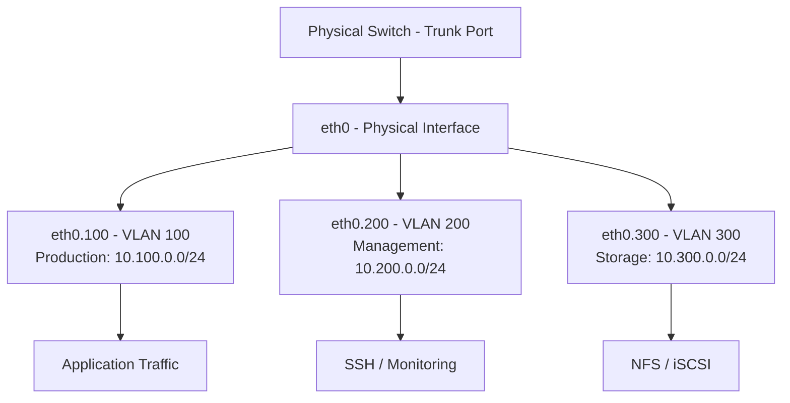

# How to Use Ansible to Configure VLAN Interfaces

Author: [nawazdhandala](https://www.github.com/nawazdhandala)

Tags: Ansible, VLAN, Networking, Linux, Infrastructure

Description: Learn how to configure 802.1Q VLAN interfaces on Linux servers using Ansible with NetworkManager, netplan, and manual configuration methods.

---

VLANs (Virtual LANs) let you segment network traffic at Layer 2 without adding physical network hardware. On Linux servers, you create VLAN sub-interfaces that tag outgoing frames with a VLAN ID and accept incoming frames with the same tag. This is common in data centers where a single physical NIC needs to access multiple isolated networks. Ansible can automate VLAN interface creation and configuration across your entire fleet.

## Prerequisites

- Ansible 2.9+ on your control node
- Linux target hosts with the `8021q` kernel module available
- A physical network switch configured with VLAN trunking on the ports connected to your servers
- Root or sudo access

## Loading the 8021q Kernel Module

Before creating VLAN interfaces, the 8021q kernel module must be loaded. Here is how to ensure it is loaded and persisted across reboots:

```yaml
# load_vlan_module.yml - Load the 802.1Q VLAN kernel module
---
- name: Prepare system for VLAN configuration
  hosts: all
  become: true
  tasks:
    - name: Ensure 8021q kernel module is loaded
      community.general.modprobe:
        name: 8021q
        state: present

    - name: Persist 8021q module across reboots
      ansible.builtin.lineinfile:
        path: /etc/modules-load.d/vlan.conf
        line: 8021q
        create: true
        mode: '0644'

    - name: Install vlan package on Debian/Ubuntu
      ansible.builtin.apt:
        name: vlan
        state: present
      when: ansible_os_family == "Debian"
```

## Creating VLAN Interfaces with nmcli

On systems running NetworkManager, the `nmcli` module handles VLAN interfaces natively:

```yaml
# nmcli_vlan.yml - Create VLAN interfaces using NetworkManager
---
- name: Configure VLAN interfaces with nmcli
  hosts: all
  become: true
  vars:
    vlans:
      - vlan_id: 100
        parent: eth0
        ip: 10.100.0.10/24
        gateway: 10.100.0.1
        conn_name: vlan100-production
      - vlan_id: 200
        parent: eth0
        ip: 10.200.0.10/24
        gateway: ""
        conn_name: vlan200-management
      - vlan_id: 300
        parent: eth0
        ip: 10.300.0.10/24
        gateway: ""
        conn_name: vlan300-storage
  tasks:
    - name: Create VLAN interfaces
      community.general.nmcli:
        conn_name: "{{ item.conn_name }}"
        type: vlan
        vlanid: "{{ item.vlan_id }}"
        vlandev: "{{ item.parent }}"
        ip4: "{{ item.ip }}"
        gw4: "{{ item.gateway | default(omit) }}"
        state: present
        autoconnect: true
      loop: "{{ vlans }}"

    - name: Verify VLAN interfaces are up
      ansible.builtin.command: "ip link show {{ item.parent }}.{{ item.vlan_id }}"
      loop: "{{ vlans }}"
      register: vlan_status
      changed_when: false

    - name: Display VLAN interface status
      ansible.builtin.debug:
        msg: "{{ item.stdout }}"
      loop: "{{ vlan_status.results }}"
      loop_control:
        label: "{{ item.item.conn_name }}"
```

## Creating VLAN Interfaces with Netplan

On Ubuntu Server 18.04+, netplan is the default network configuration tool. You can manage VLAN interfaces through a netplan template:

```yaml
# netplan_vlan.yml - Configure VLAN interfaces with netplan
---
- name: Configure VLANs with netplan
  hosts: ubuntu_servers
  become: true
  vars:
    parent_interface: ens3
    vlans:
      - id: 100
        addresses:
          - 10.100.0.10/24
        routes:
          - to: 10.100.0.0/16
            via: 10.100.0.1
      - id: 200
        addresses:
          - 10.200.0.10/24
      - id: 300
        addresses:
          - 10.300.0.10/24
  tasks:
    - name: Deploy netplan VLAN configuration
      ansible.builtin.template:
        src: templates/vlans-netplan.yaml.j2
        dest: /etc/netplan/60-vlans.yaml
        owner: root
        group: root
        mode: '0600'
      notify: Apply netplan

  handlers:
    - name: Apply netplan
      ansible.builtin.command: netplan apply
      changed_when: true
```

The netplan template:

```jinja2
# templates/vlans-netplan.yaml.j2 - Netplan VLAN configuration
# Managed by Ansible - do not edit manually
network:
  version: 2
  vlans:

    {{ parent_interface }}.{{ vlan.id }}:
      id: {{ vlan.id }}
      link: {{ parent_interface }}
      addresses:

        - {{ addr }}


      routes:

        - to: {{ route.to }}
          via: {{ route.via }}



```

## Manual Interface Configuration (Debian-style)

For older Debian systems or minimal installs without NetworkManager, you can configure VLANs through `/etc/network/interfaces`:

```yaml
# debian_vlan.yml - Configure VLANs in /etc/network/interfaces
---
- name: Configure VLANs on Debian
  hosts: debian_servers
  become: true
  vars:
    parent_interface: eth0
    vlans:
      - id: 100
        address: 10.100.0.10
        netmask: 255.255.255.0
        gateway: 10.100.0.1
      - id: 200
        address: 10.200.0.10
        netmask: 255.255.255.0
  tasks:
    - name: Ensure vlan package is installed
      ansible.builtin.apt:
        name: vlan
        state: present

    - name: Add VLAN interface configurations
      ansible.builtin.blockinfile:
        path: /etc/network/interfaces
        marker: "# {mark} ANSIBLE MANAGED VLAN {{ item.id }}"
        block: |
          auto {{ parent_interface }}.{{ item.id }}
          iface {{ parent_interface }}.{{ item.id }} inet static
              address {{ item.address }}
              netmask {{ item.netmask }}
              vlan-raw-device {{ parent_interface }}
              
              gateway {{ item.gateway }}
              
      loop: "{{ vlans }}"
      notify: Restart networking

  handlers:
    - name: Restart networking
      ansible.builtin.service:
        name: networking
        state: restarted
```

## VLAN with Custom MTU

When running VLANs, you might need to adjust the MTU. VLAN tagging adds 4 bytes of overhead, so if your physical network supports jumbo frames, you might set the parent interface to MTU 9000 and the VLAN interfaces accordingly:

```yaml
# vlan_mtu.yml - Configure VLANs with custom MTU settings
---
- name: Configure VLANs with jumbo frames
  hosts: storage_servers
  become: true
  tasks:
    - name: Set parent interface MTU to support jumbo frames
      ansible.builtin.command: ip link set eth0 mtu 9000
      changed_when: true

    - name: Create storage VLAN with jumbo frame MTU
      community.general.nmcli:
        conn_name: storage-vlan
        type: vlan
        vlanid: 300
        vlandev: eth0
        ip4: 10.30.0.10/24
        state: present
        autoconnect: true

    - name: Set VLAN interface MTU
      ansible.builtin.command: ip link set eth0.300 mtu 9000
      changed_when: true

    - name: Make MTU persistent via nmcli
      ansible.builtin.command: >
        nmcli connection modify storage-vlan 802-3-ethernet.mtu 9000
      changed_when: true
```

## Per-Host VLAN Configuration

In production, each server typically has different IP addresses but the same VLAN structure. Use host_vars for per-host values:

```yaml
# host_vars/server01.yml - Per-host VLAN IP assignments
vlan_ips:
  100: 10.100.0.11/24
  200: 10.200.0.11/24
  300: 10.300.0.11/24

# host_vars/server02.yml
vlan_ips:
  100: 10.100.0.12/24
  200: 10.200.0.12/24
  300: 10.300.0.12/24
```

```yaml
# per_host_vlan.yml - Apply per-host VLAN configuration
---
- name: Configure VLANs with per-host IPs
  hosts: all
  become: true
  tasks:
    - name: Create VLAN interfaces with host-specific IPs
      community.general.nmcli:
        conn_name: "vlan{{ item.key }}"
        type: vlan
        vlanid: "{{ item.key }}"
        vlandev: eth0
        ip4: "{{ item.value }}"
        state: present
        autoconnect: true
      loop: "{{ vlan_ips | dict2items }}"
```

## VLAN Network Architecture



## Verification and Cleanup

After creating VLANs, verify they are working:

```yaml
# verify_vlans.yml - Verify VLAN interface configuration
---
- name: Verify VLAN configuration
  hosts: all
  become: true
  tasks:
    - name: List all VLAN interfaces
      ansible.builtin.command: ip -d link show type vlan
      register: vlan_links
      changed_when: false

    - name: Display VLAN interfaces
      ansible.builtin.debug:
        var: vlan_links.stdout_lines

    - name: Show IP addresses on VLAN interfaces
      ansible.builtin.command: ip addr show
      register: ip_info
      changed_when: false

    - name: Check connectivity on each VLAN
      ansible.builtin.command: "ping -c 2 -I eth0.{{ item }} {{ item | regex_replace('^(\\d+)$', '10.\\1.0.1') }}"
      loop:
        - 100
        - 200
        - 300
      register: ping_results
      changed_when: false
      ignore_errors: true
```

VLANs are one of those things that are tedious to configure manually but extremely simple with Ansible once you have the playbook built. The key is making sure the 8021q module is loaded, the parent interface is configured as a trunk on the switch side, and the VLAN IDs match between your server configuration and your switch configuration. Ansible handles the server side cleanly; just make sure your network team has the switch side ready.
