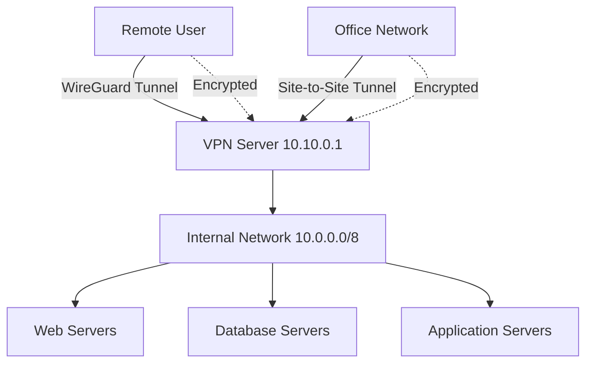

# How to Use Ansible to Configure WireGuard VPN

Author: [nawazdhandala](https://www.github.com/nawazdhandala)

Tags: Ansible, WireGuard, VPN, Security, Networking

Description: Learn how to deploy and configure WireGuard VPN using Ansible for secure site-to-site and remote access tunnels across your infrastructure.

---

WireGuard is a modern VPN protocol that is faster, simpler, and more secure than traditional solutions like OpenVPN or IPSec. It runs in the Linux kernel, uses state-of-the-art cryptography, and has a tiny codebase that is easy to audit. Setting up WireGuard on a single pair of hosts is straightforward, but when you need to configure it across a mesh of servers or provide VPN access for a team, Ansible turns a repetitive task into a one-command deployment.

## Prerequisites

- Ansible 2.9+ on your control node
- Linux target hosts (kernel 5.6+ has WireGuard built-in, earlier versions need the module)
- Root or sudo access
- Understanding of basic VPN concepts (tunnels, key pairs, allowed IPs)

## Installing WireGuard

```yaml
# install_wireguard.yml - Install WireGuard on Linux hosts
---
- name: Install WireGuard
  hosts: vpn_servers
  become: true
  tasks:
    - name: Install WireGuard on Debian/Ubuntu
      ansible.builtin.apt:
        name:
          - wireguard
          - wireguard-tools
        state: present
        update_cache: true
      when: ansible_os_family == "Debian"

    - name: Install WireGuard on RHEL/CentOS 8+
      ansible.builtin.yum:
        name:
          - wireguard-tools
        state: present
      when: ansible_os_family == "RedHat"

    - name: Enable IP forwarding
      ansible.posix.sysctl:
        name: net.ipv4.ip_forward
        value: '1'
        sysctl_set: true
        state: present
        reload: true
```

## Generating Key Pairs

WireGuard uses Curve25519 key pairs. Generate them on each host:

```yaml
# generate_keys.yml - Generate WireGuard key pairs
---
- name: Generate WireGuard keys
  hosts: vpn_servers
  become: true
  tasks:
    - name: Create WireGuard directory
      ansible.builtin.file:
        path: /etc/wireguard
        state: directory
        mode: '0700'

    - name: Check if private key already exists
      ansible.builtin.stat:
        path: /etc/wireguard/privatekey
      register: privkey_file

    - name: Generate private key
      ansible.builtin.command: wg genkey
      register: wg_private_key
      when: not privkey_file.stat.exists
      changed_when: true

    - name: Save private key
      ansible.builtin.copy:
        content: "{{ wg_private_key.stdout }}"
        dest: /etc/wireguard/privatekey
        owner: root
        group: root
        mode: '0600'
      when: not privkey_file.stat.exists

    - name: Read private key
      ansible.builtin.slurp:
        src: /etc/wireguard/privatekey
      register: private_key_content

    - name: Generate public key from private key
      ansible.builtin.shell: echo "{{ private_key_content.content | b64decode | trim }}" | wg pubkey
      register: wg_public_key
      changed_when: false

    - name: Save public key
      ansible.builtin.copy:
        content: "{{ wg_public_key.stdout }}"
        dest: /etc/wireguard/publickey
        owner: root
        group: root
        mode: '0644'

    - name: Display public key for reference
      ansible.builtin.debug:
        msg: "Public key for {{ inventory_hostname }}: {{ wg_public_key.stdout }}"
```

## Server Configuration (Hub)

Here is a complete WireGuard server setup that accepts connections from multiple peers:

```yaml
# wireguard_server.yml - Configure WireGuard VPN server
---
- name: Configure WireGuard server
  hosts: vpn_server
  become: true
  vars:
    wg_interface: wg0
    wg_port: 51820
    wg_address: 10.10.0.1/24
    wg_server_private_key: "{{ vault_wg_server_private_key }}"
    wg_peers:
      - name: laptop
        public_key: "abc123PublicKeyHere="
        allowed_ips: 10.10.0.2/32
      - name: office
        public_key: "def456PublicKeyHere="
        allowed_ips: 10.10.0.3/32
      - name: remote_server
        public_key: "ghi789PublicKeyHere="
        allowed_ips: 10.10.0.4/32, 192.168.1.0/24
    server_public_interface: eth0
  tasks:
    - name: Deploy WireGuard server configuration
      ansible.builtin.template:
        src: templates/wg-server.conf.j2
        dest: "/etc/wireguard/{{ wg_interface }}.conf"
        owner: root
        group: root
        mode: '0600'
      notify: Restart WireGuard

    - name: Enable and start WireGuard
      ansible.builtin.systemd:
        name: "wg-quick@{{ wg_interface }}"
        state: started
        enabled: true

    - name: Open WireGuard port in firewall
      community.general.ufw:
        rule: allow
        port: "{{ wg_port }}"
        proto: udp
        comment: "WireGuard VPN"
      ignore_errors: true

  handlers:
    - name: Restart WireGuard
      ansible.builtin.systemd:
        name: "wg-quick@{{ wg_interface }}"
        state: restarted
```

The server configuration template:

```jinja2
# templates/wg-server.conf.j2 - WireGuard server configuration
# Managed by Ansible - do not edit manually

[Interface]
Address = {{ wg_address }}
ListenPort = {{ wg_port }}
PrivateKey = {{ wg_server_private_key }}

# NAT for VPN clients accessing the internet
PostUp = iptables -t nat -A POSTROUTING -o {{ server_public_interface }} -j MASQUERADE
PostDown = iptables -t nat -D POSTROUTING -o {{ server_public_interface }} -j MASQUERADE


# {{ peer.name }}
[Peer]
PublicKey = {{ peer.public_key }}
AllowedIPs = {{ peer.allowed_ips }}

PersistentKeepalive = {{ peer.persistent_keepalive }}



```

## Client Configuration

Configure WireGuard clients to connect to the server:

```yaml
# wireguard_client.yml - Configure WireGuard VPN client
---
- name: Configure WireGuard client
  hosts: vpn_clients
  become: true
  vars:
    wg_interface: wg0
    wg_client_address: "{{ wg_vpn_ip }}/24"
    wg_client_private_key: "{{ vault_wg_client_private_key }}"
    wg_server_public_key: "ServerPublicKeyHere="
    wg_server_endpoint: vpn.example.com:51820
    wg_dns: 10.10.0.1
    route_all_traffic: false
  tasks:
    - name: Deploy WireGuard client configuration
      ansible.builtin.template:
        src: templates/wg-client.conf.j2
        dest: "/etc/wireguard/{{ wg_interface }}.conf"
        owner: root
        group: root
        mode: '0600'
      notify: Restart WireGuard

    - name: Enable and start WireGuard
      ansible.builtin.systemd:
        name: "wg-quick@{{ wg_interface }}"
        state: started
        enabled: true

  handlers:
    - name: Restart WireGuard
      ansible.builtin.systemd:
        name: "wg-quick@{{ wg_interface }}"
        state: restarted
```

```jinja2
# templates/wg-client.conf.j2 - WireGuard client configuration
# Managed by Ansible

[Interface]
Address = {{ wg_client_address }}
PrivateKey = {{ wg_client_private_key }}

DNS = {{ wg_dns }}


[Peer]
PublicKey = {{ wg_server_public_key }}
Endpoint = {{ wg_server_endpoint }}

AllowedIPs = 0.0.0.0/0

AllowedIPs = 10.10.0.0/24

PersistentKeepalive = 25
```

## Site-to-Site VPN

Connect two networks together over WireGuard:

```yaml
# site_to_site.yml - Configure site-to-site WireGuard VPN
---
- name: Configure site-to-site VPN
  hosts: site_gateways
  become: true
  vars:
    wg_interface: wg0
    wg_port: 51820
  tasks:
    - name: Enable IP forwarding
      ansible.posix.sysctl:
        name: net.ipv4.ip_forward
        value: '1'
        sysctl_set: true
        state: present
        reload: true

    - name: Deploy WireGuard site-to-site configuration
      ansible.builtin.template:
        src: "templates/wg-site-{{ site_role }}.conf.j2"
        dest: "/etc/wireguard/{{ wg_interface }}.conf"
        owner: root
        group: root
        mode: '0600'
      notify: Restart WireGuard

    - name: Enable WireGuard
      ansible.builtin.systemd:
        name: "wg-quick@{{ wg_interface }}"
        state: started
        enabled: true

  handlers:
    - name: Restart WireGuard
      ansible.builtin.systemd:
        name: "wg-quick@{{ wg_interface }}"
        state: restarted
```

The inventory for site-to-site:

```yaml
# inventory.yml - Site-to-site VPN inventory
all:
  children:
    site_gateways:
      hosts:
        site_a_gw:
          ansible_host: 203.0.113.10
          site_role: site_a
          wg_vpn_ip: 10.10.0.1
          local_subnet: 192.168.1.0/24
          remote_subnet: 192.168.2.0/24
          remote_endpoint: 203.0.113.20
        site_b_gw:
          ansible_host: 203.0.113.20
          site_role: site_b
          wg_vpn_ip: 10.10.0.2
          local_subnet: 192.168.2.0/24
          remote_subnet: 192.168.1.0/24
          remote_endpoint: 203.0.113.10
```

## WireGuard Network Topology



## Managing Peers Dynamically

Add or remove peers without restarting the tunnel:

```yaml
# manage_peers.yml - Dynamically manage WireGuard peers
---
- name: Manage WireGuard peers
  hosts: vpn_server
  become: true
  vars:
    new_peer_public_key: "NewPeerPublicKey="
    new_peer_ip: 10.10.0.50/32
    wg_interface: wg0
  tasks:
    - name: Add new peer at runtime
      ansible.builtin.command: >
        wg set {{ wg_interface }}
        peer {{ new_peer_public_key }}
        allowed-ips {{ new_peer_ip }}
      changed_when: true

    - name: Save runtime config to file
      ansible.builtin.command: "wg-quick save {{ wg_interface }}"
      changed_when: true

    - name: Remove a peer
      ansible.builtin.command: >
        wg set {{ wg_interface }}
        peer OldPeerPublicKey=
        remove
      changed_when: true
      when: remove_peer | default(false)
```

## Verification

Check that WireGuard is working:

```yaml
# verify_wireguard.yml - Verify WireGuard VPN status
---
- name: Verify WireGuard
  hosts: vpn_servers:vpn_clients
  become: true
  tasks:
    - name: Show WireGuard interface status
      ansible.builtin.command: wg show
      register: wg_status
      changed_when: false

    - name: Display WireGuard status
      ansible.builtin.debug:
        var: wg_status.stdout_lines

    - name: Ping VPN server through tunnel
      ansible.builtin.command: ping -c 3 -I wg0 10.10.0.1
      register: vpn_ping
      changed_when: false
      ignore_errors: true

    - name: Show ping result
      ansible.builtin.debug:
        msg: "VPN tunnel: {{ 'UP' if vpn_ping.rc == 0 else 'DOWN' }}"
```

WireGuard with Ansible is a clean, modern approach to VPN management. The configuration files are short, the protocol is fast, and Ansible handles the distribution of keys and configs across your infrastructure. For most use cases, WireGuard has replaced OpenVPN and IPSec as the go-to choice for Linux-based VPNs.
