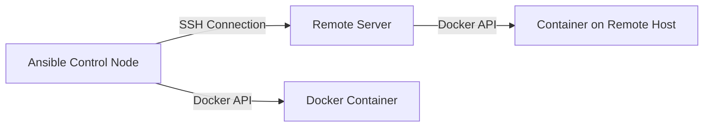

# How to Use Ansible to Connect to Docker Containers

Author: [nawazdhandala](https://www.github.com/nawazdhandala)

Tags: Ansible, Docker, Connection, Containers, Automation

Description: Use Ansible's docker connection plugin to run tasks directly inside Docker containers for management and configuration.

---

Most people use Ansible to connect to remote servers over SSH. But Ansible can also connect directly to Docker containers using the `docker` connection plugin. This means you can run Ansible tasks inside a running container just like you would on a regular server. This is useful for configuring containers after startup, running one-off commands, debugging, and managing containers that were not built with all their configuration baked into the image.

## The Docker Connection Plugin

Ansible ships with a `docker` connection plugin (also called `community.docker.docker`). Instead of using SSH, it uses the Docker API to execute commands inside a container. Think of it as an automated version of `docker exec`.



You can connect to containers on the local machine or on remote Docker hosts.

## Connecting to Local Containers

The simplest case is running Ansible against containers on the same machine:

```yaml
# connect_local.yml - Connect to a local Docker container
---
- name: Configure Local Docker Container
  hosts: my_containers
  connection: community.docker.docker
  gather_facts: false

  tasks:
    - name: Check if Python is available
      ansible.builtin.raw: python3 --version || python --version
      register: python_check
      changed_when: false

    - name: Install a package inside the container
      ansible.builtin.raw: apt-get update && apt-get install -y curl
      when: "'python' not in python_check.stdout | default('')"

    - name: Create a configuration file
      ansible.builtin.copy:
        content: |
          server.port=8080
          logging.level=INFO
        dest: /app/config/application.properties
        mode: '0644'
```

The corresponding inventory file maps container names to hosts:

```ini
# inventory/containers.ini
[my_containers]
webapp ansible_host=webapp
api-server ansible_host=api-server

[my_containers:vars]
ansible_connection=community.docker.docker
```

## Connecting to Containers on Remote Hosts

When containers run on remote Docker hosts, you need a two-step connection. Ansible first connects to the Docker host via SSH, then uses the Docker API to reach the container:

```yaml
# connect_remote.yml - Connect to containers on remote Docker hosts
---
- name: Configure Containers on Remote Docker Hosts
  hosts: remote_containers
  connection: community.docker.docker

  tasks:
    - name: Run a command inside the remote container
      ansible.builtin.command:
        cmd: /app/health-check.sh
      register: health
      changed_when: false
```

The inventory needs to specify both the Docker host and the container name:

```ini
# inventory/remote_containers.ini
[remote_containers]
webapp ansible_host=webapp ansible_docker_extra_args="-H ssh://user@docker-host-1"

# Alternative: use docker_host variable
[remote_containers:vars]
ansible_connection=community.docker.docker
```

## Dynamic Inventory for Docker Containers

Instead of manually listing containers, use a dynamic inventory script that discovers running containers:

```yaml
# docker_inventory.yml - Dynamic inventory plugin configuration
plugin: community.docker.docker_containers
docker_host: unix:///var/run/docker.sock
# Only include running containers
filters:
  status: running
# Add containers to groups based on labels
keyed_groups:
  - key: docker_config.Labels.app | default("ungrouped")
    prefix: app
  - key: docker_config.Labels.environment | default("unknown")
    prefix: env
# Set connection type automatically
compose:
  ansible_connection: community.docker.docker
```

Save this as `docker_inventory.yml` in your inventory directory. Ansible will automatically discover running containers and group them by their Docker labels.

Test the dynamic inventory:

```bash
# List discovered containers
ansible-inventory -i docker_inventory.yml --list
```

## Running Ad-Hoc Commands in Containers

For quick troubleshooting, use ad-hoc commands:

```bash
# Check disk space inside a container
ansible webapp -i inventory/containers.ini -m command -a "df -h" -c community.docker.docker

# Check running processes
ansible webapp -i inventory/containers.ini -m command -a "ps aux" -c community.docker.docker

# Read a config file inside the container
ansible webapp -i inventory/containers.ini -m command -a "cat /app/config.yml" -c community.docker.docker
```

## Configuring Containers After Startup

Sometimes you need to apply configuration that was not baked into the image. Maybe you are using a third-party image and need to tweak settings:

```yaml
# configure_nginx.yml - Configure nginx inside a running container
---
- name: Configure Nginx Container
  hosts: nginx_containers
  connection: community.docker.docker
  gather_facts: false

  tasks:
    - name: Upload custom nginx configuration
      ansible.builtin.copy:
        src: files/nginx/default.conf
        dest: /etc/nginx/conf.d/default.conf
        mode: '0644'
      register: nginx_config

    - name: Upload SSL certificates
      ansible.builtin.copy:
        src: "files/ssl/{{ item }}"
        dest: "/etc/nginx/ssl/{{ item }}"
        mode: '0600'
      loop:
        - server.crt
        - server.key
      register: ssl_certs

    - name: Test nginx configuration
      ansible.builtin.command:
        cmd: nginx -t
      register: nginx_test
      changed_when: false

    - name: Reload nginx if config changed
      ansible.builtin.command:
        cmd: nginx -s reload
      when: nginx_config is changed or ssl_certs is changed
```

## Running Database Migrations in Containers

A practical use case is running database migrations inside an application container:

```yaml
# run_migrations.yml - Run database migrations inside a container
---
- name: Run Database Migrations
  hosts: api_containers
  connection: community.docker.docker
  gather_facts: false

  tasks:
    - name: Check current migration status
      ansible.builtin.command:
        cmd: python manage.py showmigrations --plan
      register: migration_status
      changed_when: false

    - name: Run pending migrations
      ansible.builtin.command:
        cmd: python manage.py migrate --no-input
      register: migration_result
      when: "'[ ]' in migration_status.stdout"

    - name: Display migration output
      ansible.builtin.debug:
        msg: "{{ migration_result.stdout_lines | default(['No pending migrations']) }}"
```

## Debugging Containers with Ansible

When a container is misbehaving, Ansible can gather diagnostic information systematically:

```yaml
# debug_container.yml - Gather diagnostic info from a container
---
- name: Debug Docker Container
  hosts: problem_container
  connection: community.docker.docker
  gather_facts: false

  tasks:
    - name: Check process list
      ansible.builtin.command:
        cmd: ps aux
      register: processes
      changed_when: false

    - name: Check open files
      ansible.builtin.command:
        cmd: ls -la /proc/1/fd/ 2>/dev/null | wc -l
      register: open_files
      changed_when: false

    - name: Check memory usage
      ansible.builtin.command:
        cmd: cat /proc/meminfo
      register: meminfo
      changed_when: false

    - name: Check network connections
      ansible.builtin.command:
        cmd: cat /proc/net/tcp
      register: connections
      changed_when: false

    - name: Check disk usage
      ansible.builtin.command:
        cmd: df -h
      register: disk_usage
      changed_when: false

    - name: Check DNS resolution
      ansible.builtin.command:
        cmd: cat /etc/resolv.conf
      register: dns_config
      changed_when: false

    - name: Compile diagnostic report
      ansible.builtin.debug:
        msg:
          - "Processes: {{ processes.stdout_lines | length }}"
          - "Open file descriptors: {{ open_files.stdout }}"
          - "DNS servers: {{ dns_config.stdout_lines }}"
          - "Disk usage: {{ disk_usage.stdout_lines }}"
```

## Using Roles with Container Connections

You can apply existing Ansible roles to containers. This is useful when you have roles originally written for VMs that you want to reuse:

```yaml
# apply_role.yml - Apply an Ansible role inside a container
---
- name: Apply Configuration Role to Container
  hosts: app_containers
  connection: community.docker.docker
  gather_facts: true  # Some roles need facts

  roles:
    - role: configure-app
      vars:
        app_port: 8080
        app_env: production
```

Keep in mind that some modules that work on regular servers might not work inside containers. For example, `systemd` modules will not work since most containers do not run systemd. Test your roles against containers before relying on them.

## Limitations and Considerations

The Docker connection plugin has some limitations to be aware of:

1. **No Python requirement for raw/command modules**: The `raw` and `command` modules work without Python. But modules like `copy`, `template`, and `apt` need Python installed inside the container.

2. **No persistent SSH session**: Each task creates a new `docker exec` session. This means shell variables set in one task are not available in the next.

3. **Privilege escalation**: The `become` directive works inside containers, but the container needs `sudo` or the user needs to be root.

4. **Fact gathering**: If the container does not have Python and the `setup` module cannot run, set `gather_facts: false` and use `raw` commands instead.

## Summary

The Docker connection plugin extends Ansible's reach into running containers, letting you manage container internals the same way you manage servers. It is particularly useful for configuring third-party containers, running database migrations, debugging issues, and applying existing roles to containerized workloads. Combined with dynamic inventory, you can target containers by their labels and automatically discover new containers as they appear.
