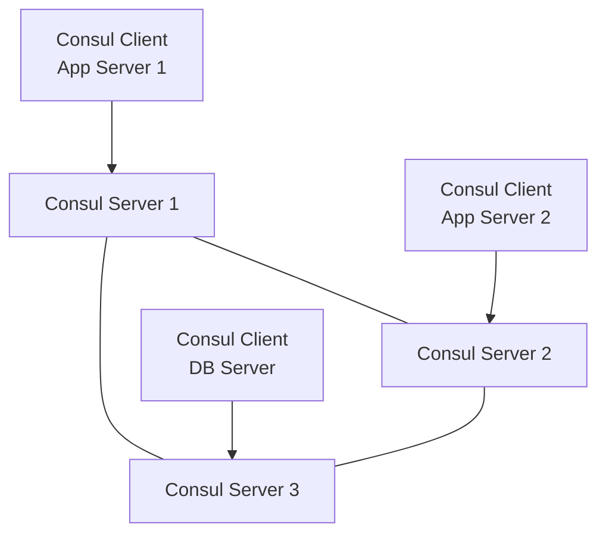

# How to Use Ansible to Set Up a Consul Cluster

Author: [nawazdhandala](https://www.github.com/nawazdhandala)

Tags: Ansible, Consul, Service Discovery, HashiCorp, Infrastructure

Description: Deploy a HashiCorp Consul cluster with service discovery, health checks, KV store, and ACLs using Ansible for distributed systems.

---

Consul is HashiCorp's solution for service discovery, health checking, and distributed key-value storage. In a microservices architecture, services need to find each other dynamically rather than relying on hardcoded IP addresses. Consul handles this through a distributed, highly available cluster that your services register with and query. Setting up a proper Consul cluster involves deploying server nodes, configuring gossip encryption, enabling ACLs, and registering services on client nodes. Ansible manages all of this cleanly.

## Architecture Overview



## Role Defaults

```yaml
# roles/consul/defaults/main.yml - Consul cluster configuration
consul_version: "1.17.1"
consul_datacenter: dc1
consul_domain: consul
consul_data_dir: /opt/consul/data
consul_config_dir: /etc/consul.d
consul_log_dir: /var/log/consul

consul_server: false
consul_bootstrap_expect: 3
consul_encrypt_key: "{{ vault_consul_encrypt_key }}"

consul_acl_enabled: true
consul_acl_default_policy: deny

# Server addresses for join
consul_retry_join:
  - 10.0.1.10
  - 10.0.1.11
  - 10.0.1.12

# DNS settings
consul_dns_port: 8600
consul_http_port: 8500
```

## Main Tasks

```yaml
# roles/consul/tasks/main.yml - Install and configure Consul
---
- name: Create consul system user
  user:
    name: consul
    system: yes
    shell: /usr/sbin/nologin
    create_home: no

- name: Create Consul directories
  file:
    path: "{{ item }}"
    state: directory
    owner: consul
    group: consul
    mode: '0755'
  loop:
    - "{{ consul_data_dir }}"
    - "{{ consul_config_dir }}"
    - "{{ consul_log_dir }}"

- name: Download Consul
  get_url:
    url: "https://releases.hashicorp.com/consul/{{ consul_version }}/consul_{{ consul_version }}_linux_amd64.zip"
    dest: /tmp/consul.zip

- name: Extract Consul binary
  unarchive:
    src: /tmp/consul.zip
    dest: /usr/local/bin/
    remote_src: yes
    creates: /usr/local/bin/consul

- name: Deploy Consul configuration
  template:
    src: consul.hcl.j2
    dest: "{{ consul_config_dir }}/consul.hcl"
    owner: consul
    group: consul
    mode: '0640'
  notify: restart consul

- name: Deploy server-specific configuration
  template:
    src: server.hcl.j2
    dest: "{{ consul_config_dir }}/server.hcl"
    owner: consul
    group: consul
    mode: '0640'
  when: consul_server
  notify: restart consul

- name: Create Consul systemd service
  template:
    src: consul.service.j2
    dest: /etc/systemd/system/consul.service
    mode: '0644'
  notify:
    - reload systemd
    - restart consul

- name: Start and enable Consul
  systemd:
    name: consul
    state: started
    enabled: yes
    daemon_reload: yes

- name: Wait for Consul to be ready
  uri:
    url: "http://127.0.0.1:{{ consul_http_port }}/v1/status/leader"
    status_code: 200
  register: consul_leader
  until: consul_leader.status == 200
  retries: 30
  delay: 5
  when: consul_server
```

## Consul Base Configuration

```hcl
# roles/consul/templates/consul.hcl.j2 - Shared Consul configuration
datacenter = "{{ consul_datacenter }}"
data_dir   = "{{ consul_data_dir }}"

client_addr    = "0.0.0.0"
bind_addr      = "{{ ansible_default_ipv4.address }}"

encrypt = "{{ consul_encrypt_key }}"

retry_join = {{ consul_retry_join | to_json }}

dns_config {
  enable_truncate = true
}

ports {
  dns   = {{ consul_dns_port }}
  http  = {{ consul_http_port }}
  grpc  = 8502
}


acl {
  enabled                  = true
  default_policy           = "{{ consul_acl_default_policy }}"
  enable_token_persistence = true
}


telemetry {
  prometheus_retention_time = "60s"
  disable_hostname          = true
}
```

## Server Configuration

```hcl
# roles/consul/templates/server.hcl.j2 - Server-only configuration
server           = true
bootstrap_expect = {{ consul_bootstrap_expect }}

ui_config {
  enabled = true
}

connect {
  enabled = true
}
```

## Systemd Service

```ini
# roles/consul/templates/consul.service.j2
[Unit]
Description=HashiCorp Consul
After=network-online.target
Wants=network-online.target

[Service]
User=consul
Group=consul
ExecStart=/usr/local/bin/consul agent -config-dir={{ consul_config_dir }}
ExecReload=/bin/kill -HUP $MAINPID
KillMode=process
Restart=on-failure
RestartSec=5
LimitNOFILE=65536

[Install]
WantedBy=multi-user.target
```

## Service Registration

Register services on client nodes:

```yaml
# Task to register a service with Consul
- name: Register web service with Consul
  copy:
    content: |
      {
        "service": {
          "name": "web",
          "port": 80,
          "tags": ["production", "v1"],
          "check": {
            "http": "http://localhost:80/health",
            "interval": "10s",
            "timeout": "3s"
          }
        }
      }
    dest: "{{ consul_config_dir }}/web-service.json"
    owner: consul
    group: consul
    mode: '0644'
  notify: reload consul
```

## Handlers

```yaml
# roles/consul/handlers/main.yml
---
- name: restart consul
  systemd:
    name: consul
    state: restarted

- name: reload consul
  command: consul reload

- name: reload systemd
  systemd:
    daemon_reload: yes
```

## Main Playbook

```yaml
# playbook.yml - Deploy Consul cluster
---
- hosts: consul_servers
  become: yes
  vars:
    consul_server: true
  roles:
    - consul

- hosts: consul_clients
  become: yes
  vars:
    consul_server: false
  roles:
    - consul
```

## Running the Playbook

```bash
# Deploy Consul cluster
ansible-playbook -i inventory/hosts.ini playbook.yml --ask-vault-pass

# Verify cluster status
consul members
consul operator raft list-peers
```

## Summary

This Ansible playbook deploys a production-ready Consul cluster with gossip encryption, ACLs, and service health checks. The same role works for both server and client nodes, controlled by the `consul_server` variable. Adding new services to the discovery system is a matter of dropping JSON registration files into the config directory and triggering a reload. This foundation supports service mesh, DNS-based discovery, and distributed configuration across your infrastructure.

## Common Use Cases

Here are several practical scenarios where this module proves essential in real-world playbooks.

### Infrastructure Provisioning Workflow

```yaml
# Complete workflow incorporating this module
- name: Infrastructure provisioning
  hosts: all
  become: true
  gather_facts: true
  tasks:
    - name: Gather system information
      ansible.builtin.setup:
        gather_subset:
          - hardware
          - network

    - name: Display system summary
      ansible.builtin.debug:
        msg: >-
          Host {{ inventory_hostname }} has
          {{ ansible_memtotal_mb }}MB RAM,
          {{ ansible_processor_vcpus }} vCPUs,
          running {{ ansible_distribution }} {{ ansible_distribution_version }}

    - name: Install required packages
      ansible.builtin.package:
        name:
          - curl
          - wget
          - git
          - vim
          - htop
          - jq
        state: present

    - name: Configure system timezone
      ansible.builtin.timezone:
        name: "{{ system_timezone | default('UTC') }}"

    - name: Configure hostname
      ansible.builtin.hostname:
        name: "{{ inventory_hostname }}"

    - name: Update /etc/hosts
      ansible.builtin.lineinfile:
        path: /etc/hosts
        regexp: '^127\.0\.1\.1'
        line: "127.0.1.1 {{ inventory_hostname }}"

    - name: Configure SSH hardening
      ansible.builtin.lineinfile:
        path: /etc/ssh/sshd_config
        regexp: "{{ item.regexp }}"
        line: "{{ item.line }}"
      loop:
        - { regexp: '^PermitRootLogin', line: 'PermitRootLogin no' }
        - { regexp: '^PasswordAuthentication', line: 'PasswordAuthentication no' }
      notify: restart sshd

    - name: Configure firewall rules
      community.general.ufw:
        rule: allow
        port: "{{ item }}"
        proto: tcp
      loop:
        - "22"
        - "80"
        - "443"

    - name: Enable firewall
      community.general.ufw:
        state: enabled
        policy: deny

  handlers:
    - name: restart sshd
      ansible.builtin.service:
        name: sshd
        state: restarted
```

### Integration with Monitoring

```yaml
# Using gathered facts to configure monitoring thresholds
- name: Configure monitoring based on system specs
  hosts: all
  become: true
  tasks:
    - name: Set monitoring thresholds based on hardware
      ansible.builtin.template:
        src: monitoring_config.yml.j2
        dest: /etc/monitoring/config.yml
      vars:
        memory_warning_threshold: "{{ (ansible_memtotal_mb * 0.8) | int }}"
        memory_critical_threshold: "{{ (ansible_memtotal_mb * 0.95) | int }}"
        cpu_warning_threshold: 80
        cpu_critical_threshold: 95

    - name: Register host with monitoring system
      ansible.builtin.uri:
        url: "https://monitoring.example.com/api/hosts"
        method: POST
        body_format: json
        body:
          hostname: "{{ inventory_hostname }}"
          ip_address: "{{ ansible_default_ipv4.address }}"
          os: "{{ ansible_distribution }}"
          memory_mb: "{{ ansible_memtotal_mb }}"
          cpus: "{{ ansible_processor_vcpus }}"
        headers:
          Authorization: "Bearer {{ monitoring_api_token }}"
        status_code: [200, 201, 409]
```

### Error Handling Patterns

```yaml
# Robust error handling with this module
- name: Robust task execution
  hosts: all
  tasks:
    - name: Attempt primary operation
      ansible.builtin.command: /opt/app/primary-task.sh
      register: primary_result
      failed_when: false

    - name: Handle primary failure with fallback
      ansible.builtin.command: /opt/app/fallback-task.sh
      when: primary_result.rc != 0
      register: fallback_result

    - name: Report final status
      ansible.builtin.debug:
        msg: >-
          Task completed via {{ 'primary' if primary_result.rc == 0 else 'fallback' }} path.
          Return code: {{ primary_result.rc if primary_result.rc == 0 else fallback_result.rc }}

    - name: Fail if both paths failed
      ansible.builtin.fail:
        msg: "Both primary and fallback operations failed"
      when:
        - primary_result.rc != 0
        - fallback_result is defined
        - fallback_result.rc != 0
```

### Scheduling and Automation

```yaml
# Set up scheduled compliance scans using cron
- name: Configure automated scans
  hosts: all
  become: true
  tasks:
    - name: Create scan script
      ansible.builtin.copy:
        dest: /opt/scripts/compliance_scan.sh
        mode: '0755'
        content: |
          #!/bin/bash
          cd /opt/ansible
          ansible-playbook playbooks/validate.yml -i inventory/ > /var/log/compliance_scan.log 2>&1
          EXIT_CODE=$?
          if [ $EXIT_CODE -ne 0 ]; then
            curl -X POST https://hooks.example.com/alert \
              -H "Content-Type: application/json" \
              -d "{\"text\":\"Compliance scan failed on $(hostname)\"}"
          fi
          exit $EXIT_CODE

    - name: Schedule weekly compliance scan
      ansible.builtin.cron:
        name: "Weekly compliance scan"
        minute: "0"
        hour: "3"
        weekday: "1"
        job: "/opt/scripts/compliance_scan.sh"
        user: ansible
```

