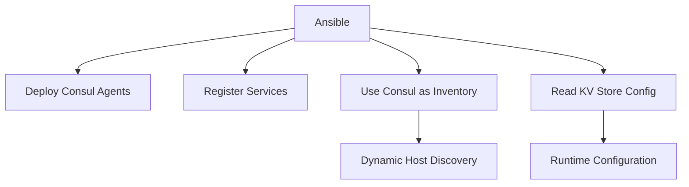

# How to Use Ansible with Consul for Service Discovery

Author: [nawazdhandala](https://www.github.com/nawazdhandala)

Tags: Ansible, Consul, Service Discovery, DevOps

Description: Integrate Ansible with HashiCorp Consul for service discovery, health checking, and dynamic inventory management across your infrastructure.

---

Service discovery is essential for modern infrastructure where services come and go dynamically. HashiCorp Consul provides service registration, health checking, and a DNS interface for service lookup. Ansible can both configure Consul and use it as a dynamic inventory source.

This post covers the integration between Ansible and Consul.

## Consul and Ansible Integration Points



## Installing Consul with Ansible

```yaml
# roles/consul/tasks/main.yml
# Install and configure Consul agent
---
- name: Create Consul user
  ansible.builtin.user:
    name: consul
    system: true
    shell: /bin/false

- name: Download Consul
  ansible.builtin.get_url:
    url: "https://releases.hashicorp.com/consul/{{ consul_version }}/consul_{{ consul_version }}_linux_amd64.zip"
    dest: /tmp/consul.zip
    checksum: "sha256:{{ consul_checksum }}"
    mode: '0644'

- name: Extract Consul
  ansible.builtin.unarchive:
    src: /tmp/consul.zip
    dest: /usr/local/bin/
    remote_src: true

- name: Create Consul directories
  ansible.builtin.file:
    path: "{{ item }}"
    state: directory
    owner: consul
    group: consul
    mode: '0750'
  loop:
    - /etc/consul.d
    - /var/lib/consul

- name: Deploy Consul configuration
  ansible.builtin.template:
    src: consul.hcl.j2
    dest: /etc/consul.d/consul.hcl
    owner: consul
    group: consul
    mode: '0640'
  notify: restart consul

- name: Deploy Consul systemd service
  ansible.builtin.template:
    src: consul.service.j2
    dest: /etc/systemd/system/consul.service
    mode: '0644'
  notify:
    - daemon reload
    - restart consul

- name: Ensure Consul is running
  ansible.builtin.service:
    name: consul
    state: started
    enabled: true
```

Consul agent configuration template:

```hcl
# roles/consul/templates/consul.hcl.j2
# Consul agent configuration
datacenter = "{{ consul_datacenter }}"
data_dir   = "/var/lib/consul"
node_name  = "{{ inventory_hostname }}"


server           = true
bootstrap_expect = {{ consul_bootstrap_expect }}


client_addr = "0.0.0.0"
bind_addr   = "{{ ansible_default_ipv4.address }}"

retry_join = {{ consul_retry_join | to_json }}

ui_config {
  enabled = {{ consul_ui_enabled | default(false) | lower }}
}

connect {
  enabled = true
}
```

## Registering Services with Consul

```yaml
# roles/consul_service/tasks/main.yml
# Register an application service with Consul
---
- name: Deploy service registration
  ansible.builtin.template:
    src: service.hcl.j2
    dest: "/etc/consul.d/{{ service_name }}.hcl"
    owner: consul
    group: consul
    mode: '0640'
  notify: reload consul

- name: Verify service is registered
  ansible.builtin.uri:
    url: "http://localhost:8500/v1/agent/service/{{ service_name }}"
    status_code: 200
  retries: 5
  delay: 3
```

```hcl
# roles/consul_service/templates/service.hcl.j2
service {
  name = "{{ service_name }}"
  port = {{ service_port }}
  tags = {{ service_tags | default([]) | to_json }}

  meta {
    version = "{{ service_version }}"
    environment = "{{ environment_name }}"
  }

  check {
    http     = "http://localhost:{{ service_port }}/health"
    interval = "10s"
    timeout  = "3s"
  }
}
```

## Using Consul as Dynamic Inventory

```yaml
# inventories/consul_inventory.yml
# Use Consul as a dynamic inventory source
plugin: community.general.consul
url: http://consul.example.com:8500
datacenter: dc1

services:
  webserver:
    groups:
      - webservers
  database:
    groups:
      - databases
  cache:
    groups:
      - cache_servers
```

## Reading Configuration from Consul KV

```yaml
# tasks/consul-kv-config.yml
# Read application configuration from Consul KV store
---
- name: Read config from Consul KV
  ansible.builtin.set_fact:
    app_config: "{{ lookup('community.general.consul_kv', 'config/app/{{ environment_name }}', url='http://consul.example.com:8500') }}"

- name: Read individual config values
  ansible.builtin.set_fact:
    db_host: "{{ lookup('community.general.consul_kv', 'config/database/host') }}"
    db_port: "{{ lookup('community.general.consul_kv', 'config/database/port') }}"
    feature_flags: "{{ lookup('community.general.consul_kv', 'config/features', recurse=true) }}"
```

## Writing to Consul KV

```yaml
# tasks/write-consul-kv.yml
# Write configuration to Consul KV store
---
- name: Write deployment info to Consul
  community.general.consul_kv:
    key: "deployments/{{ app_name }}/{{ environment_name }}"
    value: |
      {"version": "{{ app_version }}", "deployed_at": "{{ ansible_date_time.iso8601 }}", "deployed_by": "{{ lookup('env', 'USER') }}"}
    host: consul.example.com

- name: Write feature flag to Consul
  community.general.consul_kv:
    key: "config/features/{{ item.name }}"
    value: "{{ item.enabled | string | lower }}"
    host: consul.example.com
  loop: "{{ feature_flags }}"
```

## Service Discovery in Templates

Use Consul DNS for service discovery in application configs:

```yaml
# Template that uses Consul DNS for service discovery
# roles/app_config/templates/app.yml.j2
database:
  host: database.service.consul
  port: 5432
cache:
  host: cache.service.consul
  port: 6379
```

## Health Check Management

```yaml
# tasks/consul-health.yml
# Check service health via Consul
---
- name: Check health of all services
  ansible.builtin.uri:
    url: "http://consul.example.com:8500/v1/health/state/critical"
  register: critical_services

- name: Alert on critical services
  ansible.builtin.debug:
    msg: "CRITICAL: {{ critical_services.json | length }} services in critical state"
  when: critical_services.json | length > 0
```

## Key Takeaways

Consul and Ansible complement each other well. Ansible deploys and configures Consul agents, registers services, and manages KV store entries. Consul provides dynamic service discovery that Ansible can use as an inventory source. Use Consul DNS in your application configuration templates so services find each other automatically. Store runtime configuration in Consul KV that applications read directly, reducing the need for redeployment when configuration changes.

## Common Use Cases

Here are several practical scenarios where this module proves essential in real-world playbooks.

### Infrastructure Provisioning Workflow

```yaml
# Complete workflow incorporating this module
- name: Infrastructure provisioning
  hosts: all
  become: true
  gather_facts: true
  tasks:
    - name: Gather system information
      ansible.builtin.setup:
        gather_subset:
          - hardware
          - network

    - name: Display system summary
      ansible.builtin.debug:
        msg: >-
          Host {{ inventory_hostname }} has
          {{ ansible_memtotal_mb }}MB RAM,
          {{ ansible_processor_vcpus }} vCPUs,
          running {{ ansible_distribution }} {{ ansible_distribution_version }}

    - name: Install required packages
      ansible.builtin.package:
        name:
          - curl
          - wget
          - git
          - vim
          - htop
          - jq
        state: present

    - name: Configure system timezone
      ansible.builtin.timezone:
        name: "{{ system_timezone | default('UTC') }}"

    - name: Configure hostname
      ansible.builtin.hostname:
        name: "{{ inventory_hostname }}"

    - name: Update /etc/hosts
      ansible.builtin.lineinfile:
        path: /etc/hosts
        regexp: '^127\.0\.1\.1'
        line: "127.0.1.1 {{ inventory_hostname }}"

    - name: Configure SSH hardening
      ansible.builtin.lineinfile:
        path: /etc/ssh/sshd_config
        regexp: "{{ item.regexp }}"
        line: "{{ item.line }}"
      loop:
        - { regexp: '^PermitRootLogin', line: 'PermitRootLogin no' }
        - { regexp: '^PasswordAuthentication', line: 'PasswordAuthentication no' }
      notify: restart sshd

    - name: Configure firewall rules
      community.general.ufw:
        rule: allow
        port: "{{ item }}"
        proto: tcp
      loop:
        - "22"
        - "80"
        - "443"

    - name: Enable firewall
      community.general.ufw:
        state: enabled
        policy: deny

  handlers:
    - name: restart sshd
      ansible.builtin.service:
        name: sshd
        state: restarted
```

### Integration with Monitoring

```yaml
# Using gathered facts to configure monitoring thresholds
- name: Configure monitoring based on system specs
  hosts: all
  become: true
  tasks:
    - name: Set monitoring thresholds based on hardware
      ansible.builtin.template:
        src: monitoring_config.yml.j2
        dest: /etc/monitoring/config.yml
      vars:
        memory_warning_threshold: "{{ (ansible_memtotal_mb * 0.8) | int }}"
        memory_critical_threshold: "{{ (ansible_memtotal_mb * 0.95) | int }}"
        cpu_warning_threshold: 80
        cpu_critical_threshold: 95

    - name: Register host with monitoring system
      ansible.builtin.uri:
        url: "https://monitoring.example.com/api/hosts"
        method: POST
        body_format: json
        body:
          hostname: "{{ inventory_hostname }}"
          ip_address: "{{ ansible_default_ipv4.address }}"
          os: "{{ ansible_distribution }}"
          memory_mb: "{{ ansible_memtotal_mb }}"
          cpus: "{{ ansible_processor_vcpus }}"
        headers:
          Authorization: "Bearer {{ monitoring_api_token }}"
        status_code: [200, 201, 409]
```

### Error Handling Patterns

```yaml
# Robust error handling with this module
- name: Robust task execution
  hosts: all
  tasks:
    - name: Attempt primary operation
      ansible.builtin.command: /opt/app/primary-task.sh
      register: primary_result
      failed_when: false

    - name: Handle primary failure with fallback
      ansible.builtin.command: /opt/app/fallback-task.sh
      when: primary_result.rc != 0
      register: fallback_result

    - name: Report final status
      ansible.builtin.debug:
        msg: >-
          Task completed via {{ 'primary' if primary_result.rc == 0 else 'fallback' }} path.
          Return code: {{ primary_result.rc if primary_result.rc == 0 else fallback_result.rc }}

    - name: Fail if both paths failed
      ansible.builtin.fail:
        msg: "Both primary and fallback operations failed"
      when:
        - primary_result.rc != 0
        - fallback_result is defined
        - fallback_result.rc != 0
```

### Scheduling and Automation

```yaml
# Set up scheduled compliance scans using cron
- name: Configure automated scans
  hosts: all
  become: true
  tasks:
    - name: Create scan script
      ansible.builtin.copy:
        dest: /opt/scripts/compliance_scan.sh
        mode: '0755'
        content: |
          #!/bin/bash
          cd /opt/ansible
          ansible-playbook playbooks/validate.yml -i inventory/ > /var/log/compliance_scan.log 2>&1
          EXIT_CODE=$?
          if [ $EXIT_CODE -ne 0 ]; then
            curl -X POST https://hooks.example.com/alert \
              -H "Content-Type: application/json" \
              -d "{\"text\":\"Compliance scan failed on $(hostname)\"}"
          fi
          exit $EXIT_CODE

    - name: Schedule weekly compliance scan
      ansible.builtin.cron:
        name: "Weekly compliance scan"
        minute: "0"
        hour: "3"
        weekday: "1"
        job: "/opt/scripts/compliance_scan.sh"
        user: ansible
```

