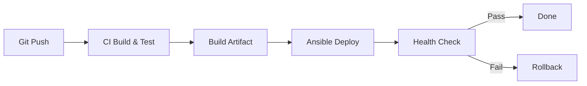

# How to Use Ansible for Continuous Deployment

Author: [nawazdhandala](https://www.github.com/nawazdhandala)

Tags: Ansible, Continuous Deployment, CI/CD, DevOps

Description: Build a continuous deployment pipeline with Ansible that deploys application updates automatically with rolling updates, health checks, and rollback capability.

---

Continuous Deployment (CD) means every change that passes your test suite gets deployed to production automatically. Ansible is a solid tool for the deployment step because it gives you fine-grained control over how updates roll out, and it integrates cleanly with any CI system.

In this guide, I will build a complete CD pipeline using Ansible, covering the deployment playbook, rolling updates, health checks, and automatic rollbacks.

## The Pipeline Architecture

A typical CD pipeline looks like this:



The CI system handles building and testing. Ansible handles the actual deployment. This separation keeps each tool doing what it does best.

## Setting Up the Deployment Playbook

The core deployment playbook needs to handle pulling the new artifact, stopping the old version, starting the new one, and verifying it works.

```yaml
# playbooks/deploy.yml
# Main deployment playbook with rolling update strategy
---
- name: Deploy application
  hosts: webservers
  become: true
  serial: "25%"
  max_fail_percentage: 10
  vars:
    app_name: myapp
    deploy_dir: /opt/{{ app_name }}
    releases_dir: "{{ deploy_dir }}/releases"
    shared_dir: "{{ deploy_dir }}/shared"
    current_link: "{{ deploy_dir }}/current"

  pre_tasks:
    - name: Get deployment timestamp
      ansible.builtin.set_fact:
        release_timestamp: "{{ lookup('pipe', 'date +%Y%m%d%H%M%S') }}"
        release_version: "{{ app_version }}"

    - name: Deregister from load balancer
      ansible.builtin.uri:
        url: "http://{{ lb_endpoint }}/api/v1/backends"
        method: POST
        body_format: json
        body:
          host: "{{ inventory_hostname }}"
          action: drain
        status_code: 200
      delegate_to: localhost

    - name: Wait for connections to drain
      ansible.builtin.pause:
        seconds: 15

  tasks:
    - name: Create release directory
      ansible.builtin.file:
        path: "{{ releases_dir }}/{{ release_timestamp }}"
        state: directory
        owner: "{{ app_user }}"
        group: "{{ app_group }}"
        mode: '0755'

    - name: Download application artifact
      ansible.builtin.get_url:
        url: "{{ artifact_url }}/{{ app_name }}-{{ release_version }}.tar.gz"
        dest: "/tmp/{{ app_name }}-{{ release_version }}.tar.gz"
        checksum: "sha256:{{ artifact_checksum }}"

    - name: Extract artifact
      ansible.builtin.unarchive:
        src: "/tmp/{{ app_name }}-{{ release_version }}.tar.gz"
        dest: "{{ releases_dir }}/{{ release_timestamp }}"
        remote_src: true
        owner: "{{ app_user }}"
        group: "{{ app_group }}"

    - name: Link shared configuration
      ansible.builtin.file:
        src: "{{ shared_dir }}/config/{{ item }}"
        dest: "{{ releases_dir }}/{{ release_timestamp }}/config/{{ item }}"
        state: link
      loop:
        - application.yml
        - database.yml
        - secrets.yml

    - name: Save current release for rollback
      ansible.builtin.stat:
        path: "{{ current_link }}"
      register: current_release

    - name: Record previous release path
      ansible.builtin.copy:
        content: "{{ current_release.stat.lnk_target | default('none') }}"
        dest: "{{ deploy_dir }}/.previous_release"
        mode: '0644'
      when: current_release.stat.exists | default(false)

    - name: Update current symlink
      ansible.builtin.file:
        src: "{{ releases_dir }}/{{ release_timestamp }}"
        dest: "{{ current_link }}"
        state: link
        force: true

    - name: Restart application service
      ansible.builtin.systemd:
        name: "{{ app_name }}"
        state: restarted
        daemon_reload: true

  post_tasks:
    - name: Wait for application to start
      ansible.builtin.uri:
        url: "http://localhost:{{ app_port }}/health"
        status_code: 200
      register: health_check
      retries: 20
      delay: 3
      until: health_check.status == 200

    - name: Register with load balancer
      ansible.builtin.uri:
        url: "http://{{ lb_endpoint }}/api/v1/backends"
        method: POST
        body_format: json
        body:
          host: "{{ inventory_hostname }}"
          action: enable
        status_code: 200
      delegate_to: localhost

    - name: Clean up old releases (keep last 5)
      ansible.builtin.shell: |
        cd {{ releases_dir }}
        ls -dt */ | tail -n +6 | xargs rm -rf
      args:
        warn: false
      changed_when: false
```

## Triggering Deployment from CI

Here is how to call the Ansible deployment from GitHub Actions:

```yaml
# .github/workflows/deploy.yml
# CI pipeline that triggers Ansible deployment
name: Deploy
on:
  push:
    branches: [main]

jobs:
  build:
    runs-on: ubuntu-latest
    outputs:
      version: ${{ steps.version.outputs.value }}
      checksum: ${{ steps.checksum.outputs.value }}
    steps:
      - uses: actions/checkout@v4
      - name: Build artifact
        run: |
          make build
          tar czf myapp-${{ github.sha }}.tar.gz -C dist .
      - name: Calculate checksum
        id: checksum
        run: echo "value=$(sha256sum myapp-*.tar.gz | awk '{print $1}')" >> $GITHUB_OUTPUT
      - name: Set version
        id: version
        run: echo "value=${{ github.sha }}" >> $GITHUB_OUTPUT
      - name: Upload artifact
        run: |
          aws s3 cp myapp-${{ github.sha }}.tar.gz \
            s3://deploy-artifacts/myapp/

  deploy:
    needs: build
    runs-on: ubuntu-latest
    steps:
      - uses: actions/checkout@v4
      - name: Install Ansible
        run: pip install ansible boto3
      - name: Run deployment
        env:
          ANSIBLE_HOST_KEY_CHECKING: "false"
        run: |
          ansible-playbook playbooks/deploy.yml \
            -i inventories/production/aws_ec2.yml \
            -e "app_version=${{ needs.build.outputs.version }}" \
            -e "artifact_checksum=${{ needs.build.outputs.checksum }}" \
            -e "artifact_url=https://deploy-artifacts.s3.amazonaws.com/myapp"
```

## Implementing Rollback

When a deployment goes wrong, you need fast rollback. Here is a dedicated rollback playbook:

```yaml
# playbooks/rollback.yml
# Emergency rollback to the previous release
---
- name: Rollback to previous release
  hosts: webservers
  become: true
  serial: "50%"

  tasks:
    - name: Read previous release path
      ansible.builtin.slurp:
        src: "{{ deploy_dir }}/.previous_release"
      register: previous_release_raw

    - name: Set previous release fact
      ansible.builtin.set_fact:
        previous_release: "{{ previous_release_raw.content | b64decode | trim }}"

    - name: Verify previous release exists
      ansible.builtin.stat:
        path: "{{ previous_release }}"
      register: prev_check
      failed_when: not prev_check.stat.exists

    - name: Switch symlink to previous release
      ansible.builtin.file:
        src: "{{ previous_release }}"
        dest: "{{ deploy_dir }}/current"
        state: link
        force: true

    - name: Restart application
      ansible.builtin.systemd:
        name: "{{ app_name }}"
        state: restarted

    - name: Verify application health
      ansible.builtin.uri:
        url: "http://localhost:{{ app_port }}/health"
        status_code: 200
      retries: 20
      delay: 3
      register: health
      until: health.status == 200
```

## Automatic Rollback on Failure

You can make rollback automatic by using Ansible's block/rescue mechanism:

```yaml
# playbooks/deploy-with-auto-rollback.yml
# Deployment with automatic rollback on failure
---
- name: Deploy with automatic rollback
  hosts: webservers
  become: true
  serial: 1

  tasks:
    - name: Deploy and verify
      block:
        - name: Pull new version
          ansible.builtin.include_tasks: tasks/deploy-release.yml

        - name: Run smoke tests
          ansible.builtin.uri:
            url: "http://localhost:{{ app_port }}/{{ item }}"
            status_code: 200
          loop:
            - health
            - api/v1/status
            - ready

      rescue:
        - name: Deployment failed - rolling back
          ansible.builtin.include_tasks: tasks/rollback-release.yml

        - name: Notify team of rollback
          community.general.slack:
            token: "{{ slack_token }}"
            channel: "#deployments"
            msg: "Deployment of {{ app_version }} to {{ inventory_hostname }} FAILED. Rolled back automatically."

        - name: Fail the play
          ansible.builtin.fail:
            msg: "Deployment failed on {{ inventory_hostname }}, rolled back successfully"
```

## Deployment Notifications

Keep your team informed about deployments:

```yaml
# roles/deploy_notify/tasks/main.yml
# Send deployment notifications to Slack
---
- name: Notify deployment start
  community.general.slack:
    token: "{{ slack_token }}"
    channel: "#deployments"
    msg: |
      :rocket: Deploying {{ app_name }} version {{ app_version }}
      Environment: {{ environment_name }}
      Started by: {{ lookup('env', 'GITHUB_ACTOR') | default('manual') }}
  delegate_to: localhost
  run_once: true
  tags: [notify]
```

## Key Practices

Run deployments in small batches using `serial` so you can catch problems before they affect the entire fleet. Always include health checks after deployment. Keep previous releases on disk for fast rollback. Use `block/rescue` for automatic rollback when smoke tests fail. And notify your team through Slack or another channel so everyone knows what is happening.

Ansible gives you the building blocks for a robust CD pipeline. The key is combining them into a deployment flow that is safe, observable, and recoverable.
