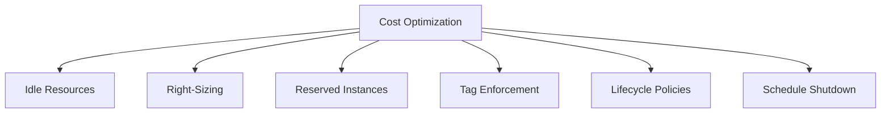

# How to Use Ansible for Cost Optimization Automation

Author: [nawazdhandala](https://www.github.com/nawazdhandala)

Tags: Ansible, Cost Optimization, Cloud, FinOps

Description: Automate cloud cost optimization with Ansible by identifying idle resources, rightsizing instances, and enforcing tagging and lifecycle policies.

---

Cloud bills grow quietly. An unused RDS instance here, an oversized EC2 instance there, and suddenly you are spending thousands more than necessary. Ansible can automate the discovery and remediation of cost waste across your infrastructure.

This post covers building cost optimization automation with Ansible.

## Cost Optimization Areas



## Find and Remove Idle Resources

```yaml
# playbooks/find-idle-resources.yml
# Identify and optionally remove unused cloud resources
---
- name: Find idle resources
  hosts: localhost
  connection: local

  tasks:
    - name: Find unattached EBS volumes
      amazon.aws.ec2_vol_info:
        filters:
          status: available
      register: unattached_volumes

    - name: Report unattached volumes
      ansible.builtin.debug:
        msg: |
          Found {{ unattached_volumes.volumes | length }} unattached EBS volumes
          Total wasted storage: {{ unattached_volumes.volumes | map(attribute='size') | sum }}GB
          Monthly cost estimate: ${{ (unattached_volumes.volumes | map(attribute='size') | sum) * 0.10 }}

    - name: Find unused Elastic IPs
      amazon.aws.ec2_eip_info:
      register: all_eips

    - name: Identify unattached EIPs
      ansible.builtin.set_fact:
        unused_eips: "{{ all_eips.addresses | selectattr('association_id', 'undefined') | list }}"

    - name: Report unused EIPs
      ansible.builtin.debug:
        msg: "Found {{ unused_eips | length }} unused EIPs (cost: ${{ unused_eips | length * 3.65 }}/month each)"

    - name: Find old snapshots (older than 90 days)
      amazon.aws.ec2_snapshot_info:
        filters:
          owner-id: "{{ aws_account_id }}"
      register: all_snapshots

    - name: Identify old snapshots
      ansible.builtin.set_fact:
        old_snapshots: "{{ all_snapshots.snapshots | selectattr('start_time', 'lt', (ansible_date_time.date | to_datetime - 'P90D' | to_datetime).isoformat()) | list }}"

    - name: Generate cost report
      ansible.builtin.template:
        src: cost-report.md.j2
        dest: "./reports/cost-report-{{ ansible_date_time.date }}.md"
        mode: '0644'
```

## Cleanup Idle Resources

```yaml
# playbooks/cleanup-idle-resources.yml
# Remove confirmed idle resources
---
- name: Cleanup idle resources
  hosts: localhost
  connection: local
  vars:
    dry_run: true  # Set to false to actually delete

  tasks:
    - name: Delete unattached EBS volumes older than 30 days
      amazon.aws.ec2_vol:
        id: "{{ item.id }}"
        state: absent
      loop: "{{ unattached_volumes.volumes }}"
      when:
        - not dry_run
        - item.create_time < (ansible_date_time.date | to_datetime('%Y-%m-%d') - 'P30D' | to_datetime).isoformat()

    - name: Release unused Elastic IPs
      amazon.aws.ec2_eip:
        public_ip: "{{ item.public_ip }}"
        state: absent
      loop: "{{ unused_eips }}"
      when: not dry_run

    - name: Shut down non-production instances outside business hours
      amazon.aws.ec2_instance:
        instance_ids: "{{ item.instance_id }}"
        state: stopped
      loop: "{{ dev_instances_running }}"
      when:
        - not dry_run
        - ansible_date_time.hour | int > 20 or ansible_date_time.hour | int < 7
```

## Right-Sizing Recommendations

```yaml
# playbooks/rightsizing-report.yml
# Generate right-sizing recommendations
---
- name: Generate rightsizing recommendations
  hosts: localhost
  connection: local

  tasks:
    - name: Get CloudWatch CPU metrics for all instances
      amazon.aws.cloudwatch_metric_alarm_info:
        alarm_names: []
      register: alarms

    - name: Query average CPU per instance over 14 days
      ansible.builtin.uri:
        url: "http://{{ prometheus_host }}:9090/api/v1/query"
        method: POST
        body_format: form-urlencoded
        body:
          query: "avg_over_time(instance:cpu_utilization:avg[14d])"
      register: cpu_data

    - name: Identify oversized instances (avg CPU < 20%)
      ansible.builtin.set_fact:
        oversized: "{{ cpu_data.json.data.result | selectattr('value.1', 'lt', '20') | list }}"

    - name: Generate recommendations
      ansible.builtin.debug:
        msg: |
          Right-sizing recommendations:
          
          - {{ instance.metric.instance }}: avg CPU {{ instance.value[1] }}% - consider downsizing
          
```

## Tag Enforcement

Enforce tagging policies to track costs:

```yaml
# playbooks/enforce-tags.yml
# Find and tag untagged resources
---
- name: Enforce resource tagging
  hosts: localhost
  connection: local
  vars:
    required_tags:
      - Environment
      - Team
      - CostCenter

  tasks:
    - name: Find EC2 instances missing required tags
      amazon.aws.ec2_instance_info:
      register: all_instances

    - name: Identify untagged instances
      ansible.builtin.set_fact:
        untagged_instances: >-
          {{ all_instances.instances
             | selectattr('state.name', 'equalto', 'running')
             | rejectattr('tags.Environment', 'defined')
             | list }}

    - name: Report untagged instances
      ansible.builtin.debug:
        msg: "{{ untagged_instances | length }} running instances missing required tags"

    - name: Apply default tags to untagged instances
      amazon.aws.ec2_tag:
        resource: "{{ item.instance_id }}"
        tags:
          Environment: "UNTAGGED-REVIEW"
          Team: "UNKNOWN"
          CostCenter: "UNKNOWN"
      loop: "{{ untagged_instances }}"

    - name: Notify team about untagged resources
      community.general.slack:
        token: "{{ slack_token }}"
        channel: "#finops"
        msg: "Found {{ untagged_instances | length }} untagged EC2 instances. Applied REVIEW tags."
```

## Scheduled Cost Optimization

Run cost checks automatically:

```yaml
# roles/cost_optimizer_scheduler/tasks/main.yml
# Schedule regular cost optimization checks
---
- name: Schedule weekly idle resource scan
  ansible.builtin.cron:
    name: "Weekly idle resource scan"
    weekday: "1"
    hour: "9"
    minute: "0"
    job: >
      ansible-playbook /opt/ansible/playbooks/find-idle-resources.yml
      >> /var/log/cost-optimization.log 2>&1
    user: ansible

- name: Schedule daily tag enforcement
  ansible.builtin.cron:
    name: "Daily tag enforcement"
    hour: "8"
    minute: "0"
    job: >
      ansible-playbook /opt/ansible/playbooks/enforce-tags.yml
      >> /var/log/cost-optimization.log 2>&1
    user: ansible

- name: Schedule dev environment shutdown
  ansible.builtin.cron:
    name: "Dev environment nightly shutdown"
    hour: "20"
    minute: "0"
    weekday: "1-5"
    job: >
      ansible-playbook /opt/ansible/playbooks/stop-dev-instances.yml
      >> /var/log/cost-optimization.log 2>&1
    user: ansible
```

## Key Takeaways

Cloud cost optimization is an ongoing process, not a one-time effort. Use Ansible to regularly scan for idle resources like unattached volumes and unused IPs. Generate rightsizing reports based on actual CPU and memory usage. Enforce tagging so every resource has an owner and cost center. Schedule non-production environment shutdowns during off-hours. Run these automations on a schedule so waste is caught quickly. Even small optimizations compound over time into significant savings.
