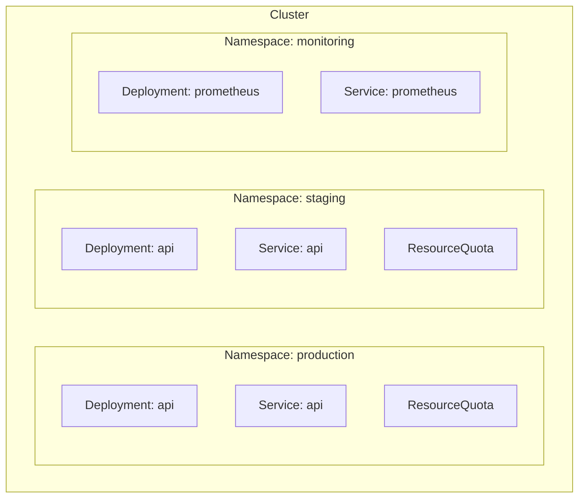

# How to Use Ansible to Create Kubernetes Namespaces

Author: [nawazdhandala](https://www.github.com/nawazdhandala)

Tags: Ansible, Kubernetes, Namespaces, Organization, DevOps

Description: Create and manage Kubernetes namespaces with Ansible including labels, annotations, resource quotas, and network policies.

---

Namespaces are the fundamental organizational unit in Kubernetes. They partition a cluster into virtual sub-clusters, providing isolation for resources, access control boundaries, and a way to divvy up cluster resources among teams or environments. Creating namespaces manually is quick, but managing dozens of namespaces with consistent configurations, quotas, and policies is where Ansible adds real value.

## What Namespaces Do

A namespace in Kubernetes provides:

- **Resource isolation**: Resources in one namespace are not visible from another by default
- **Access control**: RBAC policies can be scoped to a namespace
- **Resource quotas**: Limit CPU, memory, and object counts per namespace
- **Network policies**: Control traffic between namespaces
- **Naming scope**: Two namespaces can each have a Service called "api" without conflict



## Creating a Simple Namespace

The most basic namespace creation:

```yaml
# create_namespace.yml - Create a basic namespace
---
- name: Create Kubernetes Namespace
  hosts: localhost
  connection: local

  tasks:
    - name: Create the production namespace
      kubernetes.core.k8s:
        state: present
        definition:
          apiVersion: v1
          kind: Namespace
          metadata:
            name: production
```

That is three lines of YAML for the definition. But production namespaces need a lot more configuration.

## Namespaces with Labels and Annotations

Labels and annotations provide metadata that other tools and policies can use:

```yaml
# labeled_namespace.yml - Namespace with labels and annotations
---
- name: Create Labeled Namespace
  hosts: localhost
  connection: local
  vars:
    team: backend
    environment: production
    cost_center: eng-001

  tasks:
    - name: Create namespace with metadata
      kubernetes.core.k8s:
        state: present
        definition:
          apiVersion: v1
          kind: Namespace
          metadata:
            name: "{{ team }}-{{ environment }}"
            labels:
              team: "{{ team }}"
              environment: "{{ environment }}"
              cost-center: "{{ cost_center }}"
              managed-by: ansible
            annotations:
              description: "Production namespace for the backend team"
              contact: "backend-team@example.com"
              created-by: "ansible-automation"
```

Labels are particularly important because many cluster tools use them. For example:

- Istio uses labels to inject sidecars automatically
- Network policies select namespaces by label
- Cost allocation tools group resources by label
- Pod security standards are applied via labels

## Creating Multiple Namespaces

Most clusters need several namespaces. Define them as a list and create them all:

```yaml
# create_multiple.yml - Create multiple namespaces at once
---
- name: Create Multiple Namespaces
  hosts: localhost
  connection: local
  vars:
    namespaces:
      - name: production
        team: platform
        environment: production
        quotas:
          cpu: "32"
          memory: "64Gi"
          pods: "200"
      - name: staging
        team: platform
        environment: staging
        quotas:
          cpu: "8"
          memory: "16Gi"
          pods: "100"
      - name: development
        team: platform
        environment: development
        quotas:
          cpu: "4"
          memory: "8Gi"
          pods: "50"
      - name: monitoring
        team: sre
        environment: shared
        quotas:
          cpu: "8"
          memory: "16Gi"
          pods: "50"
      - name: ci-cd
        team: devops
        environment: shared
        quotas:
          cpu: "16"
          memory: "32Gi"
          pods: "100"

  tasks:
    - name: Create namespaces
      kubernetes.core.k8s:
        state: present
        definition:
          apiVersion: v1
          kind: Namespace
          metadata:
            name: "{{ item.name }}"
            labels:
              team: "{{ item.team }}"
              environment: "{{ item.environment }}"
              managed-by: ansible
      loop: "{{ namespaces }}"
      loop_control:
        label: "{{ item.name }}"
```

## Adding Resource Quotas

Resource quotas prevent any single namespace from consuming the entire cluster's resources:

```yaml
# namespace_with_quota.yml - Namespace with ResourceQuota
---
- name: Create Namespace with Resource Quota
  hosts: localhost
  connection: local
  vars:
    namespace_name: production
    cpu_limit: "32"
    memory_limit: "64Gi"
    max_pods: "200"

  tasks:
    - name: Create the namespace
      kubernetes.core.k8s:
        state: present
        definition:
          apiVersion: v1
          kind: Namespace
          metadata:
            name: "{{ namespace_name }}"

    - name: Create ResourceQuota
      kubernetes.core.k8s:
        state: present
        definition:
          apiVersion: v1
          kind: ResourceQuota
          metadata:
            name: "{{ namespace_name }}-quota"
            namespace: "{{ namespace_name }}"
          spec:
            hard:
              requests.cpu: "{{ cpu_limit }}"
              requests.memory: "{{ memory_limit }}"
              limits.cpu: "{{ cpu_limit }}"
              limits.memory: "{{ memory_limit }}"
              pods: "{{ max_pods }}"
              services: "50"
              secrets: "100"
              configmaps: "100"
              persistentvolumeclaims: "30"
```

## Adding Limit Ranges

While ResourceQuotas limit the total resources in a namespace, LimitRanges set default and maximum values for individual pods and containers:

```yaml
    - name: Create LimitRange for default container limits
      kubernetes.core.k8s:
        state: present
        definition:
          apiVersion: v1
          kind: LimitRange
          metadata:
            name: "{{ namespace_name }}-limits"
            namespace: "{{ namespace_name }}"
          spec:
            limits:
              - type: Container
                default:
                  cpu: "500m"
                  memory: "512Mi"
                defaultRequest:
                  cpu: "100m"
                  memory: "128Mi"
                max:
                  cpu: "4"
                  memory: "8Gi"
                min:
                  cpu: "50m"
                  memory: "64Mi"
              - type: Pod
                max:
                  cpu: "8"
                  memory: "16Gi"
```

This means that if a developer creates a pod without specifying resource requests/limits, it gets the defaults automatically. And no single container can request more than the maximum.

## Network Policies

Control which namespaces can talk to each other:

```yaml
# namespace_network_policy.yml - Restrict inter-namespace traffic
---
- name: Apply Network Policies to Namespace
  hosts: localhost
  connection: local
  vars:
    namespace_name: production

  tasks:
    - name: Default deny all ingress traffic
      kubernetes.core.k8s:
        state: present
        definition:
          apiVersion: networking.k8s.io/v1
          kind: NetworkPolicy
          metadata:
            name: default-deny-ingress
            namespace: "{{ namespace_name }}"
          spec:
            podSelector: {}
            policyTypes:
              - Ingress

    - name: Allow traffic from same namespace
      kubernetes.core.k8s:
        state: present
        definition:
          apiVersion: networking.k8s.io/v1
          kind: NetworkPolicy
          metadata:
            name: allow-same-namespace
            namespace: "{{ namespace_name }}"
          spec:
            podSelector: {}
            ingress:
              - from:
                  - podSelector: {}
            policyTypes:
              - Ingress

    - name: Allow traffic from monitoring namespace
      kubernetes.core.k8s:
        state: present
        definition:
          apiVersion: networking.k8s.io/v1
          kind: NetworkPolicy
          metadata:
            name: allow-monitoring
            namespace: "{{ namespace_name }}"
          spec:
            podSelector: {}
            ingress:
              - from:
                  - namespaceSelector:
                      matchLabels:
                        team: sre
                ports:
                  - port: 9090
                    protocol: TCP
            policyTypes:
              - Ingress
```

## RBAC Per Namespace

Grant team access to their namespace:

```yaml
# namespace_rbac.yml - Set up RBAC for a team namespace
---
- name: Configure Namespace RBAC
  hosts: localhost
  connection: local
  vars:
    namespace_name: backend-production
    team_group: backend-team

  tasks:
    - name: Create namespace-scoped role for developers
      kubernetes.core.k8s:
        state: present
        definition:
          apiVersion: rbac.authorization.k8s.io/v1
          kind: Role
          metadata:
            name: developer-role
            namespace: "{{ namespace_name }}"
          rules:
            - apiGroups: ["", "apps", "batch"]
              resources: ["pods", "deployments", "services", "configmaps", "jobs"]
              verbs: ["get", "list", "watch", "create", "update", "patch"]
            - apiGroups: [""]
              resources: ["pods/log", "pods/exec"]
              verbs: ["get", "create"]
            - apiGroups: [""]
              resources: ["secrets"]
              verbs: ["get", "list"]  # Read-only for secrets

    - name: Bind the role to the team group
      kubernetes.core.k8s:
        state: present
        definition:
          apiVersion: rbac.authorization.k8s.io/v1
          kind: RoleBinding
          metadata:
            name: developer-binding
            namespace: "{{ namespace_name }}"
          subjects:
            - kind: Group
              name: "{{ team_group }}"
              apiGroup: rbac.authorization.k8s.io
          roleRef:
            kind: Role
            name: developer-role
            apiGroup: rbac.authorization.k8s.io
```

## Complete Namespace Provisioning

Here is a full playbook that sets up a namespace with everything it needs:

```yaml
# provision_namespace.yml - Complete namespace provisioning
---
- name: Provision Complete Namespace
  hosts: localhost
  connection: local
  vars:
    ns: "{{ namespace_name }}"
    team: "{{ team_name }}"

  tasks:
    - name: Create the namespace
      kubernetes.core.k8s:
        state: present
        definition:
          apiVersion: v1
          kind: Namespace
          metadata:
            name: "{{ ns }}"
            labels:
              team: "{{ team }}"
              managed-by: ansible
              pod-security.kubernetes.io/enforce: baseline

    - name: Create ResourceQuota
      kubernetes.core.k8s:
        state: present
        src: templates/resource-quota.yaml.j2

    - name: Create LimitRange
      kubernetes.core.k8s:
        state: present
        src: templates/limit-range.yaml.j2

    - name: Create default NetworkPolicy
      kubernetes.core.k8s:
        state: present
        src: templates/network-policy.yaml.j2

    - name: Create RBAC Role
      kubernetes.core.k8s:
        state: present
        src: templates/role.yaml.j2

    - name: Create RoleBinding
      kubernetes.core.k8s:
        state: present
        src: templates/rolebinding.yaml.j2

    - name: Verify namespace is ready
      kubernetes.core.k8s_info:
        kind: Namespace
        name: "{{ ns }}"
      register: ns_info

    - name: Report namespace status
      ansible.builtin.debug:
        msg: "Namespace {{ ns }} provisioned. Status: {{ ns_info.resources[0].status.phase }}"
```

Run it for any team:

```bash
# Provision namespace for the frontend team
ansible-playbook provision_namespace.yml -e "namespace_name=frontend-prod team_name=frontend"

# Provision namespace for the data team
ansible-playbook provision_namespace.yml -e "namespace_name=data-prod team_name=data"
```

## Cleaning Up Namespaces

Deleting a namespace removes everything inside it:

```yaml
    - name: Delete a namespace and all its resources
      kubernetes.core.k8s:
        state: absent
        kind: Namespace
        name: old-namespace
        wait: true
        wait_timeout: 120
```

Be careful with this. Deleting a namespace is irreversible and removes all resources inside it, including PersistentVolumeClaims (which deletes data if the reclaim policy is Delete).

## Summary

Namespace management with Ansible goes well beyond just creating a namespace object. A properly provisioned namespace needs resource quotas to prevent resource hogging, limit ranges to set sensible defaults, network policies to control traffic, and RBAC to grant appropriate access. Ansible lets you package all of this into a single playbook that you run whenever a new team or environment needs a namespace. The result is consistent, secure, and auditable namespace provisioning across your entire cluster.
