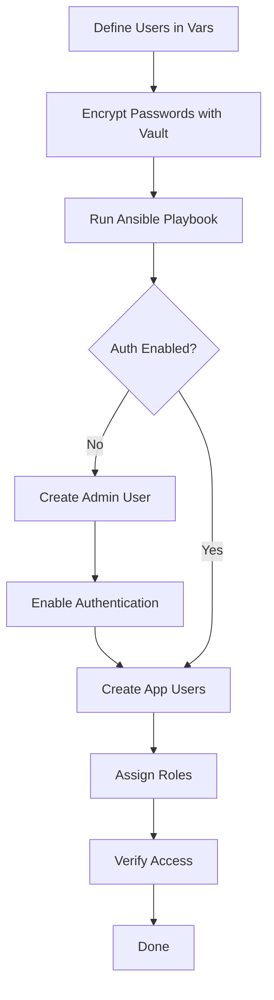

# How to Use Ansible to Create MongoDB Users

Author: [nawazdhandala](https://www.github.com/nawazdhandala)

Tags: Ansible, MongoDB, Database Administration, Automation

Description: Learn how to automate MongoDB user creation and permission management using Ansible playbooks with practical examples.

---

Managing MongoDB users manually across multiple servers is tedious and error-prone. If you have ever SSH'd into a dozen MongoDB instances to create the same application user, you know the pain. Ansible gives you a clean, repeatable way to handle MongoDB user management at scale.

In this guide, I will walk through creating MongoDB users with Ansible, covering everything from basic user creation to role-based access control and replica set authentication.

## Prerequisites

Before diving in, make sure you have:

- Ansible 2.9+ installed on your control node
- MongoDB 4.4+ running on target hosts
- The `community.mongodb` Ansible collection installed
- Python `pymongo` library on target hosts

Install the required collection first.

```bash
# Install the community MongoDB collection from Ansible Galaxy
ansible-galaxy collection install community.mongodb
```

## Setting Up Your Inventory

Here is a basic inventory file for a MongoDB environment with a primary and two secondaries.

```ini
# inventory/mongodb.ini
[mongodb_primary]
mongo-primary ansible_host=10.0.1.10

[mongodb_secondary]
mongo-secondary-1 ansible_host=10.0.1.11
mongo-secondary-2 ansible_host=10.0.1.12

[mongodb:children]
mongodb_primary
mongodb_secondary

[mongodb:vars]
ansible_user=ubuntu
ansible_ssh_private_key_file=~/.ssh/mongo-key.pem
mongodb_admin_user=admin
mongodb_admin_password="{{ vault_mongodb_admin_password }}"
```

## Creating the Admin User

The first user you need is the admin user. This is a chicken-and-egg problem because you need an admin to create users, but the admin does not exist yet. The trick is to create the admin user when MongoDB is running without authentication enabled, then enable auth afterward.

```yaml
# playbooks/create-admin-user.yml
---
- name: Create MongoDB admin user
  hosts: mongodb_primary
  become: true
  vars_files:
    - ../vault/mongodb-secrets.yml

  tasks:
    - name: Create the admin user in the admin database
      community.mongodb.mongodb_user:
        database: admin
        name: "{{ mongodb_admin_user }}"
        password: "{{ vault_mongodb_admin_password }}"
        roles:
          - role: root
            db: admin
        state: present
        # login_port defaults to 27017
        login_port: 27017
      # Only run this when auth is not yet enabled
      when: mongodb_auth_enabled is not defined or not mongodb_auth_enabled
```

## Creating Application Users

This is where things get practical. Most of the time, you are creating users for applications that need specific permissions on specific databases.

```yaml
# playbooks/create-app-users.yml
---
- name: Create MongoDB application users
  hosts: mongodb_primary
  become: true
  vars_files:
    - ../vault/mongodb-secrets.yml
  vars:
    mongodb_app_users:
      - name: webapp_user
        password: "{{ vault_webapp_password }}"
        database: webapp_db
        roles:
          - role: readWrite
            db: webapp_db
      - name: analytics_reader
        password: "{{ vault_analytics_password }}"
        database: analytics_db
        roles:
          - role: read
            db: analytics_db
          - role: read
            db: webapp_db
      - name: backup_user
        password: "{{ vault_backup_password }}"
        database: admin
        roles:
          - role: backup
            db: admin
          - role: restore
            db: admin

  tasks:
    - name: Create each application user
      community.mongodb.mongodb_user:
        login_user: "{{ mongodb_admin_user }}"
        login_password: "{{ vault_mongodb_admin_password }}"
        login_database: admin
        login_host: localhost
        login_port: 27017
        database: "{{ item.database }}"
        name: "{{ item.name }}"
        password: "{{ item.password }}"
        roles: "{{ item.roles }}"
        state: present
      loop: "{{ mongodb_app_users }}"
      loop_control:
        label: "{{ item.name }}"
      no_log: true  # Prevent passwords from showing in output
```

## Using Ansible Vault for Passwords

Never store MongoDB passwords in plain text. Use Ansible Vault to encrypt them.

```bash
# Create an encrypted vault file for MongoDB secrets
ansible-vault create vault/mongodb-secrets.yml
```

Inside the vault file, define your passwords.

```yaml
# vault/mongodb-secrets.yml (encrypted)
vault_mongodb_admin_password: "S3cureAdm1nP@ss"
vault_webapp_password: "W3bApp$ecret2024"
vault_analytics_password: "An@lytics_R3ad"
vault_backup_password: "B@ckup_Usr_P@ss"
```

Run the playbook with the vault password.

```bash
# Run the playbook and prompt for the vault password
ansible-playbook playbooks/create-app-users.yml --ask-vault-pass
```

## Managing User Permissions with Custom Roles

Sometimes the built-in MongoDB roles are not granular enough. You might want a user that can read from certain collections but write only to specific ones. For that, you can create custom roles first, then assign them to users.

```yaml
# playbooks/custom-roles-and-users.yml
---
- name: Create custom MongoDB roles and users
  hosts: mongodb_primary
  become: true
  vars_files:
    - ../vault/mongodb-secrets.yml

  tasks:
    - name: Create a custom role for the reporting service
      community.mongodb.mongodb_shell:
        login_user: "{{ mongodb_admin_user }}"
        login_password: "{{ vault_mongodb_admin_password }}"
        login_database: admin
        db: webapp_db
        eval: |
          db.createRole({
            role: "reportingRole",
            privileges: [
              {
                resource: { db: "webapp_db", collection: "orders" },
                actions: ["find", "aggregate"]
              },
              {
                resource: { db: "webapp_db", collection: "products" },
                actions: ["find"]
              }
            ],
            roles: []
          })
      ignore_errors: true  # Role might already exist

    - name: Create reporting user with the custom role
      community.mongodb.mongodb_user:
        login_user: "{{ mongodb_admin_user }}"
        login_password: "{{ vault_mongodb_admin_password }}"
        login_database: admin
        database: webapp_db
        name: reporting_service
        password: "{{ vault_reporting_password }}"
        roles:
          - role: reportingRole
            db: webapp_db
        state: present
      no_log: true
```

## Removing Users Safely

When an application is decommissioned or a team member leaves, you need to remove users. Here is how to handle that cleanly.

```yaml
# playbooks/remove-users.yml
---
- name: Remove decommissioned MongoDB users
  hosts: mongodb_primary
  become: true
  vars_files:
    - ../vault/mongodb-secrets.yml
  vars:
    users_to_remove:
      - name: old_webapp_user
        database: webapp_db
      - name: temp_migration_user
        database: admin

  tasks:
    - name: Remove specified users from MongoDB
      community.mongodb.mongodb_user:
        login_user: "{{ mongodb_admin_user }}"
        login_password: "{{ vault_mongodb_admin_password }}"
        login_database: admin
        database: "{{ item.database }}"
        name: "{{ item.name }}"
        state: absent
      loop: "{{ users_to_remove }}"
      loop_control:
        label: "{{ item.name }}"
```

## Full Workflow Diagram

Here is the overall workflow for managing MongoDB users with Ansible.



## Verifying User Creation

After creating users, always verify they work. This task connects to MongoDB with the new credentials to confirm access.

```yaml
    - name: Verify each user can authenticate
      community.mongodb.mongodb_shell:
        login_user: "{{ item.name }}"
        login_password: "{{ item.password }}"
        login_database: "{{ item.database }}"
        eval: "db.runCommand({ connectionStatus: 1 })"
      loop: "{{ mongodb_app_users }}"
      loop_control:
        label: "{{ item.name }}"
      no_log: true
      register: auth_check

    - name: Display authentication results
      ansible.builtin.debug:
        msg: "User {{ item.item.name }} authenticated successfully"
      loop: "{{ auth_check.results }}"
      loop_control:
        label: "{{ item.item.name }}"
      when: item is succeeded
```

## Tips From Production Experience

A few things I have learned the hard way when managing MongoDB users with Ansible:

1. **Always use `no_log: true`** on tasks that handle passwords. Without it, Ansible prints your credentials to stdout and they end up in CI/CD logs.

2. **Run user management on the primary only.** Users replicate automatically to secondaries in a replica set. If you try to create users on a secondary, it will fail.

3. **Use `login_database: admin`** for authentication, even when creating users in other databases. MongoDB authenticates against the admin database by default.

4. **Test in a staging environment first.** A typo in roles can lock you out of your own database. Ask me how I know.

5. **Keep a separate playbook for emergency access.** If your Vault password gets lost, having a documented recovery procedure saves you from a very bad day.

## Conclusion

Ansible takes the manual drudgery out of MongoDB user management. By defining users in variables, encrypting passwords with Vault, and running playbooks against your fleet, you get consistent, auditable user management across every MongoDB instance. The `community.mongodb` collection handles the heavy lifting, so you can focus on getting the permissions right rather than remembering the MongoDB shell syntax for the twentieth time.
