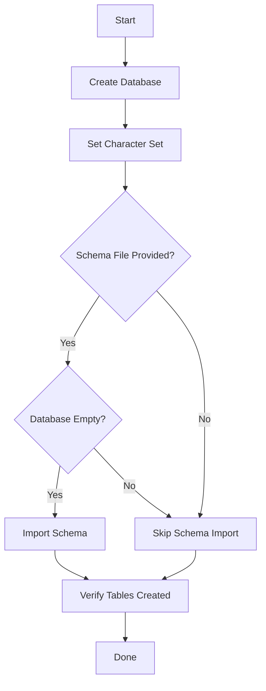

# How to Use Ansible to Create MySQL Databases

Author: [nawazdhandala](https://www.github.com/nawazdhandala)

Tags: Ansible, MySQL, Database Management, Automation

Description: Automate MySQL database creation with Ansible including character sets, collation, schema imports, and multi-environment management.

---

Creating MySQL databases is one of those tasks that seems trivial until you have to do it across multiple servers and environments with consistent settings. Character set mismatches between development and production, missing databases on newly provisioned servers, forgotten schema imports: these problems disappear when you automate database creation with Ansible.

This post covers creating MySQL databases with Ansible, setting character encoding and collation, importing schemas, and managing databases across environments.

## Prerequisites

Install the MySQL community collection.

```bash
# Install the community MySQL collection
ansible-galaxy collection install community.mysql
pip install PyMySQL
```

## Creating a Single Database

The simplest database creation looks like this.

```yaml
# playbooks/create-mysql-database.yml
# Create a MySQL database with UTF-8 support
---
- name: Create MySQL database
  hosts: databases
  become: true

  tasks:
    - name: Create application database
      community.mysql.mysql_db:
        name: myapp
        encoding: utf8mb4
        collation: utf8mb4_unicode_ci
        state: present
        login_unix_socket: /var/run/mysqld/mysqld.sock
```

Using `utf8mb4` instead of `utf8` is important. MySQL's `utf8` encoding only supports 3-byte characters, which means emojis and some international characters will cause errors. `utf8mb4` is true UTF-8 with full 4-byte support.

## Creating Multiple Databases

Define databases as a list and loop through them.

```yaml
# playbooks/create-mysql-databases.yml
# Create multiple MySQL databases from a variable list
---
- name: Create MySQL databases
  hosts: databases
  become: true
  vars:
    mysql_databases:
      - name: myapp_production
        encoding: utf8mb4
        collation: utf8mb4_unicode_ci
      - name: myapp_sessions
        encoding: utf8mb4
        collation: utf8mb4_unicode_ci
      - name: myapp_analytics
        encoding: utf8mb4
        collation: utf8mb4_unicode_ci
      - name: myapp_audit
        encoding: utf8mb4
        collation: utf8mb4_unicode_ci

  tasks:
    - name: Create databases
      community.mysql.mysql_db:
        name: "{{ item.name }}"
        encoding: "{{ item.encoding | default('utf8mb4') }}"
        collation: "{{ item.collation | default('utf8mb4_unicode_ci') }}"
        state: present
        login_unix_socket: /var/run/mysqld/mysqld.sock
      loop: "{{ mysql_databases }}"
```

## Importing Schema on Database Creation

After creating the database, you often need to load an initial schema.

```yaml
# Import schema into a newly created database
- name: Check if schema has been applied
  community.mysql.mysql_query:
    login_db: myapp_production
    query: "SHOW TABLES LIKE 'users'"
    login_unix_socket: /var/run/mysqld/mysqld.sock
  register: tables_check

- name: Copy schema file to server
  copy:
    src: files/schema.sql
    dest: /tmp/schema.sql
    mode: '0644'
  when: tables_check.query_result[0] | length == 0

- name: Import schema
  community.mysql.mysql_db:
    name: myapp_production
    state: import
    target: /tmp/schema.sql
    login_unix_socket: /var/run/mysqld/mysqld.sock
  when: tables_check.query_result[0] | length == 0

- name: Clean up schema file
  file:
    path: /tmp/schema.sql
    state: absent
```

Here is a sample schema file.

```sql
-- files/schema.sql
-- Application database schema

CREATE TABLE IF NOT EXISTS users (
    id BIGINT UNSIGNED AUTO_INCREMENT PRIMARY KEY,
    email VARCHAR(255) NOT NULL UNIQUE,
    name VARCHAR(255) NOT NULL,
    password_hash VARCHAR(255) NOT NULL,
    created_at TIMESTAMP DEFAULT CURRENT_TIMESTAMP,
    updated_at TIMESTAMP DEFAULT CURRENT_TIMESTAMP ON UPDATE CURRENT_TIMESTAMP,
    INDEX idx_email (email)
) ENGINE=InnoDB DEFAULT CHARSET=utf8mb4 COLLATE=utf8mb4_unicode_ci;

CREATE TABLE IF NOT EXISTS sessions (
    id CHAR(36) PRIMARY KEY,
    user_id BIGINT UNSIGNED NOT NULL,
    token VARCHAR(512) NOT NULL,
    expires_at TIMESTAMP NOT NULL,
    created_at TIMESTAMP DEFAULT CURRENT_TIMESTAMP,
    FOREIGN KEY (user_id) REFERENCES users(id) ON DELETE CASCADE,
    INDEX idx_user_id (user_id),
    INDEX idx_token (token(255))
) ENGINE=InnoDB DEFAULT CHARSET=utf8mb4 COLLATE=utf8mb4_unicode_ci;

CREATE TABLE IF NOT EXISTS audit_log (
    id BIGINT UNSIGNED AUTO_INCREMENT PRIMARY KEY,
    user_id BIGINT UNSIGNED,
    action VARCHAR(100) NOT NULL,
    resource_type VARCHAR(100) NOT NULL,
    resource_id VARCHAR(255),
    details JSON,
    created_at TIMESTAMP DEFAULT CURRENT_TIMESTAMP,
    INDEX idx_user_action (user_id, action),
    INDEX idx_created_at (created_at)
) ENGINE=InnoDB DEFAULT CHARSET=utf8mb4 COLLATE=utf8mb4_unicode_ci;
```

## Environment-Specific Database Configuration

Use inventory variables to define different databases per environment.

```yaml
# inventory/staging/group_vars/databases.yml
# Staging databases
mysql_databases:
  - name: myapp_staging
    encoding: utf8mb4
    collation: utf8mb4_unicode_ci

# inventory/production/group_vars/databases.yml
# Production databases
mysql_databases:
  - name: myapp_production
    encoding: utf8mb4
    collation: utf8mb4_unicode_ci
  - name: myapp_analytics
    encoding: utf8mb4
    collation: utf8mb4_unicode_ci
```

## Database Creation Role

Wrap everything in a reusable role.

```yaml
# roles/mysql_databases/tasks/main.yml
# Create databases, import schemas, and verify
---
- name: Create MySQL databases
  community.mysql.mysql_db:
    name: "{{ item.name }}"
    encoding: "{{ item.encoding | default('utf8mb4') }}"
    collation: "{{ item.collation | default('utf8mb4_unicode_ci') }}"
    state: present
    login_unix_socket: "{{ mysql_socket }}"
  loop: "{{ mysql_databases }}"

- name: Check if initial schema is needed
  community.mysql.mysql_query:
    login_db: "{{ item.name }}"
    query: "SELECT COUNT(*) as table_count FROM information_schema.tables WHERE table_schema = '{{ item.name }}'"
    login_unix_socket: "{{ mysql_socket }}"
  register: schema_check
  loop: "{{ mysql_databases }}"

- name: Import schema for empty databases
  community.mysql.mysql_db:
    name: "{{ item.item.name }}"
    state: import
    target: "{{ item.item.schema_file }}"
    login_unix_socket: "{{ mysql_socket }}"
  loop: "{{ schema_check.results }}"
  when:
    - item.item.schema_file is defined
    - item.query_result[0][0].table_count | int == 0
```

## Database Creation Flow



## Dumping and Restoring Databases

Ansible can also manage database dumps for backups or migrations.

```yaml
# Dump a database to a file
- name: Create database backup
  community.mysql.mysql_db:
    name: myapp_production
    state: dump
    target: "/backups/myapp_production_{{ ansible_date_time.date }}.sql.gz"
    login_unix_socket: /var/run/mysqld/mysqld.sock
    dump_extra_args: "--single-transaction --routines --triggers"

# Restore from a dump file
- name: Restore database from backup
  community.mysql.mysql_db:
    name: myapp_production
    state: import
    target: "/backups/myapp_production_2026-02-20.sql.gz"
    login_unix_socket: /var/run/mysqld/mysqld.sock
```

## Safely Dropping Databases

Include safety checks before dropping any database.

```yaml
# Drop a database with environment safety check
- name: Verify we are not on production
  assert:
    that:
      - env_name != 'production'
    fail_msg: "Refusing to drop databases on production"

- name: Drop test database
  community.mysql.mysql_db:
    name: myapp_test
    state: absent
    login_unix_socket: /var/run/mysqld/mysqld.sock
```

## Running the Playbook

```bash
# Create databases on staging
ansible-playbook playbooks/create-mysql-databases.yml \
  -i inventory/staging/

# Create databases on production
ansible-playbook playbooks/create-mysql-databases.yml \
  -i inventory/production/
```

## Verifying Database Creation

```yaml
# Verify databases were created correctly
- name: List all databases
  community.mysql.mysql_query:
    query: "SHOW DATABASES"
    login_unix_socket: /var/run/mysqld/mysqld.sock
  register: db_list

- name: Verify expected databases exist
  assert:
    that:
      - "'{{ item.name }}' in (db_list.query_result[0] | map(attribute='Database') | list)"
    fail_msg: "Database {{ item.name }} was not created"
  loop: "{{ mysql_databases }}"

- name: Check character set for each database
  community.mysql.mysql_query:
    query: >
      SELECT default_character_set_name, default_collation_name
      FROM information_schema.schemata
      WHERE schema_name = '{{ item.name }}'
    login_unix_socket: /var/run/mysqld/mysqld.sock
  register: charset_check
  loop: "{{ mysql_databases }}"
```

## Conclusion

Creating MySQL databases with Ansible gives you consistent, repeatable database provisioning across all your environments. Define your databases in inventory variables, use the `community.mysql.mysql_db` module for creation and schema imports, and always include verification tasks. The idempotent nature means running the playbook on a server that already has the databases is safe and produces no changes. Combine database creation with user and permission management for a complete MySQL provisioning pipeline.
