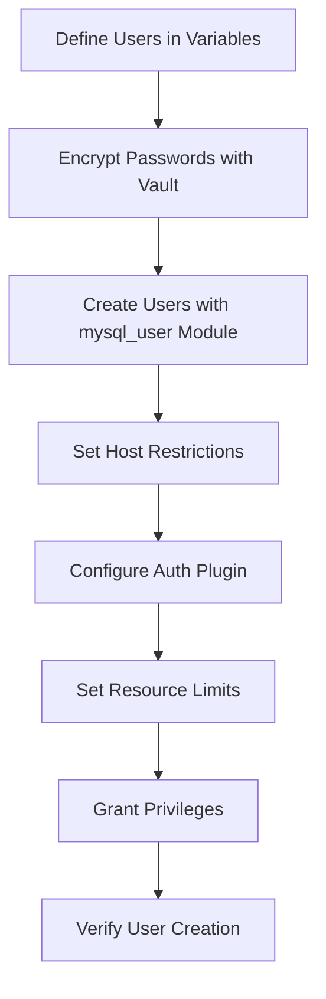

# How to Use Ansible to Create MySQL Users

Author: [nawazdhandala](https://www.github.com/nawazdhandala)

Tags: Ansible, MySQL, User Management, Database Security

Description: Automate MySQL user creation with Ansible including password management, host restrictions, and authentication plugin configuration.

---

MySQL user management is one of those things that is easy to mess up when done manually. You might forget to restrict a user to specific hosts, use weak authentication plugins, or create users with passwords that differ between servers. Ansible eliminates these problems by defining users as code, making creation repeatable and auditable.

This post covers creating MySQL users with Ansible, managing passwords securely, configuring host restrictions, and handling the differences between MySQL 5.7 and 8.0 authentication.

## Prerequisites

```bash
# Install the required Ansible collection and Python library
ansible-galaxy collection install community.mysql
pip install PyMySQL
```

## Creating a Basic User

```yaml
# playbooks/create-mysql-users.yml
# Create a basic MySQL user with a password
---
- name: Create MySQL users
  hosts: databases
  become: true

  tasks:
    - name: Create application user
      community.mysql.mysql_user:
        name: myapp_user
        password: "{{ vault_myapp_user_password }}"
        host: "%"
        state: present
        login_unix_socket: /var/run/mysqld/mysqld.sock
      no_log: true
```

The `host: "%"` allows the user to connect from any host. In production, you should restrict this to specific IP addresses or subnets.

## Creating Multiple Users with Different Access Levels

Most applications need several users with different levels of access.

```yaml
# playbooks/create-mysql-users.yml
# Create multiple users for different purposes
---
- name: Create MySQL users
  hosts: databases
  become: true
  vars:
    mysql_users:
      - name: myapp_admin
        password: "{{ vault_myapp_admin_password }}"
        host: "10.0.1.%"
        priv: "*.*:ALL,GRANT"
      - name: myapp_user
        password: "{{ vault_myapp_user_password }}"
        host: "10.0.1.%"
        priv: "myapp_production.*:SELECT,INSERT,UPDATE,DELETE"
      - name: myapp_readonly
        password: "{{ vault_myapp_readonly_password }}"
        host: "10.0.%"
        priv: "myapp_production.*:SELECT"
      - name: myapp_backup
        password: "{{ vault_myapp_backup_password }}"
        host: "localhost"
        priv: "*.*:SELECT,LOCK TABLES,SHOW VIEW,EVENT,TRIGGER,RELOAD"
      - name: myapp_monitoring
        password: "{{ vault_myapp_monitoring_password }}"
        host: "10.0.3.%"
        priv: "*.*:PROCESS,REPLICATION CLIENT,SELECT"

  tasks:
    - name: Create MySQL users
      community.mysql.mysql_user:
        name: "{{ item.name }}"
        password: "{{ item.password }}"
        host: "{{ item.host }}"
        priv: "{{ item.priv }}"
        state: present
        login_unix_socket: /var/run/mysqld/mysqld.sock
      loop: "{{ mysql_users }}"
      no_log: true
```

## Host Restriction Patterns

MySQL uses host patterns to control where connections can come from. Here are common patterns.

```yaml
# Different host restriction examples
mysql_users:
  # Allow from any host (not recommended for production)
  - name: dev_user
    host: "%"

  # Allow from specific IP only
  - name: app_user
    host: "10.0.1.50"

  # Allow from a subnet
  - name: internal_user
    host: "10.0.1.%"

  # Allow only from localhost
  - name: backup_user
    host: "localhost"

  # Allow from specific domain
  - name: office_user
    host: "%.mycompany.com"
```

## Multiple Hosts for the Same User

If a user needs to connect from multiple hosts, create separate entries.

```yaml
# Create the same user for multiple source hosts
- name: Create app user for web servers
  community.mysql.mysql_user:
    name: myapp_user
    password: "{{ vault_myapp_user_password }}"
    host: "{{ item }}"
    priv: "myapp_production.*:SELECT,INSERT,UPDATE,DELETE"
    state: present
    login_unix_socket: /var/run/mysqld/mysqld.sock
  loop:
    - "10.0.1.10"
    - "10.0.1.11"
    - "10.0.1.12"
    - "10.0.1.13"
  no_log: true
```

## MySQL 8.0 Authentication Plugins

MySQL 8.0 changed the default authentication plugin to `caching_sha2_password`. Some applications still require the older `mysql_native_password` plugin. Here is how to handle this.

```yaml
# Create user with specific authentication plugin
- name: Create user with mysql_native_password (for legacy app compatibility)
  community.mysql.mysql_user:
    name: legacy_app_user
    password: "{{ vault_legacy_password }}"
    host: "10.0.1.%"
    priv: "legacy_db.*:SELECT,INSERT,UPDATE,DELETE"
    plugin: mysql_native_password
    state: present
    login_unix_socket: /var/run/mysqld/mysqld.sock
  no_log: true

# Create user with caching_sha2_password (MySQL 8.0 default)
- name: Create user with caching_sha2_password
  community.mysql.mysql_user:
    name: modern_app_user
    password: "{{ vault_modern_password }}"
    host: "10.0.1.%"
    priv: "myapp_production.*:SELECT,INSERT,UPDATE,DELETE"
    plugin: caching_sha2_password
    state: present
    login_unix_socket: /var/run/mysqld/mysqld.sock
  no_log: true
```

## Storing Passwords in Ansible Vault

Never put passwords in plain text. Use Ansible Vault.

```bash
# Create encrypted vault file for database passwords
ansible-vault create group_vars/databases/vault.yml
```

```yaml
# group_vars/databases/vault.yml (encrypted content)
vault_myapp_admin_password: "Str0ng@dminP@ss!"
vault_myapp_user_password: "AppUs3rS3cure#"
vault_myapp_readonly_password: "R3adOnlyP@ss99"
vault_myapp_backup_password: "B@ckupS3cret!"
vault_myapp_monitoring_password: "M0n1torP@ss!"
```

## User Creation Role

```yaml
# roles/mysql_users/tasks/main.yml
# Reusable role for MySQL user management
---
- name: Create MySQL users
  community.mysql.mysql_user:
    name: "{{ item.name }}"
    password: "{{ item.password }}"
    host: "{{ item.host | default('%') }}"
    priv: "{{ item.priv | default(omit) }}"
    plugin: "{{ item.plugin | default(omit) }}"
    resource_limits: "{{ item.resource_limits | default(omit) }}"
    state: "{{ item.state | default('present') }}"
    login_unix_socket: "{{ mysql_socket }}"
  loop: "{{ mysql_users }}"
  no_log: true

- name: Verify users were created
  community.mysql.mysql_query:
    query: "SELECT user, host, plugin FROM mysql.user WHERE user = %s"
    positional_args:
      - "{{ item.name }}"
    login_unix_socket: "{{ mysql_socket }}"
  register: user_check
  loop: "{{ mysql_users }}"
  changed_when: false
```

## Setting Resource Limits

MySQL lets you limit resources per user to prevent any single user from consuming too many connections or queries.

```yaml
# Create user with resource limits
- name: Create user with resource restrictions
  community.mysql.mysql_user:
    name: reporting_user
    password: "{{ vault_reporting_password }}"
    host: "10.0.%"
    priv: "myapp_production.*:SELECT"
    resource_limits:
      MAX_QUERIES_PER_HOUR: 10000
      MAX_CONNECTIONS_PER_HOUR: 100
      MAX_USER_CONNECTIONS: 5
    state: present
    login_unix_socket: /var/run/mysqld/mysqld.sock
  no_log: true
```

## User Management Flow



## Password Rotation

```yaml
# playbooks/rotate-mysql-passwords.yml
# Rotate MySQL user passwords
---
- name: Rotate MySQL passwords
  hosts: databases
  become: true

  tasks:
    - name: Update user password
      community.mysql.mysql_user:
        name: myapp_user
        password: "{{ new_myapp_user_password }}"
        host: "10.0.1.%"
        state: present
        login_unix_socket: /var/run/mysqld/mysqld.sock
      no_log: true

    - name: Verify new password works
      community.mysql.mysql_query:
        query: "SELECT 1"
        login_user: myapp_user
        login_password: "{{ new_myapp_user_password }}"
        login_host: "127.0.0.1"
      register: auth_test
      no_log: true

    - name: Confirm authentication
      assert:
        that: auth_test.query_result | length > 0
        fail_msg: "Password rotation failed for myapp_user"
```

## Removing Users

```yaml
# Remove a MySQL user safely
- name: Remove decommissioned user
  community.mysql.mysql_user:
    name: old_user
    host: "%"
    state: absent
    login_unix_socket: /var/run/mysqld/mysqld.sock
```

## Running the Playbook

```bash
# Create users on all database servers
ansible-playbook playbooks/create-mysql-users.yml \
  -i inventory/production/ \
  --ask-vault-pass

# Check mode to preview changes
ansible-playbook playbooks/create-mysql-users.yml \
  -i inventory/production/ \
  --ask-vault-pass \
  --check
```

## Conclusion

Automating MySQL user creation with Ansible ensures consistent user accounts across all your database servers. Define users in variables, encrypt passwords with Ansible Vault, and use the `community.mysql.mysql_user` module for idempotent creation. The combination of host restrictions, authentication plugins, and resource limits gives you fine-grained control over who can connect and what they can do. The `no_log: true` directive keeps sensitive information out of your CI/CD logs. With users defined as code, you have a full audit trail of every access change.
