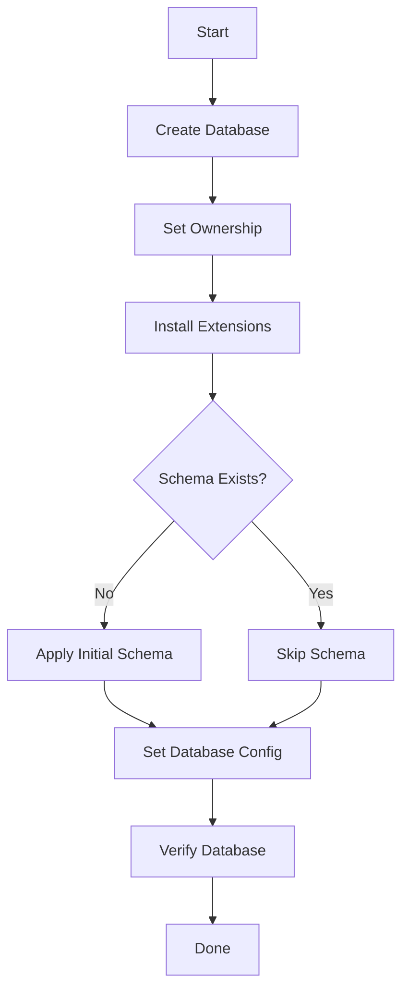

# How to Use Ansible to Create PostgreSQL Databases

Author: [nawazdhandala](https://www.github.com/nawazdhandala)

Tags: Ansible, PostgreSQL, Database Management, Automation

Description: Automate PostgreSQL database creation with Ansible including encoding, templates, extensions, and schema management.

---

Creating databases in PostgreSQL by hand works fine for a single server. But when you manage multiple environments (dev, staging, production) across several servers, you want every database created the same way, every time. Ansible's `community.postgresql.postgresql_db` module makes this repeatable and idempotent. Run the playbook once or ten times, and the result is the same.

This post shows you how to create PostgreSQL databases with Ansible, including setting encoding, installing extensions, applying schemas, and managing databases across multiple environments.

## Prerequisites

You need the PostgreSQL community collection and the `psycopg2` Python library on the managed hosts.

```bash
# Install the PostgreSQL Ansible collection
ansible-galaxy collection install community.postgresql
```

```yaml
# Ensure psycopg2 is installed on the target servers
- name: Install psycopg2
  apt:
    name: python3-psycopg2
    state: present
  when: ansible_os_family == "Debian"
```

## Creating a Simple Database

The most basic database creation looks like this.

```yaml
# playbooks/create-database.yml
# Create a PostgreSQL database with basic settings
---
- name: Create PostgreSQL database
  hosts: databases
  become: true
  become_user: postgres

  tasks:
    - name: Create the application database
      community.postgresql.postgresql_db:
        name: myapp
        encoding: UTF-8
        lc_collate: en_US.UTF-8
        lc_ctype: en_US.UTF-8
        template: template0
        state: present
```

The `template: template0` setting is important when specifying non-default encoding or locale settings. PostgreSQL uses `template1` by default, which might have a different encoding.

## Creating Multiple Databases

Most projects need more than one database. Define them as a list and loop.

```yaml
# playbooks/create-databases.yml
# Create multiple databases from a variable list
---
- name: Create application databases
  hosts: databases
  become: true
  become_user: postgres
  vars:
    postgresql_databases:
      - name: myapp_production
        owner: myapp_user
        encoding: UTF-8
        extensions:
          - uuid-ossp
          - pgcrypto
          - pg_trgm
      - name: myapp_analytics
        owner: analytics_user
        encoding: UTF-8
        extensions:
          - pg_stat_statements
          - btree_gist
      - name: myapp_audit
        owner: audit_user
        encoding: UTF-8
        extensions:
          - pgcrypto

  tasks:
    - name: Create databases
      community.postgresql.postgresql_db:
        name: "{{ item.name }}"
        owner: "{{ item.owner | default('postgres') }}"
        encoding: "{{ item.encoding | default('UTF-8') }}"
        lc_collate: "en_US.UTF-8"
        lc_ctype: "en_US.UTF-8"
        template: template0
        state: present
      loop: "{{ postgresql_databases }}"

    - name: Install extensions for each database
      community.postgresql.postgresql_ext:
        name: "{{ item.1 }}"
        db: "{{ item.0.name }}"
        state: present
      loop: "{{ postgresql_databases | subelements('extensions', skip_missing=True) }}"
```

## Installing PostgreSQL Extensions

Extensions add powerful features to your databases. Here is how to manage them.

```yaml
# Install common PostgreSQL extensions on a database
- name: Install database extensions
  community.postgresql.postgresql_ext:
    name: "{{ item }}"
    db: myapp_production
    state: present
  loop:
    - uuid-ossp        # UUID generation functions
    - pgcrypto         # Cryptographic functions
    - pg_trgm          # Trigram matching for fuzzy search
    - hstore           # Key-value store
    - pg_stat_statements  # Query performance statistics
  become: true
  become_user: postgres
```

## Setting Database-Level Configuration

Some settings are per-database rather than global.

```yaml
# Set database-specific configuration parameters
- name: Configure database settings
  community.postgresql.postgresql_set:
    name: "{{ item.name }}"
    value: "{{ item.value }}"
    db: myapp_production
  loop:
    - { name: "log_statement", value: "all" }
    - { name: "statement_timeout", value: "30000" }
  become: true
  become_user: postgres
```

## Applying Database Schema

After creating the database, you often need to apply an initial schema.

```yaml
# Apply initial database schema from a SQL file
- name: Copy schema file to server
  copy:
    src: files/schema.sql
    dest: /tmp/schema.sql
    owner: postgres
    mode: '0644'

- name: Check if schema has been applied
  community.postgresql.postgresql_query:
    db: myapp_production
    query: "SELECT EXISTS (SELECT FROM information_schema.tables WHERE table_name = 'users');"
  register: schema_check
  become: true
  become_user: postgres

- name: Apply database schema
  community.postgresql.postgresql_query:
    db: myapp_production
    path_to_script: /tmp/schema.sql
  when: not schema_check.query_result[0].exists
  become: true
  become_user: postgres

- name: Clean up schema file
  file:
    path: /tmp/schema.sql
    state: absent
```

Here is an example schema file.

```sql
-- files/schema.sql
-- Initial database schema for the application

CREATE TABLE IF NOT EXISTS users (
    id UUID PRIMARY KEY DEFAULT gen_random_uuid(),
    email VARCHAR(255) UNIQUE NOT NULL,
    name VARCHAR(255) NOT NULL,
    created_at TIMESTAMP WITH TIME ZONE DEFAULT CURRENT_TIMESTAMP,
    updated_at TIMESTAMP WITH TIME ZONE DEFAULT CURRENT_TIMESTAMP
);

CREATE TABLE IF NOT EXISTS sessions (
    id UUID PRIMARY KEY DEFAULT gen_random_uuid(),
    user_id UUID REFERENCES users(id) ON DELETE CASCADE,
    token VARCHAR(512) NOT NULL,
    expires_at TIMESTAMP WITH TIME ZONE NOT NULL,
    created_at TIMESTAMP WITH TIME ZONE DEFAULT CURRENT_TIMESTAMP
);

CREATE INDEX IF NOT EXISTS idx_sessions_user_id ON sessions(user_id);
CREATE INDEX IF NOT EXISTS idx_sessions_token ON sessions(token);
CREATE INDEX IF NOT EXISTS idx_users_email ON users(email);
```

## Environment-Specific Database Names

Use inventory variables to create different database names per environment.

```yaml
# inventory/staging/group_vars/databases.yml
# Staging database definitions
postgresql_databases:
  - name: myapp_staging
    owner: myapp_staging_user
    extensions:
      - uuid-ossp
      - pgcrypto
```

```yaml
# inventory/production/group_vars/databases.yml
# Production database definitions
postgresql_databases:
  - name: myapp_production
    owner: myapp_prod_user
    extensions:
      - uuid-ossp
      - pgcrypto
      - pg_stat_statements
```

## Database Creation Workflow



## Checking Database Existence Before Creation

The `postgresql_db` module is idempotent, so it will not recreate an existing database. But if you want to check explicitly, you can.

```yaml
# Check if a database exists before performing operations
- name: Check if database exists
  community.postgresql.postgresql_info:
    filter: databases
  register: pg_info
  become: true
  become_user: postgres

- name: Display existing databases
  debug:
    msg: "Existing databases: {{ pg_info.databases.keys() | list }}"

- name: Create database only if it does not exist
  community.postgresql.postgresql_db:
    name: myapp_production
    state: present
  when: "'myapp_production' not in pg_info.databases"
  become: true
  become_user: postgres
```

## Dropping Databases Safely

Be very careful with database deletion. Always include safety checks.

```yaml
# Drop a database with safety checks
- name: Verify we are NOT on production
  assert:
    that:
      - env_name != 'production'
    fail_msg: "Cannot drop databases on production servers"

- name: Drop the test database
  community.postgresql.postgresql_db:
    name: myapp_test
    state: absent
  become: true
  become_user: postgres
```

## Running the Playbook

```bash
# Create databases in staging
ansible-playbook playbooks/create-databases.yml \
  -i inventory/staging/

# Preview changes in production (check mode)
ansible-playbook playbooks/create-databases.yml \
  -i inventory/production/ \
  --check
```

## Conclusion

Creating PostgreSQL databases with Ansible is straightforward with the `community.postgresql` collection. Define your databases as a list of dictionaries, loop through them, install the extensions each one needs, and apply schemas as needed. The idempotent nature of Ansible means running the playbook multiple times is safe, and using inventory variables lets you maintain environment-specific database configurations without duplicating playbook code.
