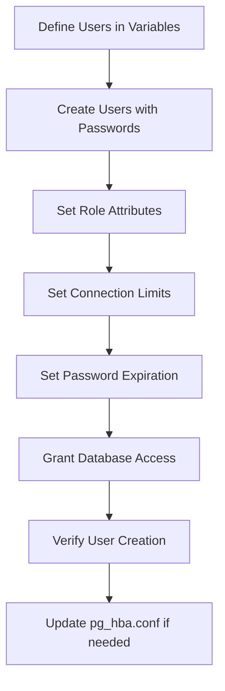

# How to Use Ansible to Create PostgreSQL Users

Author: [nawazdhandala](https://www.github.com/nawazdhandala)

Tags: Ansible, PostgreSQL, User Management, Security

Description: Automate PostgreSQL user and role creation with Ansible including password management, privileges, and connection limits.

---

Managing database users manually across multiple servers is tedious and error-prone. Forgetting to create a user on one server, or setting different passwords across environments, leads to application failures that are frustrating to debug. Ansible automates this with the `community.postgresql.postgresql_user` module, which creates users, sets passwords, assigns roles, and manages connection limits idempotently.

This post covers creating PostgreSQL users with Ansible, handling passwords securely, setting up application and read-only users, and managing user lifecycle across environments.

## Prerequisites

Make sure you have the PostgreSQL community collection installed.

```bash
# Install the PostgreSQL collection
ansible-galaxy collection install community.postgresql
```

## Creating a Basic User

Here is the simplest way to create a PostgreSQL user.

```yaml
# playbooks/create-pg-users.yml
# Create basic PostgreSQL users
---
- name: Create PostgreSQL users
  hosts: databases
  become: true
  become_user: postgres

  tasks:
    - name: Create application user
      community.postgresql.postgresql_user:
        name: myapp_user
        password: "{{ vault_myapp_db_password }}"
        state: present
```

The password should come from Ansible Vault or an external secrets manager. Never hardcode passwords in your playbooks.

## Creating Multiple Users with Different Privileges

Real applications need multiple users: an application user for reads and writes, a read-only user for reporting, and an admin user for migrations.

```yaml
# playbooks/create-pg-users.yml
# Create multiple users with specific attributes and privileges
---
- name: Create PostgreSQL users
  hosts: databases
  become: true
  become_user: postgres
  vars:
    postgresql_users:
      - name: myapp_admin
        password: "{{ vault_myapp_admin_password }}"
        role_attr_flags: CREATEDB,CREATEROLE
        connection_limit: 5
        comment: "Admin user for database migrations"
      - name: myapp_user
        password: "{{ vault_myapp_user_password }}"
        role_attr_flags: NOSUPERUSER,NOCREATEDB
        connection_limit: 50
        comment: "Application read/write user"
      - name: myapp_readonly
        password: "{{ vault_myapp_readonly_password }}"
        role_attr_flags: NOSUPERUSER,NOCREATEDB,NOCREATEROLE
        connection_limit: 20
        comment: "Read-only user for reporting"
      - name: myapp_backup
        password: "{{ vault_myapp_backup_password }}"
        role_attr_flags: NOSUPERUSER,NOCREATEDB
        connection_limit: 2
        comment: "Backup user for pg_dump"

  tasks:
    - name: Create PostgreSQL users
      community.postgresql.postgresql_user:
        name: "{{ item.name }}"
        password: "{{ item.password }}"
        role_attr_flags: "{{ item.role_attr_flags | default('NOSUPERUSER') }}"
        conn_limit: "{{ item.connection_limit | default(-1) }}"
        comment: "{{ item.comment | default('') }}"
        state: present
      loop: "{{ postgresql_users }}"
      no_log: true
```

The `no_log: true` directive prevents passwords from appearing in Ansible output.

## Managing Passwords Securely

Store passwords in Ansible Vault.

```bash
# Create an encrypted variables file for database passwords
ansible-vault create group_vars/databases/vault.yml
```

```yaml
# group_vars/databases/vault.yml (encrypted)
# Database user passwords - encrypted with ansible-vault
vault_myapp_admin_password: "s3cureAdm1nP@ss"
vault_myapp_user_password: "appUs3rP@ssw0rd"
vault_myapp_readonly_password: "r3adOnlyP@ss"
vault_myapp_backup_password: "b@ckupP@ssw0rd"
```

Reference the vault variables in your regular variables.

```yaml
# group_vars/databases/main.yml
# Reference encrypted passwords from vault
myapp_admin_password: "{{ vault_myapp_admin_password }}"
myapp_user_password: "{{ vault_myapp_user_password }}"
```

## Setting User Attributes

PostgreSQL has several role attributes you can control.

```yaml
# Create a user with specific role attributes
- name: Create superuser for emergencies
  community.postgresql.postgresql_user:
    name: emergency_admin
    password: "{{ vault_emergency_admin_password }}"
    role_attr_flags: SUPERUSER,CREATEDB,CREATEROLE,LOGIN
    expires: "2026-03-01T00:00:00+00:00"
    conn_limit: 1
    state: present
  no_log: true
```

Available role attributes include:
- `SUPERUSER` / `NOSUPERUSER`
- `CREATEDB` / `NOCREATEDB`
- `CREATEROLE` / `NOCREATEROLE`
- `LOGIN` / `NOLOGIN`
- `REPLICATION` / `NOREPLICATION`

## Password Expiration

You can set passwords to expire after a certain date.

```yaml
# Create user with password expiration
- name: Create temporary contractor user
  community.postgresql.postgresql_user:
    name: contractor_jane
    password: "{{ vault_contractor_password }}"
    expires: "2026-06-30T23:59:59+00:00"
    role_attr_flags: NOSUPERUSER,NOCREATEDB
    state: present
  no_log: true
```

## Granting Database Access

After creating users, grant them access to specific databases.

```yaml
# Grant database ownership and access
- name: Set database owner
  community.postgresql.postgresql_db:
    name: myapp_production
    owner: myapp_admin
    state: present

- name: Grant connect privilege to application user
  community.postgresql.postgresql_privs:
    database: myapp_production
    type: database
    roles: myapp_user
    privs: CONNECT
    state: present

- name: Grant connect privilege to read-only user
  community.postgresql.postgresql_privs:
    database: myapp_production
    type: database
    roles: myapp_readonly
    privs: CONNECT
    state: present
```

## Creating a Complete User Management Role

```yaml
# roles/postgresql_users/tasks/main.yml
# Full user management role with creation, privileges, and validation
---
- name: Create PostgreSQL users
  community.postgresql.postgresql_user:
    name: "{{ item.name }}"
    password: "{{ item.password }}"
    role_attr_flags: "{{ item.role_attr_flags | default('NOSUPERUSER,NOCREATEDB') }}"
    conn_limit: "{{ item.conn_limit | default(-1) }}"
    expires: "{{ item.expires | default(omit) }}"
    state: present
  loop: "{{ postgresql_users }}"
  no_log: true
  become: true
  become_user: postgres

- name: Grant database access to users
  community.postgresql.postgresql_privs:
    database: "{{ item.0.database }}"
    type: database
    roles: "{{ item.0.name }}"
    privs: CONNECT
    state: present
  loop: "{{ postgresql_users | selectattr('database', 'defined') | list }}"
  become: true
  become_user: postgres

- name: Verify user creation
  community.postgresql.postgresql_query:
    query: "SELECT usename, valuntil, usesuper, usecreatedb FROM pg_user WHERE usename = %s"
    positional_args:
      - "{{ item.name }}"
  register: user_info
  loop: "{{ postgresql_users }}"
  become: true
  become_user: postgres
  changed_when: false

- name: Display user information
  debug:
    msg: "User {{ item.item.name }}: {{ item.query_result }}"
  loop: "{{ user_info.results }}"
  when: item.query_result | length > 0
```

## User Management Flow



## Rotating Passwords

Password rotation is a security best practice. Here is how to rotate passwords with Ansible.

```yaml
# playbooks/rotate-passwords.yml
# Rotate database user passwords
---
- name: Rotate PostgreSQL passwords
  hosts: databases
  become: true
  become_user: postgres

  tasks:
    - name: Update user password
      community.postgresql.postgresql_user:
        name: myapp_user
        password: "{{ new_myapp_user_password }}"
        state: present
      no_log: true

    - name: Verify new password works
      community.postgresql.postgresql_query:
        db: myapp_production
        login_user: myapp_user
        login_password: "{{ new_myapp_user_password }}"
        login_host: "127.0.0.1"
        query: "SELECT 1"
      register: auth_test
      no_log: true

    - name: Confirm authentication succeeded
      assert:
        that: auth_test.query_result | length > 0
        fail_msg: "Password rotation failed - new password does not work"
```

## Removing Users Safely

```yaml
# Remove a PostgreSQL user with reassignment of owned objects
- name: Reassign owned objects before dropping user
  community.postgresql.postgresql_owner:
    db: myapp_production
    new_owner: myapp_admin
    reassign_owned_by: old_user
  become: true
  become_user: postgres

- name: Drop the old user
  community.postgresql.postgresql_user:
    name: old_user
    state: absent
  become: true
  become_user: postgres
```

## Conclusion

Ansible makes PostgreSQL user management consistent and repeatable. Define your users in variables, store passwords in Ansible Vault, and let the `community.postgresql.postgresql_user` module handle the creation and updates. The `no_log` directive keeps passwords out of your CI/CD logs, and the idempotent nature means you can safely run the playbook repeatedly without side effects. Combine user creation with privilege management (covered in the next post) for a complete database access control pipeline.
