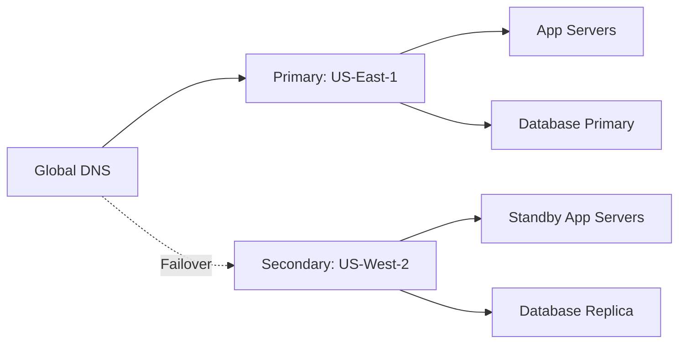

# How to Use Ansible for Cross-Region Failover Automation

Author: [nawazdhandala](https://www.github.com/nawazdhandala)

Tags: Ansible, Failover, Disaster Recovery, High Availability

Description: Automate cross-region failover procedures with Ansible to quickly switch traffic and services between regions during outages.

---

When an entire cloud region goes down, your failover procedure needs to be fast and reliable. Manual failover during a crisis is error-prone because people are stressed and rushing. Ansible can automate the entire failover process so it runs in minutes instead of hours.

This post covers building cross-region failover automation with Ansible.

## Failover Architecture



## Pre-Failover Health Checks

```yaml
# playbooks/failover-to-secondary.yml
# Automated cross-region failover
---
- name: Pre-failover validation
  hosts: localhost
  connection: local
  tasks:
    - name: Verify primary region is actually down
      ansible.builtin.uri:
        url: "https://{{ primary_region_endpoint }}/health"
        timeout: 10
        status_code: 200
      register: primary_health
      ignore_errors: true
      retries: 3
      delay: 10

    - name: Confirm primary is unreachable
      ansible.builtin.assert:
        that:
          - primary_health is failed or primary_health.status != 200
        fail_msg: "Primary region appears healthy. Aborting failover."
        success_msg: "Primary region confirmed down. Proceeding with failover."

    - name: Verify secondary region is healthy
      ansible.builtin.uri:
        url: "https://{{ secondary_region_endpoint }}/health"
        status_code: 200
      register: secondary_health

    - name: Notify team of failover start
      community.general.slack:
        token: "{{ slack_token }}"
        channel: "#incidents"
        msg: "FAILOVER INITIATED: Switching from {{ primary_region }} to {{ secondary_region }}"

- name: Promote database replica
  hosts: db_secondary
  become: true
  tasks:
    - name: Promote PostgreSQL replica to primary
      ansible.builtin.command:
        cmd: pg_ctlcluster 15 main promote
      changed_when: true

    - name: Wait for promotion to complete
      community.postgresql.postgresql_query:
        db: "{{ db_name }}"
        query: "SELECT pg_is_in_recovery();"
      register: recovery_status
      retries: 30
      delay: 5
      until: not recovery_status.query_result[0].pg_is_in_recovery

    - name: Verify database is accepting writes
      community.postgresql.postgresql_query:
        db: "{{ db_name }}"
        query: "CREATE TABLE IF NOT EXISTS failover_test (id serial); DROP TABLE failover_test;"

- name: Activate secondary application servers
  hosts: secondary_app_servers
  become: true
  tasks:
    - name: Update application to point to promoted database
      ansible.builtin.template:
        src: database.yml.j2
        dest: "{{ app_config_dir }}/database.yml"
        mode: '0640'
      vars:
        db_host: "{{ secondary_db_host }}"
      notify: restart application

    - name: Flush handlers
      ansible.builtin.meta: flush_handlers

    - name: Verify application is healthy
      ansible.builtin.uri:
        url: "http://localhost:{{ app_port }}/health"
        status_code: 200
      retries: 30
      delay: 5
      register: app_health
      until: app_health.status == 200

- name: Switch DNS to secondary region
  hosts: localhost
  connection: local
  tasks:
    - name: Update Route53 to point to secondary region
      amazon.aws.route53:
        zone: "{{ domain_zone }}"
        record: "{{ app_domain }}"
        type: A
        value: "{{ secondary_lb_ip }}"
        ttl: 60
        overwrite: true
        state: present

    - name: Update health check to monitor secondary
      amazon.aws.route53_health_check:
        fqdn: "{{ secondary_region_endpoint }}"
        port: 443
        type: HTTPS
        resource_path: /health
        state: present

    - name: Notify failover complete
      community.general.slack:
        token: "{{ slack_token }}"
        channel: "#incidents"
        msg: |
          FAILOVER COMPLETE:
          - Traffic now routing to {{ secondary_region }}
          - Database promoted in {{ secondary_region }}
          - All health checks passing
          - DNS TTL: 60s (full propagation in ~5 minutes)
```

## Failback Procedure

After the primary region recovers:

```yaml
# playbooks/failback-to-primary.yml
# Return to primary region after recovery
---
- name: Failback pre-checks
  hosts: localhost
  connection: local
  tasks:
    - name: Verify primary region has recovered
      ansible.builtin.uri:
        url: "https://{{ primary_region_endpoint }}/infra-health"
        status_code: 200

    - name: Verify primary database can be rebuilt
      ansible.builtin.uri:
        url: "https://{{ primary_db_endpoint }}:5432/"
        timeout: 5
      ignore_errors: true

- name: Rebuild primary database from new primary
  hosts: db_primary_region
  become: true
  tasks:
    - name: Stop PostgreSQL on old primary
      ansible.builtin.service:
        name: postgresql
        state: stopped

    - name: Clear old data
      ansible.builtin.file:
        path: /var/lib/postgresql/15/main
        state: absent

    - name: Rebuild as replica of new primary
      ansible.builtin.command:
        cmd: >
          pg_basebackup -h {{ secondary_db_host }} -U replicator
          -D /var/lib/postgresql/15/main
          -Fp -Xs -P -R
      become_user: postgres
      changed_when: true

    - name: Start PostgreSQL as replica
      ansible.builtin.service:
        name: postgresql
        state: started

    - name: Wait for replication to catch up
      community.postgresql.postgresql_query:
        db: "{{ db_name }}"
        login_host: "{{ secondary_db_host }}"
        query: |
          SELECT client_addr, state, sent_lsn, replay_lsn,
                 sent_lsn - replay_lsn as lag
          FROM pg_stat_replication;
      register: repl_status
      retries: 60
      delay: 10
      until: repl_status.query_result[0].lag | default(1) | int == 0

- name: Switch traffic back to primary
  hosts: localhost
  connection: local
  tasks:
    - name: Promote primary database
      ansible.builtin.include_tasks: tasks/promote-database.yml
      vars:
        target_host: db_primary_region

    - name: Update DNS back to primary
      amazon.aws.route53:
        zone: "{{ domain_zone }}"
        record: "{{ app_domain }}"
        type: A
        value: "{{ primary_lb_ip }}"
        ttl: 60
        overwrite: true
        state: present
```

## Failover Testing

Regularly test your failover procedure:

```yaml
# playbooks/test-failover.yml
# Test failover procedure without affecting production
---
- name: Failover drill
  hosts: localhost
  connection: local
  tasks:
    - name: Record pre-drill state
      ansible.builtin.set_fact:
        drill_start: "{{ ansible_date_time.iso8601 }}"

    - name: Simulate primary failure (stop health checks)
      ansible.builtin.debug:
        msg: "Simulating primary region failure..."

    - name: Run failover playbook in check mode
      ansible.builtin.command:
        cmd: >
          ansible-playbook playbooks/failover-to-secondary.yml
          --check --diff
          -e primary_region={{ primary_region }}
          -e secondary_region={{ secondary_region }}
      register: drill_result
      changed_when: false

    - name: Document drill results
      ansible.builtin.copy:
        content: |
          Failover Drill Report
          Date: {{ drill_start }}
          Result: {{ 'PASS' if drill_result.rc == 0 else 'FAIL' }}
          Duration: {{ ansible_date_time.epoch | int - (drill_start | to_datetime).epoch | default(0) }}s
        dest: "./drill-reports/{{ drill_start }}.txt"
        mode: '0644'
```

## Key Takeaways

Cross-region failover automation with Ansible requires careful ordering: verify the primary is actually down, promote the database replica, activate secondary application servers, then switch DNS. Always include validation at each step. Build a failback playbook that reverses the process. Test your failover procedure regularly with drills. The difference between a 10-minute automated failover and a 2-hour manual one is the difference between a minor incident and a major outage.
