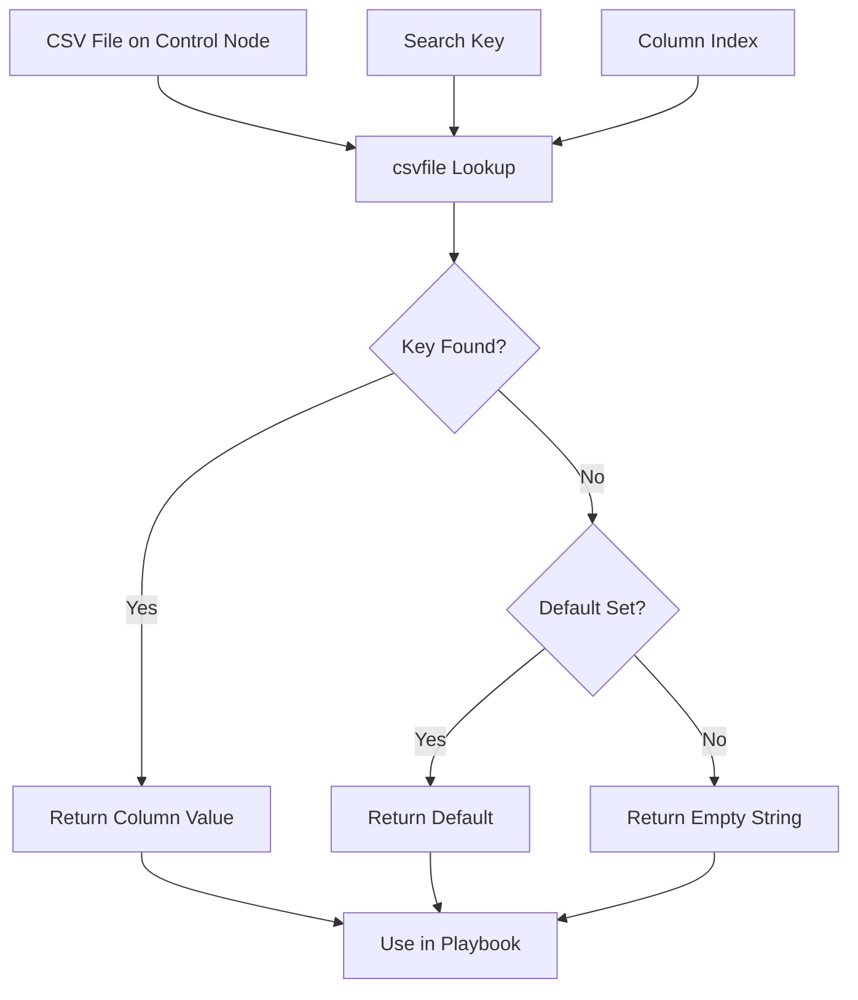

# How to Use the Ansible csvfile Lookup Plugin

Author: [nawazdhandala](https://www.github.com/nawazdhandala)

Tags: Ansible, Lookup Plugins, CSV, Data Management, Automation

Description: Learn how to use the Ansible csvfile lookup plugin to read data from CSV files on the control node for dynamic inventory and configuration.

---

CSV files are everywhere in IT operations. You might have a spreadsheet of server IP assignments, a list of user accounts to provision, or a configuration matrix exported from a CMDB. The Ansible `csvfile` lookup plugin lets you query CSV files directly from your playbooks, extracting specific values by looking up a key in one column and returning the value from another column. It turns static spreadsheet data into dynamic Ansible variables.

## How the csvfile Lookup Works

The csvfile lookup reads a CSV file on the control node and searches for a specific key value in a designated column. When it finds a match, it returns the value from a different column in the same row. Think of it like a VLOOKUP in Excel.

Basic syntax:

```yaml
"{{ lookup('csvfile', 'search_key file=path/to/file.csv delimiter=, col=2') }}"
```

The parameters:

- First argument: the key value to search for
- `file`: path to the CSV file
- `delimiter`: field separator (default is TAB)
- `col`: column number to return (0-indexed, default 1)
- `default`: value to return if key is not found

## Setting Up a Sample CSV File

Let us start with a sample CSV file that maps server hostnames to their configurations:

```csv
hostname,ip_address,role,environment,datacenter
web01,10.0.1.10,webserver,production,dc1
web02,10.0.1.11,webserver,production,dc1
db01,10.0.2.10,database,production,dc1
db02,10.0.2.11,database,production,dc2
app01,10.0.3.10,appserver,staging,dc1
app02,10.0.3.11,appserver,staging,dc2
monitor01,10.0.5.10,monitoring,production,dc1
```

Save this as `files/servers.csv` in your playbook directory.

## Basic CSV Lookup

Look up a server's IP address by hostname:

```yaml
# basic_csvfile.yml - Basic CSV file lookup
---
- name: Look up server information from CSV
  hosts: localhost
  connection: local
  tasks:
    - name: Get IP address for web01
      ansible.builtin.debug:
        msg: "web01 IP: {{ lookup('csvfile', 'web01 file=files/servers.csv delimiter=, col=1') }}"

    - name: Get role for db01
      ansible.builtin.debug:
        msg: "db01 role: {{ lookup('csvfile', 'db01 file=files/servers.csv delimiter=, col=2') }}"

    - name: Get environment for app01
      ansible.builtin.debug:
        msg: "app01 env: {{ lookup('csvfile', 'app01 file=files/servers.csv delimiter=, col=3') }}"

    - name: Get datacenter for db02
      ansible.builtin.debug:
        msg: "db02 dc: {{ lookup('csvfile', 'db02 file=files/servers.csv delimiter=, col=4') }}"
```

## Using CSV Data for Configuration

Read configuration values from a CSV and apply them to hosts:

```yaml
# csv_config.yml - Configure hosts using CSV data
---
- name: Configure hosts from CSV data
  hosts: all
  become: true
  tasks:
    - name: Look up server role from CSV
      ansible.builtin.set_fact:
        server_role: "{{ lookup('csvfile', inventory_hostname + ' file=files/servers.csv delimiter=, col=2') }}"
        server_env: "{{ lookup('csvfile', inventory_hostname + ' file=files/servers.csv delimiter=, col=3') }}"
        server_dc: "{{ lookup('csvfile', inventory_hostname + ' file=files/servers.csv delimiter=, col=4') }}"

    - name: Display server info
      ansible.builtin.debug:
        msg:
          - "Host: {{ inventory_hostname }}"
          - "Role: {{ server_role }}"
          - "Environment: {{ server_env }}"
          - "Datacenter: {{ server_dc }}"

    - name: Apply role-specific configuration
      ansible.builtin.template:
        src: "templates/{{ server_role }}.conf.j2"
        dest: "/etc/myapp/{{ server_role }}.conf"
        mode: '0644'
      when: server_role | length > 0
```

## IP Address Management from CSV

Use a CSV file as a simple IPAM (IP Address Management) database:

```csv
hostname,mgmt_ip,data_ip,storage_ip,ilo_ip
server01,10.0.0.11,10.1.0.11,10.2.0.11,10.3.0.11
server02,10.0.0.12,10.1.0.12,10.2.0.12,10.3.0.12
server03,10.0.0.13,10.1.0.13,10.2.0.13,10.3.0.13
server04,10.0.0.14,10.1.0.14,10.2.0.14,10.3.0.14
```

```yaml
# ipam_csv.yml - Use CSV as IP address management database
---
- name: Configure network interfaces from CSV IPAM
  hosts: all
  become: true
  vars:
    ipam_file: files/ipam.csv
  tasks:
    - name: Look up all IP addresses for this host
      ansible.builtin.set_fact:
        mgmt_ip: "{{ lookup('csvfile', inventory_hostname + ' file=' + ipam_file + ' delimiter=, col=1') }}"
        data_ip: "{{ lookup('csvfile', inventory_hostname + ' file=' + ipam_file + ' delimiter=, col=2') }}"
        storage_ip: "{{ lookup('csvfile', inventory_hostname + ' file=' + ipam_file + ' delimiter=, col=3') }}"
        ilo_ip: "{{ lookup('csvfile', inventory_hostname + ' file=' + ipam_file + ' delimiter=, col=4') }}"

    - name: Display IP assignments
      ansible.builtin.debug:
        msg:
          - "Management: {{ mgmt_ip }}"
          - "Data: {{ data_ip }}"
          - "Storage: {{ storage_ip }}"
          - "iLO/IPMI: {{ ilo_ip }}"

    - name: Configure management interface
      community.general.nmcli:
        conn_name: management
        ifname: eth0
        type: ethernet
        ip4: "{{ mgmt_ip }}/24"
        state: present
      when: mgmt_ip | length > 0

    - name: Configure data interface
      community.general.nmcli:
        conn_name: data
        ifname: eth1
        type: ethernet
        ip4: "{{ data_ip }}/24"
        state: present
      when: data_ip | length > 0
```

## User Provisioning from CSV

Provision user accounts from a CSV file:

```csv
username,full_name,email,group,ssh_key_file
jsmith,John Smith,jsmith@example.com,developers,files/keys/jsmith.pub
jdoe,Jane Doe,jdoe@example.com,developers,files/keys/jdoe.pub
admin1,Admin User,admin1@example.com,admins,files/keys/admin1.pub
ops1,Ops User,ops1@example.com,operations,files/keys/ops1.pub
```

```yaml
# user_provision.yml - Provision users from CSV
---
- name: Provision users from CSV
  hosts: all
  become: true
  vars:
    users_csv: files/users.csv
    user_list:
      - jsmith
      - jdoe
      - admin1
      - ops1
  tasks:
    - name: Create user groups
      ansible.builtin.group:
        name: "{{ lookup('csvfile', item + ' file=' + users_csv + ' delimiter=, col=3') }}"
        state: present
      loop: "{{ user_list }}"

    - name: Create user accounts
      ansible.builtin.user:
        name: "{{ item }}"
        comment: "{{ lookup('csvfile', item + ' file=' + users_csv + ' delimiter=, col=1') }}"
        groups: "{{ lookup('csvfile', item + ' file=' + users_csv + ' delimiter=, col=3') }}"
        shell: /bin/bash
        state: present
      loop: "{{ user_list }}"

    - name: Deploy SSH keys
      ansible.posix.authorized_key:
        user: "{{ item }}"
        key: "{{ lookup('file', lookup('csvfile', item + ' file=' + users_csv + ' delimiter=, col=4')) }}"
        state: present
      loop: "{{ user_list }}"
      ignore_errors: true
```

## Handling Default Values

When a key is not found in the CSV, you can specify a default:

```yaml
# default_values.yml - Handle missing CSV entries
---
- name: CSV lookup with defaults
  hosts: all
  tasks:
    - name: Look up with default for missing entries
      ansible.builtin.set_fact:
        server_role: "{{ lookup('csvfile', inventory_hostname + ' file=files/servers.csv delimiter=, col=2 default=unknown') }}"

    - name: Show result
      ansible.builtin.debug:
        msg: "Role for {{ inventory_hostname }}: {{ server_role }}"

    - name: Skip hosts not in CSV
      ansible.builtin.debug:
        msg: "Configuring {{ inventory_hostname }} as {{ server_role }}"
      when: server_role != 'unknown'
```

## Port Assignment Database

Use CSV for service port mappings:

```csv
service,http_port,https_port,admin_port,metrics_port
frontend,80,443,8080,9100
api,3000,3443,3080,9101
worker,8000,8443,8880,9102
scheduler,9000,9443,9080,9103
```

```yaml
# port_assignment.yml - Look up port assignments from CSV
---
- name: Configure services with ports from CSV
  hosts: all
  become: true
  vars:
    ports_csv: files/ports.csv
    service_name: api
  tasks:
    - name: Look up all ports for this service
      ansible.builtin.set_fact:
        http_port: "{{ lookup('csvfile', service_name + ' file=' + ports_csv + ' delimiter=, col=1') }}"
        https_port: "{{ lookup('csvfile', service_name + ' file=' + ports_csv + ' delimiter=, col=2') }}"
        admin_port: "{{ lookup('csvfile', service_name + ' file=' + ports_csv + ' delimiter=, col=3') }}"
        metrics_port: "{{ lookup('csvfile', service_name + ' file=' + ports_csv + ' delimiter=, col=4') }}"

    - name: Show port assignments
      ansible.builtin.debug:
        msg:
          - "HTTP: {{ http_port }}"
          - "HTTPS: {{ https_port }}"
          - "Admin: {{ admin_port }}"
          - "Metrics: {{ metrics_port }}"

    - name: Open firewall ports
      community.general.ufw:
        rule: allow
        port: "{{ item }}"
        proto: tcp
      loop:
        - "{{ http_port }}"
        - "{{ https_port }}"
        - "{{ admin_port }}"
        - "{{ metrics_port }}"
      ignore_errors: true
```

## Reading TSV Files (Tab-Separated)

The csvfile lookup uses TAB as the default delimiter, which makes it work with TSV files directly:

```yaml
# tsv_lookup.yml - Read tab-separated values (default delimiter)
---
- name: Read TSV file
  hosts: all
  tasks:
    # No delimiter parameter needed for TSV
    - name: Look up value from TSV
      ansible.builtin.debug:
        msg: "{{ lookup('csvfile', 'web01 file=files/servers.tsv col=1') }}"
```

## CSV Lookup Data Flow



## Limitations and Alternatives

The csvfile lookup searches only the first column by default for the key. It returns a single value per lookup call, so reading an entire row requires multiple lookups (one per column). For more complex CSV operations, you might want to read the entire file and parse it with Python:

```yaml
# complex_csv.yml - Alternative for complex CSV operations
---
- name: Complex CSV processing
  hosts: localhost
  connection: local
  tasks:
    - name: Read entire CSV as structured data
      ansible.builtin.read_csv:
        path: files/servers.csv
      register: csv_data

    - name: Show all records
      ansible.builtin.debug:
        msg: "{{ item.hostname }}: {{ item.ip_address }} ({{ item.role }})"
      loop: "{{ csv_data.list }}"

    - name: Filter records by role
      ansible.builtin.debug:
        msg: "Web server: {{ item.hostname }} at {{ item.ip_address }}"
      loop: "{{ csv_data.list | selectattr('role', 'equalto', 'webserver') | list }}"
```

The `read_csv` module (available since Ansible 2.8) is often a better choice when you need to process multiple rows or filter data. Use the `csvfile` lookup when you need simple key-value lookups, especially when the CSV serves as a configuration database and you just need one value at a time.

CSV files are a practical and widely understood data format. The csvfile lookup bridges the gap between your spreadsheets and your automation, letting operations teams maintain familiar CSV files while Ansible uses them to drive infrastructure configuration.
