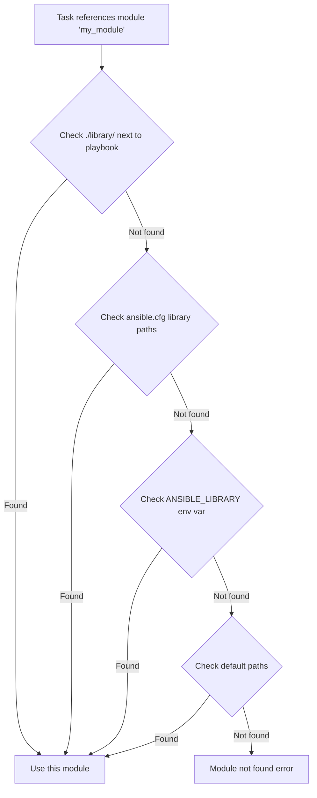

# How to Set Up Ansible with a Custom Module Path

Author: [nawazdhandala](https://www.github.com/nawazdhandala)

Tags: Ansible, Modules, Configuration, DevOps

Description: Configure Ansible to load custom modules from your own directories, enabling you to extend Ansible with project-specific or shared modules.

---

Ansible ships with hundreds of built-in modules, but sooner or later you will need to add your own. Maybe you have a custom module that interacts with an internal API, or your team maintains a shared library of modules that are not published on Galaxy. The `library` setting in ansible.cfg tells Ansible where to look for additional modules beyond the default locations. This guide shows you how to set up custom module paths and organize your modules effectively.

## How Ansible Finds Modules

When you reference a module in a task, Ansible searches for it in this order:

1. The `library` directory adjacent to the playbook being run
2. Paths specified in the `library` setting in ansible.cfg
3. Paths in the `ANSIBLE_LIBRARY` environment variable
4. The default module path (`~/.ansible/plugins/modules` and the built-in module path)

If Ansible finds a module with the same name in multiple locations, the first match wins.



## Setting the Module Path in ansible.cfg

The simplest approach is to add a `library` setting to your ansible.cfg:

```ini
# ansible.cfg
[defaults]
# Colon-separated list of directories to search for modules
library = ./library:~/shared-modules:/opt/ansible/custom-modules
```

This tells Ansible to look in three directories (in order):
1. `./library` relative to the current working directory
2. `~/shared-modules` in your home directory
3. `/opt/ansible/custom-modules` as an absolute path

The colon separator works on Linux and macOS. On Windows (via WSL), use the same colon separator since you are running in a Linux environment.

## Setting the Module Path via Environment Variable

For CI/CD pipelines or when you need to override the ansible.cfg value:

```bash
# Set module path via environment variable
export ANSIBLE_LIBRARY=./library:~/shared-modules

# Run your playbook
ansible-playbook deploy.yml
```

The environment variable overrides the ansible.cfg `library` setting.

## Project Structure with Custom Modules

Here is a recommended project structure that keeps custom modules organized:

```
my-ansible-project/
  ansible.cfg
  inventory.ini
  playbooks/
    deploy.yml
    configure.yml
  library/
    my_api_module.py
    check_service_health.py
  module_utils/
    api_helper.py
  roles/
    webserver/
      tasks/
        main.yml
      library/
        nginx_config_validator.py
```

The `library/` directory at the project root is automatically searched when you run playbooks from the project directory. Roles can also have their own `library/` directory for role-specific modules.

## Creating a Simple Custom Module

Let me walk through a practical example. Say you need a module that checks the health of an internal service by making an HTTP request.

Create the module file:

```python
#!/usr/bin/python
# library/check_service_health.py

from ansible.module_utils.basic import AnsibleModule
import urllib.request
import urllib.error
import json


def check_health(url, timeout):
    """Make a GET request to the health endpoint and return the result."""
    try:
        req = urllib.request.Request(url, method='GET')
        response = urllib.request.urlopen(req, timeout=timeout)
        body = json.loads(response.read().decode('utf-8'))
        return True, response.status, body
    except urllib.error.URLError as e:
        return False, 0, str(e)
    except Exception as e:
        return False, 0, str(e)


def main():
    # Define the module arguments
    module = AnsibleModule(
        argument_spec=dict(
            url=dict(type='str', required=True),
            timeout=dict(type='int', default=10),
            expected_status=dict(type='int', default=200),
        ),
        supports_check_mode=True,
    )

    url = module.params['url']
    timeout = module.params['timeout']
    expected_status = module.params['expected_status']

    # In check mode, just report what would happen
    if module.check_mode:
        module.exit_json(changed=False, msg="Would check health at {}".format(url))

    success, status_code, body = check_health(url, timeout)

    if not success:
        module.fail_json(msg="Health check failed: {}".format(body), url=url)

    if status_code != expected_status:
        module.fail_json(
            msg="Expected status {}, got {}".format(expected_status, status_code),
            status_code=status_code,
            url=url,
        )

    module.exit_json(
        changed=False,
        healthy=True,
        status_code=status_code,
        response=body,
        url=url,
    )


if __name__ == '__main__':
    main()
```

Use it in a playbook:

```yaml
# playbooks/health-check.yml
---
- name: Check service health
  hosts: localhost
  connection: local
  gather_facts: false

  tasks:
    - name: Check API health endpoint
      check_service_health:
        url: "http://api.internal.example.com/health"
        timeout: 5
        expected_status: 200
      register: health_result

    - name: Display health status
      ansible.builtin.debug:
        msg: "Service is healthy. Response: {{ health_result.response }}"
```

## Using module_utils for Shared Code

If multiple custom modules share common code, put it in `module_utils/`:

```python
# module_utils/api_helper.py

import urllib.request
import urllib.error
import json


class APIClient:
    """Shared API client for custom Ansible modules."""

    def __init__(self, base_url, api_key=None, timeout=10):
        self.base_url = base_url.rstrip('/')
        self.api_key = api_key
        self.timeout = timeout

    def get(self, endpoint):
        url = "{}/{}".format(self.base_url, endpoint.lstrip('/'))
        headers = {}
        if self.api_key:
            headers['Authorization'] = "Bearer {}".format(self.api_key)

        req = urllib.request.Request(url, headers=headers, method='GET')
        try:
            response = urllib.request.urlopen(req, timeout=self.timeout)
            return json.loads(response.read().decode('utf-8'))
        except urllib.error.URLError as e:
            raise Exception("API request failed: {}".format(str(e)))
```

Reference it in your module:

```python
# library/my_api_module.py

from ansible.module_utils.basic import AnsibleModule
from ansible.module_utils.api_helper import APIClient


def main():
    module = AnsibleModule(
        argument_spec=dict(
            base_url=dict(type='str', required=True),
            api_key=dict(type='str', required=True, no_log=True),
            endpoint=dict(type='str', required=True),
        ),
    )

    client = APIClient(
        base_url=module.params['base_url'],
        api_key=module.params['api_key'],
    )

    try:
        result = client.get(module.params['endpoint'])
        module.exit_json(changed=False, data=result)
    except Exception as e:
        module.fail_json(msg=str(e))


if __name__ == '__main__':
    main()
```

The `module_utils` directory must also be configured in ansible.cfg:

```ini
# ansible.cfg
[defaults]
library = ./library
module_utils = ./module_utils
```

## Sharing Modules Across Multiple Projects

If your team maintains modules used across many projects, put them in a shared location and reference it:

```ini
# ansible.cfg
[defaults]
# Project modules first, then shared modules
library = ./library:/opt/company/ansible-modules/library
module_utils = ./module_utils:/opt/company/ansible-modules/module_utils
```

Alternatively, package your modules as an Ansible collection and install them with `ansible-galaxy`. This is the more scalable approach for organizations with many shared modules.

## Testing Your Module Path Configuration

Verify that Ansible can find your modules:

```bash
# List the module search path
ansible-config dump | grep DEFAULT_MODULE_PATH

# Try to get documentation for your custom module
ansible-doc -t module check_service_health

# Run a quick test
ansible localhost -m check_service_health -a "url=http://localhost:8080/health"
```

If `ansible-doc` can find your module, your path is configured correctly.

## Debugging Module Loading Issues

If Ansible cannot find your module, use verbose mode to see where it is looking:

```bash
# Run with high verbosity to trace module loading
ansible-playbook -vvvv playbooks/health-check.yml
```

Look for lines containing "module" and "search" in the output to see which paths Ansible is checking.

Common issues:
- The module file does not have a `.py` extension
- The module file is not executable (though Ansible handles this for Python modules)
- The `library` path in ansible.cfg is relative but you are running the playbook from a different directory
- There is a syntax error in the module file preventing it from loading

## Summary

Setting up a custom module path is straightforward: add the `library` setting to your ansible.cfg and put your Python module files in the specified directory. For shared code, use `module_utils`. Keep project-specific modules in the project's `library/` directory and shared modules in a central location. As your module library grows, consider packaging them as Ansible collections for better distribution and versioning.
