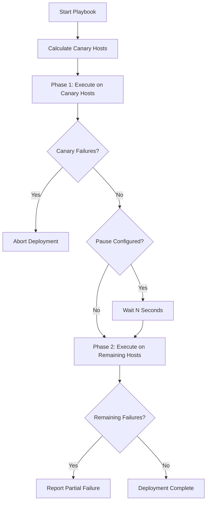

# How to Create a Custom Ansible Strategy Plugin

Author: [nawazdhandala](https://www.github.com/nawazdhandala)

Tags: Ansible, Plugins, Strategy, Execution, Python

Description: Build a custom Ansible strategy plugin to control how tasks are distributed and executed across your infrastructure hosts.

---

Strategy plugins control how Ansible executes tasks across hosts. The built-in strategies include `linear` (default, runs each task on all hosts before moving on), `free` (each host runs through tasks independently), and `host_pinned` (similar to free but keeps workers pinned to hosts). When these do not fit your needs, you can write a custom strategy plugin.

Common reasons to build a custom strategy include: rolling deployments with health checks between batches, canary deployments that test on a subset before full rollout, dependency-aware execution where certain hosts must complete before others start, and rate-limited execution for API-heavy playbooks.

## How Strategy Plugins Work

A strategy plugin inherits from `StrategyBase` and implements the `run()` method. This method receives the play's task iterator and play context, and it is responsible for queuing tasks to workers, collecting results, and deciding what runs next. It is the most complex plugin type in Ansible because you are essentially controlling the execution engine.

## Project Layout

```
my_project/
  strategy_plugins/
    canary.py
  ansible.cfg
  playbooks/
    deploy.yml
```

Configure `ansible.cfg` to load your plugin:

```ini
# ansible.cfg
[defaults]
strategy_plugins = ./strategy_plugins
strategy = canary
```

## Building a Canary Deployment Strategy

This strategy plugin runs tasks on a small percentage of hosts first (the canary group), waits for confirmation, and then proceeds with the rest.

Create `strategy_plugins/canary.py`:

```python
# canary.py - Strategy plugin for canary deployments
from __future__ import absolute_import, division, print_function
__metaclass__ = type

DOCUMENTATION = """
    name: canary
    short_description: Canary deployment strategy
    description:
        - Runs tasks on a canary subset of hosts first,
          then proceeds to the remaining hosts if successful.
    options:
      canary_percentage:
        description: Percentage of hosts to use as canaries (1-50)
        default: 10
        type: int
        env:
          - name: ANSIBLE_CANARY_PERCENTAGE
        ini:
          - key: canary_percentage
            section: canary_strategy
      pause_after_canary:
        description: Seconds to pause after canary batch completes
        default: 0
        type: int
        env:
          - name: ANSIBLE_CANARY_PAUSE
        ini:
          - key: pause_after_canary
            section: canary_strategy
"""

import math
import time

from ansible.plugins.strategy.linear import StrategyModule as LinearStrategy
from ansible.utils.display import Display

display = Display()


class StrategyModule(LinearStrategy):
    """Canary deployment strategy.

    Extends the linear strategy to first execute on a canary
    subset of hosts, then on the remaining hosts.
    """

    def __init__(self, tqm):
        super(StrategyModule, self).__init__(tqm)
        self._canary_percentage = 10
        self._pause_seconds = 0

    def run(self, iterator, play_context):
        """Execute the play with canary deployment logic."""

        # Read configuration
        self._canary_percentage = self.get_option('canary_percentage')
        self._pause_seconds = self.get_option('pause_after_canary')

        # Get the full list of hosts
        all_hosts = self._inventory.get_hosts(
            iterator._play.hosts, order=iterator._play.order
        )

        if len(all_hosts) <= 1:
            # Not enough hosts for canary, just run normally
            display.display("Only one host, running standard linear strategy")
            return super(StrategyModule, self).run(iterator, play_context)

        # Calculate canary count (at least 1 host)
        canary_count = max(
            1,
            int(math.ceil(len(all_hosts) * self._canary_percentage / 100.0))
        )

        canary_hosts = all_hosts[:canary_count]
        remaining_hosts = all_hosts[canary_count:]

        canary_names = [h.name for h in canary_hosts]
        remaining_names = [h.name for h in remaining_hosts]

        display.display(
            "CANARY STRATEGY: Running on %d canary hosts first: %s"
            % (len(canary_hosts), ', '.join(canary_names)),
            color='yellow'
        )

        # Phase 1: Run on canary hosts only
        # Temporarily restrict the host list
        for host in remaining_hosts:
            self._tqm._unreachable_hosts[host.name] = True

        result = super(StrategyModule, self).run(iterator, play_context)

        # Check if canary phase had failures
        if self._tqm._stats.failures:
            display.error(
                "CANARY STRATEGY: Canary hosts had failures. "
                "Aborting deployment to remaining hosts."
            )
            return result

        # Remove the temporary restriction
        for host in remaining_hosts:
            if host.name in self._tqm._unreachable_hosts:
                del self._tqm._unreachable_hosts[host.name]

        if self._pause_seconds > 0:
            display.display(
                "CANARY STRATEGY: Pausing %d seconds after canary phase"
                % self._pause_seconds,
                color='yellow'
            )
            time.sleep(self._pause_seconds)

        display.display(
            "CANARY STRATEGY: Canary successful. Proceeding with %d remaining hosts: %s"
            % (len(remaining_hosts), ', '.join(remaining_names)),
            color='green'
        )

        # Phase 2: Run on remaining hosts
        result = super(StrategyModule, self).run(iterator, play_context)

        return result
```

## Using the Canary Strategy

Reference the strategy in your playbook:

```yaml
---
# deploy.yml - Deploy with canary strategy
- name: Deploy application with canary rollout
  hosts: web_servers
  strategy: canary
  become: true

  vars:
    app_version: "2.5.0"

  tasks:
    - name: Pull latest application code
      ansible.builtin.git:
        repo: "https://github.com/myorg/myapp.git"
        dest: /opt/myapp
        version: "v{{ app_version }}"

    - name: Install dependencies
      ansible.builtin.pip:
        requirements: /opt/myapp/requirements.txt
        virtualenv: /opt/myapp/venv

    - name: Restart application service
      ansible.builtin.systemd:
        name: myapp
        state: restarted

    - name: Verify application health
      ansible.builtin.uri:
        url: "http://localhost:8080/health"
        status_code: 200
      retries: 5
      delay: 3
```

Set strategy options via environment variables or `ansible.cfg`:

```ini
# ansible.cfg
[canary_strategy]
canary_percentage = 20
pause_after_canary = 30
```

## A Simpler Strategy: Rate-Limited Execution

Here is a simpler example that adds a delay between each host to avoid overwhelming downstream services:

```python
# rate_limited.py - Strategy that adds delays between hosts
from __future__ import absolute_import, division, print_function
__metaclass__ = type

DOCUMENTATION = """
    name: rate_limited
    short_description: Rate-limited linear strategy
    description:
        - Like linear, but adds a configurable delay between
          processing each host to avoid overwhelming services.
    options:
      delay_seconds:
        description: Seconds to wait between each host
        default: 5
        type: int
        env:
          - name: ANSIBLE_RATE_LIMIT_DELAY
        ini:
          - key: delay_seconds
            section: rate_limited
"""

import time
from ansible.plugins.strategy.linear import StrategyModule as LinearStrategy
from ansible.utils.display import Display

display = Display()


class StrategyModule(LinearStrategy):
    """Rate-limited strategy plugin."""

    def _queue_task(self, host, task, task_vars, play_context):
        """Override task queuing to add delays between hosts."""
        delay = self.get_option('delay_seconds')

        display.vv(
            "RATE LIMITED: Queuing task '%s' for host '%s' (delay: %ds)"
            % (task.name, host.name, delay)
        )

        # Add delay before queuing
        if delay > 0:
            time.sleep(delay)

        return super(StrategyModule, self)._queue_task(
            host, task, task_vars, play_context
        )
```

## Execution Flow Diagram

Here is how the canary strategy processes a deployment:



## Important Considerations

Strategy plugins are the most powerful and most dangerous plugin type. A bug in your strategy can cause tasks to run out of order, skip hosts, or execute tasks multiple times. Here are some things to keep in mind:

1. Always extend an existing strategy (like `linear` or `free`) rather than building from scratch. The base strategies handle worker management, result collection, and handler execution.

2. Be careful with the `_tqm._unreachable_hosts` dictionary. It is a shared state that affects all strategy logic.

3. Test thoroughly with `--check` mode first. Strategy plugins affect check mode too.

4. Use `display.display()`, `display.vv()`, and `display.vvv()` for output at different verbosity levels.

5. Remember that `run()` must return a numeric result code. Zero means success, non-zero means failure.

## Summary

Custom strategy plugins give you complete control over how Ansible distributes and sequences work across your hosts. Whether you need canary deployments, rate limiting, dependency-based ordering, or blue-green switching, the strategy plugin interface lets you implement it. Start by extending an existing strategy like `linear` and override only the methods you need to change. Test carefully since strategy bugs affect every task in your playbook.
