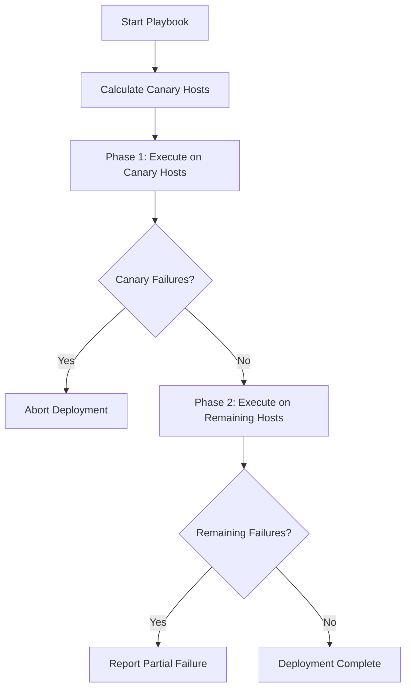

# How to Create a Custom Ansible Strategy Plugin

Author: [nawazdhandala](https://www.github.com/nawazdhandala)

Tags: Ansible, Plugin, Strategy, Execution, Python

Description: Build a custom Ansible strategy plugin to control how tasks are distributed and executed across your infrastructure hosts.

---

Strategy plugins control how Ansible executes tasks across hosts. The built-in strategies include `linear` (default, runs each task on all hosts before moving on), `free` (each host runs through tasks independently), and `host_pinned` (similar to free but keeps workers pinned to hosts). When these do not fit your needs, you can write a custom strategy plugin.

Common reasons to build a custom strategy include: rolling deployments with health checks between batches, canary deployments that test on a subset before full rollout, dependency-aware execution where certain hosts must complete before others start, and rate-limited execution for API-heavy playbooks.

## How Strategy Plugins Work

A strategy plugin inherits from `StrategyBase`, usually by extending an existing strategy such as `linear` or `free`. A full custom strategy can implement the `run()` method, which receives the play's task iterator and play context, and is responsible for queuing tasks to workers, collecting results, and deciding what runs next. For smaller changes, you can override helper methods from the existing strategy. It is the most complex plugin type in Ansible because you are essentially controlling the execution engine.

## Project Layout

```text
my_project/
  strategy_plugins/
    rate_limited.py
  ansible.cfg
  playbooks/
    deploy.yml
```

Configure `ansible.cfg` to load your plugin:

```ini
# ansible.cfg

[defaults]
strategy_plugins = ./strategy_plugins
strategy = rate_limited
```

## Building a Canary Deployment Strategy

For canary rollouts, use Ansible's built-in `serial` keyword to divide the play into batches. The `linear` strategy runs each batch to completion before Ansible moves to the next batch, and failures are scoped to the active batch.

## Using Canary Batches

Reference the batching behavior in your playbook:

```yaml
---
# deploy.yml - Deploy with canary strategy
- name: Deploy application with canary rollout
  hosts: web_servers
  strategy: linear
  serial:
    - "10%"
    - "100%"
  become: true

  vars:
    app_version: "2.5.0"

  tasks:
    - name: Pull latest application code
      ansible.builtin.git:
        repo: "https://github.com/myorg/myapp.git"
        dest: /opt/myapp
        version: "v{{ app_version }}"

    - name: Install dependencies
      ansible.builtin.pip:
        requirements: /opt/myapp/requirements.txt
        virtualenv: /opt/myapp/venv

    - name: Restart application service
      ansible.builtin.systemd:
        name: myapp
        state: restarted

    - name: Verify application health
      ansible.builtin.uri:
        url: "http://localhost:8080/health"
        status_code: 200
      retries: 5
      delay: 3
```

## A Custom Strategy: Rate-Limited Execution

Here is a simpler example that adds a delay between each host to avoid overwhelming downstream services:

```python
# rate_limited.py - Strategy that adds delays between hosts
from __future__ import absolute_import, division, print_function
__metaclass__ = type

DOCUMENTATION = """
    name: rate_limited
    short_description: Rate-limited linear strategy
    description:
        - Like linear, but adds a configurable delay between
          processing each host to avoid overwhelming services.
    options:
      delay_seconds:
        description: Seconds to wait between each host
        default: 5
        type: int
        env:
          - name: ANSIBLE_RATE_LIMIT_DELAY
        ini:
          - key: delay_seconds
            section: rate_limited
"""

import time
from ansible.plugins.strategy.linear import StrategyModule as LinearStrategy
from ansible.utils.display import Display

display = Display()


class StrategyModule(LinearStrategy):
    """Rate-limited strategy plugin."""

    def _queue_task(self, host, task, task_vars, play_context):
        """Override task queuing to add delays between hosts."""
        delay = self.get_option('delay_seconds')

        display.vv(
            "RATE LIMITED: Queuing task '%s' for host '%s' (delay: %ds)"
            % (task.name, host.name, delay)
        )

        # Add delay before queuing
        if delay > 0:
            time.sleep(delay)

        return super(StrategyModule, self)._queue_task(
            host, task, task_vars, play_context
        )
```

## Execution Flow Diagram

Here is how the canary strategy processes a deployment:


```mermaid
flowchart TD
    A[Start Playbook] --> B[Calculate Canary Hosts]
    B --> C[Phase 1: Execute on Canary Hosts]
    C --> D{Canary Failures?}
    D -->|Yes| E[Abort Deployment]
    D -->|No| H[Phase 2: Execute on Remaining Hosts]
    H --> I{Remaining Failures?}
    I -->|Yes| J[Report Partial Failure]
    I -->|No| K[Deployment Complete]
```

## Important Considerations

Strategy plugins are the most powerful and most dangerous plugin type. A bug in your strategy can cause tasks to run out of order, skip hosts, or execute tasks multiple times. Here are some things to keep in mind:

1. Always extend an existing strategy (like `linear` or `free`) rather than building from scratch. The base strategies handle worker management, result collection, and handler execution.

2. Be careful with the `_tqm._unreachable_hosts` dictionary. It is a shared state that affects all strategy logic.

3. Test thoroughly with `--check` mode first. Strategy plugins affect check mode too.

4. Use `display.display()`, `display.vv()`, and `display.vvv()` for output at different verbosity levels.

5. If you implement `run()`, remember that it must return a numeric result code. Zero means success, non-zero means failure.

## Summary

Custom strategy plugins give you control over how Ansible distributes and sequences work across your hosts. Whether you need rate limiting, dependency-based ordering, or custom task scheduling, the strategy plugin interface lets you implement it. For canary and rolling deployments, use `serial` when batching is enough, and reach for a strategy plugin only when you need behavior that Ansible's play-level keywords cannot express. Start by extending an existing strategy like `linear` and override only the methods you need to change. Test carefully since strategy bugs affect every task in your playbook.
