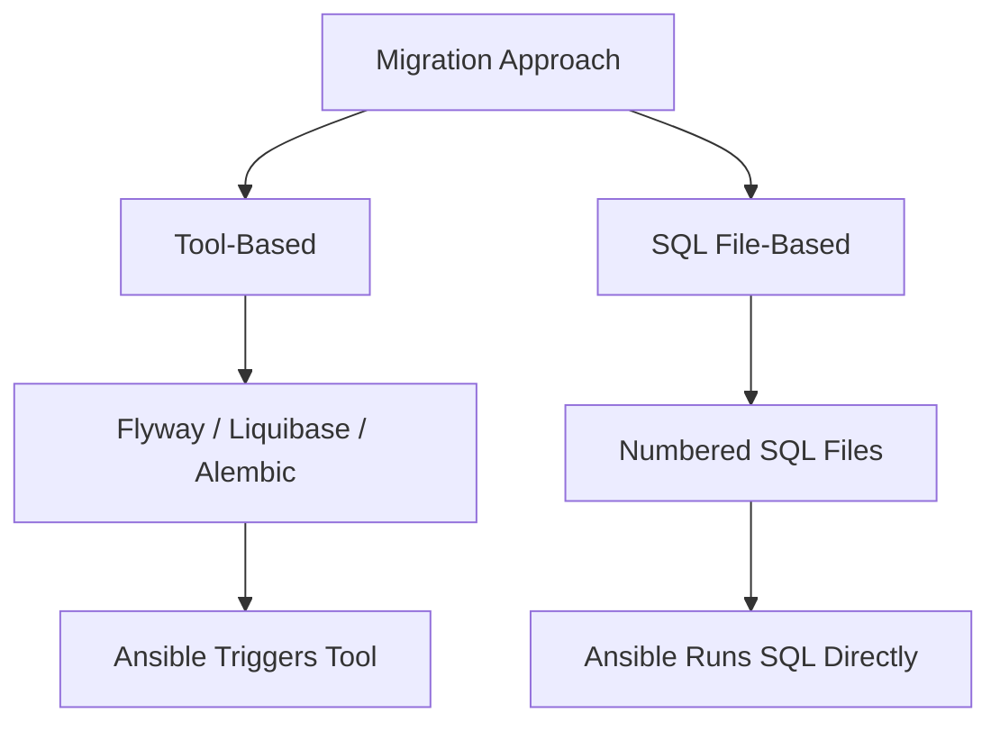

# How to Use Ansible for Database Schema Migrations

Author: [nawazdhandala](https://www.github.com/nawazdhandala)

Tags: Ansible, Database, Migrations, PostgreSQL, DevOps

Description: Automate database schema migrations safely with Ansible playbooks that handle version tracking, rollback procedures, and multi-environment deployments.

---

Database schema migrations are one of the riskiest parts of any deployment. A bad migration can take down your entire application, and unlike code rollbacks, undoing a schema change is not always straightforward. Ansible can help by automating the migration process with safety checks, backup steps, and rollback procedures built in.

This post covers how to manage database schema migrations using Ansible, including migration versioning, execution, and handling failures.

## Migration Strategy

Before writing playbooks, you need a migration strategy. There are two main approaches:



Tool-based migrations use a dedicated migration tool like Flyway or Alembic, and Ansible triggers the tool. SQL file-based migrations use numbered SQL files that Ansible runs directly against the database. Both work well; the choice depends on what your team already uses.

## SQL File-Based Migrations

Let us start with the simpler approach where migration files are plain SQL:

```
migrations/
  V001__create_users_table.sql
  V002__add_email_to_users.sql
  V003__create_orders_table.sql
  V004__add_index_on_orders_user_id.sql
  V005__create_products_table.sql
```

Each file contains the forward migration and optionally a rollback section:

```sql
-- migrations/V003__create_orders_table.sql
-- Forward migration: Create orders table with foreign key to users

CREATE TABLE orders (
    id SERIAL PRIMARY KEY,
    user_id INTEGER NOT NULL REFERENCES users(id),
    total_amount DECIMAL(10, 2) NOT NULL,
    status VARCHAR(50) NOT NULL DEFAULT 'pending',
    created_at TIMESTAMP NOT NULL DEFAULT CURRENT_TIMESTAMP,
    updated_at TIMESTAMP NOT NULL DEFAULT CURRENT_TIMESTAMP
);

CREATE INDEX idx_orders_user_id ON orders(user_id);
CREATE INDEX idx_orders_status ON orders(status);

-- ROLLBACK:
-- DROP TABLE IF EXISTS orders;
```

## Migration Tracking Table

Ansible needs to know which migrations have already been applied:

```yaml
# roles/db_migrate/tasks/init.yml
# Create the migration tracking table
---
- name: Create schema migrations tracking table
  community.postgresql.postgresql_query:
    db: "{{ db_name }}"
    login_host: "{{ db_host }}"
    login_user: "{{ db_admin_user }}"
    login_password: "{{ db_admin_password }}"
    query: |
      CREATE TABLE IF NOT EXISTS schema_migrations (
        version VARCHAR(255) PRIMARY KEY,
        filename VARCHAR(512) NOT NULL,
        applied_at TIMESTAMP NOT NULL DEFAULT CURRENT_TIMESTAMP,
        applied_by VARCHAR(255) NOT NULL,
        checksum VARCHAR(64) NOT NULL,
        execution_time_ms INTEGER
      );
```

## The Migration Role

```yaml
# roles/db_migrate/tasks/main.yml
# Run pending database migrations
---
- name: Initialize migration tracking
  ansible.builtin.include_tasks: init.yml

- name: Find all migration files
  ansible.builtin.find:
    paths: "{{ migration_dir }}"
    patterns: "V*.sql"
  register: migration_files
  delegate_to: localhost

- name: Get applied migrations
  community.postgresql.postgresql_query:
    db: "{{ db_name }}"
    login_host: "{{ db_host }}"
    login_user: "{{ db_admin_user }}"
    login_password: "{{ db_admin_password }}"
    query: "SELECT version FROM schema_migrations ORDER BY version;"
  register: applied_migrations

- name: Build list of applied versions
  ansible.builtin.set_fact:
    applied_versions: "{{ applied_migrations.query_result | map(attribute='version') | list }}"

- name: Determine pending migrations
  ansible.builtin.set_fact:
    pending_migrations: >-
      {{ migration_files.files
         | sort(attribute='path')
         | selectattr('path', 'regex', 'V\d+__')
         | rejectattr('path', 'search', applied_versions | join('|'))
         | list }}
  when: applied_versions | length > 0

- name: Set pending to all when none applied
  ansible.builtin.set_fact:
    pending_migrations: "{{ migration_files.files | sort(attribute='path') | list }}"
  when: applied_versions | length == 0

- name: Display pending migrations
  ansible.builtin.debug:
    msg: "Will apply {{ pending_migrations | length }} migration(s)"

- name: Apply each pending migration
  ansible.builtin.include_tasks: apply_migration.yml
  loop: "{{ pending_migrations }}"
  loop_control:
    loop_var: migration_file
```

```yaml
# roles/db_migrate/tasks/apply_migration.yml
# Apply a single migration file
---
- name: Extract version from filename
  ansible.builtin.set_fact:
    migration_version: "{{ migration_file.path | basename | regex_replace('^(V\\d+)__.*', '\\1') }}"
    migration_filename: "{{ migration_file.path | basename }}"

- name: Read migration SQL
  ansible.builtin.slurp:
    src: "{{ migration_file.path }}"
  register: migration_content
  delegate_to: localhost

- name: Calculate checksum
  ansible.builtin.set_fact:
    migration_checksum: "{{ migration_content.content | b64decode | hash('sha256') }}"

- name: Create pre-migration backup
  community.postgresql.postgresql_db:
    name: "{{ db_name }}"
    login_host: "{{ db_host }}"
    login_user: "{{ db_admin_user }}"
    login_password: "{{ db_admin_password }}"
    state: dump
    target: "/tmp/pre_{{ migration_version }}_backup.sql.gz"
  when: create_backup_per_migration | default(false)

- name: Apply migration
  community.postgresql.postgresql_query:
    db: "{{ db_name }}"
    login_host: "{{ db_host }}"
    login_user: "{{ db_admin_user }}"
    login_password: "{{ db_admin_password }}"
    query: "{{ migration_content.content | b64decode | regex_replace('--\\s*ROLLBACK:.*', '', multiline=True) }}"
  register: migration_result

- name: Record migration in tracking table
  community.postgresql.postgresql_query:
    db: "{{ db_name }}"
    login_host: "{{ db_host }}"
    login_user: "{{ db_admin_user }}"
    login_password: "{{ db_admin_password }}"
    query: |
      INSERT INTO schema_migrations (version, filename, applied_by, checksum, execution_time_ms)
      VALUES (%(ver)s, %(file)s, %(user)s, %(sum)s, %(time)s);
    named_args:
      ver: "{{ migration_version }}"
      file: "{{ migration_filename }}"
      user: "ansible-{{ lookup('env', 'USER') }}"
      sum: "{{ migration_checksum }}"
      time: "{{ migration_result.query_all_results | length }}"

- name: Log migration success
  ansible.builtin.debug:
    msg: "Applied {{ migration_filename }} successfully"
```

## Pre-Migration Safety Checks

Always run safety checks before migrating:

```yaml
# roles/db_migrate/tasks/pre_checks.yml
# Verify database is ready for migration
---
- name: Check database connectivity
  community.postgresql.postgresql_ping:
    db: "{{ db_name }}"
    login_host: "{{ db_host }}"
    login_user: "{{ db_admin_user }}"
    login_password: "{{ db_admin_password }}"

- name: Check for active locks
  community.postgresql.postgresql_query:
    db: "{{ db_name }}"
    login_host: "{{ db_host }}"
    login_user: "{{ db_admin_user }}"
    login_password: "{{ db_admin_password }}"
    query: |
      SELECT count(*) as lock_count
      FROM pg_locks l
      JOIN pg_stat_activity a ON l.pid = a.pid
      WHERE l.mode = 'AccessExclusiveLock';
  register: lock_check

- name: Fail if exclusive locks exist
  ansible.builtin.fail:
    msg: "Database has {{ lock_check.query_result[0].lock_count }} exclusive locks. Resolve before migrating."
  when: lock_check.query_result[0].lock_count | int > 0

- name: Check disk space on database server
  ansible.builtin.shell: df -h {{ db_data_dir }} | awk 'NR==2 {print $5}' | tr -d '%'
  register: disk_usage
  changed_when: false

- name: Fail if disk space is low
  ansible.builtin.fail:
    msg: "Database disk usage is {{ disk_usage.stdout }}%. Must be below 80% to migrate."
  when: disk_usage.stdout | int > 80

- name: Create full backup before migration
  community.postgresql.postgresql_db:
    name: "{{ db_name }}"
    login_host: "{{ db_host }}"
    login_user: "{{ db_admin_user }}"
    login_password: "{{ db_admin_password }}"
    state: dump
    target: "{{ backup_dir }}/pre_migration_{{ ansible_date_time.epoch }}.sql.gz"
```

## Using Flyway with Ansible

If you prefer a dedicated migration tool:

```yaml
# roles/db_migrate_flyway/tasks/main.yml
# Run Flyway migrations through Ansible
---
- name: Download Flyway
  ansible.builtin.get_url:
    url: "https://repo1.maven.org/maven2/org/flywaydb/flyway-commandline/{{ flyway_version }}/flyway-commandline-{{ flyway_version }}-linux-x64.tar.gz"
    dest: "/tmp/flyway-{{ flyway_version }}.tar.gz"
    mode: '0644'

- name: Extract Flyway
  ansible.builtin.unarchive:
    src: "/tmp/flyway-{{ flyway_version }}.tar.gz"
    dest: /opt/
    remote_src: true

- name: Deploy Flyway configuration
  ansible.builtin.template:
    src: flyway.conf.j2
    dest: "/opt/flyway-{{ flyway_version }}/conf/flyway.conf"
    mode: '0600'

- name: Copy migration files
  ansible.builtin.copy:
    src: "{{ migration_dir }}/"
    dest: "/opt/flyway-{{ flyway_version }}/sql/"
    mode: '0644'

- name: Run Flyway info to see pending migrations
  ansible.builtin.command:
    cmd: "/opt/flyway-{{ flyway_version }}/flyway info"
  register: flyway_info
  changed_when: false

- name: Display migration info
  ansible.builtin.debug:
    var: flyway_info.stdout_lines

- name: Run Flyway migrate
  ansible.builtin.command:
    cmd: "/opt/flyway-{{ flyway_version }}/flyway migrate"
  register: flyway_result
  changed_when: "'Successfully applied' in flyway_result.stdout"
```

## Rollback Playbook

When things go wrong, you need a fast rollback path:

```yaml
# playbooks/rollback-migration.yml
# Rollback the last applied migration
---
- name: Rollback database migration
  hosts: db_primary
  become: true
  vars:
    target_version: "{{ rollback_to_version }}"

  tasks:
    - name: Get last applied migration
      community.postgresql.postgresql_query:
        db: "{{ db_name }}"
        login_host: "{{ db_host }}"
        login_user: "{{ db_admin_user }}"
        login_password: "{{ db_admin_password }}"
        query: "SELECT version, filename FROM schema_migrations ORDER BY version DESC LIMIT 1;"
      register: last_migration

    - name: Display rollback target
      ansible.builtin.debug:
        msg: "Rolling back: {{ last_migration.query_result[0].filename }}"

    - name: Restore from pre-migration backup
      community.postgresql.postgresql_db:
        name: "{{ db_name }}"
        login_host: "{{ db_host }}"
        login_user: "{{ db_admin_user }}"
        login_password: "{{ db_admin_password }}"
        state: restore
        target: "{{ backup_dir }}/pre_migration_{{ target_version }}.sql.gz"
      when: rollback_method == "restore"
```

## Key Takeaways

Database migrations need special care in automation. Always run pre-migration checks for locks and disk space. Always take backups before migrating. Track which migrations have been applied in a dedicated table. Run migrations in order and never skip versions. Have a tested rollback procedure ready before you need it. Whether you use raw SQL files or a tool like Flyway, Ansible provides the orchestration layer that ties safety checks, backups, migration execution, and verification together into a reliable process.
