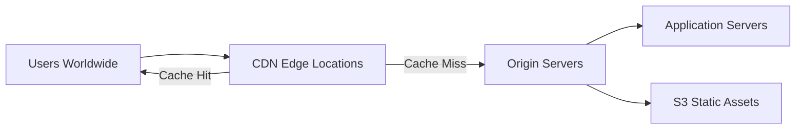

# How to Use Ansible to Deploy Applications Behind CDN

Author: [nawazdhandala](https://www.github.com/nawazdhandala)

Tags: Ansible, CDN, CloudFront, Deployment, Performance

Description: Deploy web applications behind a CDN with Ansible including CloudFront configuration, cache invalidation, and origin server setup.

---

A Content Delivery Network (CDN) caches your application's static assets (and sometimes dynamic content) at edge locations around the world. This reduces latency for users far from your origin servers and offloads a significant amount of traffic. Deploying an application behind a CDN requires coordination: the origin servers need proper cache headers, the CDN needs to be configured with the right caching rules, and after each deployment you may need to invalidate cached content. Ansible can orchestrate all of these steps.

This guide covers deploying applications behind a CDN with Ansible, including origin server configuration, CDN cache management, and deployment workflows that account for caching.

## CDN Architecture



The CDN sits between your users and your origin servers. On the first request for a resource, the CDN fetches it from the origin and caches it. Subsequent requests are served from the edge cache, which is geographically closer to the user.

## Project Structure

```
cdn-deploy/
  inventory/
    production.yml
  group_vars/
    all.yml
  roles/
    origin_server/
      tasks/
        main.yml
      templates/
        nginx-origin.conf.j2
    cdn_config/
      tasks/
        main.yml
      templates/
        cloudfront-config.json.j2
    deploy/
      tasks/
        main.yml
  deploy.yml
```

## Variables

```yaml
# group_vars/all.yml
app_name: myapp
app_domain: www.example.com
cdn_domain: cdn.example.com
origin_domain: origin.example.com
app_port: 8000
static_dir: /var/www/static

# CDN Configuration
cdn_provider: cloudfront  # cloudfront, cloudflare, or custom
cloudfront_distribution_id: E1ABCDEF123456
aws_region: us-east-1

# Cache configuration
static_cache_max_age: 31536000  # 1 year for hashed assets
html_cache_max_age: 300         # 5 minutes for HTML pages
api_cache_max_age: 0            # No caching for API responses
enable_cache_invalidation: true

# S3 for static asset hosting
use_s3_for_static: true
s3_bucket: myapp-static-assets
s3_prefix: "assets/"
```

## Origin Server Configuration

The origin server needs to send proper cache-control headers so the CDN knows how long to cache each type of content.

```yaml
# roles/origin_server/tasks/main.yml
---
- name: Install Nginx
  apt:
    name: nginx
    state: present
    update_cache: yes

- name: Deploy Nginx origin server configuration
  template:
    src: nginx-origin.conf.j2
    dest: /etc/nginx/sites-available/{{ app_name }}-origin
    mode: '0644'
  notify: reload nginx

- name: Enable origin server site
  file:
    src: /etc/nginx/sites-available/{{ app_name }}-origin
    dest: /etc/nginx/sites-enabled/{{ app_name }}-origin
    state: link
  notify: reload nginx

- name: Remove default Nginx site
  file:
    path: /etc/nginx/sites-enabled/default
    state: absent
  notify: reload nginx
```

## Nginx Origin Configuration

This Nginx configuration is specifically tuned for serving behind a CDN.

```nginx
# roles/origin_server/templates/nginx-origin.conf.j2
server {
    listen 80;
    server_name {{ origin_domain }};

    # Gzip compression for the CDN to cache compressed versions
    gzip on;
    gzip_vary on;
    gzip_proxied any;
    gzip_comp_level 6;
    gzip_min_length 256;
    gzip_types
        text/plain
        text/css
        text/xml
        text/javascript
        application/javascript
        application/json
        application/xml
        image/svg+xml;

    # Static assets with content-hash filenames (e.g., main.a1b2c3.js)
    # These can be cached for a very long time
    location ~* \.(js|css|woff|woff2|ttf|eot)$ {
        root {{ static_dir }};
        expires {{ static_cache_max_age }}s;
        add_header Cache-Control "public, immutable";
        add_header X-Content-Type-Options "nosniff";
        access_log off;
    }

    # Images can be cached long-term
    location ~* \.(png|jpg|jpeg|gif|ico|svg|webp|avif)$ {
        root {{ static_dir }};
        expires {{ static_cache_max_age }}s;
        add_header Cache-Control "public";
        access_log off;
    }

    # HTML pages should have short cache times
    location ~* \.html$ {
        proxy_pass http://127.0.0.1:{{ app_port }};
        proxy_set_header Host $host;
        proxy_set_header X-Real-IP $remote_addr;
        proxy_set_header X-Forwarded-For $proxy_add_x_forwarded_for;
        add_header Cache-Control "public, max-age={{ html_cache_max_age }}, must-revalidate";
    }

    # API endpoints should not be cached
    location /api/ {
        proxy_pass http://127.0.0.1:{{ app_port }};
        proxy_set_header Host $host;
        proxy_set_header X-Real-IP $remote_addr;
        proxy_set_header X-Forwarded-For $proxy_add_x_forwarded_for;
        add_header Cache-Control "no-store, no-cache, must-revalidate";
        add_header Pragma "no-cache";
    }

    # Default location proxies to the application
    location / {
        proxy_pass http://127.0.0.1:{{ app_port }};
        proxy_set_header Host $host;
        proxy_set_header X-Real-IP $remote_addr;
        proxy_set_header X-Forwarded-For $proxy_add_x_forwarded_for;
        proxy_set_header X-Forwarded-Proto $scheme;
        add_header Cache-Control "public, max-age={{ html_cache_max_age }}";
    }

    # Health check endpoint (should not be cached)
    location /health {
        proxy_pass http://127.0.0.1:{{ app_port }};
        add_header Cache-Control "no-store";
        access_log off;
    }
}
```

## CDN Management Tasks

These tasks handle CDN-specific operations like cache invalidation.

```yaml
# roles/cdn_config/tasks/main.yml
---
- name: Install AWS CLI for CloudFront management
  apt:
    name: awscli
    state: present
  when: cdn_provider == "cloudfront"

- name: Upload static assets to S3
  command: >
    aws s3 sync {{ static_dir }}/
    s3://{{ s3_bucket }}/{{ s3_prefix }}
    --cache-control "public, max-age={{ static_cache_max_age }}, immutable"
    --delete
    --region {{ aws_region }}
  when: use_s3_for_static
  register: s3_sync

- name: Display S3 sync results
  debug:
    msg: "{{ s3_sync.stdout_lines | default([]) }}"
  when: use_s3_for_static and s3_sync.changed

- name: Invalidate CloudFront cache after deployment
  command: >
    aws cloudfront create-invalidation
    --distribution-id {{ cloudfront_distribution_id }}
    --paths "/*"
    --region {{ aws_region }}
  register: cf_invalidation
  when:
    - cdn_provider == "cloudfront"
    - enable_cache_invalidation

- name: Display CloudFront invalidation ID
  debug:
    msg: "Cache invalidation submitted: {{ (cf_invalidation.stdout | from_json).Invalidation.Id }}"
  when: cf_invalidation is changed

- name: Wait for CloudFront invalidation to complete
  command: >
    aws cloudfront wait invalidation-completed
    --distribution-id {{ cloudfront_distribution_id }}
    --id {{ (cf_invalidation.stdout | from_json).Invalidation.Id }}
    --region {{ aws_region }}
  when:
    - cf_invalidation is changed
    - wait_for_invalidation | default(false)
```

## Cloudflare Cache Purge

If you use Cloudflare instead of CloudFront:

```yaml
# Purge Cloudflare cache after deployment
- name: Purge Cloudflare cache
  uri:
    url: "https://api.cloudflare.com/client/v4/zones/{{ cloudflare_zone_id }}/purge_cache"
    method: POST
    headers:
      Authorization: "Bearer {{ vault_cloudflare_api_token }}"
      Content-Type: "application/json"
    body_format: json
    body:
      purge_everything: true
    status_code: 200
  when: cdn_provider == "cloudflare"
  no_log: true

# Or purge specific URLs only
- name: Purge specific URLs from Cloudflare cache
  uri:
    url: "https://api.cloudflare.com/client/v4/zones/{{ cloudflare_zone_id }}/purge_cache"
    method: POST
    headers:
      Authorization: "Bearer {{ vault_cloudflare_api_token }}"
      Content-Type: "application/json"
    body_format: json
    body:
      files:
        - "https://{{ app_domain }}/index.html"
        - "https://{{ app_domain }}/manifest.json"
    status_code: 200
  when:
    - cdn_provider == "cloudflare"
    - selective_purge | default(false)
```

## Deployment Playbook

The full deployment playbook coordinates code deployment, static asset uploading, and cache invalidation.

```yaml
# deploy.yml
---
- name: Deploy Application Code
  hosts: app_servers
  become: yes
  serial: 1
  tasks:
    - name: Pull latest code
      git:
        repo: "{{ app_repo }}"
        dest: "{{ app_dir }}"
        version: "{{ app_branch }}"
      register: code_update
      notify: restart application

    - name: Install dependencies and build
      command: "{{ item }}"
      args:
        chdir: "{{ app_dir }}"
      loop:
        - npm ci
        - npm run build
      when: code_update.changed

    - meta: flush_handlers

    - name: Verify application health
      uri:
        url: "http://127.0.0.1:{{ app_port }}/health"
        status_code: 200
      retries: 5
      delay: 10

- name: Configure Origin Server
  hosts: app_servers
  become: yes
  roles:
    - origin_server

- name: Update CDN and Invalidate Cache
  hosts: localhost
  connection: local
  roles:
    - cdn_config
```

## Selective Cache Invalidation

Full cache invalidation is expensive and slow. For most deployments, you only need to invalidate specific paths:

```yaml
# Determine which files changed and invalidate only those
- name: Get list of changed files from Git
  command: "git diff --name-only {{ previous_commit }}..{{ current_commit }}"
  args:
    chdir: "{{ app_dir }}"
  register: changed_files

- name: Build invalidation paths from changed files
  set_fact:
    invalidation_paths: "{{ changed_files.stdout_lines | map('regex_replace', '^public/', '/') | list }}"

- name: Invalidate specific paths in CloudFront
  command: >
    aws cloudfront create-invalidation
    --distribution-id {{ cloudfront_distribution_id }}
    --paths {{ invalidation_paths | join(' ') }}
    --region {{ aws_region }}
  when: invalidation_paths | length > 0
```

## Cache-Busting Strategy

The best approach to CDN caching is to use content hashes in filenames for static assets. This way, you never need to invalidate cached assets because every new version gets a new filename.

```yaml
# Verify build output uses hashed filenames
- name: Check for hashed filenames in build output
  find:
    paths: "{{ static_dir }}/js"
    patterns: "*.[a-f0-9]*.js"
  register: hashed_files

- name: Warn if build output lacks content hashes
  debug:
    msg: "WARNING: Build output does not use content hashes. CDN cache invalidation will be required on every deploy."
  when: hashed_files.files | length == 0
```

## Running the Deployment

```bash
# Full deployment with cache invalidation
ansible-playbook -i inventory/production.yml deploy.yml

# Deploy without cache invalidation (for testing)
ansible-playbook -i inventory/production.yml deploy.yml -e "enable_cache_invalidation=false"

# Deploy and wait for cache invalidation to complete
ansible-playbook -i inventory/production.yml deploy.yml -e "wait_for_invalidation=true"

# Upload only static assets to S3
ansible-playbook -i inventory/production.yml deploy.yml --tags cdn
```

## Wrapping Up

Deploying behind a CDN adds a caching layer that improves performance but requires careful management during deployments. This Ansible playbook handles the full workflow: configuring origin servers with proper cache headers, uploading static assets to S3, and invalidating CDN caches after deployment. The best strategy is to use content-hashed filenames for static assets so that CDN cache invalidation is only needed for HTML and API responses. Whether you use CloudFront, Cloudflare, or another CDN provider, Ansible coordinates the deployment steps to ensure your users always see the latest version of your application.
