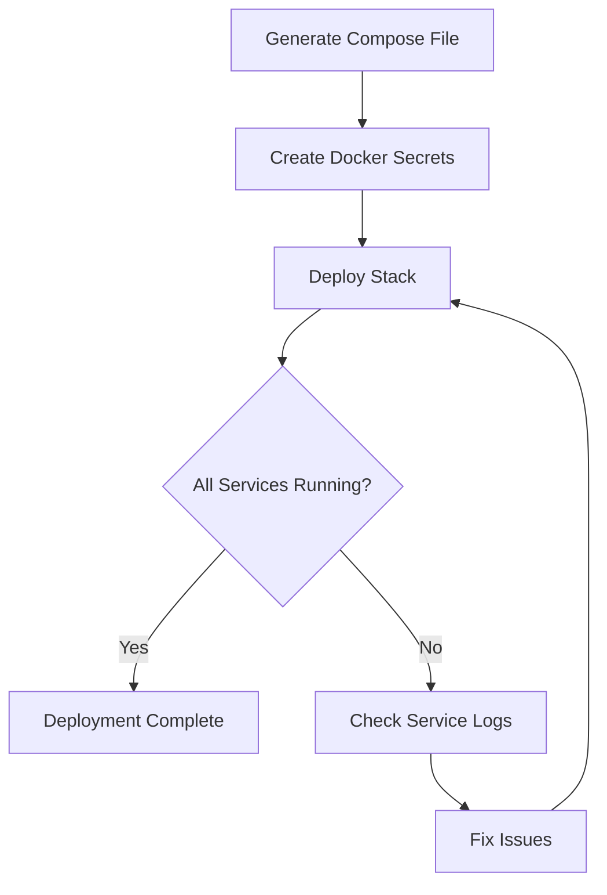

# How to Use Ansible to Deploy Docker Stack

Author: [nawazdhandala](https://www.github.com/nawazdhandala)

Tags: Ansible, Docker, Swarm, Stack, Deployment

Description: Deploy and manage Docker Stacks on Swarm clusters using Ansible with compose files and the docker_stack module.

---

Docker Stacks let you define multi-service applications using Compose files and deploy them to a Swarm cluster. Think of it as Docker Compose for production, with built-in scaling, rolling updates, and service discovery. Ansible can manage the entire stack lifecycle, from deploying the initial stack to updating services and tearing things down. This post covers the practical details.

## What is a Docker Stack?

A Docker Stack is a group of interrelated services that share dependencies and can be orchestrated together. You define your stack in a Compose file (version 3+), and Docker Swarm handles distributing the containers across your cluster.

The key difference from regular `docker-compose up` is that stacks run on Swarm, which means you get:

- Multi-node deployment
- Built-in load balancing
- Rolling updates and rollbacks
- Service discovery via DNS
- Resource constraints per service

## Prerequisites

You need a running Docker Swarm cluster and the `community.docker` collection:

```bash
# Install the community.docker collection
ansible-galaxy collection install community.docker
```

The `docker_stack` module needs to run on a Swarm manager node.

## Creating the Compose File with Ansible

First, let us use Ansible to generate the Compose file from a template. This lets you parameterize the stack based on the target environment:

```yaml
# templates/app-stack.yml.j2 - Jinja2 template for the stack compose file
version: "3.8"

services:
  web:
    image: "{{ app_registry }}/frontend:{{ app_version }}"
    deploy:
      replicas: {{ web_replicas }}
      update_config:
        parallelism: 2
        delay: 10s
        failure_action: rollback
      restart_policy:
        condition: on-failure
        delay: 5s
      resources:
        limits:
          cpus: "{{ web_cpu_limit }}"
          memory: "{{ web_memory_limit }}"
    ports:
      - "{{ web_port }}:8080"
    networks:
      - frontend
      - backend
    environment:
      API_URL: "http://api:3000"
      NODE_ENV: "{{ deploy_env }}"

  api:
    image: "{{ app_registry }}/api:{{ app_version }}"
    deploy:
      replicas: {{ api_replicas }}
      update_config:
        parallelism: 1
        delay: 15s
        failure_action: rollback
      restart_policy:
        condition: on-failure
      resources:
        limits:
          cpus: "{{ api_cpu_limit }}"
          memory: "{{ api_memory_limit }}"
    networks:
      - backend
    environment:
      DATABASE_URL: "postgres://{{ db_user }}:{{ db_pass }}@db:5432/{{ db_name }}"
      REDIS_URL: "redis://cache:6379"
    secrets:
      - api_key

  db:
    image: postgres:16
    deploy:
      replicas: 1
      placement:
        constraints:
          - node.labels.storage == ssd
    volumes:
      - db_data:/var/lib/postgresql/data
    networks:
      - backend
    environment:
      POSTGRES_USER: "{{ db_user }}"
      POSTGRES_PASSWORD: "{{ db_pass }}"
      POSTGRES_DB: "{{ db_name }}"

  cache:
    image: redis:7-alpine
    deploy:
      replicas: 1
      resources:
        limits:
          memory: 256M
    networks:
      - backend

networks:
  frontend:
    driver: overlay
  backend:
    driver: overlay
    internal: true

volumes:
  db_data:
    driver: local

secrets:
  api_key:
    external: true
```

## Deploying the Stack

Here is the playbook that generates the compose file and deploys the stack:

```yaml
# deploy_stack.yml - Deploy a Docker stack to Swarm
---
- name: Deploy Application Stack
  hosts: swarm_managers[0]
  become: true
  vars:
    stack_name: myapp
    app_registry: registry.example.com
    app_version: "1.4.0"
    deploy_env: production
    web_replicas: 3
    api_replicas: 2
    web_port: 80
    web_cpu_limit: "0.5"
    web_memory_limit: "256M"
    api_cpu_limit: "1.0"
    api_memory_limit: "512M"
    db_user: appuser
    db_pass: "{{ vault_db_password }}"
    db_name: appdb
    compose_dir: /opt/stacks/{{ stack_name }}

  tasks:
    - name: Create stack directory
      ansible.builtin.file:
        path: "{{ compose_dir }}"
        state: directory
        mode: '0750'

    - name: Generate compose file from template
      ansible.builtin.template:
        src: templates/app-stack.yml.j2
        dest: "{{ compose_dir }}/docker-compose.yml"
        mode: '0640'
      register: compose_file

    - name: Create Docker secret for API key
      community.docker.docker_secret:
        name: api_key
        data: "{{ vault_api_key }}"
        state: present

    - name: Deploy the stack
      community.docker.docker_stack:
        name: "{{ stack_name }}"
        compose:
          - "{{ compose_dir }}/docker-compose.yml"
        state: present
        with_registry_auth: true
      register: stack_deploy

    - name: Show deployment result
      ansible.builtin.debug:
        msg: "Stack {{ stack_name }} deployed successfully"
      when: stack_deploy is changed
```

## Stack Deployment Flow



## Updating a Running Stack

One of the best things about Docker Stacks is rolling updates. When you change the image version and redeploy, Swarm automatically rolls out the update according to the `update_config` in your compose file:

```yaml
# update_stack.yml - Update an existing stack with a new version
---
- name: Update Application Stack
  hosts: swarm_managers[0]
  become: true
  vars:
    stack_name: myapp
    app_version: "1.5.0"  # New version to deploy

  tasks:
    - name: Update compose file with new version
      ansible.builtin.template:
        src: templates/app-stack.yml.j2
        dest: "/opt/stacks/{{ stack_name }}/docker-compose.yml"
        mode: '0640'

    - name: Redeploy the stack (triggers rolling update)
      community.docker.docker_stack:
        name: "{{ stack_name }}"
        compose:
          - "/opt/stacks/{{ stack_name }}/docker-compose.yml"
        state: present
        with_registry_auth: true

    - name: Wait for services to stabilize
      ansible.builtin.pause:
        seconds: 30

    - name: Check service status
      ansible.builtin.command:
        cmd: docker stack services {{ stack_name }}
      register: service_status
      changed_when: false

    - name: Display service status
      ansible.builtin.debug:
        msg: "{{ service_status.stdout_lines }}"
```

## Checking Stack Health

After deployment, verify everything is running as expected:

```yaml
# check_stack.yml - Verify stack services are healthy
---
- name: Verify Stack Health
  hosts: swarm_managers[0]
  become: true
  vars:
    stack_name: myapp

  tasks:
    - name: Get list of services in the stack
      ansible.builtin.command:
        cmd: "docker stack services {{ stack_name }} --format '{{.Name}} {{.Replicas}}'"
      register: stack_services
      changed_when: false

    - name: Parse and validate service replicas
      ansible.builtin.assert:
        that:
          - "'0/' not in item"
        fail_msg: "Service has zero running replicas: {{ item }}"
        success_msg: "{{ item }} - OK"
      loop: "{{ stack_services.stdout_lines }}"

    - name: Check for failed tasks
      ansible.builtin.command:
        cmd: "docker stack ps {{ stack_name }} --filter desired-state=shutdown --format '{{.Name}} {{.Error}}'"
      register: failed_tasks
      changed_when: false

    - name: Report failed tasks
      ansible.builtin.debug:
        msg: "Failed tasks: {{ failed_tasks.stdout_lines }}"
      when: failed_tasks.stdout_lines | length > 0
```

## Environment-Specific Stack Configuration

Use Ansible group variables to define stack parameters per environment:

```yaml
# group_vars/staging.yml - Stack settings for staging
---
web_replicas: 1
api_replicas: 1
web_port: 8080
web_cpu_limit: "0.25"
web_memory_limit: "128M"
api_cpu_limit: "0.5"
api_memory_limit: "256M"
deploy_env: staging
```

```yaml
# group_vars/production.yml - Stack settings for production
---
web_replicas: 5
api_replicas: 3
web_port: 80
web_cpu_limit: "1.0"
web_memory_limit: "512M"
api_cpu_limit: "2.0"
api_memory_limit: "1G"
deploy_env: production
```

Then deploy with the appropriate inventory:

```bash
# Deploy to staging
ansible-playbook deploy_stack.yml -i inventory/staging

# Deploy to production
ansible-playbook deploy_stack.yml -i inventory/production
```

## Removing a Stack

Tearing down a stack is straightforward:

```yaml
# remove_stack.yml - Remove a Docker stack
---
- name: Remove Application Stack
  hosts: swarm_managers[0]
  become: true
  vars:
    stack_name: myapp

  tasks:
    - name: Remove the stack
      community.docker.docker_stack:
        name: "{{ stack_name }}"
        state: absent

    - name: Clean up compose file
      ansible.builtin.file:
        path: "/opt/stacks/{{ stack_name }}"
        state: absent

    - name: Remove unused networks
      ansible.builtin.command:
        cmd: docker network prune -f
      changed_when: true

    - name: Remove Docker secret
      community.docker.docker_secret:
        name: api_key
        state: absent
```

## Summary

Docker Stacks provide a clean way to deploy multi-service applications on Swarm. Ansible adds the infrastructure-as-code layer on top, letting you template your compose files, manage secrets, handle environment-specific configurations, and automate the deployment lifecycle. The `docker_stack` module from the `community.docker` collection handles deployment and removal, while Ansible's templating engine gives you the flexibility to adapt your stack to different environments without duplicating compose files.
