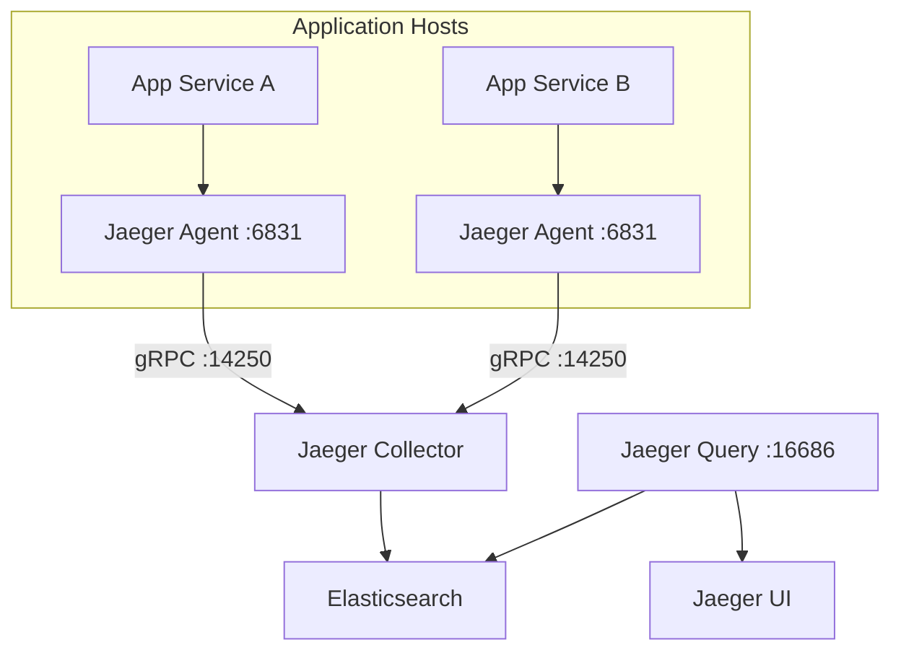

# How to Use Ansible to Deploy Jaeger for Distributed Tracing

Author: [nawazdhandala](https://www.github.com/nawazdhandala)

Tags: Ansible, Jaeger, Distributed Tracing, Observability, Microservices

Description: Deploy Jaeger distributed tracing with Ansible including collector, agent, query service and Elasticsearch storage backend.

---

When your application is split across multiple microservices, debugging a slow request becomes a detective game. Distributed tracing solves this by tracking requests as they flow through each service. Jaeger, originally built at Uber, is one of the most popular open-source tracing platforms. It supports OpenTelemetry natively and provides a clean UI for visualizing trace data.

Deploying Jaeger in production involves several components: agents, collectors, a query service, and a storage backend. Ansible is the right tool for managing this because you need consistent configuration across all these pieces. In this post, I will walk through deploying a production-grade Jaeger setup using Ansible.

## Jaeger Architecture



Jaeger Agents run on each application host and receive spans over UDP. They batch and forward spans to the Collector via gRPC. The Collector validates, indexes, and stores spans in Elasticsearch. The Query service reads from Elasticsearch and serves the web UI.

## Inventory

```ini
# inventory/hosts.ini
[jaeger_collector]
trace-01 ansible_host=10.0.3.10

[jaeger_query]
trace-01 ansible_host=10.0.3.10

[jaeger_agent]
app-01 ansible_host=10.0.1.10
app-02 ansible_host=10.0.1.11
app-03 ansible_host=10.0.1.12

[elasticsearch]
es-01 ansible_host=10.0.3.20
```

## Variables

```yaml
# group_vars/all.yml
jaeger_version: "1.54.0"
jaeger_collector_host: "10.0.3.10"
jaeger_collector_grpc_port: 14250
jaeger_collector_http_port: 14268
jaeger_query_port: 16686
jaeger_agent_compact_port: 6831
jaeger_agent_binary_port: 6832

# Elasticsearch storage
jaeger_storage_type: elasticsearch
jaeger_es_server_url: "http://10.0.3.20:9200"
jaeger_es_index_prefix: "jaeger"
jaeger_es_num_shards: 3
jaeger_es_num_replicas: 1

# Sampling configuration
jaeger_sampling_type: "probabilistic"
jaeger_sampling_param: 0.1  # Sample 10% of traces

# Retention
jaeger_span_storage_max_age: "168h"  # 7 days
```

## Jaeger Collector Role

The Collector is the central component that receives and stores spans.

```yaml
# roles/jaeger-collector/tasks/main.yml
---
- name: Create jaeger system user
  ansible.builtin.user:
    name: jaeger
    system: yes
    shell: /usr/sbin/nologin
    create_home: no

- name: Create Jaeger directories
  ansible.builtin.file:
    path: "{{ item }}"
    state: directory
    owner: jaeger
    group: jaeger
    mode: '0755'
  loop:
    - /etc/jaeger
    - /var/lib/jaeger

- name: Download Jaeger binaries
  ansible.builtin.get_url:
    url: "https://github.com/jaegertracing/jaeger/releases/download/v{{ jaeger_version }}/jaeger-{{ jaeger_version }}-linux-amd64.tar.gz"
    dest: /tmp/jaeger.tar.gz

- name: Extract Jaeger binaries
  ansible.builtin.unarchive:
    src: /tmp/jaeger.tar.gz
    dest: /tmp/
    remote_src: yes

- name: Install collector binary
  ansible.builtin.copy:
    src: "/tmp/jaeger-{{ jaeger_version }}-linux-amd64/jaeger-collector"
    dest: /usr/local/bin/jaeger-collector
    remote_src: yes
    owner: root
    group: root
    mode: '0755'

- name: Deploy collector configuration
  ansible.builtin.template:
    src: collector-env.j2
    dest: /etc/jaeger/collector.env
    owner: jaeger
    group: jaeger
    mode: '0640'
  notify: Restart Jaeger Collector

- name: Deploy sampling configuration
  ansible.builtin.template:
    src: sampling.json.j2
    dest: /etc/jaeger/sampling.json
    owner: jaeger
    group: jaeger
    mode: '0644'
  notify: Restart Jaeger Collector

- name: Deploy collector systemd service
  ansible.builtin.template:
    src: jaeger-collector.service.j2
    dest: /etc/systemd/system/jaeger-collector.service
    mode: '0644'
  notify:
    - Reload systemd
    - Restart Jaeger Collector

- name: Start Jaeger Collector
  ansible.builtin.service:
    name: jaeger-collector
    state: started
    enabled: yes
```

The environment file contains all collector configuration.

```jinja2
# roles/jaeger-collector/templates/collector-env.j2
# Jaeger Collector configuration - Managed by Ansible
SPAN_STORAGE_TYPE={{ jaeger_storage_type }}
ES_SERVER_URLS={{ jaeger_es_server_url }}
ES_INDEX_PREFIX={{ jaeger_es_index_prefix }}
ES_NUM_SHARDS={{ jaeger_es_num_shards }}
ES_NUM_REPLICAS={{ jaeger_es_num_replicas }}
COLLECTOR_GRPC_HOST_PORT=:{{ jaeger_collector_grpc_port }}
COLLECTOR_HTTP_HOST_PORT=:{{ jaeger_collector_http_port }}
SAMPLING_STRATEGIES_FILE=/etc/jaeger/sampling.json
LOG_LEVEL=info
```

The sampling strategy determines what percentage of traces get stored.

```jinja2
# roles/jaeger-collector/templates/sampling.json.j2
{
  "service_strategies": [
    {
      "service": "default",
      "type": "{{ jaeger_sampling_type }}",
      "param": {{ jaeger_sampling_param }}
    }

,
    {
      "service": "{{ service.name }}",
      "type": "{{ service.type | default('probabilistic') }}",
      "param": {{ service.param }}
    }


  ],
  "default_strategy": {
    "type": "{{ jaeger_sampling_type }}",
    "param": {{ jaeger_sampling_param }}
  }
}
```

The systemd service file for the collector.

```jinja2
# roles/jaeger-collector/templates/jaeger-collector.service.j2
[Unit]
Description=Jaeger Collector
Wants=network-online.target
After=network-online.target

[Service]
User=jaeger
Group=jaeger
Type=simple
EnvironmentFile=/etc/jaeger/collector.env
ExecStart=/usr/local/bin/jaeger-collector
Restart=always
RestartSec=5
LimitNOFILE=65536

[Install]
WantedBy=multi-user.target
```

## Jaeger Agent Role

The Agent runs on every application host as a local daemon.

```yaml
# roles/jaeger-agent/tasks/main.yml
---
- name: Create jaeger system user
  ansible.builtin.user:
    name: jaeger
    system: yes
    shell: /usr/sbin/nologin
    create_home: no

- name: Download Jaeger agent binary
  ansible.builtin.get_url:
    url: "https://github.com/jaegertracing/jaeger/releases/download/v{{ jaeger_version }}/jaeger-{{ jaeger_version }}-linux-amd64.tar.gz"
    dest: /tmp/jaeger.tar.gz

- name: Extract Jaeger binaries
  ansible.builtin.unarchive:
    src: /tmp/jaeger.tar.gz
    dest: /tmp/
    remote_src: yes

- name: Install agent binary
  ansible.builtin.copy:
    src: "/tmp/jaeger-{{ jaeger_version }}-linux-amd64/jaeger-agent"
    dest: /usr/local/bin/jaeger-agent
    remote_src: yes
    owner: root
    group: root
    mode: '0755'

- name: Deploy agent systemd service
  ansible.builtin.template:
    src: jaeger-agent.service.j2
    dest: /etc/systemd/system/jaeger-agent.service
    mode: '0644'
  notify:
    - Reload systemd
    - Restart Jaeger Agent

- name: Start Jaeger Agent
  ansible.builtin.service:
    name: jaeger-agent
    state: started
    enabled: yes
```

```jinja2
# roles/jaeger-agent/templates/jaeger-agent.service.j2
[Unit]
Description=Jaeger Agent
Wants=network-online.target
After=network-online.target

[Service]
User=jaeger
Group=jaeger
Type=simple
ExecStart=/usr/local/bin/jaeger-agent \
  --reporter.grpc.host-port={{ jaeger_collector_host }}:{{ jaeger_collector_grpc_port }} \
  --processor.jaeger-compact.server-host-port=:{{ jaeger_agent_compact_port }} \
  --processor.jaeger-binary.server-host-port=:{{ jaeger_agent_binary_port }} \
  --log-level=info
Restart=always
RestartSec=5

[Install]
WantedBy=multi-user.target
```

## Jaeger Query Role

The Query service serves the web UI for exploring traces.

```yaml
# roles/jaeger-query/tasks/main.yml
---
- name: Install query binary
  ansible.builtin.copy:
    src: "/tmp/jaeger-{{ jaeger_version }}-linux-amd64/jaeger-query"
    dest: /usr/local/bin/jaeger-query
    remote_src: yes
    owner: root
    group: root
    mode: '0755'

- name: Deploy query configuration
  ansible.builtin.template:
    src: query-env.j2
    dest: /etc/jaeger/query.env
    owner: jaeger
    group: jaeger
    mode: '0640'
  notify: Restart Jaeger Query

- name: Deploy query systemd service
  ansible.builtin.template:
    src: jaeger-query.service.j2
    dest: /etc/systemd/system/jaeger-query.service
    mode: '0644'
  notify:
    - Reload systemd
    - Restart Jaeger Query

- name: Start Jaeger Query
  ansible.builtin.service:
    name: jaeger-query
    state: started
    enabled: yes
```

```jinja2
# roles/jaeger-query/templates/query-env.j2
SPAN_STORAGE_TYPE={{ jaeger_storage_type }}
ES_SERVER_URLS={{ jaeger_es_server_url }}
ES_INDEX_PREFIX={{ jaeger_es_index_prefix }}
QUERY_HTTP_HOST_PORT=:{{ jaeger_query_port }}
LOG_LEVEL=info
```

## Elasticsearch Index Management

Jaeger creates daily indexes that need periodic cleanup. Deploy the jaeger-es-index-cleaner as a cron job.

```yaml
# roles/jaeger-collector/tasks/index-cleaner.yml
---
- name: Install es-index-cleaner binary
  ansible.builtin.copy:
    src: "/tmp/jaeger-{{ jaeger_version }}-linux-amd64/jaeger-es-index-cleaner"
    dest: /usr/local/bin/jaeger-es-index-cleaner
    remote_src: yes
    owner: root
    group: root
    mode: '0755'

- name: Create cron job for index cleanup
  ansible.builtin.cron:
    name: "Jaeger Elasticsearch index cleanup"
    hour: "3"
    minute: "0"
    job: "/usr/local/bin/jaeger-es-index-cleaner 7 {{ jaeger_es_server_url }} --index-prefix {{ jaeger_es_index_prefix }} >> /var/log/jaeger/index-cleaner.log 2>&1"
    user: jaeger
```

## Main Playbook

```yaml
# site.yml
---
- name: Deploy Jaeger Collector
  hosts: jaeger_collector
  become: yes
  roles:
    - jaeger-collector

- name: Deploy Jaeger Query
  hosts: jaeger_query
  become: yes
  roles:
    - jaeger-query

- name: Deploy Jaeger Agents on application hosts
  hosts: jaeger_agent
  become: yes
  roles:
    - jaeger-agent
```

## Handlers

```yaml
# roles/jaeger-collector/handlers/main.yml
---
- name: Reload systemd
  ansible.builtin.systemd:
    daemon_reload: yes

- name: Restart Jaeger Collector
  ansible.builtin.service:
    name: jaeger-collector
    state: restarted

# roles/jaeger-query/handlers/main.yml
---
- name: Reload systemd
  ansible.builtin.systemd:
    daemon_reload: yes

- name: Restart Jaeger Query
  ansible.builtin.service:
    name: jaeger-query
    state: restarted

# roles/jaeger-agent/handlers/main.yml
---
- name: Reload systemd
  ansible.builtin.systemd:
    daemon_reload: yes

- name: Restart Jaeger Agent
  ansible.builtin.service:
    name: jaeger-agent
    state: restarted
```

## Verification

After deployment, confirm the tracing pipeline works end to end.

```yaml
# verify-jaeger.yml
---
- name: Verify Jaeger deployment
  hosts: jaeger_collector
  tasks:
    - name: Check collector health
      ansible.builtin.uri:
        url: "http://localhost:14269/health"
        method: GET
        status_code: 200

    - name: Check query service health
      ansible.builtin.uri:
        url: "http://localhost:{{ jaeger_query_port }}"
        method: GET
        status_code: 200

- name: Verify agents
  hosts: jaeger_agent
  tasks:
    - name: Check agent is listening
      ansible.builtin.wait_for:
        port: "{{ jaeger_agent_compact_port }}"
        state: started
        timeout: 10
```

```bash
# Deploy the entire Jaeger stack
ansible-playbook -i inventory/hosts.ini site.yml

# Verify deployment
ansible-playbook -i inventory/hosts.ini verify-jaeger.yml
```

## Wrapping Up

With this Ansible setup, you get a fully automated Jaeger deployment that covers all the components needed for production distributed tracing. The key things to tune for your environment are the sampling rate (start at 10% and adjust based on volume), Elasticsearch index lifecycle (7 days is a good default), and the number of collector replicas (scale based on span ingestion rate). Applications can send traces to localhost:6831 via Jaeger client libraries or OpenTelemetry SDK, and the local agent handles buffering and forwarding to the collector.
