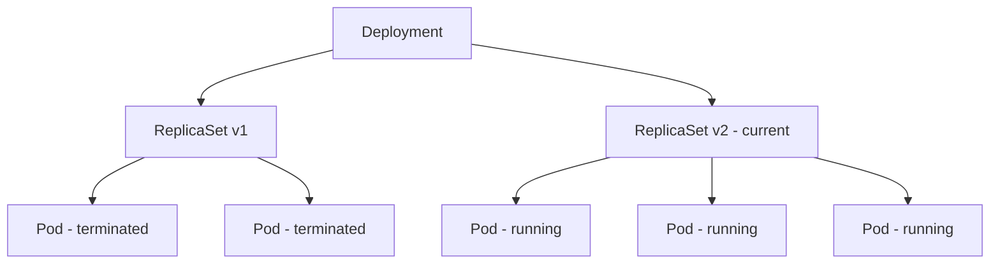

# How to Use Ansible to Deploy Kubernetes Deployments

Author: [nawazdhandala](https://www.github.com/nawazdhandala)

Tags: Ansible, Kubernetes, Deployments, Rolling Updates, DevOps

Description: Create, update, and manage Kubernetes Deployments with Ansible including rolling updates, rollbacks, and scaling strategies.

---

The Deployment is the most commonly used Kubernetes workload resource. It manages a set of identical pods, handles rolling updates when you change the pod template, and automatically replaces pods that fail. Using Ansible to manage Deployments gives you the benefits of infrastructure-as-code: version-controlled configurations, parameterized manifests, and integration with your existing automation workflows.

## Anatomy of a Kubernetes Deployment

A Deployment creates a ReplicaSet, which in turn manages the actual pods. When you update a Deployment, it creates a new ReplicaSet and gradually shifts pods from the old one to the new one.



## Creating a Basic Deployment

Here is a straightforward Deployment creation:

```yaml
# basic_deployment.yml - Create a simple Kubernetes Deployment
---
- name: Deploy Application to Kubernetes
  hosts: localhost
  connection: local
  vars:
    app_name: webapp
    namespace: production
    image: registry.example.com/webapp:1.0.0
    replicas: 3

  tasks:
    - name: Create the Deployment
      kubernetes.core.k8s:
        state: present
        definition:
          apiVersion: apps/v1
          kind: Deployment
          metadata:
            name: "{{ app_name }}"
            namespace: "{{ namespace }}"
            labels:
              app: "{{ app_name }}"
          spec:
            replicas: "{{ replicas }}"
            selector:
              matchLabels:
                app: "{{ app_name }}"
            template:
              metadata:
                labels:
                  app: "{{ app_name }}"
              spec:
                containers:
                  - name: "{{ app_name }}"
                    image: "{{ image }}"
                    ports:
                      - containerPort: 8080
                        name: http
```

## Production-Ready Deployment

A production Deployment needs resource limits, health checks, security contexts, and proper update strategies:

```yaml
# production_deployment.yml - Full production Deployment
---
- name: Deploy Production Application
  hosts: localhost
  connection: local
  vars:
    app_name: api-server
    namespace: production
    image: registry.example.com/api:2.3.0
    replicas: 5

  tasks:
    - name: Create production Deployment
      kubernetes.core.k8s:
        state: present
        wait: true
        wait_timeout: 300
        wait_condition:
          type: Available
          status: "True"
        definition:
          apiVersion: apps/v1
          kind: Deployment
          metadata:
            name: "{{ app_name }}"
            namespace: "{{ namespace }}"
            labels:
              app: "{{ app_name }}"
              version: "2.3.0"
            annotations:
              kubernetes.io/change-cause: "Deployed version 2.3.0 via Ansible"
          spec:
            replicas: "{{ replicas }}"
            revisionHistoryLimit: 10
            selector:
              matchLabels:
                app: "{{ app_name }}"
            strategy:
              type: RollingUpdate
              rollingUpdate:
                maxSurge: 1
                maxUnavailable: 0
            template:
              metadata:
                labels:
                  app: "{{ app_name }}"
                  version: "2.3.0"
              spec:
                serviceAccountName: "{{ app_name }}"
                securityContext:
                  runAsNonRoot: true
                  runAsUser: 1000
                  fsGroup: 1000
                terminationGracePeriodSeconds: 60
                containers:
                  - name: "{{ app_name }}"
                    image: "{{ image }}"
                    imagePullPolicy: Always
                    ports:
                      - containerPort: 8080
                        name: http
                      - containerPort: 9090
                        name: metrics
                    env:
                      - name: POD_NAME
                        valueFrom:
                          fieldRef:
                            fieldPath: metadata.name
                      - name: POD_NAMESPACE
                        valueFrom:
                          fieldRef:
                            fieldPath: metadata.namespace
                    envFrom:
                      - configMapRef:
                          name: "{{ app_name }}-config"
                      - secretRef:
                          name: "{{ app_name }}-secrets"
                    resources:
                      requests:
                        cpu: 250m
                        memory: 256Mi
                      limits:
                        cpu: "1"
                        memory: 512Mi
                    readinessProbe:
                      httpGet:
                        path: /ready
                        port: 8080
                      initialDelaySeconds: 5
                      periodSeconds: 10
                      successThreshold: 1
                      failureThreshold: 3
                    livenessProbe:
                      httpGet:
                        path: /health
                        port: 8080
                      initialDelaySeconds: 30
                      periodSeconds: 15
                      failureThreshold: 3
                    startupProbe:
                      httpGet:
                        path: /health
                        port: 8080
                      failureThreshold: 30
                      periodSeconds: 10
                    volumeMounts:
                      - name: config-volume
                        mountPath: /app/config
                        readOnly: true
                      - name: tmp
                        mountPath: /tmp
                    securityContext:
                      allowPrivilegeEscalation: false
                      readOnlyRootFilesystem: true
                      capabilities:
                        drop:
                          - ALL
                volumes:
                  - name: config-volume
                    configMap:
                      name: "{{ app_name }}-config"
                  - name: tmp
                    emptyDir: {}
                topologySpreadConstraints:
                  - maxSkew: 1
                    topologyKey: kubernetes.io/hostname
                    whenUnsatisfiable: DoNotSchedule
                    labelSelector:
                      matchLabels:
                        app: "{{ app_name }}"
```

Let me break down the key sections:

- **strategy.rollingUpdate.maxUnavailable: 0** ensures no downtime during updates by keeping all old pods running until new ones are ready.
- **startupProbe** gives slow-starting applications time to initialize before liveness checks begin.
- **topologySpreadConstraints** distributes pods evenly across nodes for high availability.
- **readOnlyRootFilesystem** plus a writable `/tmp` emptyDir is a security best practice.

## Rolling Updates

When you change the image version and re-run the playbook, Kubernetes performs a rolling update automatically:

```yaml
# rolling_update.yml - Update Deployment to new version
---
- name: Rolling Update Deployment
  hosts: localhost
  connection: local
  vars:
    app_name: api-server
    namespace: production
    new_version: "2.4.0"
    registry: registry.example.com

  tasks:
    - name: Get current deployment
      kubernetes.core.k8s_info:
        kind: Deployment
        namespace: "{{ namespace }}"
        name: "{{ app_name }}"
      register: current_deploy

    - name: Show current version
      ansible.builtin.debug:
        msg: "Current image: {{ current_deploy.resources[0].spec.template.spec.containers[0].image }}"

    - name: Update deployment image
      kubernetes.core.k8s:
        state: present
        definition:
          apiVersion: apps/v1
          kind: Deployment
          metadata:
            name: "{{ app_name }}"
            namespace: "{{ namespace }}"
            annotations:
              kubernetes.io/change-cause: "Updated to version {{ new_version }}"
          spec:
            template:
              metadata:
                labels:
                  app: "{{ app_name }}"
                  version: "{{ new_version }}"
              spec:
                containers:
                  - name: "{{ app_name }}"
                    image: "{{ registry }}/api:{{ new_version }}"
        wait: true
        wait_timeout: 300

    - name: Verify rollout status
      kubernetes.core.k8s_info:
        kind: Deployment
        namespace: "{{ namespace }}"
        name: "{{ app_name }}"
      register: updated_deploy

    - name: Confirm update
      ansible.builtin.debug:
        msg: "Updated to {{ updated_deploy.resources[0].spec.template.spec.containers[0].image }} - Ready: {{ updated_deploy.resources[0].status.readyReplicas }}/{{ updated_deploy.resources[0].spec.replicas }}"
```

## Rollback

If the new version has problems, roll back to the previous revision:

```yaml
# rollback.yml - Rollback a Deployment
---
- name: Rollback Deployment
  hosts: localhost
  connection: local
  vars:
    app_name: api-server
    namespace: production

  tasks:
    - name: Check rollout history
      ansible.builtin.command:
        cmd: "kubectl rollout history deployment/{{ app_name }} -n {{ namespace }}"
      register: rollout_history
      changed_when: false

    - name: Display rollout history
      ansible.builtin.debug:
        msg: "{{ rollout_history.stdout_lines }}"

    - name: Rollback to previous revision
      ansible.builtin.command:
        cmd: "kubectl rollout undo deployment/{{ app_name }} -n {{ namespace }}"
      register: rollback_result
      changed_when: true

    - name: Wait for rollback to complete
      ansible.builtin.command:
        cmd: "kubectl rollout status deployment/{{ app_name }} -n {{ namespace }} --timeout=300s"
      changed_when: false

    - name: Verify rolled-back version
      kubernetes.core.k8s_info:
        kind: Deployment
        namespace: "{{ namespace }}"
        name: "{{ app_name }}"
      register: rollback_verify

    - name: Report rollback
      ansible.builtin.debug:
        msg: "Rolled back to: {{ rollback_verify.resources[0].spec.template.spec.containers[0].image }}"
```

## Scaling Deployments

Scale replicas up or down:

```yaml
# scale.yml - Scale a Deployment
---
- name: Scale Deployment
  hosts: localhost
  connection: local
  vars:
    app_name: api-server
    namespace: production

  tasks:
    - name: Scale to 10 replicas
      kubernetes.core.k8s_scale:
        kind: Deployment
        namespace: "{{ namespace }}"
        name: "{{ app_name }}"
        replicas: 10
        wait: true
        wait_timeout: 120

    - name: Verify scaling
      kubernetes.core.k8s_info:
        kind: Deployment
        namespace: "{{ namespace }}"
        name: "{{ app_name }}"
      register: scaled

    - name: Report replica count
      ansible.builtin.debug:
        msg: "Replicas: {{ scaled.resources[0].status.readyReplicas }}/{{ scaled.resources[0].spec.replicas }}"
```

## Deploying with Accompanying Resources

A Deployment rarely exists alone. Here is a complete application deployment:

```yaml
# full_deploy.yml - Deploy application with all supporting resources
---
- name: Full Application Deployment
  hosts: localhost
  connection: local
  vars:
    app_name: webapp
    namespace: production
    app_version: "3.0.0"
    domain: app.example.com

  tasks:
    - name: Create ConfigMap
      kubernetes.core.k8s:
        state: present
        definition:
          apiVersion: v1
          kind: ConfigMap
          metadata:
            name: "{{ app_name }}-config"
            namespace: "{{ namespace }}"
          data:
            LOG_LEVEL: "info"
            PORT: "8080"

    - name: Create Secret
      kubernetes.core.k8s:
        state: present
        definition:
          apiVersion: v1
          kind: Secret
          metadata:
            name: "{{ app_name }}-secrets"
            namespace: "{{ namespace }}"
          type: Opaque
          stringData:
            DB_PASSWORD: "{{ vault_db_password }}"

    - name: Create Deployment
      kubernetes.core.k8s:
        state: present
        template: templates/deployment.yaml.j2
        wait: true
        wait_timeout: 300

    - name: Create Service
      kubernetes.core.k8s:
        state: present
        definition:
          apiVersion: v1
          kind: Service
          metadata:
            name: "{{ app_name }}"
            namespace: "{{ namespace }}"
          spec:
            selector:
              app: "{{ app_name }}"
            ports:
              - port: 80
                targetPort: 8080
                protocol: TCP

    - name: Create Ingress
      kubernetes.core.k8s:
        state: present
        definition:
          apiVersion: networking.k8s.io/v1
          kind: Ingress
          metadata:
            name: "{{ app_name }}"
            namespace: "{{ namespace }}"
            annotations:
              cert-manager.io/cluster-issuer: letsencrypt-prod
          spec:
            ingressClassName: nginx
            tls:
              - hosts:
                  - "{{ domain }}"
                secretName: "{{ app_name }}-tls"
            rules:
              - host: "{{ domain }}"
                http:
                  paths:
                    - path: /
                      pathType: Prefix
                      backend:
                        service:
                          name: "{{ app_name }}"
                          port:
                            number: 80

    - name: Create HorizontalPodAutoscaler
      kubernetes.core.k8s:
        state: present
        definition:
          apiVersion: autoscaling/v2
          kind: HorizontalPodAutoscaler
          metadata:
            name: "{{ app_name }}"
            namespace: "{{ namespace }}"
          spec:
            scaleTargetRef:
              apiVersion: apps/v1
              kind: Deployment
              name: "{{ app_name }}"
            minReplicas: 3
            maxReplicas: 20
            metrics:
              - type: Resource
                resource:
                  name: cpu
                  target:
                    type: Utilization
                    averageUtilization: 70
              - type: Resource
                resource:
                  name: memory
                  target:
                    type: Utilization
                    averageUtilization: 80

    - name: Create PodDisruptionBudget
      kubernetes.core.k8s:
        state: present
        definition:
          apiVersion: policy/v1
          kind: PodDisruptionBudget
          metadata:
            name: "{{ app_name }}"
            namespace: "{{ namespace }}"
          spec:
            minAvailable: 2
            selector:
              matchLabels:
                app: "{{ app_name }}"
```

## Deployment Verification

After deploying, run comprehensive checks:

```yaml
# verify_deployment.yml - Verify deployment is healthy
---
- name: Verify Deployment
  hosts: localhost
  connection: local
  vars:
    app_name: webapp
    namespace: production

  tasks:
    - name: Get deployment status
      kubernetes.core.k8s_info:
        kind: Deployment
        namespace: "{{ namespace }}"
        name: "{{ app_name }}"
      register: deployment

    - name: Verify all replicas are ready
      ansible.builtin.assert:
        that:
          - deployment.resources[0].status.readyReplicas == deployment.resources[0].spec.replicas
          - deployment.resources[0].status.unavailableReplicas | default(0) == 0
        fail_msg: "Not all replicas are ready"
        success_msg: "All {{ deployment.resources[0].spec.replicas }} replicas are ready"

    - name: Get pods for the deployment
      kubernetes.core.k8s_info:
        kind: Pod
        namespace: "{{ namespace }}"
        label_selectors:
          - "app={{ app_name }}"
      register: pods

    - name: Verify all pods are running
      ansible.builtin.assert:
        that:
          - item.status.phase == "Running"
        fail_msg: "Pod {{ item.metadata.name }} is {{ item.status.phase }}"
        quiet: true
      loop: "{{ pods.resources }}"
      loop_control:
        label: "{{ item.metadata.name }}"

    - name: Check for recent restarts
      ansible.builtin.debug:
        msg: "WARNING: {{ item.metadata.name }} has {{ item.status.containerStatuses[0].restartCount }} restarts"
      loop: "{{ pods.resources }}"
      loop_control:
        label: "{{ item.metadata.name }}"
      when: (item.status.containerStatuses[0].restartCount | int) > 0
```

## Summary

Kubernetes Deployments managed through Ansible give you a powerful combination: Kubernetes handles the runtime orchestration (rolling updates, self-healing, scaling), while Ansible handles the configuration management (parameterized manifests, secret injection, environment-specific values, deployment verification). Always use `wait: true` to ensure your playbook does not proceed until the deployment is actually ready, set proper rolling update strategies to avoid downtime, and include verification tasks that confirm the deployment is healthy before declaring success.
