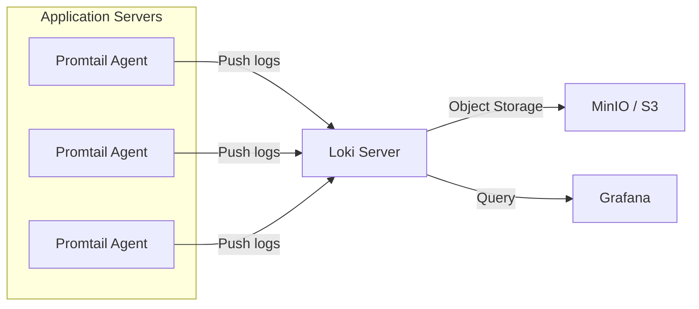

# How to Use Ansible to Deploy Loki for Log Management

Author: [nawazdhandala](https://www.github.com/nawazdhandala)

Tags: Ansible, Loki, Logging, Grafana, DevOps

Description: Deploy Grafana Loki and Promtail for lightweight log management using Ansible playbooks with production-ready configuration.

---

If you have tried running Elasticsearch just for log storage and found it demanding too many resources, Loki is the answer. Built by Grafana Labs, Loki takes a fundamentally different approach to log management. Instead of indexing the full text of every log line, it only indexes metadata (labels), which makes it dramatically cheaper to run. Think of it as "Prometheus, but for logs."

Deploying Loki along with Promtail (the log shipping agent) across your infrastructure is a perfect fit for Ansible. In this guide, I will walk through deploying a complete Loki stack that includes the Loki server, Promtail agents on each node, and Grafana for log exploration.

## Architecture



Promtail runs on every server, tails log files, attaches labels, and pushes them to Loki. Loki stores the chunks in object storage (S3 or MinIO) and the index in BoltDB. Grafana provides LogQL for querying.

## Inventory

```ini
# inventory/hosts.ini
[loki]
loki-01 ansible_host=10.0.2.10

[promtail]
app-01 ansible_host=10.0.1.10
app-02 ansible_host=10.0.1.11
app-03 ansible_host=10.0.1.12
db-01 ansible_host=10.0.1.20

[grafana]
loki-01 ansible_host=10.0.2.10
```

## Variables

```yaml
# group_vars/all.yml
loki_version: "2.9.4"
promtail_version: "2.9.4"
loki_http_port: 3100
loki_grpc_port: 9096
loki_data_dir: /var/lib/loki
loki_retention_period: 744h  # 31 days
loki_server_url: "http://10.0.2.10:3100"

# Storage backend - local filesystem for single node, S3 for production
loki_storage_backend: filesystem
# loki_s3_endpoint: "s3.amazonaws.com"
# loki_s3_bucket: "company-loki-logs"
# loki_s3_region: "us-east-1"

# Promtail log paths to scrape
promtail_scrape_configs:
  - job_name: system
    paths:
      - /var/log/syslog
      - /var/log/auth.log
      - /var/log/kern.log
  - job_name: nginx
    paths:
      - /var/log/nginx/access.log
      - /var/log/nginx/error.log
  - job_name: application
    paths:
      - /var/log/myapp/*.log
```

## Loki Server Role

Install and configure the Loki server.

```yaml
# roles/loki/tasks/main.yml
---
- name: Create loki system user
  ansible.builtin.user:
    name: loki
    system: yes
    shell: /usr/sbin/nologin
    create_home: no

- name: Create Loki directories
  ansible.builtin.file:
    path: "{{ item }}"
    state: directory
    owner: loki
    group: loki
    mode: '0755'
  loop:
    - /etc/loki
    - "{{ loki_data_dir }}"
    - "{{ loki_data_dir }}/chunks"
    - "{{ loki_data_dir }}/boltdb-shipper-active"
    - "{{ loki_data_dir }}/boltdb-shipper-cache"
    - "{{ loki_data_dir }}/rules"

- name: Download Loki binary
  ansible.builtin.get_url:
    url: "https://github.com/grafana/loki/releases/download/v{{ loki_version }}/loki-linux-amd64.zip"
    dest: /tmp/loki.zip

- name: Install unzip
  ansible.builtin.package:
    name: unzip
    state: present

- name: Extract Loki binary
  ansible.builtin.unarchive:
    src: /tmp/loki.zip
    dest: /usr/local/bin/
    remote_src: yes
    mode: '0755'

- name: Rename binary if needed
  ansible.builtin.command:
    cmd: mv /usr/local/bin/loki-linux-amd64 /usr/local/bin/loki
    creates: /usr/local/bin/loki

- name: Deploy Loki configuration
  ansible.builtin.template:
    src: loki-config.yml.j2
    dest: /etc/loki/loki-config.yml
    owner: loki
    group: loki
    mode: '0644'
  notify: Restart Loki

- name: Deploy Loki systemd service
  ansible.builtin.template:
    src: loki.service.j2
    dest: /etc/systemd/system/loki.service
    mode: '0644'
  notify:
    - Reload systemd
    - Restart Loki

- name: Start and enable Loki
  ansible.builtin.service:
    name: loki
    state: started
    enabled: yes

- name: Wait for Loki to be ready
  ansible.builtin.uri:
    url: "http://localhost:{{ loki_http_port }}/ready"
    method: GET
    status_code: 200
  register: loki_ready
  retries: 30
  delay: 5
  until: loki_ready.status == 200
```

The Loki configuration template handles both filesystem and S3 storage backends.

```jinja2
# roles/loki/templates/loki-config.yml.j2
# Loki configuration - Managed by Ansible
auth_enabled: false

server:
  http_listen_port: {{ loki_http_port }}
  grpc_listen_port: {{ loki_grpc_port }}
  log_level: info

common:
  path_prefix: {{ loki_data_dir }}
  replication_factor: 1
  ring:
    kvstore:
      store: inmemory

ingester:
  wal:
    enabled: true
    dir: {{ loki_data_dir }}/wal
  lifecycler:
    ring:
      replication_factor: 1
  chunk_idle_period: 1h
  max_chunk_age: 1h
  chunk_target_size: 1048576
  chunk_retain_period: 30s

schema_config:
  configs:
    - from: 2024-01-01
      store: boltdb-shipper
      object_store: {{ loki_storage_backend }}
      schema: v12
      index:
        prefix: index_
        period: 24h

storage_config:

  boltdb_shipper:
    active_index_directory: {{ loki_data_dir }}/boltdb-shipper-active
    cache_location: {{ loki_data_dir }}/boltdb-shipper-cache
    shared_store: filesystem
  filesystem:
    directory: {{ loki_data_dir }}/chunks

  boltdb_shipper:
    active_index_directory: {{ loki_data_dir }}/boltdb-shipper-active
    cache_location: {{ loki_data_dir }}/boltdb-shipper-cache
    shared_store: s3
  aws:
    s3: s3://{{ loki_s3_region }}/{{ loki_s3_bucket }}
    endpoint: {{ loki_s3_endpoint }}


limits_config:
  reject_old_samples: true
  reject_old_samples_max_age: 168h
  max_entries_limit_per_query: 5000
  ingestion_rate_mb: 10
  ingestion_burst_size_mb: 20

compactor:
  working_directory: {{ loki_data_dir }}/compactor
  shared_store: {{ loki_storage_backend }}
  retention_enabled: true

chunk_store_config:
  max_look_back_period: {{ loki_retention_period }}

table_manager:
  retention_deletes_enabled: true
  retention_period: {{ loki_retention_period }}

ruler:
  storage:
    type: local
    local:
      directory: {{ loki_data_dir }}/rules
  rule_path: {{ loki_data_dir }}/rules-temp
  ring:
    kvstore:
      store: inmemory
  enable_api: true
```

The systemd service for Loki.

```jinja2
# roles/loki/templates/loki.service.j2
[Unit]
Description=Loki Log Aggregation System
Wants=network-online.target
After=network-online.target

[Service]
User=loki
Group=loki
Type=simple
ExecStart=/usr/local/bin/loki -config.file=/etc/loki/loki-config.yml
Restart=always
RestartSec=5
LimitNOFILE=65536

[Install]
WantedBy=multi-user.target
```

## Promtail Role

Promtail runs on every server that needs to ship logs to Loki.

```yaml
# roles/promtail/tasks/main.yml
---
- name: Create promtail system user
  ansible.builtin.user:
    name: promtail
    system: yes
    shell: /usr/sbin/nologin
    create_home: no
    groups: adm,syslog
    append: yes

- name: Create Promtail directories
  ansible.builtin.file:
    path: "{{ item }}"
    state: directory
    owner: promtail
    group: promtail
    mode: '0755'
  loop:
    - /etc/promtail
    - /var/lib/promtail

- name: Download Promtail binary
  ansible.builtin.get_url:
    url: "https://github.com/grafana/loki/releases/download/v{{ promtail_version }}/promtail-linux-amd64.zip"
    dest: /tmp/promtail.zip

- name: Extract Promtail binary
  ansible.builtin.unarchive:
    src: /tmp/promtail.zip
    dest: /usr/local/bin/
    remote_src: yes
    mode: '0755'

- name: Rename binary if needed
  ansible.builtin.command:
    cmd: mv /usr/local/bin/promtail-linux-amd64 /usr/local/bin/promtail
    creates: /usr/local/bin/promtail

- name: Deploy Promtail configuration
  ansible.builtin.template:
    src: promtail-config.yml.j2
    dest: /etc/promtail/promtail-config.yml
    owner: promtail
    group: promtail
    mode: '0644'
  notify: Restart Promtail

- name: Deploy Promtail systemd service
  ansible.builtin.template:
    src: promtail.service.j2
    dest: /etc/systemd/system/promtail.service
    mode: '0644'
  notify:
    - Reload systemd
    - Restart Promtail

- name: Start and enable Promtail
  ansible.builtin.service:
    name: promtail
    state: started
    enabled: yes
```

The Promtail configuration automatically attaches hostname labels and scrapes configured log paths.

```jinja2
# roles/promtail/templates/promtail-config.yml.j2
# Promtail configuration - Managed by Ansible
server:
  http_listen_port: 9080
  grpc_listen_port: 0

positions:
  filename: /var/lib/promtail/positions.yml

clients:
  - url: {{ loki_server_url }}/loki/api/v1/push

scrape_configs:

  - job_name: {{ config.job_name }}
    static_configs:
      - targets:
          - localhost
        labels:
          job: {{ config.job_name }}
          host: {{ ansible_hostname }}
          environment: {{ env | default('production') }}
          __path__: "{{ config.paths | join(',') }}"

    pipeline_stages:

      - {{ stage }}




  # Journal scraping for systemd services
  - job_name: journal
    journal:
      max_age: 12h
      labels:
        job: systemd-journal
        host: {{ ansible_hostname }}
    relabel_configs:
      - source_labels: ['__journal__systemd_unit']
        target_label: 'unit'
```

## Handlers

```yaml
# roles/loki/handlers/main.yml
---
- name: Reload systemd
  ansible.builtin.systemd:
    daemon_reload: yes

- name: Restart Loki
  ansible.builtin.service:
    name: loki
    state: restarted

# roles/promtail/handlers/main.yml
---
- name: Reload systemd
  ansible.builtin.systemd:
    daemon_reload: yes

- name: Restart Promtail
  ansible.builtin.service:
    name: promtail
    state: restarted
```

## Main Playbook

```yaml
# site.yml
---
- name: Deploy Loki log server
  hosts: loki
  become: yes
  roles:
    - loki

- name: Deploy Promtail on all servers
  hosts: promtail
  become: yes
  roles:
    - promtail

- name: Configure Grafana datasource for Loki
  hosts: grafana
  become: yes
  tasks:
    - name: Add Loki as Grafana datasource
      ansible.builtin.template:
        src: grafana-loki-datasource.yml.j2
        dest: /etc/grafana/provisioning/datasources/loki.yml
        owner: grafana
        group: grafana
        mode: '0640'
      notify: Restart Grafana
```

## Verification

```yaml
# verify-loki.yml
---
- name: Verify Loki deployment
  hosts: loki
  tasks:
    - name: Check Loki readiness
      ansible.builtin.uri:
        url: "http://localhost:{{ loki_http_port }}/ready"
        method: GET
        status_code: 200

    - name: Query for recent logs
      ansible.builtin.uri:
        url: "http://localhost:{{ loki_http_port }}/loki/api/v1/query_range"
        method: GET
        body_format: form-urlencoded
        body:
          query: '{job="system"}'
          limit: "5"
      register: log_query

    - name: Show log count
      ansible.builtin.debug:
        msg: "Found {{ log_query.json.data.result | length }} log streams"
```

## Running It

```bash
# Deploy the full Loki stack
ansible-playbook -i inventory/hosts.ini site.yml

# Deploy only Promtail agents (when adding new servers)
ansible-playbook -i inventory/hosts.ini site.yml --limit promtail

# Verify everything is working
ansible-playbook -i inventory/hosts.ini verify-loki.yml
```

## Wrapping Up

Loki is a great fit for teams that want centralized logging without the operational overhead of Elasticsearch. With this Ansible setup, adding a new server to the logging pipeline is just adding it to the promtail inventory group and running the playbook. The Promtail configuration automatically picks up the hostname and environment labels, so logs are organized without manual intervention. For production deployments, switch the storage backend to S3, add retention policies, and consider running Loki in microservices mode for horizontal scaling.
