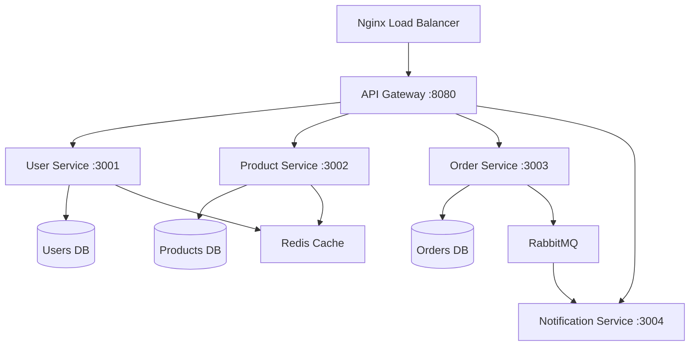

# How to Use Ansible to Deploy Microservices Architecture

Author: [nawazdhandala](https://www.github.com/nawazdhandala)

Tags: Ansible, Microservices, Deployment, Architecture, DevOps

Description: Deploy and manage a microservices architecture using Ansible with service discovery, inter-service communication, and rolling updates.

---

Microservices architecture breaks a monolithic application into smaller, independently deployable services. Each service handles a specific business function, runs its own process, and communicates with other services over the network. Deploying microservices is inherently more complex than deploying a monolith because you are managing multiple applications with their own dependencies, configurations, and scaling requirements. Ansible provides the coordination layer that ties all of this together.

This guide covers deploying a microservices architecture with Ansible, including multi-service orchestration, shared infrastructure, service discovery, and rolling updates.

## Architecture Overview

Let's say we have a typical e-commerce platform broken into microservices:



## Project Structure

```
microservices-deploy/
  inventory/
    production/
      hosts.yml
      group_vars/
        all.yml
        api_gateway.yml
        user_service.yml
        product_service.yml
        order_service.yml
        notification_service.yml
  roles/
    common/
      tasks/
        main.yml
    service_base/
      tasks/
        main.yml
      templates/
        service.j2
        nginx-upstream.conf.j2
      handlers/
        main.yml
    api_gateway/
      tasks/
        main.yml
      templates/
        gateway.conf.j2
    shared_infra/
      tasks/
        main.yml
  deploy.yml
  deploy-service.yml
```

## Inventory

Define your servers grouped by service:

```yaml
# inventory/production/hosts.yml
all:
  children:
    load_balancers:
      hosts:
        lb1:
          ansible_host: 10.0.0.5

    api_gateway:
      hosts:
        gw1:
          ansible_host: 10.0.1.10
        gw2:
          ansible_host: 10.0.1.11

    user_service:
      hosts:
        user1:
          ansible_host: 10.0.2.10
        user2:
          ansible_host: 10.0.2.11

    product_service:
      hosts:
        prod1:
          ansible_host: 10.0.3.10
        prod2:
          ansible_host: 10.0.3.11

    order_service:
      hosts:
        order1:
          ansible_host: 10.0.4.10
        order2:
          ansible_host: 10.0.4.11

    notification_service:
      hosts:
        notif1:
          ansible_host: 10.0.5.10

    shared_infra:
      hosts:
        redis1:
          ansible_host: 10.0.6.10
        rabbit1:
          ansible_host: 10.0.6.11

  vars:
    ansible_user: deploy
```

## Shared Variables

```yaml
# inventory/production/group_vars/all.yml
deploy_base_dir: /opt/services
service_user: svcuser
service_group: svcuser
redis_host: 10.0.6.10
rabbitmq_host: 10.0.6.11
log_level: warning
```

## Service-Specific Variables

```yaml
# inventory/production/group_vars/user_service.yml
service_name: user-service
service_port: 3001
service_repo: git@github.com:yourorg/user-service.git
service_branch: main
service_env:
  NODE_ENV: production
  PORT: 3001
  DATABASE_URL: "postgresql://users:{{ vault_users_db_pass }}@db-users.internal:5432/users"
  REDIS_URL: "redis://{{ redis_host }}:6379/0"
  JWT_SECRET: "{{ vault_jwt_secret }}"
  LOG_LEVEL: "{{ log_level }}"
```

```yaml
# inventory/production/group_vars/order_service.yml
service_name: order-service
service_port: 3003
service_repo: git@github.com:yourorg/order-service.git
service_branch: main
service_env:
  NODE_ENV: production
  PORT: 3003
  DATABASE_URL: "postgresql://orders:{{ vault_orders_db_pass }}@db-orders.internal:5432/orders"
  RABBITMQ_URL: "amqp://{{ rabbitmq_host }}:5672"
  USER_SERVICE_URL: "http://10.0.2.10:3001"
  PRODUCT_SERVICE_URL: "http://10.0.3.10:3002"
  LOG_LEVEL: "{{ log_level }}"
```

## Common Role

Tasks that run on every server regardless of which service it hosts:

```yaml
# roles/common/tasks/main.yml
---
- name: Update apt cache
  apt:
    update_cache: yes
    cache_valid_time: 3600

- name: Install common packages
  apt:
    name:
      - curl
      - git
      - htop
      - jq
      - net-tools
    state: present

- name: Create service user
  user:
    name: "{{ service_user }}"
    group: "{{ service_group }}"
    system: yes
    create_home: yes

- name: Set system file descriptor limits
  lineinfile:
    path: /etc/security/limits.conf
    line: "{{ item }}"
  loop:
    - "{{ service_user }} soft nofile 65535"
    - "{{ service_user }} hard nofile 65535"
```

## Service Base Role

This reusable role handles deploying any microservice. Each service-specific role includes it with its own variables.

```yaml
# roles/service_base/tasks/main.yml
---
- name: Install Node.js
  shell: "curl -fsSL https://deb.nodesource.com/setup_20.x | bash -"
  args:
    creates: /etc/apt/sources.list.d/nodesource.list

- name: Install Node.js package
  apt:
    name: nodejs
    state: present

- name: Create service directory
  file:
    path: "{{ deploy_base_dir }}/{{ service_name }}"
    state: directory
    owner: "{{ service_user }}"
    group: "{{ service_group }}"
    mode: '0755'

- name: Clone or update service code
  git:
    repo: "{{ service_repo }}"
    dest: "{{ deploy_base_dir }}/{{ service_name }}"
    version: "{{ service_branch }}"
    force: yes
  become_user: "{{ service_user }}"
  register: git_result
  notify: restart service

- name: Install npm dependencies
  npm:
    path: "{{ deploy_base_dir }}/{{ service_name }}"
    production: yes
  become_user: "{{ service_user }}"
  when: git_result.changed

- name: Deploy service environment file
  copy:
    content: |
      
      {{ key }}={{ value }}
      
    dest: "{{ deploy_base_dir }}/{{ service_name }}/.env"
    owner: "{{ service_user }}"
    group: "{{ service_group }}"
    mode: '0600'
  notify: restart service

- name: Deploy systemd service unit
  template:
    src: service.j2
    dest: "/etc/systemd/system/{{ service_name }}.service"
    mode: '0644'
  notify:
    - reload systemd
    - restart service

- name: Enable and start the service
  systemd:
    name: "{{ service_name }}"
    enabled: yes
    state: started

- name: Wait for service to be ready
  wait_for:
    port: "{{ service_port }}"
    delay: 5
    timeout: 30

- name: Verify service health endpoint
  uri:
    url: "http://127.0.0.1:{{ service_port }}/health"
    status_code: 200
  retries: 5
  delay: 5
```

## Service Systemd Template

```ini
# roles/service_base/templates/service.j2
[Unit]
Description={{ service_name }} microservice
After=network.target

[Service]
Type=simple
User={{ service_user }}
Group={{ service_group }}
WorkingDirectory={{ deploy_base_dir }}/{{ service_name }}
EnvironmentFile={{ deploy_base_dir }}/{{ service_name }}/.env
ExecStart=/usr/bin/node server.js
Restart=on-failure
RestartSec=5

# Resource limits
LimitNOFILE=65535
MemoryMax=512M

[Install]
WantedBy=multi-user.target
```

## API Gateway Configuration

```yaml
# roles/api_gateway/tasks/main.yml
---
- name: Install Nginx
  apt:
    name: nginx
    state: present

- name: Deploy API gateway configuration
  template:
    src: gateway.conf.j2
    dest: /etc/nginx/sites-available/api-gateway
    mode: '0644'
  notify: reload nginx

- name: Enable gateway site
  file:
    src: /etc/nginx/sites-available/api-gateway
    dest: /etc/nginx/sites-enabled/api-gateway
    state: link
  notify: reload nginx
```

```nginx
# roles/api_gateway/templates/gateway.conf.j2
# Upstream definitions for each microservice
upstream user_service {

    server {{ hostvars[host].ansible_host }}:3001;

}

upstream product_service {

    server {{ hostvars[host].ansible_host }}:3002;

}

upstream order_service {

    server {{ hostvars[host].ansible_host }}:3003;

}

server {
    listen 8080;
    server_name api.example.com;

    # Route requests to the appropriate microservice
    location /api/users {
        proxy_pass http://user_service;
        proxy_set_header Host $host;
        proxy_set_header X-Real-IP $remote_addr;
        proxy_set_header X-Request-ID $request_id;
    }

    location /api/products {
        proxy_pass http://product_service;
        proxy_set_header Host $host;
        proxy_set_header X-Real-IP $remote_addr;
        proxy_set_header X-Request-ID $request_id;
    }

    location /api/orders {
        proxy_pass http://order_service;
        proxy_set_header Host $host;
        proxy_set_header X-Real-IP $remote_addr;
        proxy_set_header X-Request-ID $request_id;
    }

    # Aggregate health check
    location /health {
        return 200 '{"status": "ok"}';
        add_header Content-Type application/json;
    }
}
```

## Main Deployment Playbook

```yaml
# deploy.yml - Deploy all services in the correct order
---
- name: Apply common configuration
  hosts: all
  become: yes
  roles:
    - common

- name: Deploy shared infrastructure
  hosts: shared_infra
  become: yes
  roles:
    - shared_infra

- name: Deploy User Service
  hosts: user_service
  become: yes
  serial: 1
  roles:
    - service_base

- name: Deploy Product Service
  hosts: product_service
  become: yes
  serial: 1
  roles:
    - service_base

- name: Deploy Order Service
  hosts: order_service
  become: yes
  serial: 1
  roles:
    - service_base

- name: Deploy Notification Service
  hosts: notification_service
  become: yes
  roles:
    - service_base

- name: Configure API Gateway
  hosts: api_gateway
  become: yes
  roles:
    - api_gateway
```

## Deploying a Single Service

When you only need to update one service:

```yaml
# deploy-service.yml - Deploy a specific service
---
- name: Deploy Single Service
  hosts: "{{ target_service }}"
  become: yes
  serial: 1
  roles:
    - service_base
```

```bash
# Deploy only the order service
ansible-playbook -i inventory/production deploy-service.yml -e "target_service=order_service"
```

## Running the Full Deployment

```bash
# Deploy everything
ansible-playbook -i inventory/production deploy.yml --ask-vault-pass

# Deploy a specific service
ansible-playbook -i inventory/production deploy-service.yml -e "target_service=user_service"

# Deploy with a specific branch for one service
ansible-playbook -i inventory/production deploy-service.yml \
  -e "target_service=product_service" \
  -e "service_branch=feature/new-search"
```

## Wrapping Up

Deploying microservices with Ansible requires organization and planning, but the result is a reproducible, auditable deployment process. The key patterns are: a reusable service base role that handles common deployment logic, service-specific variables for configuration, serial deployment for rolling updates, health check gates to catch failures early, and an API gateway that dynamically routes to service instances based on inventory. This approach scales well from a handful of services to dozens, and the inventory-driven configuration means adding new service instances is just a matter of adding hosts to the right group.
