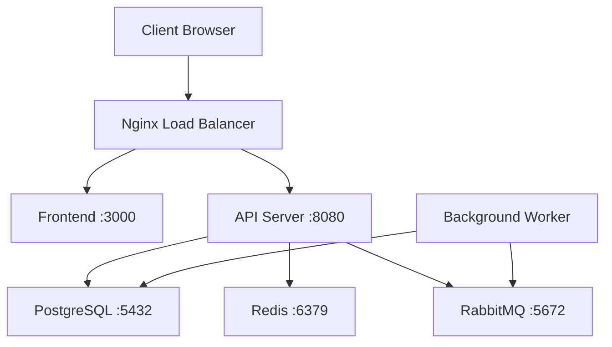

# How to Use Ansible to Deploy Multi-Container Applications

Author: [nawazdhandala](https://www.github.com/nawazdhandala)

Tags: Ansible, Docker, Deployment, Multi-Container, DevOps

Description: Deploy and orchestrate multi-container applications using Ansible with proper networking, dependencies, and health verification.

---

Most real applications consist of more than one container. A typical web application might have a frontend, an API backend, a database, a cache, and maybe a message queue. Deploying all these pieces together while handling dependencies, networking, and health checks is where Ansible proves its value over manual Docker commands. This post covers patterns for deploying multi-container applications with Ansible.

## Application Architecture Example

Let us work with a realistic application that has five services:



Each service runs in its own container, connected through Docker networks.

## Network Setup

Before deploying any containers, create the networks they will communicate over:

```yaml
# networks.yml - Create Docker networks for the application
---
- name: Set Up Application Networks
  hosts: docker_hosts
  become: true

  tasks:
    - name: Create frontend network (proxy to web services)
      community.docker.docker_network:
        name: frontend_net
        driver: bridge
        ipam_config:
          - subnet: 172.20.0.0/24
            gateway: 172.20.0.1

    - name: Create backend network (app to data services)
      community.docker.docker_network:
        name: backend_net
        driver: bridge
        internal: true  # No external access for data services
        ipam_config:
          - subnet: 172.21.0.0/24
            gateway: 172.21.0.1
```

Using `internal: true` on the backend network means containers on that network cannot reach the outside internet, which adds a layer of security for databases and caches.

## Defining the Application Stack

Here is the full deployment playbook. Services are deployed in order of their dependencies:

```yaml
# deploy_app.yml - Deploy the complete multi-container application
---
- name: Deploy Multi-Container Application
  hosts: docker_hosts
  become: true
  vars:
    app_version: "2.3.0"
    registry: registry.example.com
    db_password: "{{ vault_db_password }}"
    redis_password: "{{ vault_redis_password }}"
    rabbitmq_password: "{{ vault_rabbitmq_password }}"

  tasks:
    # --- Data Layer (no dependencies) ---

    - name: Deploy PostgreSQL
      community.docker.docker_container:
        name: app-db
        image: postgres:16
        state: started
        restart_policy: unless-stopped
        networks:
          - name: backend_net
        volumes:
          - "pgdata:/var/lib/postgresql/data"
          - "/opt/app/db/init:/docker-entrypoint-initdb.d:ro"
        env:
          POSTGRES_USER: "appuser"
          POSTGRES_PASSWORD: "{{ db_password }}"
          POSTGRES_DB: "appdb"
        memory: "2g"
        cpus: 2.0
        healthcheck:
          test: ["CMD-SHELL", "pg_isready -U appuser -d appdb"]
          interval: 10s
          timeout: 5s
          retries: 5
          start_period: 30s

    - name: Deploy Redis
      community.docker.docker_container:
        name: app-cache
        image: redis:7-alpine
        state: started
        restart_policy: unless-stopped
        networks:
          - name: backend_net
        volumes:
          - "redisdata:/data"
        command: "redis-server --requirepass {{ redis_password }} --maxmemory 256mb --maxmemory-policy allkeys-lru"
        memory: "512m"
        cpus: 0.5
        healthcheck:
          test: ["CMD", "redis-cli", "-a", "{{ redis_password }}", "ping"]
          interval: 10s
          timeout: 3s
          retries: 3

    - name: Deploy RabbitMQ
      community.docker.docker_container:
        name: app-queue
        image: rabbitmq:3-management
        state: started
        restart_policy: unless-stopped
        networks:
          - name: backend_net
        volumes:
          - "rabbitmqdata:/var/lib/rabbitmq"
        env:
          RABBITMQ_DEFAULT_USER: "appuser"
          RABBITMQ_DEFAULT_PASS: "{{ rabbitmq_password }}"
        memory: "512m"
        cpus: 1.0
        healthcheck:
          test: ["CMD", "rabbitmq-diagnostics", "check_running"]
          interval: 15s
          timeout: 10s
          retries: 5
          start_period: 30s

    # --- Wait for Data Layer ---

    - name: Wait for PostgreSQL to be healthy
      community.docker.docker_container_info:
        name: app-db
      register: db_info
      until: db_info.container.State.Health.Status == "healthy"
      retries: 30
      delay: 5

    - name: Wait for Redis to be healthy
      community.docker.docker_container_info:
        name: app-cache
      register: cache_info
      until: cache_info.container.State.Health.Status == "healthy"
      retries: 15
      delay: 3

    - name: Wait for RabbitMQ to be healthy
      community.docker.docker_container_info:
        name: app-queue
      register: queue_info
      until: queue_info.container.State.Health.Status == "healthy"
      retries: 20
      delay: 5

    # --- Application Layer (depends on data layer) ---

    - name: Deploy API Server
      community.docker.docker_container:
        name: app-api
        image: "{{ registry }}/myapp-api:{{ app_version }}"
        state: started
        restart_policy: unless-stopped
        networks:
          - name: frontend_net
          - name: backend_net
        env:
          DATABASE_URL: "postgres://appuser:{{ db_password }}@app-db:5432/appdb"
          REDIS_URL: "redis://:{{ redis_password }}@app-cache:6379"
          AMQP_URL: "amqp://appuser:{{ rabbitmq_password }}@app-queue:5672"
          NODE_ENV: "production"
          PORT: "8080"
        memory: "1g"
        cpus: 2.0
        healthcheck:
          test: ["CMD", "curl", "-f", "http://localhost:8080/health"]
          interval: 15s
          timeout: 5s
          retries: 3
          start_period: 20s

    - name: Deploy Background Worker
      community.docker.docker_container:
        name: app-worker
        image: "{{ registry }}/myapp-worker:{{ app_version }}"
        state: started
        restart_policy: unless-stopped
        networks:
          - name: backend_net
        env:
          DATABASE_URL: "postgres://appuser:{{ db_password }}@app-db:5432/appdb"
          REDIS_URL: "redis://:{{ redis_password }}@app-cache:6379"
          AMQP_URL: "amqp://appuser:{{ rabbitmq_password }}@app-queue:5672"
          WORKER_CONCURRENCY: "4"
        memory: "768m"
        cpus: 1.0

    - name: Deploy Frontend
      community.docker.docker_container:
        name: app-web
        image: "{{ registry }}/myapp-web:{{ app_version }}"
        state: started
        restart_policy: unless-stopped
        networks:
          - name: frontend_net
        env:
          API_URL: "http://app-api:8080"
          PORT: "3000"
        memory: "256m"
        cpus: 0.5

    # --- Wait for Application Layer ---

    - name: Wait for API to be healthy
      community.docker.docker_container_info:
        name: app-api
      register: api_info
      until: api_info.container.State.Health.Status == "healthy"
      retries: 15
      delay: 5

    # --- Load Balancer (depends on application layer) ---

    - name: Deploy Nginx load balancer
      community.docker.docker_container:
        name: app-lb
        image: nginx:latest
        state: started
        restart_policy: unless-stopped
        ports:
          - "80:80"
          - "443:443"
        networks:
          - name: frontend_net
        volumes:
          - "/opt/app/nginx/nginx.conf:/etc/nginx/nginx.conf:ro"
          - "/opt/app/nginx/certs:/etc/nginx/certs:ro"
        memory: "256m"
        cpus: 0.5
```

## Deploying with Roles

For better organization, split the stack into Ansible roles:

```
roles/
  data-layer/
    tasks/main.yml
    defaults/main.yml
  app-layer/
    tasks/main.yml
    defaults/main.yml
  proxy-layer/
    tasks/main.yml
    defaults/main.yml
```

```yaml
# site.yml - Top-level playbook using roles
---
- name: Deploy Complete Application
  hosts: docker_hosts
  become: true
  vars_files:
    - vars/common.yml
    - vars/{{ deploy_env }}.yml

  pre_tasks:
    - name: Set up Docker networks
      community.docker.docker_network:
        name: "{{ item.name }}"
        driver: bridge
        internal: "{{ item.internal | default(false) }}"
      loop:
        - { name: frontend_net }
        - { name: backend_net, internal: true }

  roles:
    - role: data-layer
      tags: [data]
    - role: app-layer
      tags: [app]
    - role: proxy-layer
      tags: [proxy]
```

This structure lets you deploy just one layer using tags:

```bash
# Deploy only the application layer (after updating code)
ansible-playbook site.yml --tags app
```

## Rolling Updates

Update application containers without downtime:

```yaml
# rolling_update.yml - Update app containers one at a time
---
- name: Rolling Update Application
  hosts: docker_hosts
  become: true
  vars:
    new_version: "2.4.0"
    registry: registry.example.com

  tasks:
    - name: Pull new images
      community.docker.docker_image:
        name: "{{ registry }}/{{ item }}:{{ new_version }}"
        source: pull
      loop:
        - myapp-api
        - myapp-worker
        - myapp-web

    - name: Update API server
      community.docker.docker_container:
        name: app-api
        image: "{{ registry }}/myapp-api:{{ new_version }}"
        state: started
        restart: true
        # All other parameters stay the same
      register: api_update

    - name: Verify API is healthy after update
      community.docker.docker_container_info:
        name: app-api
      register: api_health
      until: api_health.container.State.Health.Status == "healthy"
      retries: 15
      delay: 5

    - name: Update worker
      community.docker.docker_container:
        name: app-worker
        image: "{{ registry }}/myapp-worker:{{ new_version }}"
        state: started
        restart: true

    - name: Update frontend
      community.docker.docker_container:
        name: app-web
        image: "{{ registry }}/myapp-web:{{ new_version }}"
        state: started
        restart: true
```

## Health Verification

After deploying everything, run end-to-end checks:

```yaml
# verify_deployment.yml - Verify the full stack is working
---
- name: Verify Full Stack Deployment
  hosts: docker_hosts
  become: true

  tasks:
    - name: Check all containers are running
      community.docker.docker_container_info:
        name: "{{ item }}"
      register: container_status
      loop:
        - app-db
        - app-cache
        - app-queue
        - app-api
        - app-worker
        - app-web
        - app-lb

    - name: Verify all containers are running
      ansible.builtin.assert:
        that:
          - item.container.State.Running == true
        fail_msg: "{{ item.item }} is not running!"
      loop: "{{ container_status.results }}"
      loop_control:
        label: "{{ item.item }}"

    - name: Test HTTP endpoint
      ansible.builtin.uri:
        url: "http://localhost/api/health"
        method: GET
        status_code: 200
      register: http_check
      retries: 5
      delay: 5
      until: http_check.status == 200

    - name: Report deployment status
      ansible.builtin.debug:
        msg: "All services deployed and verified successfully"
```

## Teardown

Clean removal of the entire stack in reverse dependency order:

```yaml
# teardown.yml - Remove the entire application stack
---
- name: Teardown Application Stack
  hosts: docker_hosts
  become: true

  tasks:
    - name: Remove containers in reverse dependency order
      community.docker.docker_container:
        name: "{{ item }}"
        state: absent
        force_kill: true
      loop:
        - app-lb
        - app-web
        - app-api
        - app-worker
        - app-queue
        - app-cache
        - app-db

    - name: Remove networks
      community.docker.docker_network:
        name: "{{ item }}"
        state: absent
        force: true
      loop:
        - frontend_net
        - backend_net

    # Only remove volumes if you want to delete all data
    - name: Remove volumes (DESTRUCTIVE)
      community.docker.docker_volume:
        name: "{{ item }}"
        state: absent
      loop:
        - pgdata
        - redisdata
        - rabbitmqdata
      when: destroy_data | default(false) | bool
```

## Summary

Deploying multi-container applications with Ansible gives you explicit control over the deployment order, health verification at each stage, and consistent configuration across environments. The key patterns are: deploy services in dependency order (data layer first, then application layer, then proxy layer), wait for health checks to pass before starting dependent services, use internal Docker networks to isolate the data layer from external access, and organize your playbooks into roles for maintainability. This approach scales well from small applications with a handful of containers to large stacks with dozens of services.
