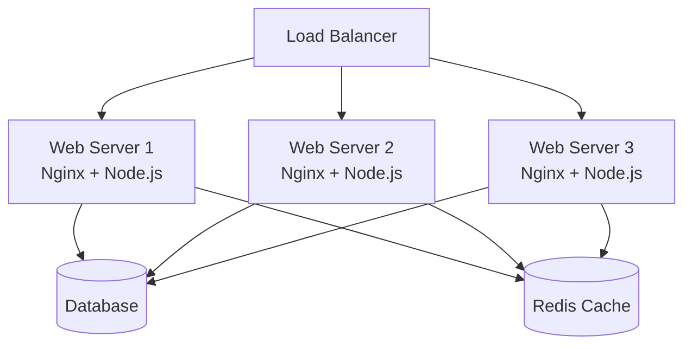
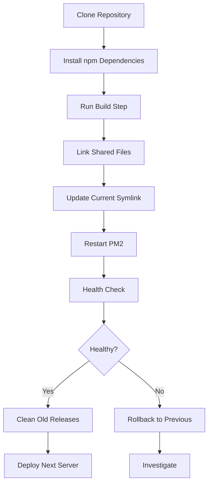

# How to Use Ansible to Deploy a Node.js Application

Author: [nawazdhandala](https://www.github.com/nawazdhandala)

Tags: Ansible, Node.js, Deployment, DevOps, JavaScript

Description: Automate Node.js application deployment with Ansible including environment setup, process management, and zero-downtime releases.

---

Deploying a Node.js application involves more than just copying files to a server. You need Node.js installed at the right version, npm dependencies built, environment variables configured, a process manager to keep the app running, and a reverse proxy in front of it. Doing this by hand for one server is manageable. Doing it for a fleet of servers during a production release is where mistakes happen. Ansible automates the entire deployment pipeline so every server gets the same treatment.

This guide covers deploying a Node.js application with Ansible, from server setup to zero-downtime releases.

## Deployment Architecture



## Inventory

```ini
# inventory/nodejs-app.ini
[app_servers]
app-1 ansible_host=10.0.13.10
app-2 ansible_host=10.0.13.11
app-3 ansible_host=10.0.13.12

[app_servers:vars]
ansible_user=ubuntu
node_version=20
app_name=myapp
app_user=appuser
app_dir=/opt/myapp
app_port=3000
app_env=production
```

## Step 1: Install Node.js

Install Node.js using the NodeSource repository to get a specific major version.

```yaml
# playbooks/install-nodejs.yml
---
- name: Install Node.js
  hosts: app_servers
  become: true

  tasks:
    - name: Install prerequisites
      ansible.builtin.apt:
        name:
          - curl
          - gnupg
          - build-essential
        state: present
        update_cache: true

    - name: Add NodeSource GPG key
      ansible.builtin.apt_key:
        url: "https://deb.nodesource.com/gpgkey/nodesource-repo.gpg.key"
        state: present

    - name: Add NodeSource repository for Node.js {{ node_version }}
      ansible.builtin.apt_repository:
        repo: "deb https://deb.nodesource.com/node_{{ node_version }}.x nodistro main"
        state: present
        filename: nodesource

    - name: Install Node.js
      ansible.builtin.apt:
        name: nodejs
        state: present
        update_cache: true

    - name: Verify Node.js version
      ansible.builtin.command:
        cmd: node --version
      register: node_ver
      changed_when: false

    - name: Display installed Node.js version
      ansible.builtin.debug:
        msg: "Node.js {{ node_ver.stdout }} installed"

    - name: Install PM2 globally for process management
      community.general.npm:
        name: pm2
        global: true
        state: present
```

## Step 2: Prepare the Application User and Directory

```yaml
# playbooks/prepare-app-environment.yml
---
- name: Prepare application environment
  hosts: app_servers
  become: true

  tasks:
    - name: Create application user
      ansible.builtin.user:
        name: "{{ app_user }}"
        system: true
        shell: /bin/bash
        home: "/home/{{ app_user }}"
        create_home: true

    - name: Create application directories
      ansible.builtin.file:
        path: "{{ item }}"
        state: directory
        owner: "{{ app_user }}"
        group: "{{ app_user }}"
        mode: "0750"
      loop:
        - "{{ app_dir }}"
        - "{{ app_dir }}/releases"
        - "{{ app_dir }}/shared"
        - "{{ app_dir }}/shared/logs"
        - "{{ app_dir }}/shared/uploads"
        - "{{ app_dir }}/shared/node_modules"

    - name: Deploy environment file with application config
      ansible.builtin.template:
        src: ../templates/app.env.j2
        dest: "{{ app_dir }}/shared/.env"
        owner: "{{ app_user }}"
        group: "{{ app_user }}"
        mode: "0600"
      no_log: true
```

The environment file template.

```jinja2
# templates/app.env.j2
# Application environment - managed by Ansible
NODE_ENV={{ app_env }}
PORT={{ app_port }}
HOST=127.0.0.1

# Database
DATABASE_URL={{ vault_database_url }}
DATABASE_POOL_SIZE={{ db_pool_size | default(10) }}

# Redis
REDIS_URL={{ vault_redis_url }}

# Application secrets
SESSION_SECRET={{ vault_session_secret }}
JWT_SECRET={{ vault_jwt_secret }}

# External services
SMTP_HOST={{ smtp_host | default('localhost') }}
SMTP_PORT={{ smtp_port | default(587) }}

# Logging
LOG_LEVEL={{ log_level | default('info') }}
LOG_DIR={{ app_dir }}/shared/logs
```

## Step 3: Deploy the Application

This playbook handles the actual deployment using a release directory pattern for easy rollbacks.

```yaml
# playbooks/deploy-nodejs-app.yml
---
- name: Deploy Node.js application
  hosts: app_servers
  become: true
  become_user: "{{ app_user }}"
  serial: 1  # Deploy one server at a time for zero downtime
  vars:
    git_repo: "https://github.com/mycompany/myapp.git"
    git_branch: main
    release_timestamp: "{{ ansible_date_time.epoch }}"
    release_dir: "{{ app_dir }}/releases/{{ release_timestamp }}"

  tasks:
    - name: Clone the application repository
      ansible.builtin.git:
        repo: "{{ git_repo }}"
        dest: "{{ release_dir }}"
        version: "{{ git_branch }}"
        depth: 1
        force: true

    - name: Link shared node_modules directory
      ansible.builtin.file:
        src: "{{ app_dir }}/shared/node_modules"
        dest: "{{ release_dir }}/node_modules"
        state: link
        force: true

    - name: Install npm dependencies
      community.general.npm:
        path: "{{ release_dir }}"
        production: true
        state: present
      environment:
        NODE_ENV: production

    - name: Run build step if package.json has a build script
      ansible.builtin.command:
        cmd: npm run build
        chdir: "{{ release_dir }}"
      register: build_result
      changed_when: build_result.rc == 0
      failed_when: build_result.rc != 0
      environment:
        NODE_ENV: production

    - name: Link the shared .env file
      ansible.builtin.file:
        src: "{{ app_dir }}/shared/.env"
        dest: "{{ release_dir }}/.env"
        state: link

    - name: Link the shared logs directory
      ansible.builtin.file:
        src: "{{ app_dir }}/shared/logs"
        dest: "{{ release_dir }}/logs"
        state: link
        force: true

    - name: Update the current symlink to the new release
      ansible.builtin.file:
        src: "{{ release_dir }}"
        dest: "{{ app_dir }}/current"
        state: link
        force: true

    - name: Start or restart the application with PM2
      ansible.builtin.command:
        cmd: >
          pm2 startOrRestart ecosystem.config.js
          --env production
        chdir: "{{ app_dir }}/current"
      register: pm2_result
      changed_when: true

    - name: Save PM2 process list for auto-restart on boot
      ansible.builtin.command:
        cmd: pm2 save
      changed_when: true

    - name: Wait for the application to become healthy
      ansible.builtin.uri:
        url: "http://127.0.0.1:{{ app_port }}/health"
        method: GET
        status_code: 200
      register: health_check
      retries: 10
      delay: 3
      until: health_check.status == 200

    - name: Clean up old releases, keeping the last 5
      ansible.builtin.shell:
        cmd: "ls -dt {{ app_dir }}/releases/*/ | tail -n +6 | xargs rm -rf"
      changed_when: true
      args:
        warn: false
```

## PM2 Ecosystem Configuration

Deploy a PM2 ecosystem file to manage the Node.js process.

```yaml
# playbooks/configure-pm2.yml
---
- name: Configure PM2 process manager
  hosts: app_servers
  become: true
  become_user: "{{ app_user }}"

  tasks:
    - name: Deploy PM2 ecosystem configuration
      ansible.builtin.copy:
        dest: "{{ app_dir }}/shared/ecosystem.config.js"
        content: |
          // PM2 ecosystem configuration - managed by Ansible
          module.exports = {
            apps: [{
              name: '{{ app_name }}',
              script: 'dist/server.js',
              cwd: '{{ app_dir }}/current',
              instances: 'max',
              exec_mode: 'cluster',
              max_memory_restart: '512M',
              env_production: {
                NODE_ENV: 'production',
                PORT: {{ app_port }}
              },
              error_file: '{{ app_dir }}/shared/logs/pm2-error.log',
              out_file: '{{ app_dir }}/shared/logs/pm2-out.log',
              merge_logs: true,
              log_date_format: 'YYYY-MM-DD HH:mm:ss Z',
              max_restarts: 10,
              restart_delay: 4000,
              watch: false,
              kill_timeout: 5000,
              listen_timeout: 8000,
              wait_ready: true
            }]
          };
        mode: "0644"

    - name: Set up PM2 to start on system boot
      ansible.builtin.command:
        cmd: "pm2 startup systemd -u {{ app_user }} --hp /home/{{ app_user }}"
      become: true
      become_user: root
      changed_when: true
```

## Step 4: Configure Nginx Reverse Proxy

Put Nginx in front of Node.js for SSL termination and static file serving.

```yaml
# playbooks/configure-nginx-for-node.yml
---
- name: Configure Nginx reverse proxy for Node.js
  hosts: app_servers
  become: true
  vars:
    app_domain: app.example.com

  tasks:
    - name: Deploy Nginx configuration for the Node.js app
      ansible.builtin.copy:
        dest: "/etc/nginx/conf.d/{{ app_name }}.conf"
        content: |
          # Nginx config for {{ app_name }} - managed by Ansible

          upstream {{ app_name }} {
              server 127.0.0.1:{{ app_port }};
              keepalive 64;
          }

          server {
              listen 80;
              server_name {{ app_domain }};
              return 301 https://$server_name$request_uri;
          }

          server {
              listen 443 ssl http2;
              server_name {{ app_domain }};

              ssl_certificate /etc/letsencrypt/live/{{ app_domain }}/fullchain.pem;
              ssl_certificate_key /etc/letsencrypt/live/{{ app_domain }}/privkey.pem;

              # SSL settings
              ssl_protocols TLSv1.2 TLSv1.3;
              ssl_ciphers ECDHE-ECDSA-AES128-GCM-SHA256:ECDHE-RSA-AES128-GCM-SHA256;
              ssl_prefer_server_ciphers off;

              # Security headers
              add_header X-Frame-Options "SAMEORIGIN" always;
              add_header X-Content-Type-Options "nosniff" always;
              add_header Strict-Transport-Security "max-age=63072000" always;

              # Logging
              access_log /var/log/nginx/{{ app_name }}_access.log;
              error_log /var/log/nginx/{{ app_name }}_error.log;

              # Serve static files directly from Nginx
              location /static/ {
                  alias {{ app_dir }}/current/public/static/;
                  expires 30d;
                  add_header Cache-Control "public, immutable";
              }

              # Proxy all other requests to Node.js
              location / {
                  proxy_pass http://{{ app_name }};
                  proxy_http_version 1.1;
                  proxy_set_header Upgrade $http_upgrade;
                  proxy_set_header Connection "upgrade";
                  proxy_set_header Host $host;
                  proxy_set_header X-Real-IP $remote_addr;
                  proxy_set_header X-Forwarded-For $proxy_add_x_forwarded_for;
                  proxy_set_header X-Forwarded-Proto $scheme;
                  proxy_cache_bypass $http_upgrade;

                  # Timeouts
                  proxy_connect_timeout 60s;
                  proxy_send_timeout 60s;
                  proxy_read_timeout 60s;
              }

              # Health check endpoint
              location /health {
                  proxy_pass http://{{ app_name }}/health;
                  access_log off;
              }
          }
        mode: "0644"
      notify: Reload Nginx

    - name: Test Nginx configuration
      ansible.builtin.command:
        cmd: nginx -t
      changed_when: false

  handlers:
    - name: Reload Nginx
      ansible.builtin.systemd:
        name: nginx
        state: reloaded
```

## Full Deployment Playbook

Orchestrate the entire deployment.

```yaml
# playbooks/full-deploy.yml
---
- name: Step 1 - Install Node.js (only if needed)
  import_playbook: install-nodejs.yml

- name: Step 2 - Prepare environment
  import_playbook: prepare-app-environment.yml

- name: Step 3 - Deploy application
  import_playbook: deploy-nodejs-app.yml

- name: Step 4 - Configure Nginx
  import_playbook: configure-nginx-for-node.yml
```

Run the full deployment.

```bash
# Deploy to all app servers with rolling updates
ansible-playbook playbooks/full-deploy.yml \
  -i inventory/nodejs-app.ini \
  --ask-vault-pass
```

## Rollback Procedure

If a deployment goes wrong, roll back to the previous release.

```yaml
# playbooks/rollback.yml
---
- name: Rollback to previous release
  hosts: app_servers
  become: true
  become_user: "{{ app_user }}"

  tasks:
    - name: Get the current release path
      ansible.builtin.command:
        cmd: readlink -f {{ app_dir }}/current
      register: current_release
      changed_when: false

    - name: List all releases sorted by timestamp
      ansible.builtin.command:
        cmd: "ls -dt {{ app_dir }}/releases/*/"
      register: all_releases
      changed_when: false

    - name: Determine the previous release
      ansible.builtin.set_fact:
        previous_release: "{{ all_releases.stdout_lines[1] | trim('/') }}"
      when: all_releases.stdout_lines | length > 1

    - name: Fail if there is no previous release
      ansible.builtin.fail:
        msg: "No previous release found to roll back to"
      when: all_releases.stdout_lines | length <= 1

    - name: Switch current symlink to the previous release
      ansible.builtin.file:
        src: "{{ previous_release }}"
        dest: "{{ app_dir }}/current"
        state: link
        force: true

    - name: Restart the application with PM2
      ansible.builtin.command:
        cmd: pm2 restart {{ app_name }}
      changed_when: true

    - name: Wait for health check
      ansible.builtin.uri:
        url: "http://127.0.0.1:{{ app_port }}/health"
        status_code: 200
      retries: 10
      delay: 3
      register: health
      until: health.status == 200

    - name: Display rollback status
      ansible.builtin.debug:
        msg: "Rolled back from {{ current_release.stdout }} to {{ previous_release }}"
```

## Deployment Flow



## Monitoring the Application

```yaml
# playbooks/check-app-status.yml
---
- name: Check Node.js application status
  hosts: app_servers
  become: true
  become_user: "{{ app_user }}"

  tasks:
    - name: Get PM2 process list
      ansible.builtin.command:
        cmd: pm2 jlist
      register: pm2_list
      changed_when: false

    - name: Display PM2 status
      ansible.builtin.command:
        cmd: pm2 status
      register: pm2_status
      changed_when: false

    - name: Show PM2 status table
      ansible.builtin.debug:
        msg: "{{ pm2_status.stdout_lines }}"

    - name: Check application health
      ansible.builtin.uri:
        url: "http://127.0.0.1:{{ app_port }}/health"
        status_code: 200
      register: health

    - name: Display health check result
      ansible.builtin.debug:
        msg: "Application health: {{ health.json | default('OK') }}"
```

## Production Tips

1. **Use `serial: 1` for rolling deployments.** This deploys one server at a time, so the load balancer always has healthy servers available. Users experience zero downtime.

2. **Keep the last 5 releases.** This gives you quick rollback options without filling your disk. The cleanup task handles this automatically.

3. **Use PM2 cluster mode.** Running `instances: 'max'` spawns a worker per CPU core and uses round-robin load balancing. This maximizes throughput on multi-core servers.

4. **Always health check after deployment.** The playbook waits for `/health` to return 200 before considering the deployment successful. If it fails, you know immediately.

5. **Serve static files through Nginx, not Node.js.** Nginx is far more efficient at serving static files. Let Node.js focus on dynamic requests.

## Conclusion

Deploying Node.js applications with Ansible gives you a repeatable, auditable deployment pipeline with built-in zero-downtime capability. The playbooks in this guide cover the complete lifecycle: Node.js installation, environment setup, application deployment with the release directory pattern, PM2 process management, Nginx reverse proxy configuration, and rollback procedures. Combine these with CI/CD triggers and you have a production-grade deployment system for your Node.js applications.
