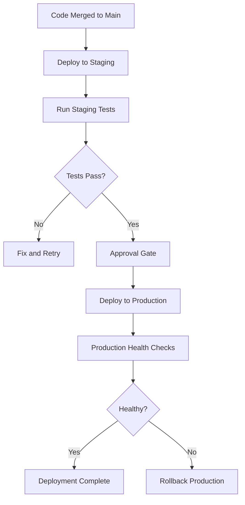

# How to Use Ansible to Deploy to Staging and Production Environments

Author: [nawazdhandala](https://www.github.com/nawazdhandala)

Tags: Ansible, Deployment, Staging, Production, DevOps

Description: Structure your Ansible project to deploy the same application to staging and production environments with environment-specific configurations.

---

Every serious deployment pipeline has at least two environments: staging and production. Staging is where you validate that everything works before it hits real users. The challenge with Ansible is structuring your project so the same playbooks work across both environments with different configurations. You do not want separate playbooks for each environment because that leads to drift and maintenance headaches.

This post shows you how to organize inventories, variables, and playbooks so deploying to staging or production is just a matter of pointing Ansible at the right inventory file.

## Directory Structure

Here is a clean project structure that supports multiple environments.

```
ansible-project/
  inventories/
    staging/
      hosts.yml
      group_vars/
        all.yml
        webservers.yml
        databases.yml
    production/
      hosts.yml
      group_vars/
        all.yml
        webservers.yml
        databases.yml
  playbooks/
    deploy.yml
    rollback.yml
  roles/
    app_deploy/
      tasks/main.yml
      templates/
      defaults/main.yml
    database/
      tasks/main.yml
  ansible.cfg
```

The key insight is that each environment has its own inventory directory with its own `group_vars`. The playbooks and roles are shared.

## Inventory Files

Here are the inventory files for staging and production.

```yaml
# inventories/staging/hosts.yml
# Staging environment servers - smaller fleet, lower specs
all:
  children:
    webservers:
      hosts:
        staging-web-01:
          ansible_host: 10.1.1.10
        staging-web-02:
          ansible_host: 10.1.1.11
    databases:
      hosts:
        staging-db-01:
          ansible_host: 10.1.2.10
    loadbalancers:
      hosts:
        staging-lb-01:
          ansible_host: 10.1.0.10
```

```yaml
# inventories/production/hosts.yml
# Production environment servers - larger fleet, high availability
all:
  children:
    webservers:
      hosts:
        prod-web-01:
          ansible_host: 10.2.1.10
        prod-web-02:
          ansible_host: 10.2.1.11
        prod-web-03:
          ansible_host: 10.2.1.12
        prod-web-04:
          ansible_host: 10.2.1.13
        prod-web-05:
          ansible_host: 10.2.1.14
        prod-web-06:
          ansible_host: 10.2.1.15
    databases:
      hosts:
        prod-db-01:
          ansible_host: 10.2.2.10
        prod-db-02:
          ansible_host: 10.2.2.11
    loadbalancers:
      hosts:
        prod-lb-01:
          ansible_host: 10.2.0.10
        prod-lb-02:
          ansible_host: 10.2.0.11
```

## Environment-Specific Variables

Each environment has its own `group_vars` directory where you define environment-specific settings.

```yaml
# inventories/staging/group_vars/all.yml
# Global variables for the staging environment
---
env_name: staging
domain_name: staging.myapp.com
deploy_user: deploy
log_level: debug
enable_debug_toolbar: true
ssl_certificate_path: /etc/letsencrypt/live/staging.myapp.com
notification_channel: "#staging-deploys"

# Database connection
db_host: staging-db-01
db_port: 5432
db_name: myapp_staging
```

```yaml
# inventories/production/group_vars/all.yml
# Global variables for the production environment
---
env_name: production
domain_name: myapp.com
deploy_user: deploy
log_level: warning
enable_debug_toolbar: false
ssl_certificate_path: /etc/letsencrypt/live/myapp.com
notification_channel: "#production-deploys"

# Database connection
db_host: prod-db-01
db_port: 5432
db_name: myapp_production
```

```yaml
# inventories/staging/group_vars/webservers.yml
# Web server settings for staging (lighter resource allocation)
---
app_workers: 2
app_threads: 2
max_connections: 100
memory_limit: 512M
serial_batch_size: 1
```

```yaml
# inventories/production/group_vars/webservers.yml
# Web server settings for production (full resource allocation)
---
app_workers: 8
app_threads: 4
max_connections: 1000
memory_limit: 2G
serial_batch_size: 2
```

## The Shared Deployment Playbook

The playbook itself has no environment-specific logic. It reads everything from inventory variables.

```yaml
# playbooks/deploy.yml
# Universal deployment playbook that works for any environment
---
- name: Deploy application to {{ env_name }}
  hosts: webservers
  serial: "{{ serial_batch_size | default(1) }}"
  become: true
  vars:
    app_version: "{{ deploy_version }}"
    app_dir: /opt/myapp

  pre_tasks:
    - name: Display deployment info
      debug:
        msg: "Deploying version {{ app_version }} to {{ env_name }} environment"
      run_once: true

  tasks:
    - name: Pull application code
      git:
        repo: "https://github.com/myorg/myapp.git"
        dest: "{{ app_dir }}"
        version: "{{ app_version }}"
        force: true

    - name: Install dependencies
      command: npm ci
      args:
        chdir: "{{ app_dir }}"

    - name: Generate environment config
      template:
        src: roles/app_deploy/templates/config.yml.j2
        dest: "{{ app_dir }}/config.yml"
        owner: "{{ deploy_user }}"
        mode: '0600'

    - name: Restart application
      systemd:
        name: myapp
        state: restarted

    - name: Wait for application to be healthy
      uri:
        url: "http://{{ ansible_host }}:8080/health"
        status_code: 200
      register: health
      until: health.status == 200
      retries: 10
      delay: 5
```

Here is the config template that adapts to each environment.

```yaml
# roles/app_deploy/templates/config.yml.j2
# Application config - values come from environment-specific group_vars
server:
  port: 8080
  workers: {{ app_workers }}
  threads: {{ app_threads }}
  max_connections: {{ max_connections }}

database:
  host: {{ db_host }}
  port: {{ db_port }}
  name: {{ db_name }}
  pool_size: {{ app_workers * 2 }}

logging:
  level: {{ log_level }}

features:
  debug_toolbar: {{ enable_debug_toolbar | lower }}

domain: {{ domain_name }}
```

## Running Deployments

The only difference between deploying to staging and production is the inventory file you pass.

```bash
# Deploy to staging
ansible-playbook playbooks/deploy.yml \
  -i inventories/staging/ \
  -e "deploy_version=v2.5.0"

# Deploy to production
ansible-playbook playbooks/deploy.yml \
  -i inventories/production/ \
  -e "deploy_version=v2.5.0"
```

## CI/CD Pipeline with Environment Gates

Here is a GitHub Actions workflow that deploys to staging first, waits for approval, and then deploys to production.

```yaml
# .github/workflows/deploy.yml
# Two-stage deployment: staging then production with approval gate
name: Staged Deployment

on:
  push:
    tags: ['v*']

jobs:
  deploy-staging:
    runs-on: ubuntu-latest
    environment: staging
    steps:
      - uses: actions/checkout@v4
      - name: Install Ansible
        run: pip install ansible
      - name: Deploy to staging
        env:
          ANSIBLE_HOST_KEY_CHECKING: "false"
        run: |
          ansible-playbook playbooks/deploy.yml \
            -i inventories/staging/ \
            -e "deploy_version=${{ github.ref_name }}" \
            --private-key <(echo "${{ secrets.SSH_KEY }}")

  deploy-production:
    runs-on: ubuntu-latest
    needs: deploy-staging
    environment: production
    steps:
      - uses: actions/checkout@v4
      - name: Install Ansible
        run: pip install ansible
      - name: Deploy to production
        env:
          ANSIBLE_HOST_KEY_CHECKING: "false"
        run: |
          ansible-playbook playbooks/deploy.yml \
            -i inventories/production/ \
            -e "deploy_version=${{ github.ref_name }}" \
            --private-key <(echo "${{ secrets.SSH_KEY }}")
```

The `environment: production` setting in GitHub Actions enables required reviewers and other protection rules you have configured.

## Deployment Flow



## Handling Secrets Per Environment

Each environment typically has different credentials. Use Ansible Vault to encrypt sensitive variables per environment.

```bash
# Create encrypted vars files for each environment
ansible-vault create inventories/staging/group_vars/vault.yml
ansible-vault create inventories/production/group_vars/vault.yml
```

```yaml
# inventories/staging/group_vars/vault.yml (encrypted)
# Staging secrets
vault_db_password: staging_password_here
vault_api_key: staging_api_key_here
```

```yaml
# inventories/production/group_vars/vault.yml (encrypted)
# Production secrets
vault_db_password: production_password_here
vault_api_key: production_api_key_here
```

Reference the vault variables in your non-encrypted group_vars.

```yaml
# inventories/staging/group_vars/all.yml
# Reference encrypted variables
db_password: "{{ vault_db_password }}"
api_key: "{{ vault_api_key }}"
```

## Conclusion

The pattern for multi-environment Ansible deployments is clean: shared playbooks and roles, separate inventory directories with environment-specific variables. This approach eliminates playbook duplication, reduces the risk of environment drift, and makes adding a new environment as simple as creating a new inventory directory. Combined with CI/CD environment gates and Ansible Vault for secrets, you get a deployment pipeline that is both flexible and secure.
