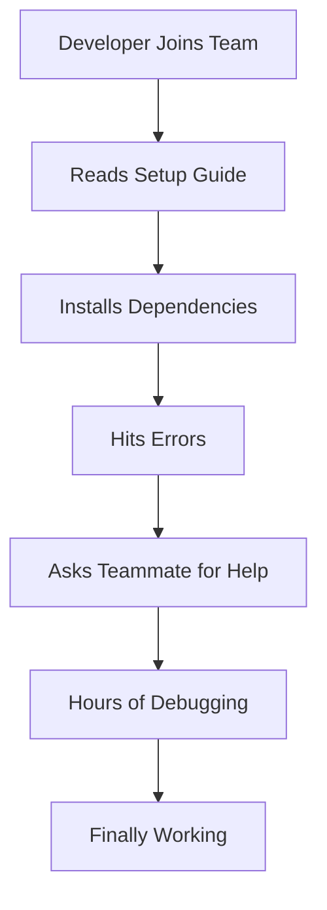

# How to Use Ansible for Development Environment Standardization

Author: [nawazdhandala](https://www.github.com/nawazdhandala)

Tags: Ansible, Development Environment, DevOps, Standardization

Description: Standardize development environments across your team using Ansible to eliminate works-on-my-machine problems and speed up onboarding.

---

Every development team has heard "it works on my machine." Different operating system versions, different tool versions, different configurations. New developers spend days setting up their environment. Ansible can standardize all of this by defining the development environment as code.

This post shows how to use Ansible to create consistent development environments that every team member can set up with a single command.

## The Problem with Manual Setup

Most teams have a README with setup instructions. It starts simple but grows into a 50-step process that is always out of date. Someone forgets to update it when they add a new dependency. A new hire follows the instructions and hits errors that no one remembers how to fix.



With Ansible, the process becomes: clone the repo, run one command, start coding.

## Local Development Setup Playbook

Here is a playbook that sets up a complete development environment on macOS or Linux:

```yaml
# dev-setup/setup.yml
# Set up local development environment
---
- name: Setup development environment
  hosts: localhost
  connection: local
  become: "{{ ansible_os_family != 'Darwin' }}"

  vars:
    project_name: myapp
    python_version: "3.11"
    node_version: "20"
    postgres_version: "15"
    redis_version: "7"

  tasks:
    - name: Detect operating system
      ansible.builtin.debug:
        msg: "Setting up on {{ ansible_os_family }} ({{ ansible_distribution }})"

    - name: Include OS-specific tasks
      ansible.builtin.include_tasks: "tasks/{{ ansible_os_family | lower }}.yml"

    - name: Install common development tools
      ansible.builtin.include_tasks: tasks/common-tools.yml

    - name: Setup project dependencies
      ansible.builtin.include_tasks: tasks/project-setup.yml

    - name: Configure local services
      ansible.builtin.include_tasks: tasks/services.yml

    - name: Setup git hooks
      ansible.builtin.include_tasks: tasks/git-hooks.yml

    - name: Display setup complete message
      ansible.builtin.debug:
        msg: |
          Development environment is ready!
          Run 'make dev' to start the application.
          Run 'make test' to run the test suite.
```

## macOS-Specific Setup

```yaml
# dev-setup/tasks/darwin.yml
# macOS-specific development setup
---
- name: Check if Homebrew is installed
  ansible.builtin.stat:
    path: /opt/homebrew/bin/brew
  register: brew_check

- name: Install Homebrew
  ansible.builtin.shell: |
    /bin/bash -c "$(curl -fsSL https://raw.githubusercontent.com/Homebrew/install/HEAD/install.sh)"
  when: not brew_check.stat.exists
  changed_when: true

- name: Install development packages via Homebrew
  community.general.homebrew:
    name:
      - git
      - python@{{ python_version }}
      - node@{{ node_version }}
      - postgresql@{{ postgres_version }}
      - redis
      - docker
      - docker-compose
      - jq
      - curl
      - wget
      - make
      - pre-commit
    state: present

- name: Start PostgreSQL service
  community.general.homebrew_service:
    name: postgresql@{{ postgres_version }}
    state: started

- name: Start Redis service
  community.general.homebrew_service:
    name: redis
    state: started
```

## Linux-Specific Setup

```yaml
# dev-setup/tasks/debian.yml
# Debian/Ubuntu-specific development setup
---
- name: Update apt cache
  ansible.builtin.apt:
    update_cache: true
    cache_valid_time: 3600

- name: Install development packages
  ansible.builtin.apt:
    name:
      - git
      - build-essential
      - curl
      - wget
      - jq
      - make
      - "python{{ python_version }}"
      - "python{{ python_version }}-venv"
      - "python{{ python_version }}-dev"
      - postgresql-{{ postgres_version }}
      - redis-server
      - docker.io
      - docker-compose-plugin
    state: present

- name: Install Node.js via NodeSource
  ansible.builtin.shell: |
    curl -fsSL https://deb.nodesource.com/setup_{{ node_version }}.x | bash -
    apt-get install -y nodejs
  args:
    creates: /usr/bin/node
  changed_when: true

- name: Add user to docker group
  ansible.builtin.user:
    name: "{{ ansible_user_id }}"
    groups: docker
    append: true

- name: Start services
  ansible.builtin.service:
    name: "{{ item }}"
    state: started
    enabled: true
  loop:
    - postgresql
    - redis-server
    - docker
```

## Project-Specific Setup

```yaml
# dev-setup/tasks/project-setup.yml
# Project-specific dependency installation
---
- name: Create Python virtual environment
  ansible.builtin.command:
    cmd: "python{{ python_version }} -m venv .venv"
    chdir: "{{ playbook_dir }}/.."
    creates: "{{ playbook_dir }}/../.venv"

- name: Install Python dependencies
  ansible.builtin.pip:
    requirements: "{{ playbook_dir }}/../requirements-dev.txt"
    virtualenv: "{{ playbook_dir }}/../.venv"

- name: Install Node.js dependencies
  community.general.npm:
    path: "{{ playbook_dir }}/.."
    state: present

- name: Create development database
  community.postgresql.postgresql_db:
    name: "{{ project_name }}_dev"
    login_user: "{{ ansible_user_id }}"
    state: present
  become: false

- name: Create test database
  community.postgresql.postgresql_db:
    name: "{{ project_name }}_test"
    login_user: "{{ ansible_user_id }}"
    state: present
  become: false

- name: Copy example environment file
  ansible.builtin.copy:
    src: "{{ playbook_dir }}/../.env.example"
    dest: "{{ playbook_dir }}/../.env"
    force: false
    mode: '0600'

- name: Run database migrations
  ansible.builtin.command:
    cmd: ".venv/bin/python manage.py migrate"
    chdir: "{{ playbook_dir }}/.."
  changed_when: true

- name: Seed development data
  ansible.builtin.command:
    cmd: ".venv/bin/python manage.py seed_dev_data"
    chdir: "{{ playbook_dir }}/.."
  changed_when: true
```

## IDE Configuration

Standardize IDE settings across the team:

```yaml
# dev-setup/tasks/ide-config.yml
# Deploy standard IDE configuration
---
- name: Create VS Code settings directory
  ansible.builtin.file:
    path: "{{ playbook_dir }}/../.vscode"
    state: directory
    mode: '0755'

- name: Deploy VS Code settings
  ansible.builtin.copy:
    content: |
      {
        "python.defaultInterpreterPath": ".venv/bin/python",
        "python.linting.enabled": true,
        "python.linting.pylintEnabled": true,
        "python.formatting.provider": "black",
        "editor.formatOnSave": true,
        "editor.rulers": [88],
        "files.trimTrailingWhitespace": true,
        "files.insertFinalNewline": true
      }
    dest: "{{ playbook_dir }}/../.vscode/settings.json"
    force: false
    mode: '0644'

- name: Deploy VS Code recommended extensions
  ansible.builtin.copy:
    content: |
      {
        "recommendations": [
          "ms-python.python",
          "ms-python.vscode-pylance",
          "dbaeumer.vscode-eslint",
          "esbenp.prettier-vscode",
          "redhat.vscode-yaml"
        ]
      }
    dest: "{{ playbook_dir }}/../.vscode/extensions.json"
    force: false
    mode: '0644'
```

## Docker-Based Development Services

For services that are complex to install locally, use Docker:

```yaml
# dev-setup/tasks/services.yml
# Start development services via Docker Compose
---
- name: Deploy development services compose file
  ansible.builtin.template:
    src: docker-compose.dev.yml.j2
    dest: "{{ playbook_dir }}/../docker-compose.dev.yml"
    mode: '0644'

- name: Start development services
  community.docker.docker_compose_v2:
    project_src: "{{ playbook_dir }}/.."
    files: [docker-compose.dev.yml]
    state: present
```

```yaml
# dev-setup/templates/docker-compose.dev.yml.j2
# Local development services
version: "3.8"
services:
  mailhog:
    image: mailhog/mailhog:latest
    ports:
      - "1025:1025"
      - "8025:8025"

  localstack:
    image: localstack/localstack:latest
    ports:
      - "4566:4566"
    environment:
      - SERVICES=s3,sqs,sns

  elasticsearch:
    image: elasticsearch:8.10.2
    ports:
      - "9200:9200"
    environment:
      - discovery.type=single-node
      - xpack.security.enabled=false
    mem_limit: 1g
```

## Verification Playbook

After setup, verify everything works:

```yaml
# dev-setup/verify.yml
# Verify the development environment is working correctly
---
- name: Verify development environment
  hosts: localhost
  connection: local

  tasks:
    - name: Check Python version
      ansible.builtin.command: python{{ python_version }} --version
      register: python_ver
      changed_when: false

    - name: Check Node version
      ansible.builtin.command: node --version
      register: node_ver
      changed_when: false

    - name: Check PostgreSQL connectivity
      community.postgresql.postgresql_ping:
        db: "{{ project_name }}_dev"

    - name: Check Redis connectivity
      ansible.builtin.command: redis-cli ping
      register: redis_ping
      changed_when: false

    - name: Run test suite
      ansible.builtin.command:
        cmd: ".venv/bin/pytest tests/ -x --tb=short"
        chdir: "{{ playbook_dir }}/.."
      register: test_result
      changed_when: false

    - name: Display environment status
      ansible.builtin.debug:
        msg: |
          Python: {{ python_ver.stdout }}
          Node: {{ node_ver.stdout }}
          PostgreSQL: Connected
          Redis: {{ redis_ping.stdout }}
          Tests: {{ 'PASSED' if test_result.rc == 0 else 'FAILED' }}
```

## Key Takeaways

Standardizing development environments with Ansible eliminates the "works on my machine" problem. New developers run one command and get a working setup. The environment definition lives in the repository alongside the code, so it stays up to date. Support both macOS and Linux by using OS-specific task files. Use Docker for complex services like Elasticsearch that are hard to install locally. Include a verification playbook that confirms everything is working. This approach pays for itself after the first new hire joins your team.
