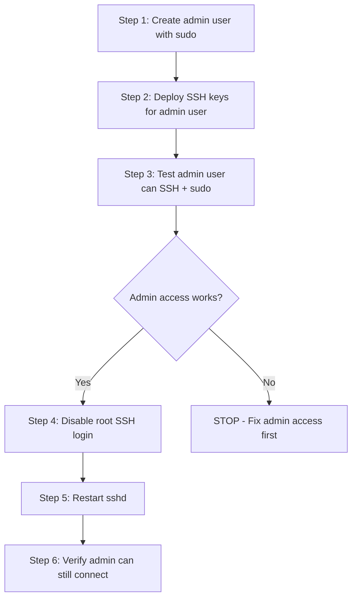

# How to Use Ansible to Disable Root SSH Login

Author: [nawazdhandala](https://www.github.com/nawazdhandala)

Tags: Ansible, SSH, Security, Linux, Root Access

Description: Safely disable root SSH login across your server fleet using Ansible with proper sudo user setup and verification to prevent lockouts.

---

Allowing root SSH login is one of the most common security misconfigurations on Linux servers. Every automated bot on the internet knows that every Linux system has a root account, which makes it the most targeted username in brute force attacks. Even with strong passwords or key-only authentication, disabling direct root SSH access adds an important layer of defense by requiring attackers to guess both a username and credentials.

The tricky part is disabling root SSH login without locking yourself out. You need to ensure that at least one non-root user with sudo privileges exists and can log in before you remove root access. Ansible handles this perfectly because you can enforce the correct order of operations in a playbook.

## The Safe Approach



## Variables

```yaml
# group_vars/all.yml
# Admin users who will replace root access
admin_users:
  - username: sysadmin
    full_name: "System Administrator"
    groups: ["sudo", "adm", "sshusers"]
    ssh_keys:
      - "ssh-ed25519 AAAAC3NzaC1lZDI1NTE5AAAAI... sysadmin@workstation"

  - username: deploy
    full_name: "Deployment User"
    groups: ["sudo", "sshusers"]
    ssh_keys:
      - "ssh-ed25519 AAAAC3NzaC1lZDI1NTE5AAAAI... deploy@ci"

# Sudo configuration
sudo_require_password: false  # Set true for stricter security
sudo_password_timeout: 15  # Minutes before sudo asks again

# SSH settings
ssh_permit_root_login: "no"
ssh_port: 22
```

## Step 1: Create Admin Users

Before touching root access, make sure alternative admin accounts exist.

```yaml
# roles/admin-users/tasks/main.yml
---
- name: Ensure sudo package is installed
  ansible.builtin.package:
    name: sudo
    state: present

- name: Ensure sshusers group exists
  ansible.builtin.group:
    name: sshusers
    state: present

- name: Create admin users
  ansible.builtin.user:
    name: "{{ item.username }}"
    comment: "{{ item.full_name }}"
    groups: "{{ item.groups }}"
    append: yes
    shell: /bin/bash
    create_home: yes
    state: present
  loop: "{{ admin_users }}"

- name: Set up .ssh directory for each admin
  ansible.builtin.file:
    path: "/home/{{ item.username }}/.ssh"
    state: directory
    owner: "{{ item.username }}"
    group: "{{ item.username }}"
    mode: '0700'
  loop: "{{ admin_users }}"

- name: Deploy authorized_keys for each admin
  ansible.builtin.copy:
    dest: "/home/{{ item.username }}/.ssh/authorized_keys"
    content: |
      
      {{ key }}
      
    owner: "{{ item.username }}"
    group: "{{ item.username }}"
    mode: '0600'
  loop: "{{ admin_users }}"

- name: Configure sudoers for admin users
  ansible.builtin.template:
    src: sudoers-admin.j2
    dest: "/etc/sudoers.d/{{ item.username }}"
    owner: root
    group: root
    mode: '0440'
    validate: '/usr/sbin/visudo -cf %s'
  loop: "{{ admin_users }}"
```

The sudoers template.

```jinja2
# roles/admin-users/templates/sudoers-admin.j2
# Managed by Ansible - sudoers for {{ item.username }}

{{ item.username }} ALL=(ALL:ALL) ALL
Defaults:{{ item.username }} timestamp_timeout={{ sudo_password_timeout }}

{{ item.username }} ALL=(ALL:ALL) NOPASSWD: ALL

```

## Step 2: Test Admin Access

Before disabling root, verify admin users can connect and use sudo.

```yaml
# roles/verify-admin-access/tasks/main.yml
---
- name: Test SSH connectivity for admin user
  ansible.builtin.command:
    cmd: >
      ssh -o BatchMode=yes
      -o ConnectTimeout=5
      -o StrictHostKeyChecking=no
      -p {{ ssh_port }}
      {{ admin_users[0].username }}@{{ ansible_host }}
      echo 'ssh_works'
  register: ssh_test
  delegate_to: localhost
  become: no
  changed_when: false
  ignore_errors: yes

- name: Test sudo access for admin user
  ansible.builtin.command:
    cmd: >
      ssh -o BatchMode=yes
      -o ConnectTimeout=5
      -p {{ ssh_port }}
      {{ admin_users[0].username }}@{{ ansible_host }}
      sudo whoami
  register: sudo_test
  delegate_to: localhost
  become: no
  changed_when: false
  ignore_errors: yes

- name: Verify SSH connectivity succeeded
  ansible.builtin.assert:
    that:
      - ssh_test.rc == 0
      - "'ssh_works' in ssh_test.stdout"
    fail_msg: >
      CRITICAL: Admin user '{{ admin_users[0].username }}' cannot SSH to {{ inventory_hostname }}.
      Root login will NOT be disabled to prevent lockout.
      Fix SSH key access first, then re-run this playbook.
    success_msg: "SSH access verified for {{ admin_users[0].username }}"

- name: Verify sudo access succeeded
  ansible.builtin.assert:
    that:
      - sudo_test.rc == 0
      - "'root' in sudo_test.stdout"
    fail_msg: >
      CRITICAL: Admin user '{{ admin_users[0].username }}' cannot sudo on {{ inventory_hostname }}.
      Root login will NOT be disabled. Fix sudo configuration first.
    success_msg: "Sudo access verified for {{ admin_users[0].username }}"
```

## Step 3: Disable Root SSH Login

Only after admin access is confirmed, disable root login.

```yaml
# roles/disable-root-ssh/tasks/main.yml
---
- name: Backup sshd_config
  ansible.builtin.copy:
    src: /etc/ssh/sshd_config
    dest: /etc/ssh/sshd_config.pre-root-disable
    remote_src: yes
    mode: '0600'

- name: Disable root SSH login
  ansible.builtin.lineinfile:
    path: /etc/ssh/sshd_config
    regexp: '^#?PermitRootLogin'
    line: "PermitRootLogin {{ ssh_permit_root_login }}"
    state: present
  notify: Restart sshd

- name: Disable password authentication for root
  ansible.builtin.lineinfile:
    path: /etc/ssh/sshd_config
    regexp: '^#?PermitRootLogin'
    line: "PermitRootLogin no"
  notify: Restart sshd

- name: Validate sshd configuration
  ansible.builtin.command:
    cmd: sshd -t
  changed_when: false

- name: Lock root password (optional extra hardening)
  ansible.builtin.command:
    cmd: passwd -l root
  changed_when: false
  when: lock_root_password | default(false) | bool
```

## Handlers

```yaml
# roles/disable-root-ssh/handlers/main.yml
---
- name: Restart sshd
  ansible.builtin.service:
    name: sshd
    state: restarted
```

## Step 4: Post-Verification

After restarting sshd, confirm that admin access still works and root is blocked.

```yaml
# roles/post-verify/tasks/main.yml
---
- name: Verify admin user can still connect
  ansible.builtin.wait_for:
    host: "{{ ansible_host }}"
    port: "{{ ssh_port }}"
    state: started
    timeout: 30
  delegate_to: localhost

- name: Confirm admin SSH still works
  ansible.builtin.command:
    cmd: >
      ssh -o BatchMode=yes -o ConnectTimeout=5
      -p {{ ssh_port }}
      {{ admin_users[0].username }}@{{ ansible_host }}
      echo 'post_disable_works'
  register: post_check
  delegate_to: localhost
  become: no
  changed_when: false

- name: Verify root SSH is blocked
  ansible.builtin.command:
    cmd: >
      ssh -o BatchMode=yes -o ConnectTimeout=5
      -p {{ ssh_port }}
      root@{{ ansible_host }}
      echo 'root_works'
  register: root_check
  delegate_to: localhost
  become: no
  changed_when: false
  ignore_errors: yes

- name: Assert root SSH is denied
  ansible.builtin.assert:
    that:
      - root_check.rc != 0
    fail_msg: "WARNING: Root SSH still appears to be working on {{ inventory_hostname }}"
    success_msg: "Root SSH access confirmed disabled on {{ inventory_hostname }}"

- name: Final status report
  ansible.builtin.debug:
    msg: |
      === Root SSH Disable Status for {{ inventory_hostname }} ===
      Admin SSH access: {{ 'WORKING' if post_check.rc == 0 else 'FAILED' }}
      Root SSH access: {{ 'BLOCKED' if root_check.rc != 0 else 'STILL OPEN' }}
```

## Main Playbook

```yaml
# disable-root-ssh.yml
---
- name: "Phase 1: Set up admin users with SSH keys and sudo"
  hosts: all
  become: yes
  roles:
    - admin-users

- name: "Phase 2: Verify admin users can log in and sudo"
  hosts: all
  gather_facts: no
  roles:
    - verify-admin-access

- name: "Phase 3: Disable root SSH login"
  hosts: all
  become: yes
  serial: 5  # Process 5 servers at a time for safety
  roles:
    - disable-root-ssh

- name: "Phase 4: Verify everything works"
  hosts: all
  gather_facts: no
  roles:
    - post-verify
```

## Emergency Rollback

If you need to re-enable root login in an emergency.

```yaml
# emergency-enable-root.yml
---
- name: Emergency re-enable root SSH
  hosts: all
  become: yes
  tasks:
    - name: Restore sshd_config backup
      ansible.builtin.copy:
        src: /etc/ssh/sshd_config.pre-root-disable
        dest: /etc/ssh/sshd_config
        remote_src: yes
      ignore_errors: yes

    - name: Or manually re-enable root login
      ansible.builtin.lineinfile:
        path: /etc/ssh/sshd_config
        regexp: '^PermitRootLogin'
        line: 'PermitRootLogin yes'

    - name: Restart sshd
      ansible.builtin.service:
        name: sshd
        state: restarted
```

## Running the Playbook

```bash
# Dry run first to see what would change
ansible-playbook -i inventory/hosts.ini disable-root-ssh.yml --check --diff

# Run the full playbook
ansible-playbook -i inventory/hosts.ini disable-root-ssh.yml

# Run only against a specific group
ansible-playbook -i inventory/hosts.ini disable-root-ssh.yml --limit staging

# Emergency rollback
ansible-playbook -i inventory/hosts.ini emergency-enable-root.yml
```

## Wrapping Up

Disabling root SSH login is a basic security hygiene step that should be done on every server, but doing it wrong can leave you locked out of your own infrastructure. The Ansible approach described here ensures that admin access is verified before root is disabled, uses serial processing to limit blast radius, and includes emergency rollback procedures. The multi-phase playbook structure makes it safe to run even across large server fleets. Combined with SSH key-only authentication and proper sudo configuration, you significantly reduce your attack surface with a single playbook run.
