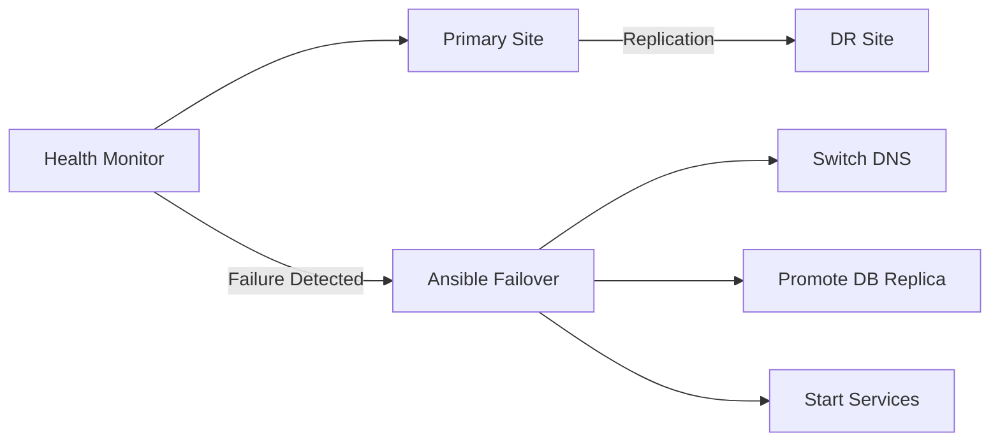

# How to Use Ansible to Automate Disaster Recovery Failover

Author: [nawazdhandala](https://www.github.com/nawazdhandala)

Tags: Ansible, Disaster Recovery, Failover, Infrastructure, DevOps

Description: Automate disaster recovery failover procedures with Ansible including health monitoring, DNS switching, and database replication failover.

---

When disaster strikes your primary infrastructure, every minute of downtime costs money and erodes customer trust. Manual disaster recovery procedures are slow, error-prone, and often poorly documented. The person who wrote the runbook might not be available at 3 AM when the primary data center goes down. Ansible automates disaster recovery failover so that switching to your backup infrastructure happens quickly and reliably.

## DR Architecture



## Role Defaults

```yaml
# roles/dr_failover/defaults/main.yml - Disaster recovery configuration
dr_primary_site: us-east-1
dr_secondary_site: us-west-2
dr_dns_zone: example.com
dr_dns_provider: route53
dr_health_check_url: "https://app.example.com/health"
dr_health_check_retries: 3
dr_health_check_interval: 10

# Services to manage during failover
dr_services:
  - name: web
    primary_hosts: "{{ groups['primary_web'] }}"
    dr_hosts: "{{ groups['dr_web'] }}"
  - name: api
    primary_hosts: "{{ groups['primary_api'] }}"
    dr_hosts: "{{ groups['dr_api'] }}"

# Database failover
dr_db_primary: db-primary.internal
dr_db_replica: db-replica-dr.internal
dr_db_type: postgresql

# DNS records to switch
dr_dns_records:
  - name: app.example.com
    primary_ip: 203.0.113.10
    dr_ip: 198.51.100.10
  - name: api.example.com
    primary_ip: 203.0.113.11
    dr_ip: 198.51.100.11
```

## Failover Tasks

```yaml
# roles/dr_failover/tasks/main.yml - Automated failover procedure
---
- name: Verify primary site is actually down
  uri:
    url: "{{ dr_health_check_url }}"
    status_code: 200
    timeout: 10
  register: primary_health
  retries: "{{ dr_health_check_retries }}"
  delay: "{{ dr_health_check_interval }}"
  ignore_errors: yes

- name: Abort if primary site is healthy
  fail:
    msg: "Primary site is responding normally. Aborting failover."
  when: primary_health.status | default(0) == 200

- name: Log failover initiation
  copy:
    content: |
      DR Failover Initiated
      Time: {{ ansible_date_time.iso8601 }}
      Primary Site: {{ dr_primary_site }}
      Failover Site: {{ dr_secondary_site }}
      Reason: Primary health check failed {{ dr_health_check_retries }} times
    dest: "/var/log/dr-failover-{{ ansible_date_time.date }}.log"
    mode: '0644'
  delegate_to: localhost

- name: Promote database replica to primary
  include_tasks: promote_database.yml

- name: Start services on DR site
  include_tasks: start_dr_services.yml

- name: Update DNS records to point to DR site
  include_tasks: switch_dns.yml

- name: Verify DR site is operational
  uri:
    url: "{{ dr_health_check_url }}"
    status_code: 200
  register: dr_health
  until: dr_health.status == 200
  retries: 15
  delay: 10
  delegate_to: "{{ groups['dr_web'][0] }}"

- name: Send failover notification
  debug:
    msg: "DR FAILOVER COMPLETE - traffic now served from {{ dr_secondary_site }}"
```

## Database Promotion

```yaml
# roles/dr_failover/tasks/promote_database.yml
---
- name: Promote PostgreSQL replica to primary
  command: >
    pg_ctl promote -D /var/lib/postgresql/15/main
  become_user: postgres
  delegate_to: "{{ dr_db_replica }}"
  when: dr_db_type == 'postgresql'

- name: Wait for promotion to complete
  command: >
    psql -c "SELECT pg_is_in_recovery();"
  become_user: postgres
  delegate_to: "{{ dr_db_replica }}"
  register: recovery_check
  until: "'f' in recovery_check.stdout"
  retries: 10
  delay: 5
```

## DNS Switching

```yaml
# roles/dr_failover/tasks/switch_dns.yml
---
- name: Update DNS records to DR site IPs
  route53:
    state: present
    zone: "{{ dr_dns_zone }}"
    record: "{{ item.name }}"
    type: A
    ttl: 60
    value: "{{ item.dr_ip }}"
    overwrite: yes
  loop: "{{ dr_dns_records }}"
  delegate_to: localhost
```

## Running the Failover

```bash
# Execute DR failover (with confirmation)
ansible-playbook -i inventory/dr.ini failover.yml --ask-vault-pass

# Execute failback to primary (after primary is restored)
ansible-playbook -i inventory/dr.ini failback.yml --ask-vault-pass
```

## Summary

Automated DR failover with Ansible turns a stressful, error-prone manual process into a controlled, repeatable procedure. The playbook verifies the primary site is actually down before proceeding, promotes database replicas, starts services on the DR site, switches DNS, and validates everything is working. Regular DR drills using this playbook ensure your team is prepared and the automation actually works when you need it most.

## Common Use Cases

Here are several practical scenarios where this module proves essential in real-world playbooks.

### Infrastructure Provisioning Workflow

```yaml
# Complete workflow incorporating this module
- name: Infrastructure provisioning
  hosts: all
  become: true
  gather_facts: true
  tasks:
    - name: Gather system information
      ansible.builtin.setup:
        gather_subset:
          - hardware
          - network

    - name: Display system summary
      ansible.builtin.debug:
        msg: >-
          Host {{ inventory_hostname }} has
          {{ ansible_memtotal_mb }}MB RAM,
          {{ ansible_processor_vcpus }} vCPUs,
          running {{ ansible_distribution }} {{ ansible_distribution_version }}

    - name: Install required packages
      ansible.builtin.package:
        name:
          - curl
          - wget
          - git
          - vim
          - htop
          - jq
        state: present

    - name: Configure system timezone
      ansible.builtin.timezone:
        name: "{{ system_timezone | default('UTC') }}"

    - name: Configure hostname
      ansible.builtin.hostname:
        name: "{{ inventory_hostname }}"

    - name: Update /etc/hosts
      ansible.builtin.lineinfile:
        path: /etc/hosts
        regexp: '^127\.0\.1\.1'
        line: "127.0.1.1 {{ inventory_hostname }}"

    - name: Configure SSH hardening
      ansible.builtin.lineinfile:
        path: /etc/ssh/sshd_config
        regexp: "{{ item.regexp }}"
        line: "{{ item.line }}"
      loop:
        - { regexp: '^PermitRootLogin', line: 'PermitRootLogin no' }
        - { regexp: '^PasswordAuthentication', line: 'PasswordAuthentication no' }
      notify: restart sshd

    - name: Configure firewall rules
      community.general.ufw:
        rule: allow
        port: "{{ item }}"
        proto: tcp
      loop:
        - "22"
        - "80"
        - "443"

    - name: Enable firewall
      community.general.ufw:
        state: enabled
        policy: deny

  handlers:
    - name: restart sshd
      ansible.builtin.service:
        name: sshd
        state: restarted
```

### Integration with Monitoring

```yaml
# Using gathered facts to configure monitoring thresholds
- name: Configure monitoring based on system specs
  hosts: all
  become: true
  tasks:
    - name: Set monitoring thresholds based on hardware
      ansible.builtin.template:
        src: monitoring_config.yml.j2
        dest: /etc/monitoring/config.yml
      vars:
        memory_warning_threshold: "{{ (ansible_memtotal_mb * 0.8) | int }}"
        memory_critical_threshold: "{{ (ansible_memtotal_mb * 0.95) | int }}"
        cpu_warning_threshold: 80
        cpu_critical_threshold: 95

    - name: Register host with monitoring system
      ansible.builtin.uri:
        url: "https://monitoring.example.com/api/hosts"
        method: POST
        body_format: json
        body:
          hostname: "{{ inventory_hostname }}"
          ip_address: "{{ ansible_default_ipv4.address }}"
          os: "{{ ansible_distribution }}"
          memory_mb: "{{ ansible_memtotal_mb }}"
          cpus: "{{ ansible_processor_vcpus }}"
        headers:
          Authorization: "Bearer {{ monitoring_api_token }}"
        status_code: [200, 201, 409]
```

### Error Handling Patterns

```yaml
# Robust error handling with this module
- name: Robust task execution
  hosts: all
  tasks:
    - name: Attempt primary operation
      ansible.builtin.command: /opt/app/primary-task.sh
      register: primary_result
      failed_when: false

    - name: Handle primary failure with fallback
      ansible.builtin.command: /opt/app/fallback-task.sh
      when: primary_result.rc != 0
      register: fallback_result

    - name: Report final status
      ansible.builtin.debug:
        msg: >-
          Task completed via {{ 'primary' if primary_result.rc == 0 else 'fallback' }} path.
          Return code: {{ primary_result.rc if primary_result.rc == 0 else fallback_result.rc }}

    - name: Fail if both paths failed
      ansible.builtin.fail:
        msg: "Both primary and fallback operations failed"
      when:
        - primary_result.rc != 0
        - fallback_result is defined
        - fallback_result.rc != 0
```

### Scheduling and Automation

```yaml
# Set up scheduled compliance scans using cron
- name: Configure automated scans
  hosts: all
  become: true
  tasks:
    - name: Create scan script
      ansible.builtin.copy:
        dest: /opt/scripts/compliance_scan.sh
        mode: '0755'
        content: |
          #!/bin/bash
          cd /opt/ansible
          ansible-playbook playbooks/validate.yml -i inventory/ > /var/log/compliance_scan.log 2>&1
          EXIT_CODE=$?
          if [ $EXIT_CODE -ne 0 ]; then
            curl -X POST https://hooks.example.com/alert \
              -H "Content-Type: application/json" \
              -d "{\"text\":\"Compliance scan failed on $(hostname)\"}"
          fi
          exit $EXIT_CODE

    - name: Schedule weekly compliance scan
      ansible.builtin.cron:
        name: "Weekly compliance scan"
        minute: "0"
        hour: "3"
        weekday: "1"
        job: "/opt/scripts/compliance_scan.sh"
        user: ansible
```

