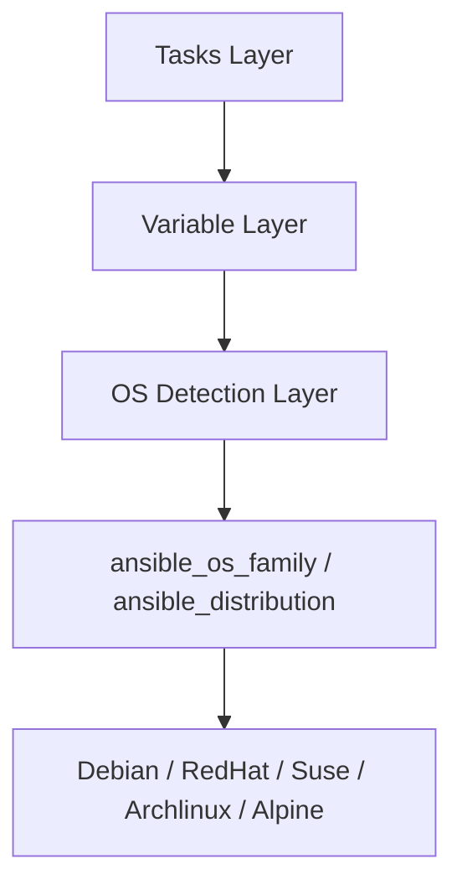

# How to Use Ansible to Write Distribution-Agnostic Playbooks

Author: [nawazdhandala](https://www.github.com/nawazdhandala)

Tags: Ansible, Linux, Cross-Platform, Best Practices, Portability

Description: Write Ansible playbooks that work on any Linux distribution by combining OS detection, variable mapping, and portable modules.

---

Writing playbooks that run identically on Debian, RHEL, SUSE, Arch, and Alpine without modification is achievable with the right patterns. This guide brings together all the cross-distribution techniques into a complete, production-ready approach.

## The Architecture

A distribution-agnostic playbook has three layers:



1. **Tasks** - Use abstract variable names, never hardcode distribution-specific values
2. **Variables** - Map abstract names to distribution-specific values
3. **Detection** - Automatically load the right variable file based on facts

## Complete Example: Web Server Role

Here is a full role that installs and configures a web server on any distribution:

```
roles/webserver/
  defaults/
    main.yml
  vars/
    Debian.yml
    RedHat.yml
    Suse.yml
    Archlinux.yml
    Alpine.yml
  tasks/
    main.yml
    install.yml
    configure.yml
    firewall.yml
  templates/
    vhost.conf.j2
  handlers/
    main.yml
```

### defaults/main.yml

```yaml
# roles/webserver/defaults/main.yml
webserver_port: 80
webserver_ssl_port: 443
webserver_document_root: /var/www/html
webserver_server_name: "{{ inventory_hostname }}"
```

### Distribution Variable Files

```yaml
# roles/webserver/vars/Debian.yml
webserver_package: apache2
webserver_service: apache2
webserver_config_dir: /etc/apache2
webserver_main_config: /etc/apache2/apache2.conf
webserver_sites_dir: /etc/apache2/sites-available
webserver_log_dir: /var/log/apache2
webserver_user: www-data
webserver_group: www-data
firewall_tool: ufw
```

```yaml
# roles/webserver/vars/RedHat.yml
webserver_package: httpd
webserver_service: httpd
webserver_config_dir: /etc/httpd
webserver_main_config: /etc/httpd/conf/httpd.conf
webserver_sites_dir: /etc/httpd/conf.d
webserver_log_dir: /var/log/httpd
webserver_user: apache
webserver_group: apache
firewall_tool: firewalld
```

```yaml
# roles/webserver/vars/Suse.yml
webserver_package: apache2
webserver_service: apache2
webserver_config_dir: /etc/apache2
webserver_main_config: /etc/apache2/httpd.conf
webserver_sites_dir: /etc/apache2/vhosts.d
webserver_log_dir: /var/log/apache2
webserver_user: wwwrun
webserver_group: www
firewall_tool: firewalld
```

### tasks/main.yml

```yaml
# roles/webserver/tasks/main.yml
- name: Load OS-specific variables
  ansible.builtin.include_vars: "{{ item }}"
  with_first_found:
    - "{{ ansible_distribution }}_{{ ansible_distribution_major_version }}.yml"
    - "{{ ansible_distribution }}.yml"
    - "{{ ansible_os_family }}.yml"

- name: Install web server
  ansible.builtin.include_tasks: install.yml

- name: Configure web server
  ansible.builtin.include_tasks: configure.yml

- name: Configure firewall
  ansible.builtin.include_tasks: firewall.yml
```

### tasks/install.yml

```yaml
# roles/webserver/tasks/install.yml
- name: Install web server package
  ansible.builtin.package:
    name: "{{ webserver_package }}"
    state: present

- name: Enable and start web server
  ansible.builtin.service:
    name: "{{ webserver_service }}"
    enabled: true
    state: started
```

### tasks/configure.yml

```yaml
# roles/webserver/tasks/configure.yml
- name: Create document root
  ansible.builtin.file:
    path: "{{ webserver_document_root }}"
    state: directory
    owner: "{{ webserver_user }}"
    group: "{{ webserver_group }}"
    mode: '0755'

- name: Deploy virtual host configuration
  ansible.builtin.template:
    src: vhost.conf.j2
    dest: "{{ webserver_sites_dir }}/{{ webserver_server_name }}.conf"
    mode: '0644'
  notify: restart webserver

- name: Enable site (Debian only)
  ansible.builtin.command: "a2ensite {{ webserver_server_name }}"
  when: ansible_os_family == "Debian"
  changed_when: true
  notify: restart webserver
```

### tasks/firewall.yml

```yaml
# roles/webserver/tasks/firewall.yml
- name: Configure UFW firewall (Debian)
  when: firewall_tool == "ufw"
  block:
    - name: Allow HTTP
      community.general.ufw:
        rule: allow
        port: "{{ webserver_port }}"
        proto: tcp

    - name: Allow HTTPS
      community.general.ufw:
        rule: allow
        port: "{{ webserver_ssl_port }}"
        proto: tcp

- name: Configure firewalld (RHEL/SUSE)
  when: firewall_tool == "firewalld"
  block:
    - name: Allow HTTP
      ansible.posix.firewalld:
        service: http
        permanent: true
        state: enabled
        immediate: true

    - name: Allow HTTPS
      ansible.posix.firewalld:
        service: https
        permanent: true
        state: enabled
        immediate: true
```

### handlers/main.yml

```yaml
# roles/webserver/handlers/main.yml
- name: restart webserver
  ansible.builtin.service:
    name: "{{ webserver_service }}"
    state: restarted
```

## Key Principles

### 1. Use ansible.builtin.package Instead of Specific Modules

```yaml
# Portable: works on any distribution
- ansible.builtin.package:
    name: "{{ pkg_name }}"
    state: present

# Not portable: only works with apt
- ansible.builtin.apt:
    name: some-package
    state: present
```

### 2. Use ansible.builtin.service Instead of ansible.builtin.systemd

```yaml
# Portable: works with systemd AND openrc
- ansible.builtin.service:
    name: "{{ svc_name }}"
    state: started

# Not portable: only works with systemd
- ansible.builtin.systemd:
    name: some-service
    state: started
```

### 3. Never Hardcode Paths

```yaml
# Bad: hardcoded path
- ansible.builtin.template:
    src: config.j2
    dest: /etc/httpd/conf/httpd.conf

# Good: variable path
- ansible.builtin.template:
    src: config.j2
    dest: "{{ webserver_main_config }}"
```

### 4. Handle Distribution-Specific Steps in Blocks

```yaml
- name: Debian-specific post-install
  when: ansible_os_family == "Debian"
  block:
    - name: Enable Apache modules
      ansible.builtin.command: "a2enmod {{ item }}"
      loop: [rewrite, ssl, headers]
```

### 5. Test on Multiple Distributions

Use Molecule with multiple platforms:

```yaml
# molecule/default/molecule.yml
platforms:
  - name: ubuntu2404
    image: ubuntu:24.04
  - name: rocky9
    image: rockylinux:9
  - name: debian12
    image: debian:12
  - name: alpine319
    image: alpine:3.19
```

## Summary

Distribution-agnostic playbooks combine three techniques: OS detection through Ansible facts, variable mapping files per distribution, and portable modules (`package`, `service`). Put distribution-specific values in variable files, never in tasks. Use `with_first_found` for graceful fallbacks. Use `ansible.builtin.package` and `ansible.builtin.service` for maximum portability. This approach lets you maintain a single codebase that works across Debian, RHEL, SUSE, Arch, and Alpine.

## Common Use Cases

Here are several practical scenarios where this module proves essential in real-world playbooks.

### Infrastructure Provisioning Workflow

```yaml
# Complete workflow incorporating this module
- name: Infrastructure provisioning
  hosts: all
  become: true
  gather_facts: true
  tasks:
    - name: Gather system information
      ansible.builtin.setup:
        gather_subset:
          - hardware
          - network

    - name: Display system summary
      ansible.builtin.debug:
        msg: >-
          Host {{ inventory_hostname }} has
          {{ ansible_memtotal_mb }}MB RAM,
          {{ ansible_processor_vcpus }} vCPUs,
          running {{ ansible_distribution }} {{ ansible_distribution_version }}

    - name: Install required packages
      ansible.builtin.package:
        name:
          - curl
          - wget
          - git
          - vim
          - htop
          - jq
        state: present

    - name: Configure system timezone
      ansible.builtin.timezone:
        name: "{{ system_timezone | default('UTC') }}"

    - name: Configure hostname
      ansible.builtin.hostname:
        name: "{{ inventory_hostname }}"

    - name: Update /etc/hosts
      ansible.builtin.lineinfile:
        path: /etc/hosts
        regexp: '^127\.0\.1\.1'
        line: "127.0.1.1 {{ inventory_hostname }}"

    - name: Configure SSH hardening
      ansible.builtin.lineinfile:
        path: /etc/ssh/sshd_config
        regexp: "{{ item.regexp }}"
        line: "{{ item.line }}"
      loop:
        - { regexp: '^PermitRootLogin', line: 'PermitRootLogin no' }
        - { regexp: '^PasswordAuthentication', line: 'PasswordAuthentication no' }
      notify: restart sshd

    - name: Configure firewall rules
      community.general.ufw:
        rule: allow
        port: "{{ item }}"
        proto: tcp
      loop:
        - "22"
        - "80"
        - "443"

    - name: Enable firewall
      community.general.ufw:
        state: enabled
        policy: deny

  handlers:
    - name: restart sshd
      ansible.builtin.service:
        name: sshd
        state: restarted
```

### Integration with Monitoring

```yaml
# Using gathered facts to configure monitoring thresholds
- name: Configure monitoring based on system specs
  hosts: all
  become: true
  tasks:
    - name: Set monitoring thresholds based on hardware
      ansible.builtin.template:
        src: monitoring_config.yml.j2
        dest: /etc/monitoring/config.yml
      vars:
        memory_warning_threshold: "{{ (ansible_memtotal_mb * 0.8) | int }}"
        memory_critical_threshold: "{{ (ansible_memtotal_mb * 0.95) | int }}"
        cpu_warning_threshold: 80
        cpu_critical_threshold: 95

    - name: Register host with monitoring system
      ansible.builtin.uri:
        url: "https://monitoring.example.com/api/hosts"
        method: POST
        body_format: json
        body:
          hostname: "{{ inventory_hostname }}"
          ip_address: "{{ ansible_default_ipv4.address }}"
          os: "{{ ansible_distribution }}"
          memory_mb: "{{ ansible_memtotal_mb }}"
          cpus: "{{ ansible_processor_vcpus }}"
        headers:
          Authorization: "Bearer {{ monitoring_api_token }}"
        status_code: [200, 201, 409]
```

### Error Handling Patterns

```yaml
# Robust error handling with this module
- name: Robust task execution
  hosts: all
  tasks:
    - name: Attempt primary operation
      ansible.builtin.command: /opt/app/primary-task.sh
      register: primary_result
      failed_when: false

    - name: Handle primary failure with fallback
      ansible.builtin.command: /opt/app/fallback-task.sh
      when: primary_result.rc != 0
      register: fallback_result

    - name: Report final status
      ansible.builtin.debug:
        msg: >-
          Task completed via {{ 'primary' if primary_result.rc == 0 else 'fallback' }} path.
          Return code: {{ primary_result.rc if primary_result.rc == 0 else fallback_result.rc }}

    - name: Fail if both paths failed
      ansible.builtin.fail:
        msg: "Both primary and fallback operations failed"
      when:
        - primary_result.rc != 0
        - fallback_result is defined
        - fallback_result.rc != 0
```

### Scheduling and Automation

```yaml
# Set up scheduled compliance scans using cron
- name: Configure automated scans
  hosts: all
  become: true
  tasks:
    - name: Create scan script
      ansible.builtin.copy:
        dest: /opt/scripts/compliance_scan.sh
        mode: '0755'
        content: |
          #!/bin/bash
          cd /opt/ansible
          ansible-playbook playbooks/validate.yml -i inventory/ > /var/log/compliance_scan.log 2>&1
          EXIT_CODE=$?
          if [ $EXIT_CODE -ne 0 ]; then
            curl -X POST https://hooks.example.com/alert \
              -H "Content-Type: application/json" \
              -d "{\"text\":\"Compliance scan failed on $(hostname)\"}"
          fi
          exit $EXIT_CODE

    - name: Schedule weekly compliance scan
      ansible.builtin.cron:
        name: "Weekly compliance scan"
        minute: "0"
        hour: "3"
        weekday: "1"
        job: "/opt/scripts/compliance_scan.sh"
        user: ansible
```

