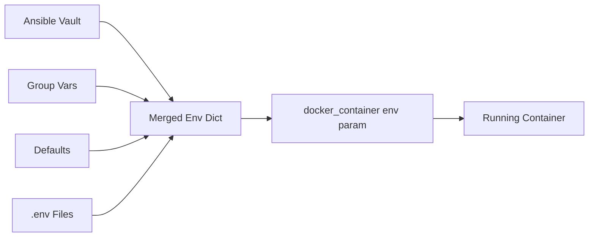

# How to Use Ansible docker_container Module with Environment Variables

Author: [nawazdhandala](https://www.github.com/nawazdhandala)

Tags: Ansible, Docker, Containers, Configuration

Description: Master passing environment variables to Docker containers using Ansible with the docker_container module and Vault integration.

---

Almost every Docker container needs some form of runtime configuration through environment variables. Database connection strings, API keys, feature flags, log levels: these all get passed in as environment variables. The Ansible `docker_container` module gives you several ways to handle this, from simple inline values to pulling secrets from Ansible Vault. This post covers all the approaches with practical examples.

## Basic Environment Variables

The simplest way to pass environment variables is through the `env` parameter, which accepts a dictionary:

```yaml
# basic_env.yml - Pass environment variables to a container
---
- name: Run Container with Environment Variables
  hosts: docker_hosts
  become: true

  tasks:
    - name: Start application container with env vars
      community.docker.docker_container:
        name: myapp
        image: myapp:latest
        state: started
        env:
          DATABASE_HOST: "db.example.com"
          DATABASE_PORT: "5432"
          DATABASE_NAME: "production"
          LOG_LEVEL: "info"
          APP_ENV: "production"
          WORKERS: "4"
```

One thing to watch out for: all environment variable values must be strings. If you pass an integer like `WORKERS: 4` without quotes, Ansible will throw an error. Always quote numeric values.

## Using Variables from Ansible

Hardcoding values in the playbook is fine for testing but not practical for real deployments. Use Ansible variables instead:

```yaml
# env_from_vars.yml - Use Ansible variables for container env
---
- name: Container with Dynamic Environment
  hosts: docker_hosts
  become: true
  vars:
    app_config:
      database_host: "{{ hostvars[groups['databases'][0]]['ansible_host'] }}"
      database_port: "5432"
      redis_host: "{{ hostvars[groups['cache'][0]]['ansible_host'] }}"
      app_env: "{{ deploy_environment }}"
      log_level: "{{ 'debug' if deploy_environment == 'staging' else 'info' }}"

  tasks:
    - name: Deploy app with environment-specific config
      community.docker.docker_container:
        name: myapp
        image: "myapp:{{ app_version }}"
        state: started
        env:
          DATABASE_HOST: "{{ app_config.database_host }}"
          DATABASE_PORT: "{{ app_config.database_port }}"
          REDIS_HOST: "{{ app_config.redis_host }}"
          APP_ENV: "{{ app_config.app_env }}"
          LOG_LEVEL: "{{ app_config.log_level }}"
```

## Secrets with Ansible Vault

Never put passwords or API keys directly in your playbooks. Use Ansible Vault to encrypt sensitive values:

```bash
# Create an encrypted variables file
ansible-vault create group_vars/production/vault.yml
```

Inside that vault file, define your secrets:

```yaml
# group_vars/production/vault.yml (encrypted)
vault_db_password: "super_secret_password"
vault_api_key: "ak_live_1234567890"
vault_jwt_secret: "jwt_signing_secret_here"
```

Then reference them in your playbook:

```yaml
# deploy_with_secrets.yml - Container env with Vault secrets
---
- name: Deploy with Vault Secrets
  hosts: docker_hosts
  become: true
  vars:
    db_password: "{{ vault_db_password }}"
    api_key: "{{ vault_api_key }}"

  tasks:
    - name: Run container with secret environment variables
      community.docker.docker_container:
        name: api-server
        image: myapi:latest
        state: started
        env:
          DATABASE_URL: "postgres://appuser:{{ db_password }}@db:5432/mydb"
          API_KEY: "{{ api_key }}"
          JWT_SECRET: "{{ vault_jwt_secret }}"
          PUBLIC_URL: "https://api.example.com"
      no_log: true  # Prevents secrets from appearing in Ansible output
```

The `no_log: true` directive is important. Without it, Ansible prints the full task parameters, including your secrets, to stdout.

## Loading Environment from a File

If your application uses `.env` files, you can load them into a dictionary and pass them to the container:

```yaml
# env_from_file.yml - Load env vars from a file on the control node
---
- name: Container with Env File
  hosts: docker_hosts
  become: true

  tasks:
    - name: Read env file
      ansible.builtin.slurp:
        src: /opt/config/myapp.env
      register: env_file_content
      delegate_to: localhost

    - name: Parse env file into dictionary
      ansible.builtin.set_fact:
        app_env_vars: >-
          {{
            (env_file_content.content | b64decode).split('\n')
            | select('match', '^[A-Z]')
            | map('regex_replace', '([^=]+)=(.*)', '\1=\2')
            | map('split', '=', 1)
            | items2dict(key_name=0, value_name=1)
          }}

    - name: Run container with loaded env vars
      community.docker.docker_container:
        name: myapp
        image: myapp:latest
        state: started
        env: "{{ app_env_vars }}"
```

Alternatively, use the `env_file` parameter, which reads a file directly on the remote host:

```yaml
    - name: Copy env file to remote host
      ansible.builtin.copy:
        src: files/myapp.env
        dest: /opt/config/myapp.env
        mode: '0600'

    - name: Run container with env_file
      community.docker.docker_container:
        name: myapp
        image: myapp:latest
        state: started
        env_file: /opt/config/myapp.env
```

## Merging Multiple Environment Sources

In practice, you often need to combine environment variables from multiple sources: defaults, environment-specific overrides, and secrets. Here is a pattern that handles this cleanly:

```yaml
# merged_env.yml - Combine env vars from multiple sources
---
- name: Container with Merged Environment
  hosts: docker_hosts
  become: true
  vars:
    # Base config shared across all environments
    base_env:
      APP_NAME: "myapp"
      LOG_FORMAT: "json"
      HEALTHCHECK_PATH: "/health"
      METRICS_PORT: "9090"

    # Environment-specific overrides (from group_vars)
    env_overrides:
      APP_ENV: "{{ deploy_environment }}"
      LOG_LEVEL: "{{ log_level | default('info') }}"
      WORKERS: "{{ worker_count | default('2') }}"
      DATABASE_HOST: "{{ db_host }}"

    # Secrets from Vault
    secret_env:
      DATABASE_PASSWORD: "{{ vault_db_password }}"
      SECRET_KEY: "{{ vault_secret_key }}"

  tasks:
    - name: Merge all environment sources
      ansible.builtin.set_fact:
        # Later dicts override earlier ones for duplicate keys
        merged_env: "{{ base_env | combine(env_overrides) | combine(secret_env) }}"

    - name: Deploy container with merged environment
      community.docker.docker_container:
        name: myapp
        image: "myapp:{{ app_version }}"
        state: started
        env: "{{ merged_env }}"
      no_log: true
```

## Per-Environment Configuration with Group Vars

Structure your inventory so each environment has its own variable file:

```
inventory/
  production/
    hosts.ini
    group_vars/
      all.yml          # Common vars
      vault.yml         # Encrypted secrets
  staging/
    hosts.ini
    group_vars/
      all.yml
      vault.yml
```

```yaml
# inventory/production/group_vars/all.yml
deploy_environment: production
log_level: info
worker_count: "8"
db_host: prod-db.internal.example.com
```

```yaml
# inventory/staging/group_vars/all.yml
deploy_environment: staging
log_level: debug
worker_count: "2"
db_host: staging-db.internal.example.com
```

## Environment Variable Flow

Here is how environment variables flow from different sources to the container:



## Verifying Environment Variables

After deploying a container, you might want to verify the environment variables were set correctly (without printing secrets):

```yaml
# verify_env.yml - Check container environment variables
---
- name: Verify Container Environment
  hosts: docker_hosts
  become: true

  tasks:
    - name: Inspect container
      community.docker.docker_container_info:
        name: myapp
      register: container_info

    - name: Extract non-secret env vars
      ansible.builtin.set_fact:
        safe_env_vars: >-
          {{
            container_info.container.Config.Env
            | select('match', '^(APP_|LOG_|WORKERS|HEALTHCHECK)')
            | list
          }}

    - name: Display safe environment variables
      ansible.builtin.debug:
        msg: "{{ safe_env_vars }}"

    - name: Verify required env vars are set
      ansible.builtin.assert:
        that:
          - "'APP_ENV=' in (container_info.container.Config.Env | join(' '))"
          - "'DATABASE_HOST=' in (container_info.container.Config.Env | join(' '))"
        fail_msg: "Required environment variables are missing"
```

## Common Pitfalls

A few things that trip people up when working with environment variables in the `docker_container` module:

1. **Values must be strings.** Even boolean-looking values need quotes: `ENABLE_CACHE: "true"`, not `ENABLE_CACHE: true`.

2. **Updating env vars requires container recreation.** If you change an environment variable, the container needs to be recreated. Use `recreate: true` or `restart: true` to force this.

3. **Variable precedence matters when merging.** The `combine` filter uses the rightmost dict for conflicts. Put your overrides and secrets last.

4. **Watch for Jinja2 whitespace.** Multi-line Jinja2 expressions can introduce unexpected whitespace in values. Use `trim` or the `-` whitespace control in templates.

## Summary

The `docker_container` module gives you flexible options for passing environment variables to containers. Start with simple `env` dictionaries for basic cases, use Ansible Vault for secrets, and adopt the merge pattern when you need to combine configuration from multiple sources. Always use `no_log: true` on tasks that handle sensitive values, and structure your inventory with per-environment group variables to keep configurations clean and maintainable.
