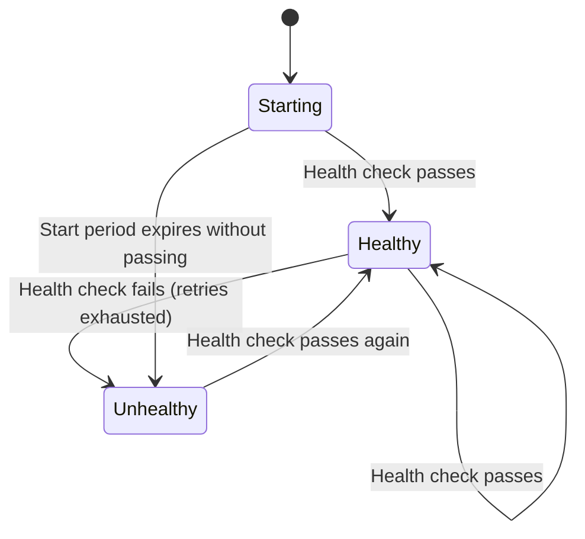

# How to Use Ansible docker_container Module with Health Checks

Author: [nawazdhandala](https://www.github.com/nawazdhandala)

Tags: Ansible, Docker, Health Checks, Monitoring, DevOps

Description: Configure Docker container health checks through Ansible to ensure services are running correctly with automated recovery.

---

Docker health checks let you define how Docker should test whether your container is actually working, not just running. A container can have a running process but be completely unresponsive due to a deadlock, memory leak, or crashed worker thread. Health checks catch these situations. When you configure them through Ansible, you get consistent health monitoring across your entire container fleet.

## Why Health Checks Matter

Without health checks, Docker only knows if the main process is running. It cannot tell the difference between a healthy web server and one that is returning 500 errors on every request. Health checks give Docker (and your orchestration layer) a way to detect unhealthy containers and take action.



A container goes through three health states: `starting` (during the start period), `healthy` (checks are passing), and `unhealthy` (checks have failed beyond the retry threshold).

## Basic Health Check Configuration

The `docker_container` module accepts a `healthcheck` parameter. Here is a simple HTTP health check for a web application:

```yaml
# basic_healthcheck.yml - Simple HTTP health check
---
- name: Deploy Container with Health Check
  hosts: docker_hosts
  become: true

  tasks:
    - name: Run web app with HTTP health check
      community.docker.docker_container:
        name: webapp
        image: myapp:latest
        state: started
        ports:
          - "8080:8080"
        healthcheck:
          test: ["CMD", "curl", "-f", "http://localhost:8080/health"]
          interval: 30s
          timeout: 10s
          retries: 3
          start_period: 40s
```

Let me break down each parameter:

- **test**: The command Docker runs to check health. `CMD` runs the command directly; `CMD-SHELL` runs it through a shell.
- **interval**: How often to run the check (default 30s).
- **timeout**: How long to wait for the check to complete before considering it failed.
- **retries**: How many consecutive failures before marking the container unhealthy.
- **start_period**: Grace period after container start where failures do not count toward retries.

## Shell-Based Health Checks

If you need shell features like pipes or environment variable expansion, use `CMD-SHELL`:

```yaml
# shell_healthcheck.yml - Health check using shell commands
---
- name: Container with Shell Health Check
  hosts: docker_hosts
  become: true

  tasks:
    - name: Run PostgreSQL with shell-based health check
      community.docker.docker_container:
        name: postgres
        image: postgres:16
        state: started
        env:
          POSTGRES_PASSWORD: "{{ vault_db_password }}"
          POSTGRES_DB: "appdb"
        healthcheck:
          # pg_isready checks if PostgreSQL is accepting connections
          test: ["CMD-SHELL", "pg_isready -U postgres -d appdb || exit 1"]
          interval: 10s
          timeout: 5s
          retries: 5
          start_period: 30s

    - name: Run Redis with health check
      community.docker.docker_container:
        name: redis
        image: redis:7-alpine
        state: started
        healthcheck:
          test: ["CMD-SHELL", "redis-cli ping | grep -q PONG"]
          interval: 15s
          timeout: 3s
          retries: 3
          start_period: 10s
```

## Health Checks for Different Service Types

Different services need different health check strategies. Here are examples for common service types:

```yaml
# service_healthchecks.yml - Health checks for various service types
---
- name: Deploy Services with Appropriate Health Checks
  hosts: docker_hosts
  become: true

  tasks:
    - name: REST API with endpoint check
      community.docker.docker_container:
        name: api
        image: myapi:latest
        state: started
        ports:
          - "3000:3000"
        healthcheck:
          test: ["CMD", "wget", "--no-verbose", "--tries=1", "--spider", "http://localhost:3000/api/health"]
          interval: 20s
          timeout: 5s
          retries: 3
          start_period: 15s

    - name: MySQL with connection check
      community.docker.docker_container:
        name: mysql
        image: mysql:8.0
        state: started
        env:
          MYSQL_ROOT_PASSWORD: "{{ vault_mysql_password }}"
        healthcheck:
          test: ["CMD", "mysqladmin", "ping", "-h", "localhost", "-u", "root", "-p{{ vault_mysql_password }}"]
          interval: 15s
          timeout: 5s
          retries: 5
          start_period: 60s  # MySQL can take a while to initialize

    - name: Elasticsearch with cluster health check
      community.docker.docker_container:
        name: elasticsearch
        image: elasticsearch:8.11.0
        state: started
        env:
          discovery.type: "single-node"
          xpack.security.enabled: "false"
        healthcheck:
          test: ["CMD-SHELL", "curl -s http://localhost:9200/_cluster/health | grep -q '\"status\":\"green\"\\|\"status\":\"yellow\"'"]
          interval: 30s
          timeout: 10s
          retries: 5
          start_period: 120s  # Elasticsearch needs time to start

    - name: RabbitMQ with management API check
      community.docker.docker_container:
        name: rabbitmq
        image: rabbitmq:3-management
        state: started
        healthcheck:
          test: ["CMD", "rabbitmq-diagnostics", "check_running"]
          interval: 30s
          timeout: 10s
          retries: 3
          start_period: 60s
```

## Custom Health Check Scripts

For complex health checks, mount a script into the container:

```yaml
# custom_healthcheck.yml - Using a custom health check script
---
- name: Container with Custom Health Check Script
  hosts: docker_hosts
  become: true

  tasks:
    - name: Create health check script
      ansible.builtin.copy:
        dest: /opt/myapp/healthcheck.sh
        mode: '0755'
        content: |
          #!/bin/sh
          # Check if the HTTP endpoint responds
          HTTP_STATUS=$(curl -s -o /dev/null -w '%{http_code}' http://localhost:8080/health)
          if [ "$HTTP_STATUS" != "200" ]; then
            echo "HTTP check failed with status $HTTP_STATUS"
            exit 1
          fi

          # Check if the worker process is running
          if ! pgrep -f "worker" > /dev/null; then
            echo "Worker process not found"
            exit 1
          fi

          # Check disk space inside container
          USAGE=$(df /app/data | tail -1 | awk '{print $5}' | sed 's/%//')
          if [ "$USAGE" -gt 90 ]; then
            echo "Disk usage at ${USAGE}%"
            exit 1
          fi

          echo "All checks passed"
          exit 0

    - name: Run container with custom health check
      community.docker.docker_container:
        name: myapp
        image: myapp:latest
        state: started
        volumes:
          - "/opt/myapp/healthcheck.sh:/healthcheck.sh:ro"
        healthcheck:
          test: ["CMD", "/healthcheck.sh"]
          interval: 30s
          timeout: 15s
          retries: 3
          start_period: 45s
```

## Monitoring Health Check Status with Ansible

After deploying containers with health checks, you can monitor their health status:

```yaml
# check_health_status.yml - Monitor container health
---
- name: Monitor Container Health
  hosts: docker_hosts
  become: true
  vars:
    containers_to_check:
      - webapp
      - api
      - postgres
      - redis

  tasks:
    - name: Get container health status
      community.docker.docker_container_info:
        name: "{{ item }}"
      register: container_info
      loop: "{{ containers_to_check }}"

    - name: Report health status
      ansible.builtin.debug:
        msg: >
          {{ item.item }}:
          Status={{ item.container.State.Health.Status | default('no healthcheck') }},
          FailingStreak={{ item.container.State.Health.FailingStreak | default(0) }}
      loop: "{{ container_info.results }}"
      loop_control:
        label: "{{ item.item }}"

    - name: Fail if any container is unhealthy
      ansible.builtin.assert:
        that:
          - item.container.State.Health.Status == "healthy"
        fail_msg: "Container {{ item.item }} is {{ item.container.State.Health.Status }}"
        quiet: true
      loop: "{{ container_info.results }}"
      loop_control:
        label: "{{ item.item }}"
      when: item.container.State.Health is defined
```

## Waiting for Health Before Proceeding

When deploying dependent services, you need to wait for one container to become healthy before starting the next:

```yaml
# wait_for_health.yml - Wait for container health before continuing
---
- name: Deploy with Health Dependencies
  hosts: docker_hosts
  become: true

  tasks:
    - name: Start database
      community.docker.docker_container:
        name: postgres
        image: postgres:16
        state: started
        env:
          POSTGRES_PASSWORD: "{{ vault_db_password }}"
        healthcheck:
          test: ["CMD-SHELL", "pg_isready -U postgres"]
          interval: 5s
          timeout: 3s
          retries: 10
          start_period: 30s

    - name: Wait for database to be healthy
      community.docker.docker_container_info:
        name: postgres
      register: db_info
      until: db_info.container.State.Health.Status == "healthy"
      retries: 30
      delay: 5

    - name: Start application (depends on healthy database)
      community.docker.docker_container:
        name: webapp
        image: myapp:latest
        state: started
        env:
          DATABASE_URL: "postgres://postgres:{{ vault_db_password }}@postgres:5432/postgres"
        healthcheck:
          test: ["CMD", "curl", "-f", "http://localhost:8080/health"]
          interval: 15s
          timeout: 5s
          retries: 3
          start_period: 20s
```

## Disabling a Health Check from an Image

Some images come with built-in health checks that might not suit your deployment. You can override or disable them:

```yaml
    - name: Run container with disabled health check
      community.docker.docker_container:
        name: myapp
        image: myapp:latest
        state: started
        healthcheck:
          test: ["NONE"]  # Disables the health check entirely
```

Or override with a completely different check:

```yaml
    - name: Override image's built-in health check
      community.docker.docker_container:
        name: myapp
        image: myapp:latest
        state: started
        healthcheck:
          test: ["CMD", "curl", "-f", "http://localhost:8080/ready"]
          interval: 10s
          timeout: 3s
          retries: 5
```

## Automatic Recovery with Restart Policies

Health checks work hand-in-hand with restart policies. When a container becomes unhealthy and Docker Swarm is managing it, the orchestrator can replace it. For standalone containers, you need to handle recovery yourself, but health checks still give you visibility:

```yaml
    - name: Container with health check and restart policy
      community.docker.docker_container:
        name: api
        image: myapi:latest
        state: started
        restart_policy: unless-stopped
        healthcheck:
          test: ["CMD", "curl", "-f", "http://localhost:3000/health"]
          interval: 15s
          timeout: 5s
          retries: 3
          start_period: 20s
```

Note that the `restart_policy` restarts containers when the main process exits, not when the health check fails. For automatic replacement on health check failure, you need Swarm or an external tool monitoring the health status.

## Summary

Health checks are one of those things that seem optional until you get a production incident caused by a zombie container that was technically "running" but not actually serving traffic. Configuring them through Ansible ensures every container in your fleet gets proper health monitoring from day one. The key decisions are choosing the right check command for your service type, setting an appropriate start period so slow-starting services do not get flagged prematurely, and building your deployment playbooks to wait for health dependencies before starting downstream services.
