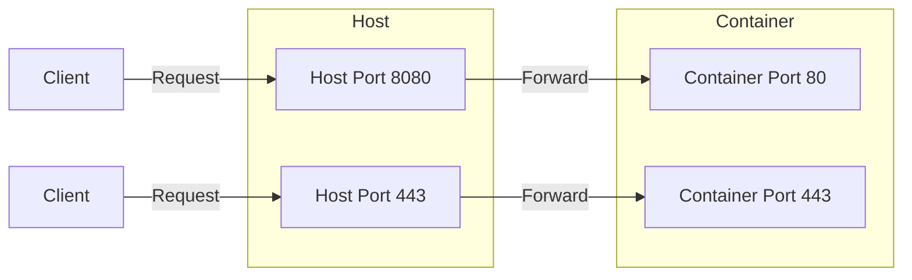

# How to Use Ansible docker_container Module with Port Mapping

Author: [nawazdhandala](https://www.github.com/nawazdhandala)

Tags: Ansible, Docker, Networking, Containers

Description: Configure Docker container port mappings using the Ansible docker_container module with practical examples for various scenarios.

---

Port mapping connects container ports to host ports, making your containerized services reachable from outside the Docker network. The Ansible `docker_container` module provides multiple ways to configure port mappings, from simple one-to-one mappings to complex multi-protocol setups. This post walks through all the common patterns you will encounter.

## How Docker Port Mapping Works

When a container runs, its services listen on ports inside the container's network namespace. Without port mapping, these ports are only accessible from other containers on the same Docker network. Port mapping creates a forwarding rule from the host's network stack to the container's internal port.



## Basic Port Mapping

The simplest form maps a host port to a container port using the `ports` parameter:

```yaml
# basic_ports.yml - Simple port mapping examples
---
- name: Container with Basic Port Mapping
  hosts: docker_hosts
  become: true

  tasks:
    - name: Run nginx with port 80 mapped to host port 8080
      community.docker.docker_container:
        name: web
        image: nginx:latest
        state: started
        ports:
          - "8080:80"
```

The format is `host_port:container_port`. In this example, traffic hitting the host on port 8080 gets forwarded to port 80 inside the container.

## Mapping Multiple Ports

Many applications expose more than one port. Just add multiple entries to the `ports` list:

```yaml
# multi_port.yml - Container with multiple port mappings
---
- name: Deploy Application with Multiple Ports
  hosts: docker_hosts
  become: true

  tasks:
    - name: Run app with HTTP, HTTPS, and metrics ports
      community.docker.docker_container:
        name: api-server
        image: myapi:latest
        state: started
        ports:
          - "80:8080"      # HTTP traffic
          - "443:8443"     # HTTPS traffic
          - "9090:9090"    # Prometheus metrics
```

## Binding to a Specific Interface

By default, Docker binds mapped ports to all interfaces (0.0.0.0). In many production scenarios, you want to restrict this. For example, you might want the application port public but the metrics port only accessible on localhost:

```yaml
# interface_binding.yml - Bind ports to specific network interfaces
---
- name: Container with Interface-Specific Port Mapping
  hosts: docker_hosts
  become: true

  tasks:
    - name: Run app with restricted port bindings
      community.docker.docker_container:
        name: api-server
        image: myapi:latest
        state: started
        ports:
          - "0.0.0.0:80:8080"        # Public: accessible from all interfaces
          - "127.0.0.1:9090:9090"     # Localhost only: metrics
          - "10.0.1.5:8443:8443"      # Specific IP: internal API
```

This is especially important for security. If your host has both a public and private network interface, you probably want database admin ports bound only to the private interface:

```yaml
    - name: Run PostgreSQL with restricted access
      community.docker.docker_container:
        name: postgres
        image: postgres:16
        state: started
        ports:
          - "10.0.1.5:5432:5432"  # Only accessible from private network
        env:
          POSTGRES_PASSWORD: "{{ vault_db_password }}"
```

## Dynamic Port Assignment

If you do not care which host port gets used, let Docker assign one dynamically by omitting the host port:

```yaml
# dynamic_ports.yml - Let Docker assign host ports
---
- name: Container with Dynamic Port Assignment
  hosts: docker_hosts
  become: true

  tasks:
    - name: Run container with dynamic port
      community.docker.docker_container:
        name: worker-1
        image: myworker:latest
        state: started
        ports:
          - "8080"  # Docker assigns a random host port
      register: container_result

    - name: Get container port mapping details
      community.docker.docker_container_info:
        name: worker-1
      register: container_info

    - name: Show assigned port
      ansible.builtin.debug:
        msg: "Container port 8080 mapped to host port {{ container_info.container.NetworkSettings.Ports['8080/tcp'][0].HostPort }}"
```

This is useful when running multiple instances of the same service where port conflicts would be an issue.

## UDP Port Mapping

Docker defaults to TCP, but some services need UDP. Specify the protocol after the port:

```yaml
# udp_ports.yml - UDP port mapping for DNS and other UDP services
---
- name: Deploy DNS Server Container
  hosts: docker_hosts
  become: true

  tasks:
    - name: Run CoreDNS with TCP and UDP port mappings
      community.docker.docker_container:
        name: dns-server
        image: coredns/coredns:latest
        state: started
        ports:
          - "53:53/tcp"    # DNS over TCP
          - "53:53/udp"    # DNS over UDP
          - "9153:9153"    # Metrics (TCP by default)

    - name: Run StatsD with UDP
      community.docker.docker_container:
        name: statsd
        image: statsd/statsd:latest
        state: started
        ports:
          - "8125:8125/udp"   # StatsD metrics ingestion
          - "8126:8126/tcp"   # StatsD management console
```

## Port Ranges

When you need to map a range of ports, Docker supports range syntax:

```yaml
# port_range.yml - Map a range of ports
---
- name: Container with Port Range
  hosts: docker_hosts
  become: true

  tasks:
    - name: Run FTP server with passive port range
      community.docker.docker_container:
        name: ftp-server
        image: fauria/vsftpd:latest
        state: started
        ports:
          - "21:21"                 # FTP control port
          - "21100-21110:21100-21110"  # Passive mode port range
        env:
          PASV_MIN_PORT: "21100"
          PASV_MAX_PORT: "21110"
```

## Using the Published Ports Parameter

For more control, use the `published_ports` parameter with the `all` keyword to publish all exposed ports:

```yaml
# publish_all.yml - Publish all ports exposed in the Dockerfile
---
- name: Publish All Exposed Ports
  hosts: docker_hosts
  become: true

  tasks:
    - name: Run container publishing all exposed ports
      community.docker.docker_container:
        name: full-app
        image: myapp:latest
        state: started
        published_ports:
          - all
```

This maps every port listed in the image's `EXPOSE` directive to a random host port. It is equivalent to `docker run -P`.

## Deploying Multiple Instances with Different Ports

A common pattern is running several instances of the same service, each on a different port:

```yaml
# multi_instance.yml - Deploy multiple instances with unique ports
---
- name: Deploy Multiple Application Instances
  hosts: docker_hosts
  become: true
  vars:
    instances:
      - { name: "app-1", host_port: 8081 }
      - { name: "app-2", host_port: 8082 }
      - { name: "app-3", host_port: 8083 }

  tasks:
    - name: Deploy each instance with its own port
      community.docker.docker_container:
        name: "{{ item.name }}"
        image: myapp:latest
        state: started
        ports:
          - "{{ item.host_port }}:8080"
        env:
          INSTANCE_ID: "{{ item.name }}"
      loop: "{{ instances }}"
```

## Reverse Proxy Pattern

A common production setup puts a reverse proxy in front of application containers. The app containers do not need host port mappings since the proxy talks to them over the Docker network:

```yaml
# reverse_proxy.yml - Proxy with port mapping, backends without
---
- name: Deploy Reverse Proxy Architecture
  hosts: docker_hosts
  become: true

  tasks:
    - name: Create application network
      community.docker.docker_network:
        name: app_net

    - name: Deploy backend containers (no host port mapping)
      community.docker.docker_container:
        name: "backend-{{ item }}"
        image: myapp:latest
        state: started
        networks:
          - name: app_net
        env:
          INSTANCE: "{{ item }}"
      loop: "{{ range(1, 4) | list }}"

    - name: Deploy nginx reverse proxy (with port mapping)
      community.docker.docker_container:
        name: nginx-proxy
        image: nginx:latest
        state: started
        ports:
          - "80:80"
          - "443:443"
        networks:
          - name: app_net
        volumes:
          - "/opt/nginx/conf.d:/etc/nginx/conf.d:ro"
          - "/opt/nginx/certs:/etc/nginx/certs:ro"
```

In this setup, only the nginx proxy has host port mappings. The backend containers communicate over the Docker network, which is both simpler and more secure.

## Verifying Port Mappings

After deploying containers, verify the port mappings are correct:

```yaml
# verify_ports.yml - Check that port mappings are correctly configured
---
- name: Verify Port Mappings
  hosts: docker_hosts
  become: true

  tasks:
    - name: Get container info
      community.docker.docker_container_info:
        name: web
      register: container_info

    - name: Display port mappings
      ansible.builtin.debug:
        msg: "Port mappings: {{ container_info.container.NetworkSettings.Ports }}"

    - name: Test port is responding
      ansible.builtin.uri:
        url: "http://localhost:8080/health"
        method: GET
        status_code: 200
      register: health_check
      retries: 5
      delay: 3
      until: health_check.status == 200
```

## Port Conflict Prevention

When managing many containers, port conflicts are a real problem. Here is a pattern that checks for conflicts before deploying:

```yaml
    - name: Check if host port is already in use
      ansible.builtin.wait_for:
        port: "{{ target_port }}"
        state: stopped
        timeout: 1
      register: port_check
      ignore_errors: true

    - name: Fail if port is occupied
      ansible.builtin.fail:
        msg: "Port {{ target_port }} is already in use on this host"
      when: port_check is failed
```

## Summary

Port mapping with the `docker_container` module is straightforward once you know the syntax options. Bind to specific interfaces for security, use dynamic ports when running multiple instances, and remember to specify the protocol for UDP services. For production deployments, prefer the reverse proxy pattern where only the proxy container exposes host ports, keeping your application containers isolated on Docker networks.
