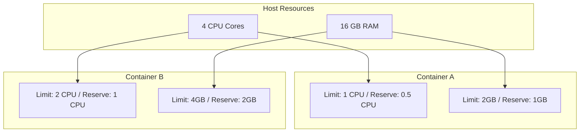

# How to Use Ansible to Manage Docker Container Resources (CPU/Memory)

Author: [nawazdhandala](https://www.github.com/nawazdhandala)

Tags: Ansible, Docker, Resources, Performance, DevOps

Description: Control Docker container CPU and memory usage with Ansible to prevent resource contention and ensure application performance.

---

Without resource limits, a single container can consume all available CPU and memory on a host, starving other containers and potentially crashing the entire system. Setting resource limits on Docker containers is a fundamental production practice. Ansible makes it easy to enforce consistent resource policies across all your containers and hosts.

## How Docker Resource Limits Work

Docker uses Linux cgroups (control groups) to limit the resources a container can use. There are two concepts for each resource type:

- **Limits**: The maximum amount a container can use. Docker will kill the container if it exceeds memory limits (OOM kill) or throttle CPU usage.
- **Reservations**: The minimum amount guaranteed to the container. Docker uses these for scheduling decisions in Swarm mode.



## Setting Memory Limits

The `docker_container` module accepts `memory` and `memory_reservation` parameters:

```yaml
# memory_limits.yml - Set memory limits on containers
---
- name: Deploy Containers with Memory Limits
  hosts: docker_hosts
  become: true

  tasks:
    - name: Run application with memory limit
      community.docker.docker_container:
        name: webapp
        image: myapp:latest
        state: started
        memory: "512m"             # Hard limit: container gets OOM-killed above this
        memory_reservation: "256m" # Soft limit: Docker tries to keep it at this level
        memory_swap: "768m"        # Memory + swap total (set equal to memory to disable swap)

    - name: Run database with generous memory
      community.docker.docker_container:
        name: postgres
        image: postgres:16
        state: started
        memory: "2g"
        memory_reservation: "1g"
        memory_swap: "2g"  # Same as memory = no swap usage
        env:
          POSTGRES_PASSWORD: "{{ vault_db_password }}"
          # Tell PostgreSQL about its available memory
          POSTGRES_SHARED_BUFFERS: "512MB"
          POSTGRES_EFFECTIVE_CACHE_SIZE: "1536MB"
```

Memory values can use suffixes: `b` (bytes), `k` (kilobytes), `m` (megabytes), `g` (gigabytes).

### Disabling Swap

For latency-sensitive applications, disable swap by setting `memory_swap` equal to `memory`:

```yaml
    - name: No-swap container for low-latency service
      community.docker.docker_container:
        name: cache
        image: redis:7-alpine
        state: started
        memory: "1g"
        memory_swap: "1g"  # Equal to memory = swap disabled
        memory_swappiness: 0  # Further discourage swap usage
```

## Setting CPU Limits

Docker provides several ways to control CPU usage:

```yaml
# cpu_limits.yml - Various CPU limiting strategies
---
- name: Deploy Containers with CPU Limits
  hosts: docker_hosts
  become: true

  tasks:
    - name: Limit to a fractional CPU
      community.docker.docker_container:
        name: worker
        image: myworker:latest
        state: started
        cpus: 1.5  # Can use up to 1.5 CPU cores

    - name: Set CPU shares (relative weight)
      community.docker.docker_container:
        name: background-task
        image: mytask:latest
        state: started
        cpu_shares: 512  # Default is 1024; this gets half the priority

    - name: Pin container to specific CPU cores
      community.docker.docker_container:
        name: latency-sensitive
        image: myapp:latest
        state: started
        cpuset_cpus: "0,1"  # Only run on cores 0 and 1
        cpus: 2.0

    - name: Set CPU period and quota for fine-grained control
      community.docker.docker_container:
        name: throttled-service
        image: myservice:latest
        state: started
        cpu_period: 100000   # Microseconds (100ms)
        cpu_quota: 50000     # Microseconds - gets 50% of one CPU
```

### CPU Shares vs CPU Limits

The difference matters:

- **cpu_shares** is relative weighting. If container A has 1024 shares and container B has 512, A gets twice the CPU time when both are competing. But if A is idle, B can use all available CPU.
- **cpus** is a hard limit. Setting `cpus: 1.0` means the container never uses more than one core, even if the host has idle CPU capacity.

```yaml
    - name: Web server with guaranteed but flexible CPU
      community.docker.docker_container:
        name: web
        image: nginx:latest
        state: started
        cpus: 2.0         # Hard ceiling
        cpu_shares: 2048  # High priority when competing
```

## Combining CPU and Memory Limits

Here is a realistic production deployment with both CPU and memory limits:

```yaml
# full_resource_limits.yml - Production resource configuration
---
- name: Deploy Application Stack with Resource Limits
  hosts: docker_hosts
  become: true
  vars:
    services:
      - name: web
        image: myapp/web:latest
        cpus: 1.0
        memory: "512m"
        memory_reserve: "256m"
        ports: ["80:8080"]
      - name: api
        image: myapp/api:latest
        cpus: 2.0
        memory: "1g"
        memory_reserve: "512m"
        ports: ["3000:3000"]
      - name: worker
        image: myapp/worker:latest
        cpus: 1.0
        memory: "768m"
        memory_reserve: "384m"
        ports: []
      - name: cache
        image: redis:7-alpine
        cpus: 0.5
        memory: "256m"
        memory_reserve: "128m"
        ports: []

  tasks:
    - name: Deploy services with resource limits
      community.docker.docker_container:
        name: "{{ item.name }}"
        image: "{{ item.image }}"
        state: started
        cpus: "{{ item.cpus }}"
        memory: "{{ item.memory }}"
        memory_reservation: "{{ item.memory_reserve }}"
        memory_swap: "{{ item.memory }}"  # Disable swap for all
        ports: "{{ item.ports }}"
        restart_policy: unless-stopped
      loop: "{{ services }}"
      loop_control:
        label: "{{ item.name }}"
```

## Monitoring Resource Usage

After setting limits, monitor actual usage to see if your limits are appropriate:

```yaml
# monitor_resources.yml - Check container resource usage
---
- name: Monitor Container Resource Usage
  hosts: docker_hosts
  become: true
  vars:
    containers_to_check:
      - web
      - api
      - worker
      - cache

  tasks:
    - name: Get container stats
      ansible.builtin.command:
        cmd: "docker stats --no-stream --format '{{.Name}}\t{{.CPUPerc}}\t{{.MemUsage}}\t{{.MemPerc}}' {{ containers_to_check | join(' ') }}"
      register: stats_output
      changed_when: false

    - name: Display resource usage
      ansible.builtin.debug:
        msg: "{{ stats_output.stdout_lines }}"

    - name: Check for containers near memory limit
      ansible.builtin.command:
        cmd: "docker stats --no-stream --format '{{.Name}}: {{.MemPerc}}' {{ item }}"
      register: mem_stats
      loop: "{{ containers_to_check }}"
      changed_when: false

    - name: Warn about high memory usage
      ansible.builtin.debug:
        msg: "WARNING: {{ item.item }} memory usage is {{ item.stdout }}"
      loop: "{{ mem_stats.results }}"
      loop_control:
        label: "{{ item.item }}"
      when: item.stdout | regex_search('[0-9.]+') | float > 80.0
```

## OOM Kill Detection

When a container exceeds its memory limit, Docker kills it with an OOM (Out of Memory) error. Detect this:

```yaml
# detect_oom.yml - Check for OOM-killed containers
---
- name: Detect OOM-Killed Containers
  hosts: docker_hosts
  become: true

  tasks:
    - name: Check container for OOM kills
      community.docker.docker_container_info:
        name: "{{ item }}"
      register: container_info
      loop:
        - web
        - api
        - worker

    - name: Report OOM-killed containers
      ansible.builtin.debug:
        msg: "ALERT: {{ item.item }} was OOM-killed!"
      loop: "{{ container_info.results }}"
      loop_control:
        label: "{{ item.item }}"
      when: item.container.State.OOMKilled | default(false)

    - name: Check kernel logs for OOM events
      ansible.builtin.command:
        cmd: dmesg -T | grep -i "oom\|killed process" | tail -10
      register: oom_logs
      changed_when: false

    - name: Display OOM kernel messages
      ansible.builtin.debug:
        msg: "{{ oom_logs.stdout_lines }}"
      when: oom_logs.stdout_lines | length > 0
```

## Swarm Service Resource Management

In Docker Swarm, resources are specified differently using `limits` and `reservations`:

```yaml
# swarm_resources.yml - Resource management for Swarm services
---
- name: Deploy Swarm Service with Resources
  hosts: swarm_managers[0]
  become: true

  tasks:
    - name: Deploy service with resource constraints
      community.docker.docker_swarm_service:
        name: api
        image: myapi:latest
        replicas: 3
        limits:
          cpus: 1.0
          memory: 512M
        reservations:
          cpus: 0.25
          memory: 256M
        placement:
          constraints:
            - "node.role == worker"
```

Swarm uses reservations for scheduling. If a node does not have enough unreserved resources, the service will not schedule there. Limits are still hard ceilings that cgroups enforce.

## Resource Limit Sizing Guidelines

Getting resource limits right takes some iteration. Here are starting points for common services:

```yaml
    resource_profiles:
      # Small utility services (nginx proxy, log shipper)
      small:
        cpus: 0.5
        memory: "256m"
        memory_reserve: "128m"
      # Medium application services (API, web)
      medium:
        cpus: 1.0
        memory: "512m"
        memory_reserve: "256m"
      # Large services (database, search)
      large:
        cpus: 2.0
        memory: "2g"
        memory_reserve: "1g"
      # Memory-intensive (caches, in-memory stores)
      memory_heavy:
        cpus: 1.0
        memory: "4g"
        memory_reserve: "2g"
```

Monitor actual usage for a week and adjust based on real data. Set limits at about 150% of typical usage to give headroom for spikes without wasting resources.

## Summary

Resource limits prevent individual containers from monopolizing host resources. Ansible makes it straightforward to enforce consistent resource policies across your entire container fleet. Start with conservative limits based on the application type, monitor actual usage, and adjust over time. Always set memory limits (OOM is better than a frozen host), and use CPU limits for workloads that should not dominate CPU time. For Swarm deployments, reservations give the scheduler the information it needs to place services on nodes with sufficient capacity.
