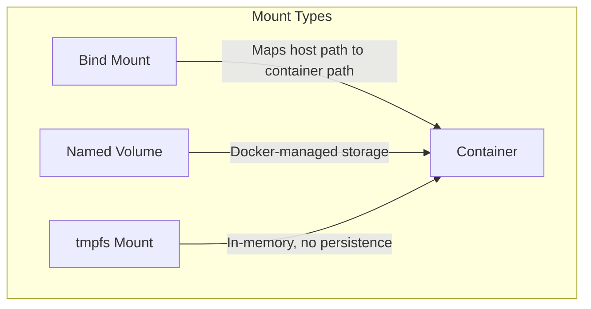

# How to Use Ansible docker_container Module with Volume Mounts

Author: [nawazdhandala](https://www.github.com/nawazdhandala)

Tags: Ansible, Docker, Volumes, Storage, DevOps

Description: Configure Docker container volume mounts with Ansible including bind mounts, named volumes, tmpfs, and read-only configurations.

---

Containers are ephemeral by design. When a container stops, any data written inside it is gone. Volume mounts solve this by connecting host directories or Docker-managed volumes to paths inside the container. The Ansible `docker_container` module supports all of Docker's mount types, and this post covers each one with real examples.

## Volume Types in Docker

Docker supports three types of mounts:



- **Bind mounts** map a specific directory on the host to a path in the container. You control the exact location on disk.
- **Named volumes** are managed by Docker. Docker decides where on the host filesystem to store the data.
- **tmpfs mounts** store data in memory only. Useful for sensitive data that should never touch disk.

## Bind Mounts

Bind mounts are the most common type. You specify both the host path and the container path:

```yaml
# bind_mount.yml - Container with bind mount volumes
---
- name: Container with Bind Mounts
  hosts: docker_hosts
  become: true

  tasks:
    - name: Create host directories for the application
      ansible.builtin.file:
        path: "{{ item }}"
        state: directory
        mode: '0755'
      loop:
        - /opt/myapp/data
        - /opt/myapp/config
        - /opt/myapp/logs

    - name: Run container with bind mounts
      community.docker.docker_container:
        name: myapp
        image: myapp:latest
        state: started
        volumes:
          - "/opt/myapp/data:/app/data"
          - "/opt/myapp/config:/app/config:ro"
          - "/opt/myapp/logs:/app/logs"
```

The format is `host_path:container_path[:options]`. The `:ro` suffix makes the mount read-only inside the container, which is a good security practice for configuration files that the application should never modify.

## Named Volumes

Named volumes let Docker manage the storage location. They are easier to back up and work better across different host operating systems:

```yaml
# named_volumes.yml - Container with Docker-managed named volumes
---
- name: Container with Named Volumes
  hosts: docker_hosts
  become: true

  tasks:
    - name: Create named volumes
      community.docker.docker_volume:
        name: "{{ item }}"
        state: present
      loop:
        - postgres_data
        - postgres_backups

    - name: Run PostgreSQL with named volumes
      community.docker.docker_container:
        name: postgres
        image: postgres:16
        state: started
        volumes:
          - "postgres_data:/var/lib/postgresql/data"
          - "postgres_backups:/backups"
        env:
          POSTGRES_PASSWORD: "{{ vault_db_password }}"
```

You can also create volumes with specific drivers and options:

```yaml
    - name: Create volume with specific driver options
      community.docker.docker_volume:
        name: nfs_share
        driver: local
        driver_options:
          type: nfs
          o: "addr=10.0.1.100,rw"
          device: ":/exports/data"
```

## Read-Only Containers with Specific Writable Mounts

A security best practice is to run containers with a read-only root filesystem and only mount specific writable paths where the application needs to write:

```yaml
# readonly_container.yml - Read-only container with writable mounts
---
- name: Secure Container with Read-Only Root
  hosts: docker_hosts
  become: true

  tasks:
    - name: Run container with read-only filesystem
      community.docker.docker_container:
        name: secure-app
        image: myapp:latest
        state: started
        read_only: true
        volumes:
          - "app_data:/app/data"              # Writable: persistent data
          - "/opt/config/app.yml:/app/config/app.yml:ro"  # Read-only config
        tmpfs:
          /tmp: "size=100M,mode=1777"         # Writable tmp in memory
          /run: "size=50M"                     # Writable run directory
```

The `read_only: true` parameter makes the entire container filesystem read-only. The `tmpfs` parameter creates in-memory writable mounts for directories where the application needs to write temporary files.

## Sharing Volumes Between Containers

Containers can share data through volumes. This is common for sidecar patterns where one container produces data and another processes it:

```yaml
# shared_volumes.yml - Multiple containers sharing a volume
---
- name: Shared Volume Between Containers
  hosts: docker_hosts
  become: true

  tasks:
    - name: Create shared volume
      community.docker.docker_volume:
        name: shared_logs

    - name: Run application that writes logs
      community.docker.docker_container:
        name: app
        image: myapp:latest
        state: started
        volumes:
          - "shared_logs:/app/logs"

    - name: Run log shipper that reads logs
      community.docker.docker_container:
        name: log-shipper
        image: fluentd:latest
        state: started
        volumes:
          - "shared_logs:/fluentd/log:ro"  # Read-only access is sufficient
          - "/opt/fluentd/conf:/fluentd/etc:ro"
```

## Using the Mounts Parameter

The `volumes` parameter uses Docker's short syntax. For more control, use the `mounts` parameter with the long-form syntax:

```yaml
# mounts_parameter.yml - Using the mounts parameter for fine-grained control
---
- name: Container with Mounts Parameter
  hosts: docker_hosts
  become: true

  tasks:
    - name: Run container with detailed mount configuration
      community.docker.docker_container:
        name: myapp
        image: myapp:latest
        state: started
        mounts:
          - type: bind
            source: /opt/myapp/config
            target: /app/config
            read_only: true
          - type: volume
            source: app_data
            target: /app/data
            volume_driver: local
            volume_options:
              type: none
              device: /mnt/ssd/app_data
              o: bind
          - type: tmpfs
            target: /app/tmp
            tmpfs_size: "104857600"  # 100MB in bytes
            tmpfs_mode: "1777"
```

The `mounts` parameter gives you access to all Docker mount options, including volume driver configuration and tmpfs size limits.

## Database Volume Management

Databases need careful volume handling. Here is a complete example for PostgreSQL that includes backup volume management:

```yaml
# database_volumes.yml - Proper database volume setup
---
- name: PostgreSQL with Proper Volume Management
  hosts: docker_hosts
  become: true
  vars:
    db_data_volume: postgres_data_v2
    db_backup_dir: /opt/backups/postgres

  tasks:
    - name: Create data volume with labels
      community.docker.docker_volume:
        name: "{{ db_data_volume }}"
        labels:
          app: postgres
          env: production
          backup: "daily"

    - name: Create backup directory on host
      ansible.builtin.file:
        path: "{{ db_backup_dir }}"
        state: directory
        mode: '0750'
        owner: "999"   # postgres user UID inside the container
        group: "999"

    - name: Run PostgreSQL
      community.docker.docker_container:
        name: postgres
        image: postgres:16
        state: started
        restart_policy: unless-stopped
        volumes:
          - "{{ db_data_volume }}:/var/lib/postgresql/data"
          - "{{ db_backup_dir }}:/backups"
          - "/opt/postgres/init:/docker-entrypoint-initdb.d:ro"
          - "/opt/postgres/conf/postgresql.conf:/etc/postgresql/postgresql.conf:ro"
        env:
          POSTGRES_PASSWORD: "{{ vault_db_password }}"
          PGDATA: "/var/lib/postgresql/data/pgdata"
        command: "postgres -c config_file=/etc/postgresql/postgresql.conf"
```

## Volume Backup with Ansible

Here is a task set that backs up a named volume:

```yaml
# backup_volume.yml - Backup a Docker volume
---
- name: Backup Docker Volume
  hosts: docker_hosts
  become: true
  vars:
    volume_name: postgres_data_v2
    backup_dir: /opt/backups
    backup_timestamp: "{{ ansible_date_time.iso8601_basic_short }}"

  tasks:
    - name: Create backup using a temporary container
      community.docker.docker_container:
        name: volume-backup
        image: alpine:latest
        state: started
        detach: false
        cleanup: true
        command: >
          tar czf /backup/{{ volume_name }}-{{ backup_timestamp }}.tar.gz
          -C /source .
        volumes:
          - "{{ volume_name }}:/source:ro"
          - "{{ backup_dir }}:/backup"
      register: backup_result

    - name: Verify backup file exists
      ansible.builtin.stat:
        path: "{{ backup_dir }}/{{ volume_name }}-{{ backup_timestamp }}.tar.gz"
      register: backup_file

    - name: Report backup status
      ansible.builtin.debug:
        msg: "Backup size: {{ backup_file.stat.size | human_readable }}"
      when: backup_file.stat.exists
```

## Cleaning Up Unused Volumes

Unused volumes accumulate over time and eat disk space:

```yaml
# cleanup_volumes.yml - Remove unused Docker volumes
---
- name: Clean Up Unused Volumes
  hosts: docker_hosts
  become: true

  tasks:
    - name: Get list of all volumes
      community.docker.docker_volume_info:
      register: all_volumes

    - name: Prune unused volumes
      community.docker.docker_prune:
        volumes: true
        volumes_filters:
          dangling: "true"
      register: prune_result

    - name: Report freed space
      ansible.builtin.debug:
        msg: "Freed {{ prune_result.volumes_space_reclaimed | default(0) | human_readable }} from pruned volumes"
```

## Permissions and Ownership

One of the most common issues with volume mounts is file permission problems. The user inside the container might not match the owner of the host files:

```yaml
# permissions.yml - Handle volume permissions correctly
---
- name: Handle Volume Permissions
  hosts: docker_hosts
  become: true
  vars:
    app_uid: 1000
    app_gid: 1000

  tasks:
    - name: Create directories with correct ownership
      ansible.builtin.file:
        path: "{{ item }}"
        state: directory
        owner: "{{ app_uid }}"
        group: "{{ app_gid }}"
        mode: '0755'
      loop:
        - /opt/myapp/data
        - /opt/myapp/logs

    - name: Run container with matching user
      community.docker.docker_container:
        name: myapp
        image: myapp:latest
        state: started
        user: "{{ app_uid }}:{{ app_gid }}"
        volumes:
          - "/opt/myapp/data:/app/data"
          - "/opt/myapp/logs:/app/logs"
```

## Summary

Volume mounts in the `docker_container` module cover every scenario you will encounter in production. Use bind mounts when you need control over the exact host path, named volumes for portability and Docker-managed storage, and tmpfs for temporary data that should never hit disk. Always create host directories before mounting them, handle file permissions carefully, and remember that `:ro` mounts are a simple but effective security measure for configuration files. Regular volume cleanup prevents disk space issues from sneaking up on you.
