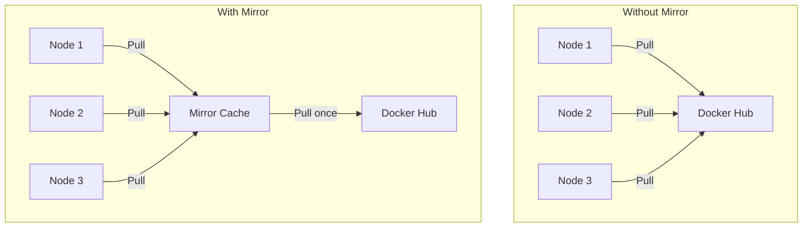

# How to Use Ansible to Set Up Docker Registry Mirror

Author: [nawazdhandala](https://www.github.com/nawazdhandala)

Tags: Ansible, Docker, Registry, Mirror, Infrastructure

Description: Set up and configure Docker registry mirrors with Ansible to speed up image pulls and reduce external bandwidth usage.

---

Every time a Docker host pulls an image from Docker Hub or another remote registry, it downloads the image layers over the internet. In environments with many Docker hosts, this means the same image gets downloaded repeatedly. A registry mirror (also called a pull-through cache) sits between your Docker hosts and the upstream registry, caching images locally so subsequent pulls are fast and do not consume external bandwidth.

## Why Use a Registry Mirror?

Registry mirrors solve several practical problems:

- **Bandwidth savings**: In a cluster of 50 nodes, pulling the same 500MB image means 25GB of external downloads. A mirror reduces that to a single download.
- **Speed**: Local network transfers are orders of magnitude faster than pulling from the internet.
- **Reliability**: If Docker Hub has an outage or rate limits you, your cached images are still available.
- **Rate limit avoidance**: Docker Hub limits anonymous pulls to 100 per 6 hours and authenticated pulls to 200 per 6 hours. A mirror counts as a single pull regardless of how many nodes need the image.



## Deploying the Mirror

A Docker registry can run in mirror (pull-through cache) mode. Here is the Ansible playbook to deploy it:

```yaml
# deploy_mirror.yml - Deploy a Docker registry mirror
---
- name: Deploy Docker Registry Mirror
  hosts: mirror_servers
  become: true
  vars:
    mirror_port: 5000
    mirror_data_dir: /opt/registry-mirror/data
    mirror_config_dir: /opt/registry-mirror/config
    upstream_registry: "https://registry-1.docker.io"
    cache_ttl: "168h"  # 7 days

  tasks:
    - name: Create mirror directories
      ansible.builtin.file:
        path: "{{ item }}"
        state: directory
        mode: '0755'
      loop:
        - "{{ mirror_data_dir }}"
        - "{{ mirror_config_dir }}"

    - name: Create registry mirror configuration
      ansible.builtin.copy:
        dest: "{{ mirror_config_dir }}/config.yml"
        mode: '0644'
        content: |
          version: 0.1
          log:
            fields:
              service: registry-mirror
          storage:
            filesystem:
              rootdirectory: /var/lib/registry
            delete:
              enabled: true
            cache:
              blobdescriptor: inmemory
          http:
            addr: :5000
            headers:
              X-Content-Type-Options: [nosniff]
          proxy:
            remoteurl: {{ upstream_registry }}
            ttl: {{ cache_ttl }}

    - name: Deploy registry mirror container
      community.docker.docker_container:
        name: registry-mirror
        image: registry:2.8
        state: started
        restart_policy: always
        ports:
          - "{{ mirror_port }}:5000"
        volumes:
          - "{{ mirror_data_dir }}:/var/lib/registry"
          - "{{ mirror_config_dir }}/config.yml:/etc/docker/registry/config.yml:ro"
```

## Configuring Docker Hosts to Use the Mirror

After the mirror is running, configure every Docker host to use it. This is where Ansible really shines, since you can update dozens of hosts in a single playbook run:

```yaml
# configure_mirror_clients.yml - Point Docker hosts to the mirror
---
- name: Configure Docker Hosts to Use Mirror
  hosts: docker_hosts
  become: true
  vars:
    mirror_url: "http://mirror.internal.example.com:5000"

  tasks:
    - name: Read current daemon.json
      ansible.builtin.slurp:
        src: /etc/docker/daemon.json
      register: current_daemon_json
      ignore_errors: true

    - name: Parse current config
      ansible.builtin.set_fact:
        current_config: "{{ (current_daemon_json.content | b64decode | from_json) if current_daemon_json is succeeded else {} }}"

    - name: Add registry mirror to daemon.json
      ansible.builtin.copy:
        content: >-
          {{ current_config | combine({'registry-mirrors': [mirror_url]}) | to_nice_json }}
        dest: /etc/docker/daemon.json
        mode: '0644'
        backup: true
      notify: restart docker

  handlers:
    - name: restart docker
      ansible.builtin.service:
        name: docker
        state: restarted
```

## Mirror with TLS

For production, the mirror should use TLS:

```yaml
# secure_mirror.yml - Deploy mirror with TLS
---
- name: Deploy Secure Registry Mirror
  hosts: mirror_servers
  become: true
  vars:
    mirror_domain: mirror.internal.example.com
    certs_dir: /opt/registry-mirror/certs

  tasks:
    - name: Create certificate directory
      ansible.builtin.file:
        path: "{{ certs_dir }}"
        state: directory
        mode: '0700'

    - name: Copy TLS certificate
      ansible.builtin.copy:
        src: "files/certs/{{ mirror_domain }}.crt"
        dest: "{{ certs_dir }}/domain.crt"
        mode: '0644'

    - name: Copy TLS key
      ansible.builtin.copy:
        src: "files/certs/{{ mirror_domain }}.key"
        dest: "{{ certs_dir }}/domain.key"
        mode: '0600'

    - name: Create secure mirror configuration
      ansible.builtin.copy:
        dest: /opt/registry-mirror/config/config.yml
        mode: '0644'
        content: |
          version: 0.1
          log:
            fields:
              service: registry-mirror
          storage:
            filesystem:
              rootdirectory: /var/lib/registry
            delete:
              enabled: true
          http:
            addr: :5000
            tls:
              certificate: /certs/domain.crt
              key: /certs/domain.key
          proxy:
            remoteurl: https://registry-1.docker.io
            ttl: 168h

    - name: Deploy secure mirror container
      community.docker.docker_container:
        name: registry-mirror
        image: registry:2.8
        state: started
        restart_policy: always
        ports:
          - "443:5000"
        volumes:
          - "/opt/registry-mirror/data:/var/lib/registry"
          - "/opt/registry-mirror/config/config.yml:/etc/docker/registry/config.yml:ro"
          - "{{ certs_dir }}:/certs:ro"
```

Then configure clients to trust the mirror's certificate:

```yaml
# configure_secure_clients.yml - Distribute mirror CA cert to Docker hosts
---
- name: Configure Hosts for Secure Mirror
  hosts: docker_hosts
  become: true
  vars:
    mirror_domain: mirror.internal.example.com
    mirror_url: "https://mirror.internal.example.com"

  tasks:
    - name: Create cert directory for mirror
      ansible.builtin.file:
        path: "/etc/docker/certs.d/{{ mirror_domain }}"
        state: directory
        mode: '0755'

    - name: Copy CA certificate
      ansible.builtin.copy:
        src: files/certs/ca.crt
        dest: "/etc/docker/certs.d/{{ mirror_domain }}/ca.crt"
        mode: '0644'

    - name: Update daemon.json with HTTPS mirror
      ansible.builtin.template:
        src: templates/daemon.json.j2
        dest: /etc/docker/daemon.json
        mode: '0644'
      notify: restart docker

  handlers:
    - name: restart docker
      ansible.builtin.service:
        name: docker
        state: restarted
```

## Mirroring Multiple Registries

If you pull from multiple upstream registries (Docker Hub, GitHub Container Registry, Quay), you can run separate mirror instances:

```yaml
# multi_mirror.yml - Mirror multiple upstream registries
---
- name: Deploy Multiple Registry Mirrors
  hosts: mirror_servers
  become: true
  vars:
    mirrors:
      - name: dockerhub-mirror
        port: 5001
        upstream: "https://registry-1.docker.io"
        data_dir: /opt/mirrors/dockerhub
      - name: ghcr-mirror
        port: 5002
        upstream: "https://ghcr.io"
        data_dir: /opt/mirrors/ghcr
      - name: quay-mirror
        port: 5003
        upstream: "https://quay.io"
        data_dir: /opt/mirrors/quay

  tasks:
    - name: Create data directories
      ansible.builtin.file:
        path: "{{ item.data_dir }}"
        state: directory
        mode: '0755'
      loop: "{{ mirrors }}"

    - name: Deploy mirror containers
      community.docker.docker_container:
        name: "{{ item.name }}"
        image: registry:2.8
        state: started
        restart_policy: always
        ports:
          - "{{ item.port }}:5000"
        volumes:
          - "{{ item.data_dir }}:/var/lib/registry"
        env:
          REGISTRY_PROXY_REMOTEURL: "{{ item.upstream }}"
      loop: "{{ mirrors }}"
```

## Monitoring Mirror Health

Keep an eye on the mirror's health and cache statistics:

```yaml
# monitor_mirror.yml - Check mirror health and stats
---
- name: Monitor Registry Mirror
  hosts: mirror_servers
  become: true
  vars:
    mirror_url: "http://localhost:5000"

  tasks:
    - name: Check mirror health endpoint
      ansible.builtin.uri:
        url: "{{ mirror_url }}/v2/"
        method: GET
        status_code: 200
      register: health_check

    - name: Check mirror catalog
      ansible.builtin.uri:
        url: "{{ mirror_url }}/v2/_catalog"
        method: GET
      register: catalog

    - name: Report cached repositories
      ansible.builtin.debug:
        msg: "Cached repositories: {{ catalog.json.repositories | length }}"

    - name: Check mirror disk usage
      ansible.builtin.command:
        cmd: du -sh /opt/registry-mirror/data
      register: disk_usage
      changed_when: false

    - name: Report disk usage
      ansible.builtin.debug:
        msg: "Mirror disk usage: {{ disk_usage.stdout }}"
```

## Cache Cleanup

Over time, the mirror cache grows. Schedule periodic cleanup:

```yaml
# cleanup_mirror.yml - Clean old cached images from the mirror
---
- name: Clean Mirror Cache
  hosts: mirror_servers
  become: true

  tasks:
    - name: Stop the mirror
      community.docker.docker_container:
        name: registry-mirror
        state: stopped

    - name: Run garbage collection
      ansible.builtin.command:
        cmd: >
          docker run --rm
          -v /opt/registry-mirror/data:/var/lib/registry
          -v /opt/registry-mirror/config/config.yml:/etc/docker/registry/config.yml:ro
          registry:2.8 garbage-collect /etc/docker/registry/config.yml
      changed_when: true

    - name: Start the mirror
      community.docker.docker_container:
        name: registry-mirror
        state: started
```

## Summary

A Docker registry mirror is one of the simplest infrastructure improvements you can make for a multi-host Docker environment. It cuts bandwidth costs, speeds up deployments, and insulates you from upstream registry outages. Ansible makes the setup reproducible: deploy the mirror with a single playbook, then configure every Docker host in your fleet to use it with another playbook. The result is faster, more reliable image pulls across your entire infrastructure.
