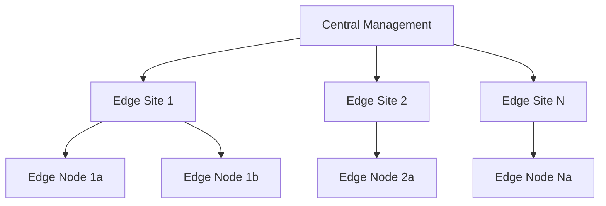

# How to Use Ansible for Edge Computing Infrastructure

Author: [nawazdhandala](https://www.github.com/nawazdhandala)

Tags: Ansible, Edge Computing, IoT, Infrastructure

Description: Manage edge computing infrastructure with Ansible to deploy and maintain applications on distributed edge nodes across multiple locations.

---

Edge computing pushes workloads closer to where data is generated, reducing latency and bandwidth costs. But managing hundreds of edge nodes spread across geographic locations is a challenge. They may have intermittent connectivity, limited resources, and different hardware configurations. Ansible handles this well because it is agentless and can work with nodes that are not always online.

This post covers managing edge computing infrastructure with Ansible.

## Edge Architecture

A typical edge computing setup has a central management plane and distributed edge nodes:



## Edge Node Inventory

Define edge nodes with their location-specific attributes:

```yaml
# inventories/edge/hosts.yml
# Edge computing node inventory
all:
  children:
    edge_nodes:
      children:
        edge_us_west:
          hosts:
            edge-usw-001:
              ansible_host: 10.100.1.10
              edge_site: san-francisco
              edge_role: compute
              hardware_profile: jetson-nano
            edge-usw-002:
              ansible_host: 10.100.1.11
              edge_site: san-francisco
              edge_role: gateway
              hardware_profile: x86-mini
        edge_us_east:
          hosts:
            edge-use-001:
              ansible_host: 10.200.1.10
              edge_site: new-york
              edge_role: compute
              hardware_profile: jetson-xavier
        edge_eu:
          hosts:
            edge-eu-001:
              ansible_host: 10.300.1.10
              edge_site: london
              edge_role: compute
              hardware_profile: x86-mini
```

## Edge Node Bootstrap

Bootstrap new edge nodes with the base configuration:

```yaml
# playbooks/bootstrap-edge-node.yml
# Initial setup of an edge computing node
---
- name: Bootstrap edge node
  hosts: "{{ target_nodes }}"
  become: true
  vars:
    central_api: https://central.example.com

  tasks:
    - name: Configure hostname
      ansible.builtin.hostname:
        name: "{{ inventory_hostname }}"

    - name: Set timezone to UTC
      community.general.timezone:
        name: UTC

    - name: Install base packages
      ansible.builtin.apt:
        name:
          - docker.io
          - python3
          - python3-pip
          - curl
          - jq
          - wireguard
          - ntp
        state: present
        update_cache: true

    - name: Configure WireGuard VPN to central
      ansible.builtin.template:
        src: wireguard.conf.j2
        dest: /etc/wireguard/wg0.conf
        mode: '0600'
      notify: restart wireguard

    - name: Enable WireGuard service
      ansible.builtin.service:
        name: wg-quick@wg0
        state: started
        enabled: true

    - name: Configure Docker for edge workloads
      ansible.builtin.template:
        src: edge-daemon.json.j2
        dest: /etc/docker/daemon.json
        mode: '0644'
      notify: restart docker

    - name: Deploy edge agent
      community.docker.docker_container:
        name: edge-agent
        image: "{{ edge_agent_image }}:{{ edge_agent_version }}"
        state: started
        restart_policy: always
        env:
          CENTRAL_API: "{{ central_api }}"
          NODE_ID: "{{ inventory_hostname }}"
          SITE_ID: "{{ edge_site }}"
        volumes:
          - /var/run/docker.sock:/var/run/docker.sock
          - /opt/edge/data:/data
        network_mode: host

    - name: Configure offline playbook pull
      ansible.builtin.cron:
        name: "Edge ansible-pull"
        minute: "*/15"
        job: >
          /usr/local/bin/ansible-pull
          -U {{ edge_config_repo }}
          -C {{ edge_config_branch }}
          -d /opt/edge/ansible
          playbooks/edge-local.yml
          >> /var/log/edge-ansible.log 2>&1
        user: root

    - name: Register with central management
      ansible.builtin.uri:
        url: "{{ central_api }}/api/v1/nodes/register"
        method: POST
        body_format: json
        body:
          node_id: "{{ inventory_hostname }}"
          site: "{{ edge_site }}"
          role: "{{ edge_role }}"
          hardware: "{{ hardware_profile }}"
          ip: "{{ ansible_default_ipv4.address }}"
      delegate_to: localhost
```

## Edge Application Deployment

Deploy applications to edge nodes with hardware-aware configurations:

```yaml
# roles/edge_app_deploy/tasks/main.yml
# Deploy application containers to edge nodes
---
- name: Select container image based on hardware
  ansible.builtin.set_fact:
    container_image: "{{ edge_app_images[hardware_profile] }}"

- name: Pull application image
  community.docker.docker_image:
    name: "{{ container_image }}:{{ edge_app_version }}"
    source: pull
    force_source: "{{ force_pull | default(false) }}"

- name: Deploy edge application
  community.docker.docker_container:
    name: "{{ edge_app_name }}"
    image: "{{ container_image }}:{{ edge_app_version }}"
    state: started
    restart_policy: unless-stopped
    env:
      NODE_ID: "{{ inventory_hostname }}"
      SITE_ID: "{{ edge_site }}"
      CENTRAL_API: "{{ central_api }}"
      LOCAL_STORAGE: /data
    volumes:
      - /opt/edge/data:/data
      - /opt/edge/config:/config:ro
    ports:
      - "{{ edge_app_port }}:8080"
    memory: "{{ edge_memory_limit[hardware_profile] }}"
    cpus: "{{ edge_cpu_limit[hardware_profile] }}"
```

## Handling Intermittent Connectivity

Edge nodes may lose connectivity. Use ansible-pull for resilience:

```yaml
# playbooks/edge-local.yml
# Local playbook pulled by edge nodes (runs even offline)
---
- name: Edge node self-management
  hosts: localhost
  connection: local
  become: true

  tasks:
    - name: Update local configuration
      ansible.builtin.template:
        src: edge-config.yml.j2
        dest: /opt/edge/config/app-config.yml
        mode: '0644'
      notify: restart edge app

    - name: Ensure all containers are running
      community.docker.docker_container:
        name: "{{ item.name }}"
        state: started
      loop:
        - { name: edge-agent }
        - { name: edge-app }
        - { name: edge-metrics }

    - name: Clean up old Docker images
      community.docker.docker_prune:
        images: true
        images_filters:
          dangling: true

    - name: Check disk space
      ansible.builtin.command: df -h / --output=pcent
      register: disk_usage
      changed_when: false

    - name: Clean logs if disk over 80%
      ansible.builtin.command: journalctl --vacuum-size=100M
      when: disk_usage.stdout_lines[1] | trim | replace('%','') | int > 80
      changed_when: true

    - name: Report health to central (best effort)
      ansible.builtin.uri:
        url: "{{ central_api }}/api/v1/nodes/{{ inventory_hostname }}/health"
        method: POST
        body_format: json
        body:
          status: healthy
          disk_usage: "{{ disk_usage.stdout_lines[1] | trim }}"
          timestamp: "{{ ansible_date_time.iso8601 }}"
        timeout: 10
      ignore_errors: true
```

## Bulk Edge Operations

Update all edge nodes in a controlled manner:

```yaml
# playbooks/update-edge-fleet.yml
# Rolling update across all edge nodes
---
- name: Update edge fleet
  hosts: edge_nodes
  become: true
  serial: "10%"
  max_fail_percentage: 5

  tasks:
    - name: Pull new application version
      community.docker.docker_image:
        name: "{{ container_image }}:{{ new_version }}"
        source: pull

    - name: Update edge application
      community.docker.docker_container:
        name: "{{ edge_app_name }}"
        image: "{{ container_image }}:{{ new_version }}"
        state: started
        restart: true

    - name: Verify edge node health
      ansible.builtin.uri:
        url: "http://localhost:{{ edge_app_port }}/health"
        status_code: 200
      retries: 10
      delay: 5
```

## Key Takeaways

Edge computing infrastructure management with Ansible requires accounting for intermittent connectivity, varied hardware, and geographic distribution. Use ansible-pull so edge nodes can self-manage when disconnected from central management. Deploy hardware-aware container images based on the node's profile. Use WireGuard or similar VPN for secure connectivity back to the central management plane. Roll out updates gradually across the fleet and tolerate some percentage of failures since edge nodes may be temporarily unreachable. The key is building resilient automation that works even when individual nodes go offline.
