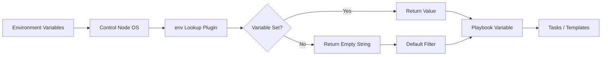

# How to Use the Ansible env Lookup Plugin

Author: [nawazdhandala](https://www.github.com/nawazdhandala)

Tags: Ansible, Lookup Plugins, Environment Variables, DevOps

Description: Learn how to use the Ansible env lookup plugin to read environment variables from the control node for dynamic playbook configuration.

---

Environment variables are a common way to pass configuration to applications, and Ansible playbooks are no exception. The `env` lookup plugin reads environment variables from the Ansible control node (the machine running `ansible-playbook`) and makes their values available in your playbooks. This is useful for keeping secrets out of source control, integrating with CI/CD pipelines, and making playbooks portable across different environments.

## How the env Lookup Works

The `env` lookup reads environment variables from the control node's environment. It does NOT read environment variables on the remote/target hosts. If you need to read an environment variable on a remote host, you would use the `ansible.builtin.command` module to run `echo $VARIABLE` or gather it through facts.

Basic syntax:

```yaml
"{{ lookup('env', 'VARIABLE_NAME') }}"
```

## Basic Usage

Here is the most straightforward use case: reading an environment variable and using it in a task.

```yaml
# basic_env.yml - Read environment variables and use in tasks
---
- name: Use environment variables in playbook
  hosts: all
  become: true
  vars:
    deploy_user: "{{ lookup('env', 'DEPLOY_USER') | default('deploy', true) }}"
    deploy_env: "{{ lookup('env', 'DEPLOY_ENV') | default('staging', true) }}"
    api_key: "{{ lookup('env', 'API_KEY') }}"
  tasks:
    - name: Show deployment configuration
      ansible.builtin.debug:
        msg:
          - "Deploy user: {{ deploy_user }}"
          - "Environment: {{ deploy_env }}"
          - "API key is {{ 'set' if api_key else 'NOT set' }}"

    - name: Deploy application config with environment-specific settings
      ansible.builtin.template:
        src: templates/app.conf.j2
        dest: /etc/myapp/app.conf
        mode: '0600'
```

Running this playbook:

```bash
# Set variables before running
export DEPLOY_USER=john
export DEPLOY_ENV=production
export API_KEY=secret123

# Run the playbook
ansible-playbook basic_env.yml
```

## CI/CD Integration

The env lookup is extremely useful in CI/CD pipelines where variables are injected as environment variables:

```yaml
# cicd_deploy.yml - CI/CD deployment using environment variables
---
- name: Deploy application from CI/CD
  hosts: app_servers
  become: true
  vars:
    git_commit: "{{ lookup('env', 'CI_COMMIT_SHA') | default('HEAD') }}"
    git_branch: "{{ lookup('env', 'CI_BRANCH') | default('main') }}"
    build_number: "{{ lookup('env', 'BUILD_NUMBER') | default('local') }}"
    docker_registry: "{{ lookup('env', 'DOCKER_REGISTRY') | default('registry.example.com') }}"
    image_tag: "{{ lookup('env', 'IMAGE_TAG') | default('latest') }}"
  tasks:
    - name: Display deployment info
      ansible.builtin.debug:
        msg:
          - "Deploying commit {{ git_commit }} from {{ git_branch }}"
          - "Build number: {{ build_number }}"
          - "Image: {{ docker_registry }}/myapp:{{ image_tag }}"

    - name: Pull and deploy Docker image
      community.docker.docker_container:
        name: myapp
        image: "{{ docker_registry }}/myapp:{{ image_tag }}"
        state: started
        restart_policy: always
        env:
          APP_VERSION: "{{ git_commit[:8] }}"
          BUILD_NUM: "{{ build_number }}"
```

## Keeping Secrets Out of Source Control

One of the best uses for the env lookup is avoiding secrets in your playbook repository:

```yaml
# secrets_from_env.yml - Read secrets from environment variables
---
- name: Deploy with secrets from environment
  hosts: database_servers
  become: true
  vars:
    db_root_password: "{{ lookup('env', 'DB_ROOT_PASSWORD') }}"
    db_app_password: "{{ lookup('env', 'DB_APP_PASSWORD') }}"
    smtp_password: "{{ lookup('env', 'SMTP_PASSWORD') }}"
    slack_webhook: "{{ lookup('env', 'SLACK_WEBHOOK_URL') }}"
  tasks:
    - name: Validate that required secrets are set
      ansible.builtin.assert:
        that:
          - db_root_password | length > 0
          - db_app_password | length > 0
        fail_msg: "Required database passwords are not set in environment variables"
        success_msg: "All required secrets are present"

    - name: Deploy database configuration
      ansible.builtin.template:
        src: templates/my.cnf.j2
        dest: /etc/mysql/my.cnf
        owner: root
        group: mysql
        mode: '0640'

    - name: Create application database user
      community.mysql.mysql_user:
        name: appuser
        password: "{{ db_app_password }}"
        priv: 'appdb.*:ALL'
        login_user: root
        login_password: "{{ db_root_password }}"
        state: present
```

## Default Values and Validation

Always provide defaults or validate that required variables are set:

```yaml
# env_with_defaults.yml - Handle missing environment variables
---
- name: Handle environment variables with defaults
  hosts: all
  vars:
    # Provide sensible defaults for optional variables
    log_level: "{{ lookup('env', 'LOG_LEVEL') | default('INFO', true) }}"
    max_workers: "{{ lookup('env', 'MAX_WORKERS') | default('4', true) }}"
    cache_ttl: "{{ lookup('env', 'CACHE_TTL') | default('3600', true) }}"

    # Required variables with no defaults
    app_secret: "{{ lookup('env', 'APP_SECRET') }}"
  tasks:
    - name: Check required variables
      ansible.builtin.fail:
        msg: >
          The APP_SECRET environment variable must be set.
          Run: export APP_SECRET=your_secret_here
      when: app_secret | length == 0

    - name: Show configuration
      ansible.builtin.debug:
        msg:
          - "Log level: {{ log_level }}"
          - "Max workers: {{ max_workers }}"
          - "Cache TTL: {{ cache_ttl }}"
          - "App secret is configured: yes"
```

## Reading PATH and System Variables

You can read any system environment variable:

```yaml
# system_env.yml - Read system environment variables
---
- name: Use system environment variables
  hosts: localhost
  connection: local
  tasks:
    - name: Show control node environment
      ansible.builtin.debug:
        msg:
          - "Home directory: {{ lookup('env', 'HOME') }}"
          - "Current user: {{ lookup('env', 'USER') }}"
          - "Shell: {{ lookup('env', 'SHELL') }}"
          - "PATH: {{ lookup('env', 'PATH') }}"
          - "PWD: {{ lookup('env', 'PWD') }}"

    - name: Check if running in a container
      ansible.builtin.set_fact:
        in_container: "{{ lookup('env', 'container') | default('') | length > 0 }}"

    - name: Show container status
      ansible.builtin.debug:
        msg: "Running in container: {{ in_container }}"
```

## Environment-Based Inventory Selection

Use environment variables to dynamically select configuration:

```yaml
# env_based_config.yml - Select configuration based on environment
---
- name: Environment-based configuration
  hosts: all
  become: true
  vars:
    target_env: "{{ lookup('env', 'TARGET_ENV') | default('development') }}"
    env_configs:
      development:
        replicas: 1
        debug: true
        log_level: DEBUG
        db_host: localhost
      staging:
        replicas: 2
        debug: false
        log_level: INFO
        db_host: staging-db.internal
      production:
        replicas: 5
        debug: false
        log_level: WARNING
        db_host: prod-db.internal
    config: "{{ env_configs[target_env] }}"
  tasks:
    - name: Show active configuration
      ansible.builtin.debug:
        msg:
          - "Environment: {{ target_env }}"
          - "Replicas: {{ config.replicas }}"
          - "Debug: {{ config.debug }}"
          - "DB Host: {{ config.db_host }}"

    - name: Deploy environment-specific config
      ansible.builtin.template:
        src: templates/app-config.j2
        dest: /etc/myapp/config.yml
        mode: '0644'
```

## Combining with Other Lookups

The env lookup combines well with other lookups:

```yaml
# combined_env.yml - Combine env lookup with other lookups
---
- name: Combined lookup patterns
  hosts: all
  tasks:
    - name: Read file path from env, then read the file
      ansible.builtin.set_fact:
        config_path: "{{ lookup('env', 'CONFIG_PATH') | default('files/default.conf') }}"

    - name: Load config from the path
      ansible.builtin.set_fact:
        config_content: "{{ lookup('file', config_path) }}"
      when: config_path | length > 0

    - name: Build connection string from env vars
      ansible.builtin.set_fact:
        db_connection: >-
          postgresql://{{ lookup('env', 'DB_USER') }}:{{ lookup('env', 'DB_PASS') }}@{{ lookup('env', 'DB_HOST') }}:{{ lookup('env', 'DB_PORT') | default('5432') }}/{{ lookup('env', 'DB_NAME') }}

    - name: Show connection string (masked)
      ansible.builtin.debug:
        msg: "DB connection configured: {{ 'yes' if db_connection | length > 20 else 'no' }}"
```

## Using with ansible-playbook Command

You can pass environment variables inline when running playbooks:

```bash
# Pass environment variables inline
DB_PASSWORD=secret DEPLOY_ENV=production ansible-playbook deploy.yml

# Or export them in your shell
export DB_PASSWORD=secret
export DEPLOY_ENV=production
ansible-playbook deploy.yml

# Or use a .env file with source
source .env && ansible-playbook deploy.yml

# In CI/CD (GitLab CI example)
# Variables are automatically available as env vars
# DEPLOY_TOKEN is set in GitLab CI/CD settings
ansible-playbook deploy.yml
```

## Env Lookup Data Flow



## Important Limitations

The env lookup has several important characteristics to keep in mind. It only reads from the control node, never from remote hosts. The value is resolved at playbook parse time, not at task execution time. If an environment variable is not set, the lookup returns an empty string (not an error). For secrets, consider using Ansible Vault instead of environment variables in production, since env vars can be leaked through process listings or logs.

That said, the env lookup is perfect for CI/CD pipelines, local development overrides, and any scenario where you need to inject values into a playbook from the outside without modifying files.
