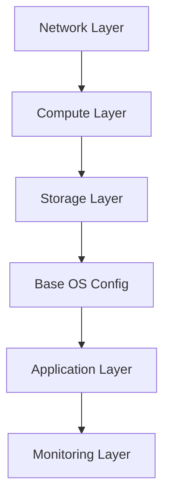

# How to Use Ansible for Environment Provisioning

Author: [nawazdhandala](https://www.github.com/nawazdhandala)

Tags: Ansible, Environment Provisioning, DevOps, Cloud

Description: Automate the provisioning of complete environments including compute, networking, and application stacks using Ansible playbooks and roles.

---

Provisioning a new environment used to mean days of manual work: requesting VMs, configuring networks, installing software, and setting up monitoring. With Ansible, you can spin up a complete environment from scratch in minutes. Whether it is a development sandbox, a QA environment for testing, or a full production replica, the process should be a single command.

This post walks through building environment provisioning playbooks that create everything from infrastructure to running applications.

## Environment Architecture

A typical environment includes multiple layers that need to be provisioned in order:



Each layer depends on the one before it. Ansible handles this naturally through playbook ordering.

## Defining Environments as Variables

The key to reusable provisioning is parameterizing everything through variables:

```yaml
# environments/dev.yml
# Development environment specification
---
env_name: dev
env_domain: dev.example.com

network:
  vpc_cidr: 10.10.0.0/16
  public_subnets:
    - cidr: 10.10.1.0/24
      az: us-east-1a
    - cidr: 10.10.2.0/24
      az: us-east-1b
  private_subnets:
    - cidr: 10.10.10.0/24
      az: us-east-1a
    - cidr: 10.10.11.0/24
      az: us-east-1b

compute:
  web_servers:
    count: 1
    instance_type: t3.small
    ami: ami-0abcdef1234567890
  app_servers:
    count: 1
    instance_type: t3.medium
    ami: ami-0abcdef1234567890
  db_servers:
    count: 1
    instance_type: r6g.large
    ami: ami-0abcdef1234567890

database:
  engine: postgresql
  version: "15"
  allocated_storage: 50
  max_connections: 100

monitoring:
  enabled: true
  retention_days: 7
```

```yaml
# environments/production.yml
# Production environment specification
---
env_name: production
env_domain: example.com

network:
  vpc_cidr: 10.0.0.0/16
  public_subnets:
    - cidr: 10.0.1.0/24
      az: us-east-1a
    - cidr: 10.0.2.0/24
      az: us-east-1b
    - cidr: 10.0.3.0/24
      az: us-east-1c
  private_subnets:
    - cidr: 10.0.10.0/24
      az: us-east-1a
    - cidr: 10.0.11.0/24
      az: us-east-1b
    - cidr: 10.0.12.0/24
      az: us-east-1c

compute:
  web_servers:
    count: 3
    instance_type: c6g.xlarge
    ami: ami-0abcdef1234567890
  app_servers:
    count: 3
    instance_type: m6g.xlarge
    ami: ami-0abcdef1234567890
  db_servers:
    count: 2
    instance_type: r6g.2xlarge
    ami: ami-0abcdef1234567890

database:
  engine: postgresql
  version: "15"
  allocated_storage: 500
  max_connections: 500

monitoring:
  enabled: true
  retention_days: 90
```

## Network Provisioning

The first step is creating the network infrastructure:

```yaml
# roles/provision_network/tasks/main.yml
# Create VPC, subnets, and networking components
---
- name: Create VPC
  amazon.aws.ec2_vpc_net:
    name: "{{ env_name }}-vpc"
    cidr_block: "{{ network.vpc_cidr }}"
    region: "{{ aws_region }}"
    tags:
      Environment: "{{ env_name }}"
  register: vpc

- name: Create internet gateway
  amazon.aws.ec2_vpc_igw:
    vpc_id: "{{ vpc.vpc.id }}"
    region: "{{ aws_region }}"
    tags:
      Name: "{{ env_name }}-igw"
  register: igw

- name: Create public subnets
  amazon.aws.ec2_vpc_subnet:
    vpc_id: "{{ vpc.vpc.id }}"
    cidr: "{{ item.cidr }}"
    az: "{{ item.az }}"
    region: "{{ aws_region }}"
    map_public: true
    tags:
      Name: "{{ env_name }}-public-{{ item.az }}"
      Tier: public
  loop: "{{ network.public_subnets }}"
  register: public_subnets

- name: Create private subnets
  amazon.aws.ec2_vpc_subnet:
    vpc_id: "{{ vpc.vpc.id }}"
    cidr: "{{ item.cidr }}"
    az: "{{ item.az }}"
    region: "{{ aws_region }}"
    tags:
      Name: "{{ env_name }}-private-{{ item.az }}"
      Tier: private
  loop: "{{ network.private_subnets }}"
  register: private_subnets

- name: Create public route table
  amazon.aws.ec2_vpc_route_table:
    vpc_id: "{{ vpc.vpc.id }}"
    region: "{{ aws_region }}"
    subnets: "{{ public_subnets.results | map(attribute='subnet.id') | list }}"
    routes:
      - dest: 0.0.0.0/0
        gateway_id: "{{ igw.gateway_id }}"
    tags:
      Name: "{{ env_name }}-public-rt"

- name: Create security groups
  amazon.aws.ec2_security_group:
    name: "{{ env_name }}-{{ item.name }}"
    description: "{{ item.description }}"
    vpc_id: "{{ vpc.vpc.id }}"
    region: "{{ aws_region }}"
    rules: "{{ item.rules }}"
  loop:
    - name: web-sg
      description: "Web server security group"
      rules:
        - proto: tcp
          ports: [80, 443]
          cidr_ip: 0.0.0.0/0
    - name: app-sg
      description: "App server security group"
      rules:
        - proto: tcp
          ports: [8080]
          group_name: "{{ env_name }}-web-sg"
    - name: db-sg
      description: "Database security group"
      rules:
        - proto: tcp
          ports: [5432]
          group_name: "{{ env_name }}-app-sg"
```

## Compute Provisioning

Once the network exists, provision the servers:

```yaml
# roles/provision_compute/tasks/main.yml
# Launch EC2 instances for each tier
---
- name: Launch web servers
  amazon.aws.ec2_instance:
    name: "{{ env_name }}-web-{{ item }}"
    instance_type: "{{ compute.web_servers.instance_type }}"
    image_id: "{{ compute.web_servers.ami }}"
    subnet_id: "{{ public_subnet_ids[item % (public_subnet_ids | length)] }}"
    security_group: "{{ env_name }}-web-sg"
    key_name: "{{ env_name }}-deploy"
    tags:
      Environment: "{{ env_name }}"
      Role: webserver
    state: present
    wait: true
  loop: "{{ range(compute.web_servers.count) | list }}"
  register: web_instances

- name: Launch app servers
  amazon.aws.ec2_instance:
    name: "{{ env_name }}-app-{{ item }}"
    instance_type: "{{ compute.app_servers.instance_type }}"
    image_id: "{{ compute.app_servers.ami }}"
    subnet_id: "{{ private_subnet_ids[item % (private_subnet_ids | length)] }}"
    security_group: "{{ env_name }}-app-sg"
    key_name: "{{ env_name }}-deploy"
    tags:
      Environment: "{{ env_name }}"
      Role: appserver
    state: present
    wait: true
  loop: "{{ range(compute.app_servers.count) | list }}"
  register: app_instances

- name: Wait for SSH to be available
  ansible.builtin.wait_for:
    host: "{{ item.instances[0].private_ip_address }}"
    port: 22
    timeout: 300
  loop: "{{ web_instances.results + app_instances.results }}"

- name: Add new instances to in-memory inventory
  ansible.builtin.add_host:
    name: "{{ item.instances[0].tags.Name }}"
    ansible_host: "{{ item.instances[0].private_ip_address }}"
    groups:
      - "{{ item.instances[0].tags.Role }}"
      - "{{ env_name }}"
  loop: "{{ web_instances.results + app_instances.results }}"
```

## The Master Provisioning Playbook

Tie everything together with a single entry point:

```yaml
# playbooks/provision-environment.yml
# Provision a complete environment from scratch
---
- name: Provision network infrastructure
  hosts: localhost
  connection: local
  gather_facts: false
  vars_files:
    - "../environments/{{ target_env }}.yml"
  roles:
    - provision_network

- name: Provision compute resources
  hosts: localhost
  connection: local
  gather_facts: false
  vars_files:
    - "../environments/{{ target_env }}.yml"
  roles:
    - provision_compute

- name: Configure base OS on all new servers
  hosts: "{{ target_env }}"
  become: true
  roles:
    - common
    - security_baseline
    - monitoring_agent

- name: Configure web servers
  hosts: webserver
  become: true
  roles:
    - nginx
    - ssl_certs

- name: Configure app servers
  hosts: appserver
  become: true
  roles:
    - java_runtime
    - app_deploy

- name: Run smoke tests
  hosts: webserver
  tasks:
    - name: Test HTTP endpoint
      ansible.builtin.uri:
        url: "http://{{ inventory_hostname }}/health"
        status_code: 200
      retries: 10
      delay: 5
```

Run it with:

```bash
# Provision a development environment
ansible-playbook playbooks/provision-environment.yml \
  -e target_env=dev

# Provision production
ansible-playbook playbooks/provision-environment.yml \
  -e target_env=production
```

## Teardown Playbook

For non-production environments, you need a way to tear things down:

```yaml
# playbooks/teardown-environment.yml
# Destroy an environment and all its resources
---
- name: Teardown environment
  hosts: localhost
  connection: local
  gather_facts: false
  vars_files:
    - "../environments/{{ target_env }}.yml"

  tasks:
    - name: Safety check - prevent production teardown
      ansible.builtin.fail:
        msg: "Cannot tear down production environment!"
      when: target_env == "production"

    - name: Terminate all EC2 instances
      amazon.aws.ec2_instance:
        state: absent
        filters:
          "tag:Environment": "{{ env_name }}"
        wait: true

    - name: Delete security groups
      amazon.aws.ec2_security_group:
        name: "{{ env_name }}-{{ item }}"
        state: absent
      loop: [web-sg, app-sg, db-sg]

    - name: Delete VPC and all dependencies
      amazon.aws.ec2_vpc_net:
        name: "{{ env_name }}-vpc"
        cidr_block: "{{ network.vpc_cidr }}"
        state: absent
        purge_cidrs: true
```

## Key Takeaways

Environment provisioning with Ansible works best when you define everything through variables in environment-specific files. The same playbooks and roles should work for dev, staging, and production with only variable differences. Always include a teardown playbook for non-production environments, and always include a safety check to prevent accidentally tearing down production. This approach gives you repeatable, version-controlled environment creation that anyone on the team can run.
