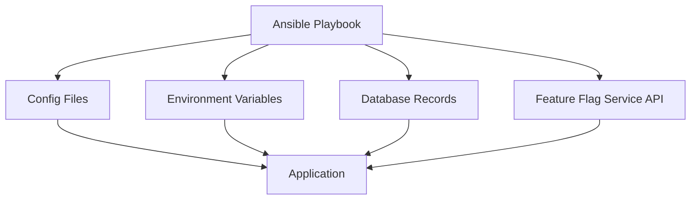

# How to Use Ansible for Feature Flag Management

Author: [nawazdhandala](https://www.github.com/nawazdhandala)

Tags: Ansible, Feature Flags, DevOps, Configuration Management

Description: Manage feature flags across your infrastructure with Ansible to control feature rollouts, environment-specific toggles, and gradual releases.

---

Feature flags let you enable or disable features without deploying new code. While many teams use SaaS feature flag services, there are good reasons to manage flags through your infrastructure tooling. Ansible can manage feature flag configuration files, environment variables, database entries, and API calls to feature flag systems, giving you version-controlled, auditable flag management.

This post covers different approaches to managing feature flags with Ansible.

## Feature Flag Architecture

Feature flags can live in different places depending on your architecture:



Each approach has tradeoffs. Config files are simple but require restarts. Environment variables work with containers. Database records allow runtime changes. API-based services offer the most flexibility.

## File-Based Feature Flags

The simplest approach is managing a JSON or YAML configuration file:

```yaml
# roles/feature_flags/templates/feature_flags.json.j2
# Feature flag configuration deployed to application servers
{
  "flags": {

    "{{ flag.name }}": {
      "enabled": {{ flag.enabled | lower }},
      "description": "{{ flag.description }}",
      "rollout_percentage": {{ flag.rollout_percentage | default(100) }},
      "allowed_users": {{ flag.allowed_users | default([]) | to_json }},
      "environments": {{ flag.environments | default(['all']) | to_json }}
    },


  }
}
```

Define flags in your variables:

```yaml
# group_vars/all/feature_flags.yml
# Feature flag definitions across all environments
feature_flags:
  - name: new_dashboard
    enabled: false
    description: "Redesigned dashboard UI"
    rollout_percentage: 0
    environments: [staging, production]

  - name: advanced_search
    enabled: true
    description: "Full-text search with filters"
    rollout_percentage: 100

  - name: payment_v2
    enabled: false
    description: "New payment processing pipeline"
    rollout_percentage: 0
    allowed_users: ["user-123", "user-456"]
```

Override flags per environment:

```yaml
# inventories/staging/group_vars/all.yml
# Staging overrides - enable experimental features
feature_flags:
  - name: new_dashboard
    enabled: true
    description: "Redesigned dashboard UI"
    rollout_percentage: 100
    environments: [staging]

  - name: advanced_search
    enabled: true
    description: "Full-text search with filters"
    rollout_percentage: 100

  - name: payment_v2
    enabled: true
    description: "New payment processing pipeline"
    rollout_percentage: 50
    allowed_users: []
```

## Deploying Feature Flags

```yaml
# roles/feature_flags/tasks/main.yml
# Deploy feature flag configuration to application servers
---
- name: Create config directory
  ansible.builtin.file:
    path: "{{ app_config_dir }}"
    state: directory
    owner: "{{ app_user }}"
    mode: '0755'

- name: Deploy feature flag configuration
  ansible.builtin.template:
    src: feature_flags.json.j2
    dest: "{{ app_config_dir }}/feature_flags.json"
    owner: "{{ app_user }}"
    mode: '0644'
    backup: true
  register: flags_deployed
  notify: reload application

- name: Log flag changes
  ansible.builtin.lineinfile:
    path: /var/log/feature_flag_changes.log
    line: "{{ ansible_date_time.iso8601 }} - Flags updated by {{ lookup('env', 'USER') }}"
    create: true
    mode: '0644'
  when: flags_deployed.changed
```

## Environment Variable Based Flags

For containerized applications, feature flags as environment variables work well:

```yaml
# roles/feature_flags_env/tasks/main.yml
# Manage feature flags as environment variables in systemd services
---
- name: Create feature flag environment file
  ansible.builtin.template:
    src: feature_flags.env.j2
    dest: /etc/default/{{ app_name }}_flags
    owner: root
    mode: '0644'
  notify: restart application

- name: Ensure systemd service reads flag file
  ansible.builtin.lineinfile:
    path: /etc/systemd/system/{{ app_name }}.service
    regexp: '^EnvironmentFile.*flags'
    line: "EnvironmentFile=/etc/default/{{ app_name }}_flags"
    insertafter: '^\[Service\]'
  notify:
    - daemon reload
    - restart application
```

```ini
# roles/feature_flags_env/templates/feature_flags.env.j2
# Feature flags as environment variables

FEATURE_{{ flag.name | upper }}={{ 'true' if flag.enabled else 'false' }}
FEATURE_{{ flag.name | upper }}_ROLLOUT={{ flag.rollout_percentage | default(100) }}

```

## Database-Backed Feature Flags

For runtime flag changes, store flags in a database:

```yaml
# roles/feature_flags_db/tasks/main.yml
# Manage feature flags in PostgreSQL
---
- name: Create feature flags table
  community.postgresql.postgresql_query:
    db: "{{ app_database }}"
    login_host: "{{ db_host }}"
    login_user: "{{ db_admin_user }}"
    login_password: "{{ db_admin_password }}"
    query: |
      CREATE TABLE IF NOT EXISTS feature_flags (
        name VARCHAR(255) PRIMARY KEY,
        enabled BOOLEAN NOT NULL DEFAULT false,
        description TEXT,
        rollout_percentage INTEGER DEFAULT 100,
        allowed_users JSONB DEFAULT '[]'::jsonb,
        updated_at TIMESTAMP DEFAULT CURRENT_TIMESTAMP,
        updated_by VARCHAR(255)
      );

- name: Upsert feature flags
  community.postgresql.postgresql_query:
    db: "{{ app_database }}"
    login_host: "{{ db_host }}"
    login_user: "{{ db_admin_user }}"
    login_password: "{{ db_admin_password }}"
    query: |
      INSERT INTO feature_flags (name, enabled, description, rollout_percentage, allowed_users, updated_by)
      VALUES (%(name)s, %(enabled)s, %(description)s, %(rollout)s, %(users)s::jsonb, %(updater)s)
      ON CONFLICT (name) DO UPDATE SET
        enabled = EXCLUDED.enabled,
        description = EXCLUDED.description,
        rollout_percentage = EXCLUDED.rollout_percentage,
        allowed_users = EXCLUDED.allowed_users,
        updated_at = CURRENT_TIMESTAMP,
        updated_by = EXCLUDED.updated_by;
    named_args:
      name: "{{ item.name }}"
      enabled: "{{ item.enabled }}"
      description: "{{ item.description }}"
      rollout: "{{ item.rollout_percentage | default(100) }}"
      users: "{{ item.allowed_users | default([]) | to_json }}"
      updater: "ansible-{{ lookup('env', 'USER') }}"
  loop: "{{ feature_flags }}"
```

## Integrating with LaunchDarkly API

If you use a feature flag service, Ansible can manage it through API calls:

```yaml
# roles/launchdarkly_flags/tasks/main.yml
# Manage feature flags via LaunchDarkly API
---
- name: Update feature flag in LaunchDarkly
  ansible.builtin.uri:
    url: "https://app.launchdarkly.com/api/v2/flags/{{ ld_project }}/{{ item.key }}"
    method: PATCH
    headers:
      Authorization: "{{ launchdarkly_api_token }}"
      Content-Type: application/json
    body_format: json
    body:
      - op: replace
        path: "/environments/{{ env_name }}/on"
        value: "{{ item.enabled }}"
      - op: replace
        path: "/environments/{{ env_name }}/fallthrough/variation"
        value: "{{ 0 if item.enabled else 1 }}"
    status_code: [200, 201]
  loop: "{{ feature_flags }}"
  when: item.sync_to_launchdarkly | default(false)

- name: Verify flag state
  ansible.builtin.uri:
    url: "https://app.launchdarkly.com/api/v2/flags/{{ ld_project }}/{{ item.key }}"
    method: GET
    headers:
      Authorization: "{{ launchdarkly_api_token }}"
    status_code: 200
  register: flag_state
  loop: "{{ feature_flags }}"
  when: item.sync_to_launchdarkly | default(false)
```

## Gradual Rollout Playbook

Here is a playbook that gradually increases a feature flag rollout:

```yaml
# playbooks/rollout-feature.yml
# Gradually roll out a feature flag
---
- name: Gradual feature rollout
  hosts: localhost
  connection: local
  vars:
    flag_name: new_dashboard
    rollout_steps: [5, 10, 25, 50, 75, 100]
    pause_between_steps: 300

  tasks:
    - name: Roll out feature in steps
      ansible.builtin.include_tasks: tasks/update-flag-percentage.yml
      loop: "{{ rollout_steps }}"
      loop_control:
        loop_var: percentage

    - name: Notify completion
      community.general.slack:
        token: "{{ slack_token }}"
        channel: "#feature-flags"
        msg: "Feature '{{ flag_name }}' fully rolled out to 100%"
```

```yaml
# tasks/update-flag-percentage.yml
# Update a single flag percentage and pause
---
- name: "Set {{ flag_name }} to {{ percentage }}%"
  community.postgresql.postgresql_query:
    db: "{{ app_database }}"
    login_host: "{{ db_host }}"
    login_user: "{{ db_admin_user }}"
    login_password: "{{ db_admin_password }}"
    query: |
      UPDATE feature_flags
      SET rollout_percentage = %(pct)s, updated_at = CURRENT_TIMESTAMP
      WHERE name = %(name)s;
    named_args:
      pct: "{{ percentage }}"
      name: "{{ flag_name }}"

- name: Wait and monitor error rates
  ansible.builtin.pause:
    seconds: "{{ pause_between_steps }}"
  when: percentage < 100
```

## Key Takeaways

Ansible gives you multiple ways to manage feature flags depending on your needs. File-based flags are the simplest and work great for small teams. Environment variables suit containerized workloads. Database-backed flags allow runtime changes without deployments. API integrations let you manage external feature flag services. Whichever approach you choose, storing flag definitions in version-controlled Ansible variables means you have a clear history of every flag change and can replicate flag states across environments reliably.
