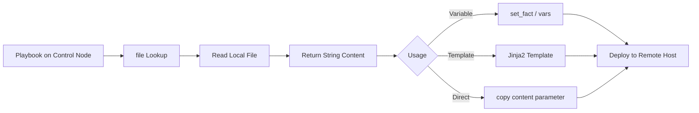

# How to Use the Ansible file Lookup Plugin

Author: [nawazdhandala](https://www.github.com/nawazdhandala)

Tags: Ansible, Lookup Plugins, File Management, Automation

Description: Learn how to use the Ansible file lookup plugin to read file contents from the control node and use them in playbooks and templates.

---

Ansible lookup plugins let you access data from external sources during playbook execution. The `file` lookup is one of the most commonly used because it reads the contents of a file on the Ansible control node and makes that content available as a variable. This is useful for injecting configuration files, certificates, license keys, or any other file content into your playbooks without hardcoding it.

## How the file Lookup Works

The `file` lookup runs on the control node (the machine where you run `ansible-playbook`), not on the target host. It reads a file from the local filesystem and returns its contents as a string. This is fundamentally different from the `slurp` module, which reads files from remote hosts.

The basic syntax is:

```yaml
"{{ lookup('file', '/path/to/file') }}"
```

## Basic Usage

Here is the simplest use case: reading a file and using its contents in a task.

```yaml
# basic_file_lookup.yml - Read a local file and deploy it
---
- name: Deploy SSH public key from local file
  hosts: all
  become: true
  tasks:
    - name: Read SSH public key from control node
      ansible.builtin.debug:
        msg: "SSH key: {{ lookup('file', '~/.ssh/id_ed25519.pub') }}"

    - name: Deploy the SSH key to authorized_keys
      ansible.posix.authorized_key:
        user: deploy
        key: "{{ lookup('file', '~/.ssh/id_ed25519.pub') }}"
        state: present
```

The file path is resolved relative to the Ansible playbook directory. You can use absolute paths, relative paths, or the tilde (`~`) for the home directory of the user running Ansible.

## Reading Multiple Files

The file lookup can read multiple files at once by passing a comma-separated list or by using it in a loop:

```yaml
# multiple_files.yml - Read multiple files with file lookup
---
- name: Read and deploy multiple files
  hosts: all
  become: true
  vars:
    ssh_keys_dir: files/ssh-keys
  tasks:
    - name: Read multiple SSH keys
      ansible.builtin.debug:
        msg: "{{ lookup('file', item) }}"
      loop:
        - files/ssh-keys/admin.pub
        - files/ssh-keys/deploy.pub
        - files/ssh-keys/ci.pub

    - name: Deploy all SSH keys to a user
      ansible.posix.authorized_key:
        user: deploy
        key: "{{ lookup('file', item) }}"
        state: present
      loop:
        - files/ssh-keys/admin.pub
        - files/ssh-keys/deploy.pub
        - files/ssh-keys/ci.pub
```

## Deploying Certificates

The file lookup is commonly used to deploy SSL certificates and keys:

```yaml
# deploy_certs.yml - Deploy certificates using file lookup
---
- name: Deploy SSL certificates
  hosts: webservers
  become: true
  vars:
    domain: www.example.com
    cert_content: "{{ lookup('file', 'files/certs/' + domain + '.crt') }}"
    key_content: "{{ lookup('file', 'files/certs/' + domain + '.key') }}"
    ca_content: "{{ lookup('file', 'files/certs/ca-chain.crt') }}"
  tasks:
    - name: Deploy SSL certificate
      ansible.builtin.copy:
        content: "{{ cert_content }}"
        dest: "/etc/ssl/certs/{{ domain }}.crt"
        owner: root
        group: root
        mode: '0644'

    - name: Deploy SSL private key
      ansible.builtin.copy:
        content: "{{ key_content }}"
        dest: "/etc/ssl/private/{{ domain }}.key"
        owner: root
        group: root
        mode: '0600'

    - name: Deploy CA chain
      ansible.builtin.copy:
        content: "{{ ca_content }}"
        dest: "/etc/ssl/certs/ca-chain.crt"
        owner: root
        group: root
        mode: '0644'
```

## Using file Lookup in Templates

You can embed file contents directly into Jinja2 templates:

```yaml
# template_with_file.yml - Use file lookup within a template variable
---
- name: Generate configuration with embedded file content
  hosts: all
  become: true
  vars:
    app_license: "{{ lookup('file', 'files/license.key') }}"
    ssl_cert: "{{ lookup('file', 'files/certs/app.crt') }}"
  tasks:
    - name: Deploy application configuration
      ansible.builtin.template:
        src: templates/app-config.yml.j2
        dest: /etc/myapp/config.yml
        mode: '0600'
```

```jinja2
# templates/app-config.yml.j2 - Config file with embedded file content
# Managed by Ansible
app:
  name: MyApplication
  license_key: |
    {{ app_license | indent(4) }}
  ssl:
    certificate: |
      {{ ssl_cert | indent(6) }}
```

## Handling Missing Files

By default, the file lookup raises an error if the file does not exist. You can handle this with a default value:

```yaml
# handle_missing.yml - Handle missing files gracefully
---
- name: Handle missing files
  hosts: all
  tasks:
    - name: Read optional config file
      ansible.builtin.set_fact:
        custom_config: "{{ lookup('file', 'files/custom.conf', errors='ignore') | default('# No custom configuration') }}"

    - name: Show config content
      ansible.builtin.debug:
        msg: "Custom config: {{ custom_config }}"

    - name: Read required file with clear error
      ansible.builtin.set_fact:
        required_content: "{{ lookup('file', 'files/required.conf') }}"
      rescue:
        - name: Fail with helpful message
          ansible.builtin.fail:
            msg: "Required file 'files/required.conf' not found on control node. Please create it before running this playbook."
```

## Reading JSON and YAML Files

The file lookup returns raw string content. To parse structured data, combine it with the `from_json` or `from_yaml` filters:

```yaml
# parse_structured_data.yml - Read and parse JSON/YAML files
---
- name: Read structured data files
  hosts: all
  tasks:
    - name: Read and parse JSON config
      ansible.builtin.set_fact:
        app_settings: "{{ lookup('file', 'files/settings.json') | from_json }}"

    - name: Use parsed JSON data
      ansible.builtin.debug:
        msg: "Database host: {{ app_settings.database.host }}"

    - name: Read and parse YAML config
      ansible.builtin.set_fact:
        deploy_config: "{{ lookup('file', 'files/deploy.yml') | from_yaml }}"

    - name: Use parsed YAML data
      ansible.builtin.debug:
        msg: "Deploy target: {{ deploy_config.target_env }}"
```

## Using file Lookup with Conditionals

Read a file and make decisions based on its content:

```yaml
# conditional_file.yml - Use file content in conditionals
---
- name: Conditional deployment based on file content
  hosts: all
  vars:
    feature_flags: "{{ lookup('file', 'files/feature-flags.json') | from_json }}"
  tasks:
    - name: Deploy monitoring agent if feature flag is enabled
      ansible.builtin.package:
        name: prometheus-node-exporter
        state: present
      when: feature_flags.monitoring_enabled | default(false)

    - name: Configure debug logging if flag is set
      ansible.builtin.lineinfile:
        path: /etc/myapp/logging.conf
        regexp: '^log_level='
        line: "log_level={{ 'DEBUG' if feature_flags.debug_mode else 'INFO' }}"
        create: true
        mode: '0644'
```

## File Search Path

Ansible looks for files in a specific order based on the file search path:

```yaml
# search_path.yml - Understanding file search paths
---
- name: Demonstrate file search paths
  hosts: all
  tasks:
    # Ansible searches in this order:
    # 1. files/ directory relative to the playbook
    # 2. files/ directory relative to the role
    # 3. The playbook directory itself
    # 4. The role directory itself

    - name: This looks in files/ first, then playbook dir
      ansible.builtin.debug:
        msg: "{{ lookup('file', 'myconfig.txt') }}"

    - name: Absolute path bypasses the search path
      ansible.builtin.debug:
        msg: "{{ lookup('file', '/opt/configs/myconfig.txt') }}"
```

## Combining with Other Lookups

The file lookup works well in combination with other lookups:

```yaml
# combined_lookups.yml - Combine file lookup with other lookups
---
- name: Combined lookup patterns
  hosts: all
  tasks:
    - name: Read file and base64 encode it
      ansible.builtin.set_fact:
        encoded_cert: "{{ lookup('file', 'files/cert.pem') | b64encode }}"

    - name: Read a file path from environment, then read that file
      ansible.builtin.set_fact:
        dynamic_content: "{{ lookup('file', lookup('env', 'CONFIG_FILE_PATH')) }}"
      when: lookup('env', 'CONFIG_FILE_PATH') != ''

    - name: Read all files matching a pattern using fileglob + file
      ansible.builtin.debug:
        msg: "Content of {{ item }}: {{ lookup('file', item) | truncate(50) }}"
      loop: "{{ lookup('fileglob', 'files/configs/*.conf', wantlist=True) }}"
```

## Lookup Data Flow



## Common Pitfalls

There are several things to watch out for. The file lookup always runs on the control node, never on the remote host. If you need to read a file from a remote host, use the `slurp` module instead. Large files can cause performance issues because the entire content is loaded into memory as a string. For files larger than a few megabytes, consider using the `copy` module with `src` instead of the file lookup. Finally, binary files will not work correctly with the file lookup since it expects text content. Use the `copy` module for binary files.

The file lookup is a fundamental building block in Ansible. Once you understand how it works, you will find yourself using it constantly for deploying configurations, certificates, keys, and any other text content that lives on your control node.
